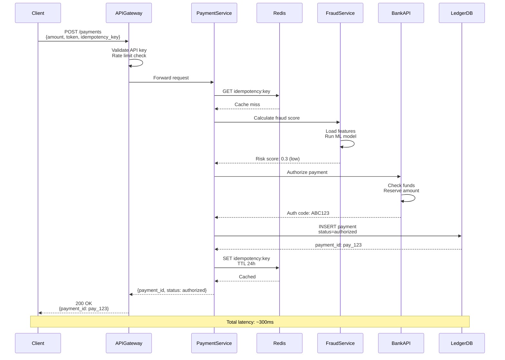
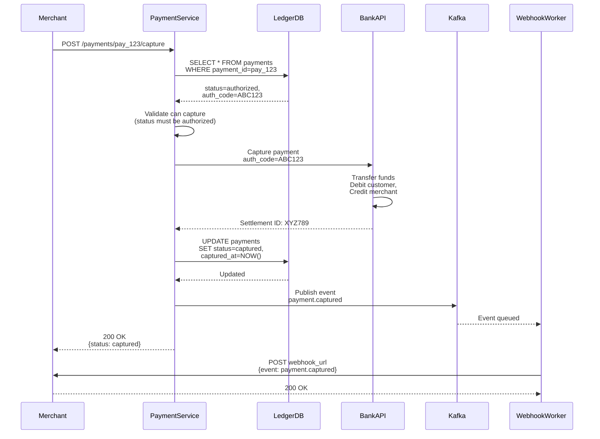
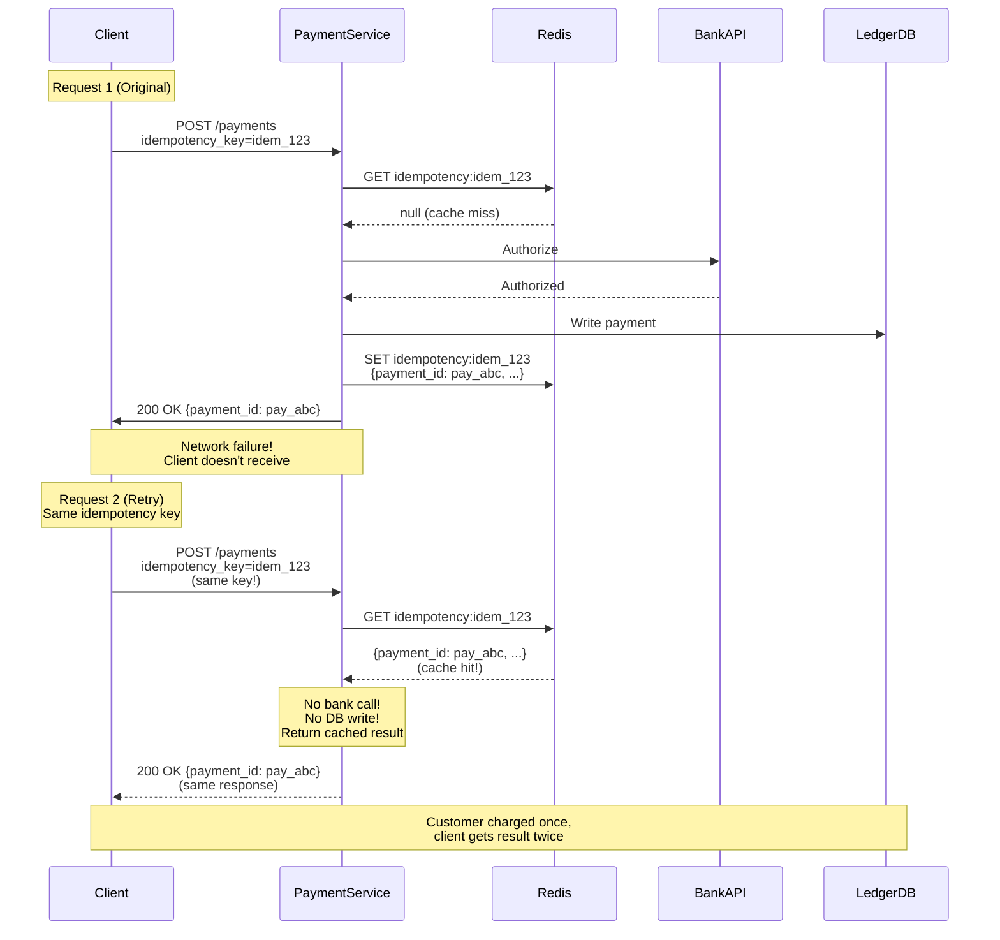
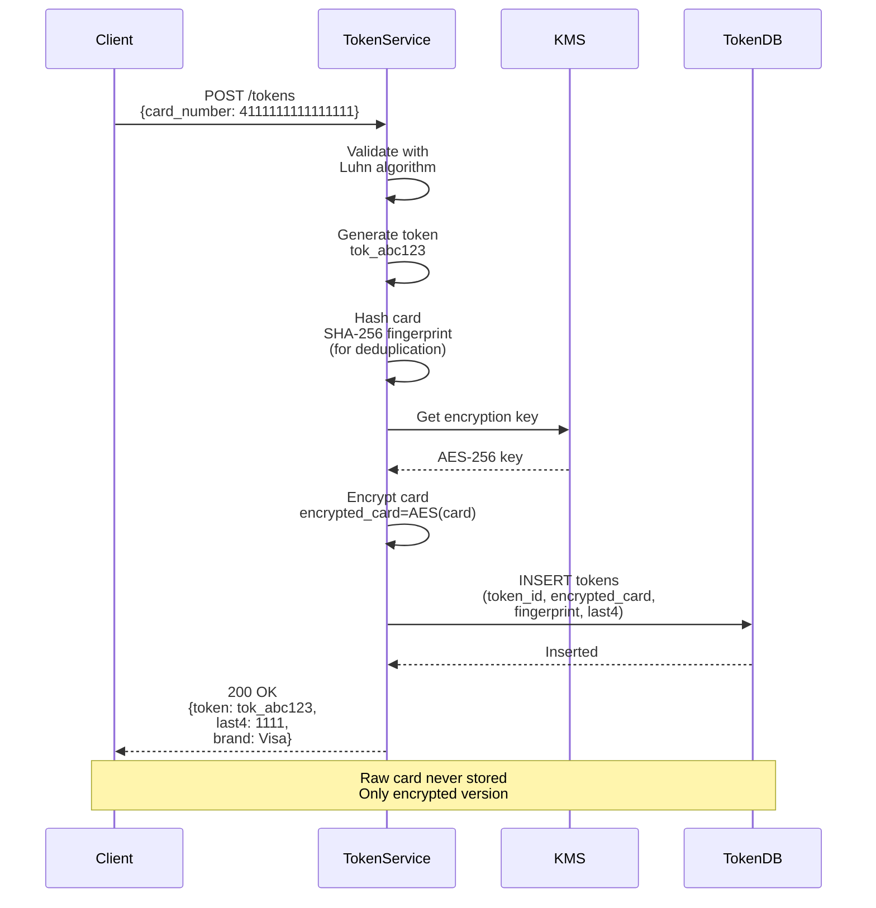
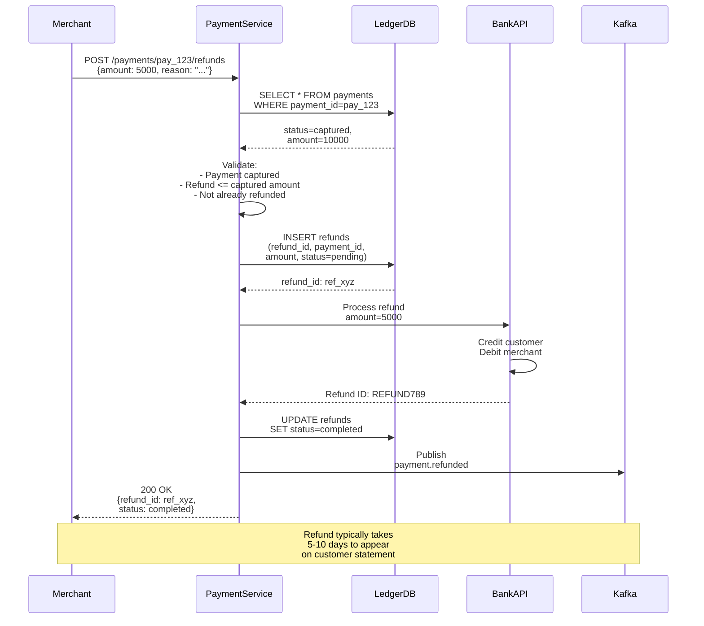
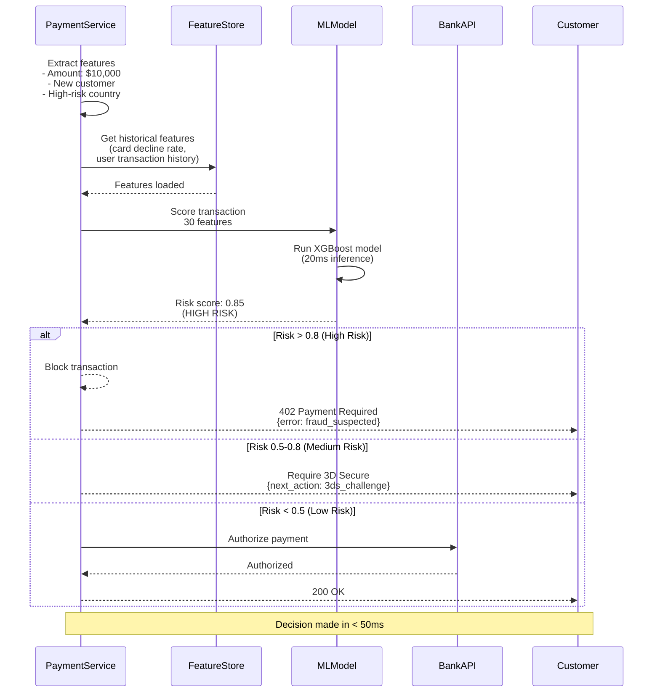
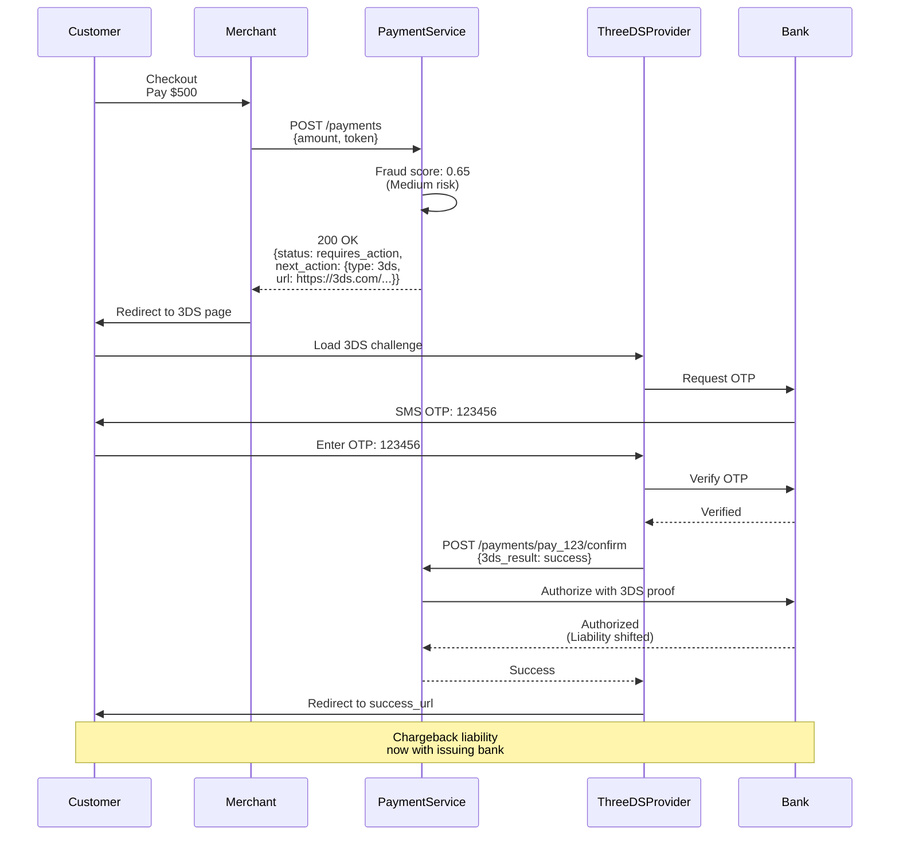
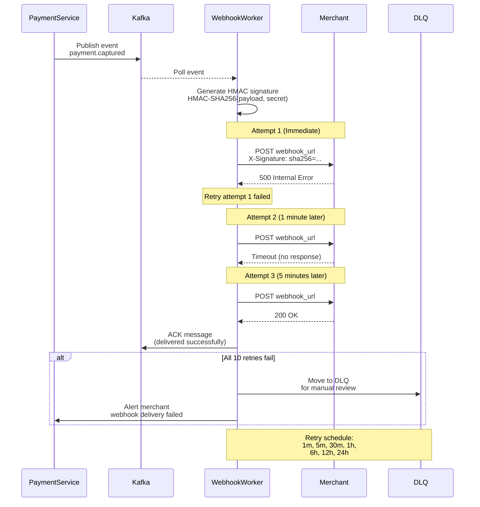
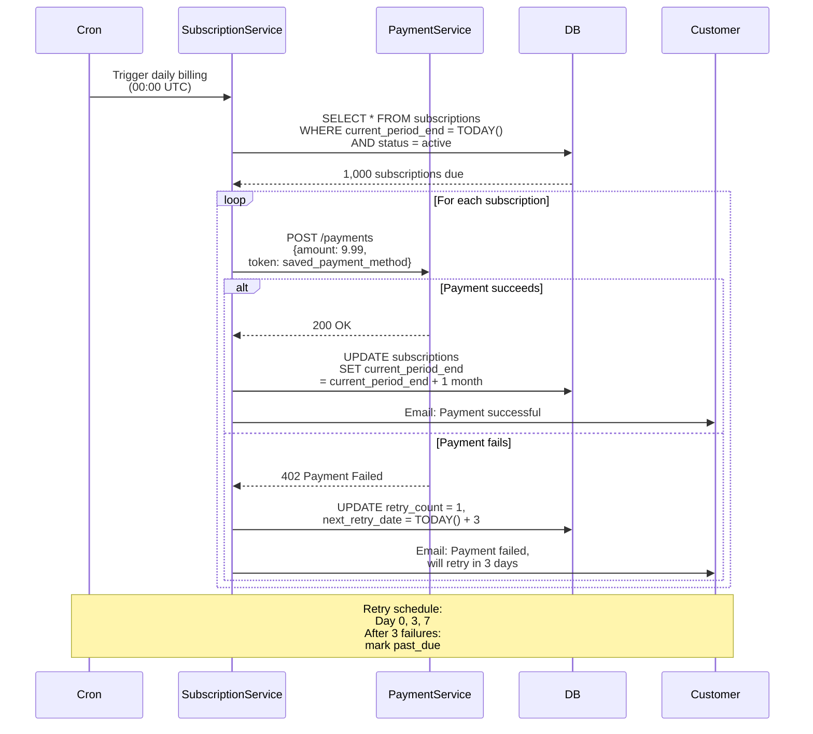
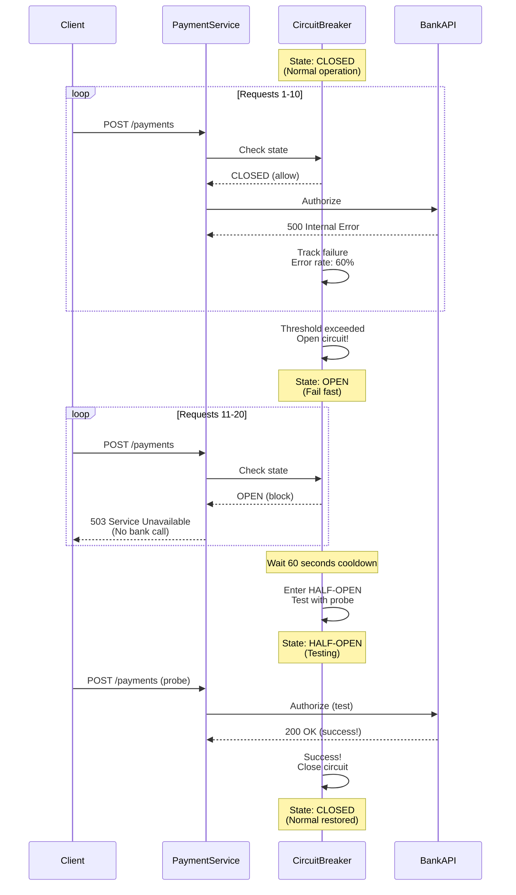

# Payment Gateway - Sequence Diagrams

This document contains detailed sequence diagrams showing interaction flows for the Payment Gateway system.

---

## Table of Contents

1. [Payment Authorization Flow](#1-payment-authorization-flow)
2. [Payment Capture Flow](#2-payment-capture-flow)
3. [Idempotent Retry Handling](#3-idempotent-retry-handling)
4. [Tokenization Flow](#4-tokenization-flow)
5. [Refund Processing](#5-refund-processing)
6. [Fraud Detection Flow](#6-fraud-detection-flow)
7. [3D Secure Authentication](#7-3d-secure-authentication)
8. [Webhook Delivery with Retries](#8-webhook-delivery-with-retries)
9. [Subscription Billing](#9-subscription-billing)
10. [Circuit Breaker Activation](#10-circuit-breaker-activation)

---

## 1. Payment Authorization Flow

**Flow:**

Complete flow from client payment request to authorized status.

**Steps:**

1. Client sends payment request (0ms)
2. API Gateway validates and routes (10ms)
3. Check idempotency cache (5ms)
4. Fraud detection scores transaction (50ms)
5. Call bank API for authorization (200ms)
6. Write to ledger database (20ms)
7. Cache idempotency result (5ms)
8. Return authorization response (10ms)

**Total Latency**: ~300ms

---

## 2. Payment Capture Flow

**Flow:**

Merchant captures previously authorized payment (after shipment confirmation).

**Steps:**

1. Merchant requests capture (0ms)
2. Verify payment exists and is authorized (10ms)
3. Call bank API to transfer funds (200ms)
4. Update ledger with captured status (20ms)
5. Trigger webhook event (5ms async)
6. Return capture confirmation (10ms)

**Total Latency**: ~245ms

---

## 3. Idempotent Retry Handling

**Flow:**

Client retries failed request with same idempotency key (network issue).

**Steps:**

1. First request: Process normally, cache result
2. Network failure: Client doesn't receive response
3. Retry: Same idempotency key
4. Cache hit: Return cached result (no reprocessing)

**Key Point**: Payment only processed once, but client gets result twice.

---

## 4. Tokenization Flow

**Flow:**

Convert sensitive card number to non-sensitive token.

**Steps:**

1. Client sends card number (never stored raw)
2. Validate card with Luhn algorithm (10ms)
3. Generate unique token (5ms)
4. Encrypt card with AES-256 (10ms)
5. Store encrypted card in database (20ms)
6. Return token to client (10ms)

**Total Latency**: ~55ms

---

## 5. Refund Processing

**Flow:**

Merchant initiates refund for captured payment.

**Steps:**

1. Merchant requests refund (0ms)
2. Verify payment captured and amount valid (10ms)
3. Create refund record (20ms)
4. Call bank API to process refund (200ms)
5. Update refund status (20ms)
6. Trigger webhook (5ms async)

**Total Latency**: ~255ms

---

## 6. Fraud Detection Flow

**Flow:**

Real-time fraud scoring during authorization.

**Steps:**

1. Payment request arrives
2. Extract features (transaction, card, user)
3. Query feature store (Redis) for historical data
4. Run ML model (20ms)
5. Make decision based on score
6. Block high-risk, challenge medium-risk, approve low-risk

---

## 7. 3D Secure Authentication

**Flow:**

Customer completes 3D Secure challenge for medium-risk transaction.

**Steps:**

1. Initial auth attempt → fraud score 0.65 (medium)
2. Redirect to 3DS page
3. Customer enters OTP sent to phone
4. Bank verifies OTP
5. Complete authorization
6. Liability shifts to bank

---

## 8. Webhook Delivery with Retries

**Flow:**

Webhook delivery with exponential backoff retry strategy.

**Steps:**

1. Payment event occurs (captured)
2. Publish to Kafka queue
3. Worker picks up event
4. Attempt delivery to merchant endpoint
5. If failure, retry with exponential backoff
6. After 10 retries, move to dead letter queue

---

## 9. Subscription Billing

**Flow:**

Automated monthly subscription billing.

**Steps:**

1. Daily cron checks for due subscriptions
2. Query subscriptions ending today
3. For each subscription, charge payment method
4. If success, extend billing period
5. If failure, retry with exponential backoff
6. After 3 failures, mark past_due

---

## 10. Circuit Breaker Activation

**Flow:**

Circuit breaker opens when bank API fails repeatedly.

**Steps:**

1. Normal: Requests pass through (CLOSED state)
2. Bank API starts failing (50% error rate)
3. Circuit opens after threshold (OPEN state)
4. Requests fail fast (no bank calls)
5. After cooldown, test with probe (HALF-OPEN)
6. If successful, close circuit

