# Ad Click Aggregator - High-Level Design Diagrams

## Table of Contents

1. [System Architecture Overview](#1-system-architecture-overview)
2. [Ingestion Layer Architecture](#2-ingestion-layer-architecture)
3. [Kafka Cluster Design](#3-kafka-cluster-design)
4. [Flink Stream Processing Pipeline](#4-flink-stream-processing-pipeline)
5. [Fraud Detection Flow](#5-fraud-detection-flow)
6. [Real-Time Storage Architecture](#6-real-time-storage-architecture)
7. [Two-Speed Processing Pipeline](#7-two-speed-processing-pipeline)
8. [Batch Processing Architecture](#8-batch-processing-architecture)
9. [Data Flow (End-to-End)](#9-data-flow-end-to-end)
10. [State Management in Flink](#10-state-management-in-flink)
11. [Multi-Region Deployment](#11-multi-region-deployment)
12. [Monitoring Dashboard](#12-monitoring-dashboard)

---

## 1. System Architecture Overview

**Flow Explanation:**

This diagram shows the complete end-to-end architecture of the ad click aggregator system, from event ingestion to query
serving.

**Key Components:**

1. Client layer sends HTTP POST requests with click events
2. NGINX load balancer distributes traffic to API Gateway instances
3. Kafka serves as the durable event backbone
4. Flink processes events in real-time for dashboard updates
5. Spark batch processes for accurate billing
6. S3 Data Lake stores raw events for long-term analysis

**Performance Characteristics:**

- Ingestion: 500k events/sec peak throughput
- Real-time lag: < 5 seconds from click to dashboard
- Batch latency: 24 hours for billing accuracy

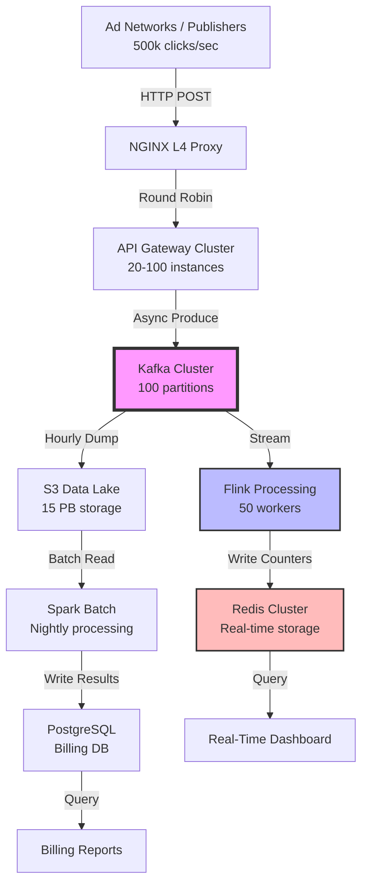

---

## 2. Ingestion Layer Architecture

**Flow Explanation:**

Shows how click events are accepted, validated, and buffered before being written to Kafka.

**Steps:**

1. Client sends click event via HTTP POST
2. NGINX terminates TLS and load balances
3. API Gateway validates schema and enriches data
4. Validation service checks for duplicates
5. Events buffered and batched to Kafka

**Benefits:**

- Async response (202 Accepted) = high throughput
- Validation catches malformed events early
- Batching reduces Kafka overhead

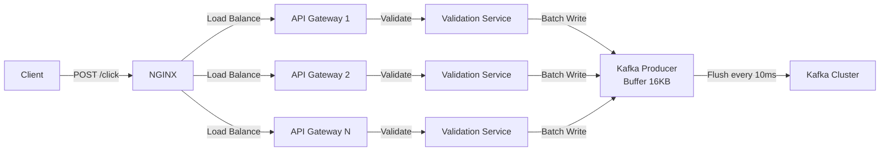

---

## 3. Kafka Cluster Design

**Flow Explanation:**

Kafka cluster configuration optimized for high-throughput write workload.

**Configuration:**

- 10 brokers across 3 availability zones
- 100 partitions (partitioned by campaign_id hash)
- Replication factor: 3
- Retention: 7 days
- Compression: LZ4 (3:1 ratio)

**Trade-offs:**

- More partitions = higher parallelism but more overhead
- 7-day retention = supports replay for late arrivals
- LZ4 compression = fast with good ratio

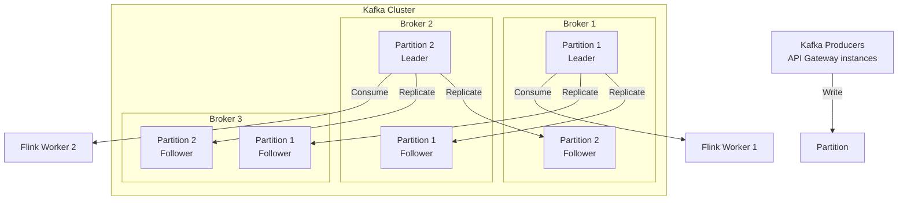

---

## 4. Flink Stream Processing Pipeline

**Flow Explanation:**

Flink pipeline that processes click events in real-time, filters fraud, aggregates counts, and writes to Redis.

**Processing Steps:**

1. Consume from Kafka (100 parallel consumers)
2. Fraud detection filter (Bloom filter + ML)
3. Windowed aggregation (5-minute tumbling windows)
4. Write to Redis (real-time counters)
5. Write to S3 (archival)

**Performance:**

- Throughput: 500k events/sec
- State size: 10M counters (1 GB per worker)
- Checkpointing: Every 60 seconds

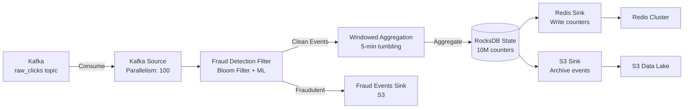

---

## 5. Fraud Detection Flow

**Flow Explanation:**

Multi-stage fraud detection pipeline that filters fraudulent clicks before counting.

**Stages:**

1. Bloom filter check (known bad IPs/user-agents)
2. Click pattern analysis (rate limiting)
3. ML model scoring (risk 0-1)
4. Decision: Clean, Suspicious, or Fraud

**Thresholds:**

- Clean (0.0-0.3): Count normally
- Suspicious (0.3-0.7): Count but flag
- Fraud (0.7-1.0): Drop immediately

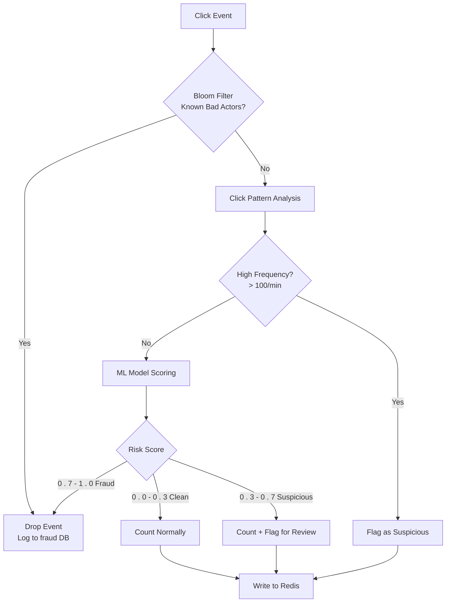

---

## 6. Real-Time Storage Architecture

**Flow Explanation:**

Redis cluster design for storing real-time counters with sub-millisecond query latency.

**Data Structures:**

- Key pattern: counter:{campaign_id}:{window}:{dimension}
- Value: Hash with clicks, unique_users, cost
- TTL: 24 hours (automatic cleanup)

**Sharding:**

- 3 master nodes + 3 replica nodes
- Sharded by campaign_id hash
- Redis Sentinel for automatic failover

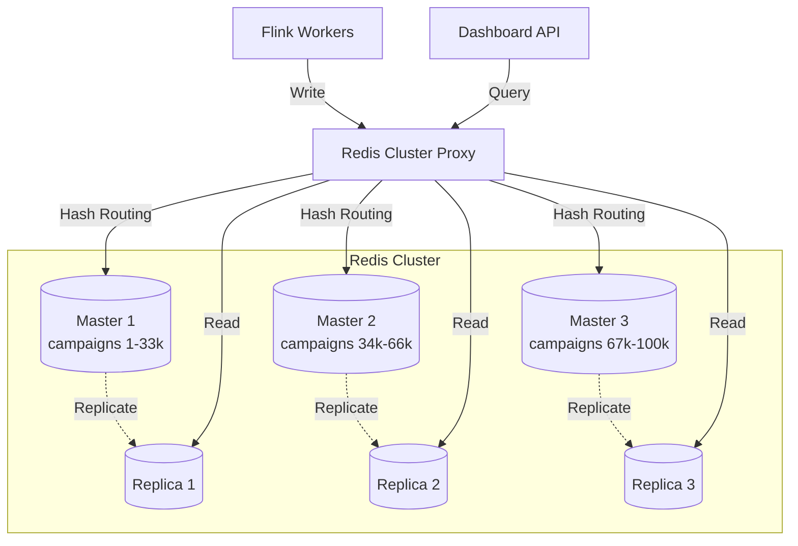

---

## 7. Two-Speed Processing Pipeline

**Flow Explanation:**

Dual-pipeline architecture: fast path for real-time dashboards, slow path for accurate billing.

**Fast Path (Real-Time):**

- Kafka → Flink → Redis
- Latency: < 5 seconds
- Accuracy: ~98% (acceptable for dashboards)

**Slow Path (Batch):**

- Kafka → S3 → Spark → PostgreSQL
- Latency: 24 hours
- Accuracy: 100% (source of truth for billing)

**Reconciliation:**

- Compare real-time vs batch daily
- Alert if discrepancy > 5%

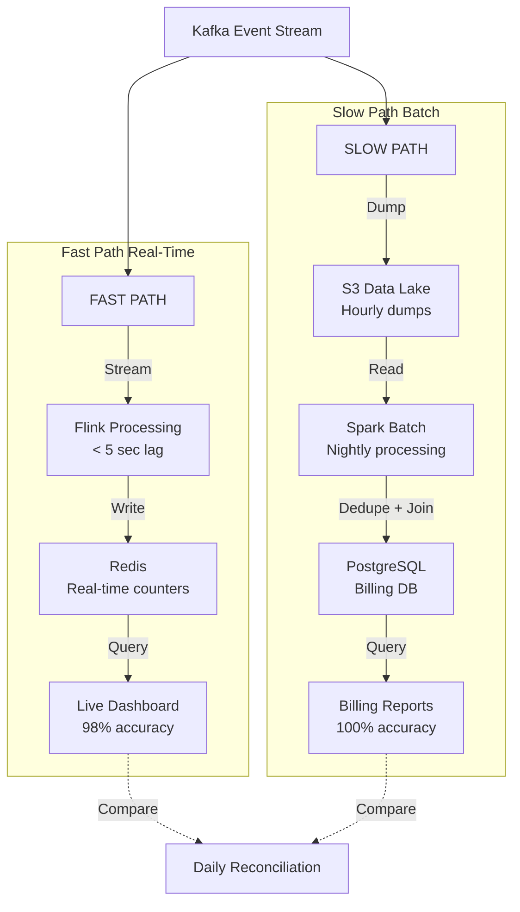

---

## 8. Batch Processing Architecture

**Flow Explanation:**

Spark batch job that runs nightly to generate accurate billing data with full deduplication and fraud removal.

**Processing Steps:**

1. Read Parquet files from S3 (previous 24 hours)
2. Deduplication by event_id
3. Fraud removal (ML model inference)
4. Join with campaign metadata
5. Aggregate by campaign/day/dimension
6. Write to PostgreSQL billing DB

**Performance:**

- Data processed: 43.2 TB/day
- Executors: 100 (EMR Spot instances)
- Duration: ~2 hours

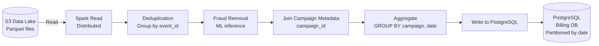

---

## 9. Data Flow (End-to-End)

**Flow Explanation:**

Complete data flow from click event to billing report, showing both real-time and batch paths.

**Timeline:**

- T+0: Click event ingested
- T+5 sec: Real-time counter updated in Redis
- T+1 hour: Event dumped to S3
- T+24 hours: Batch processing complete, billing DB updated

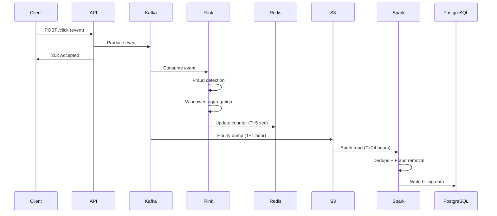

---

## 10. State Management in Flink

**Flow Explanation:**

How Flink manages stateful processing with RocksDB and checkpointing for fault tolerance.

**State Backend:**

- RocksDB: Disk-backed embedded database
- State size: ~1 GB per worker (10M counters)
- Checkpoints: S3 every 60 seconds

**Recovery:**

- On failure: Restart from last checkpoint
- Recovery time: < 5 minutes
- Exactly-once semantics preserved

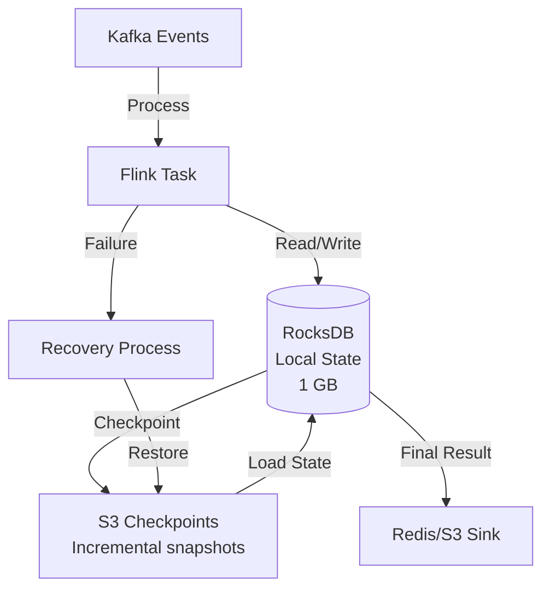

---

## 11. Multi-Region Deployment

**Flow Explanation:**

Multi-region architecture for global low-latency ingestion with centralized processing.

**Strategy:**

- Regional ingestion (US-East, EU-West, AP-Southeast)
- Kafka MirrorMaker for cross-region replication
- Batch processing in primary region only
- S3 cross-region replication for DR

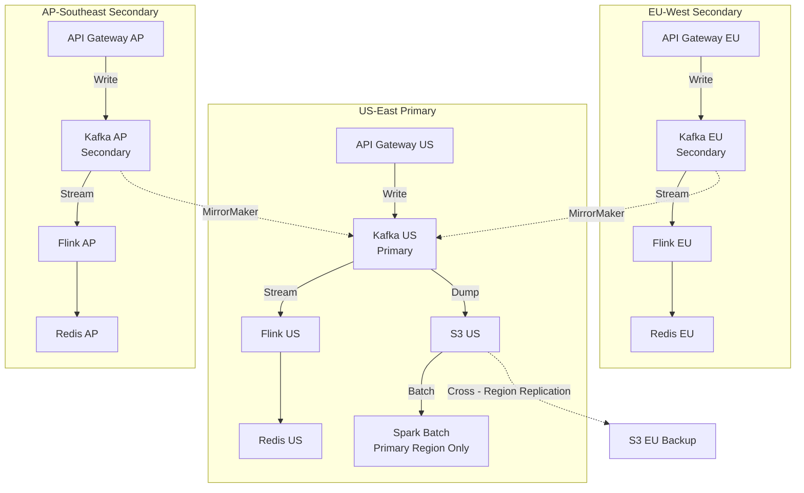

---

## 12. Monitoring Dashboard

**Flow Explanation:**

Key metrics monitored for system health and performance.

**Critical Metrics:**

1. Ingestion rate (target: 500k/sec)
2. Kafka lag (target: < 1 min)
3. Flink backpressure (target: 0%)
4. Fraud rate (target: 10-20%)
5. Real-time accuracy (target: 98%+ vs batch)

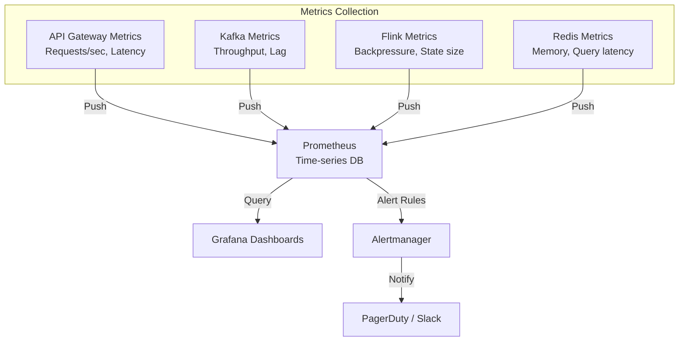

