# Ad Click Aggregator - Sequence Diagrams

## Table of Contents

1. [Click Event Ingestion (Happy Path)](#1-click-event-ingestion-happy-path)
2. [Click Event Ingestion (Failure Scenarios)](#2-click-event-ingestion-failure-scenarios)
3. [Real-Time Aggregation Flow](#3-real-time-aggregation-flow)
4. [Fraud Detection Flow](#4-fraud-detection-flow)
5. [Batch Processing Flow](#5-batch-processing-flow)
6. [Dashboard Query Flow](#6-dashboard-query-flow)
7. [Kafka Partition Rebalancing](#7-kafka-partition-rebalancing)
8. [Flink Checkpoint and Recovery](#8-flink-checkpoint-and-recovery)
9. [Redis Failover](#9-redis-failover)
10. [Late Arrival Handling](#10-late-arrival-handling)
11. [Reconciliation Process](#11-reconciliation-process)
12. [Multi-Region Replication](#12-multi-region-replication)

---

## 1. Click Event Ingestion (Happy Path)

**Flow:** Complete flow of a click event from client to Kafka.

**Steps:**

1. Client sends POST request with click event
2. NGINX load balances to API Gateway
3. API Gateway validates schema and enriches data
4. Event buffered in Kafka producer
5. Batch flushed to Kafka every 10ms
6. Client receives 202 Accepted (async response)

**Performance:**

- Total latency: < 50ms (client to Kafka)
- Throughput: 500k events/sec peak

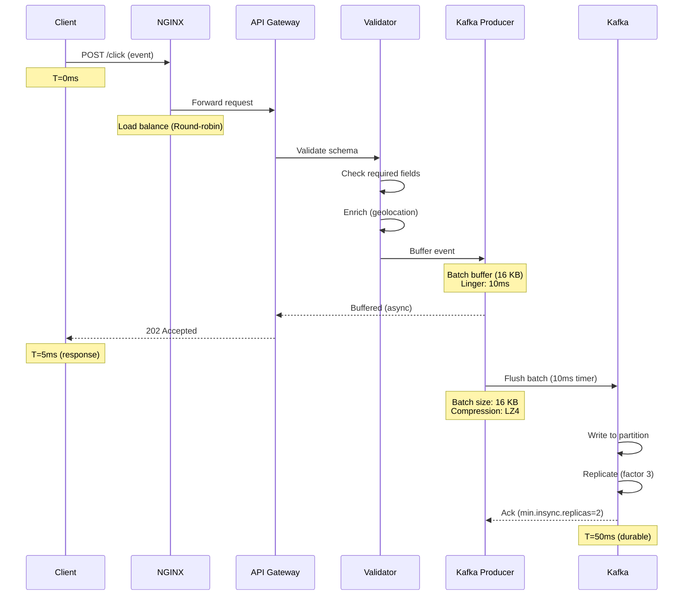

---

## 2. Click Event Ingestion (Failure Scenarios)

**Flow:** How the system handles various failure scenarios during ingestion.

**Failure Cases:**

1. Invalid schema: Return 400 Bad Request
2. Rate limit exceeded: Return 429 Too Many Requests
3. Kafka unavailable: Buffer in memory, retry with backoff
4. Kafka full: Circuit breaker opens, reject writes

**Recovery:**

- Producer retries: 3 attempts with exponential backoff
- Circuit breaker: Opens after 10 consecutive failures
- Fallback: Drop events if buffer full (log to dead letter queue)

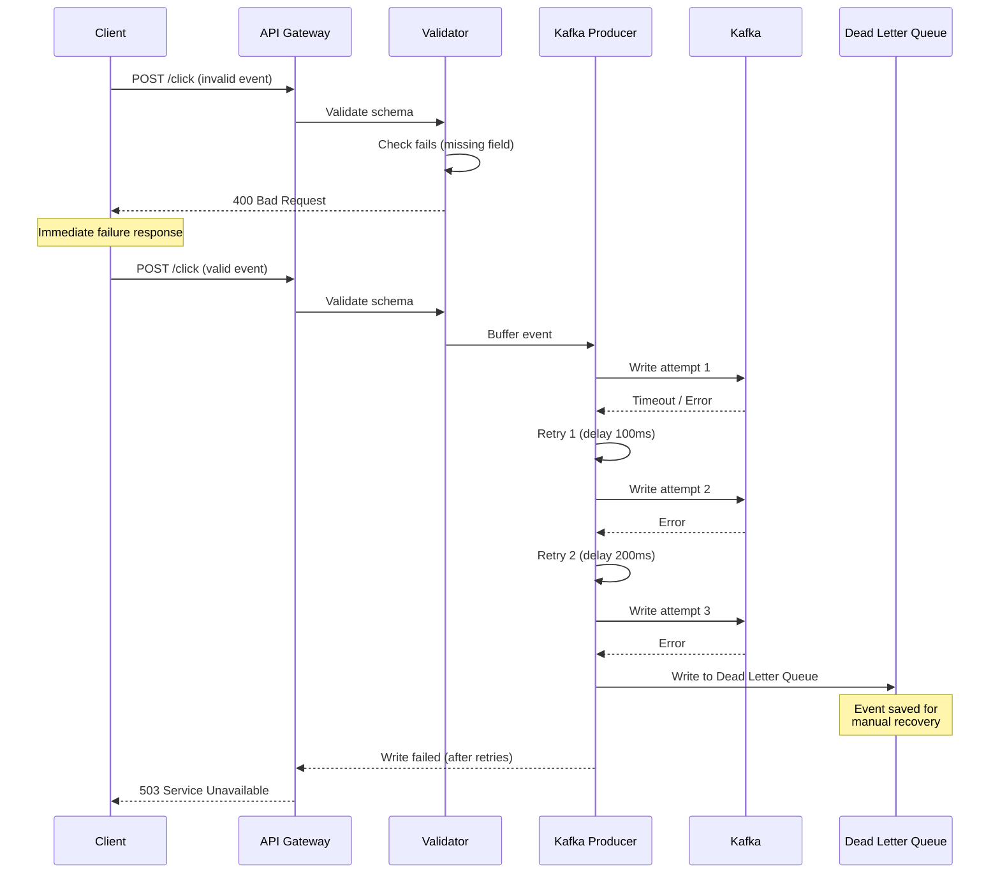

---

## 3. Real-Time Aggregation Flow

**Flow:** How Flink processes events and updates Redis counters in real-time.

**Steps:**

1. Flink consumes events from Kafka
2. Fraud detection filter applied
3. Events grouped by campaign_id + window
4. Aggregation state updated (RocksDB)
5. Window closes, results written to Redis
6. Dashboard queries Redis for real-time counts

**Latency:**

- Kafka to Flink: < 1 second
- Flink to Redis: < 2 seconds
- Total end-to-end: < 5 seconds

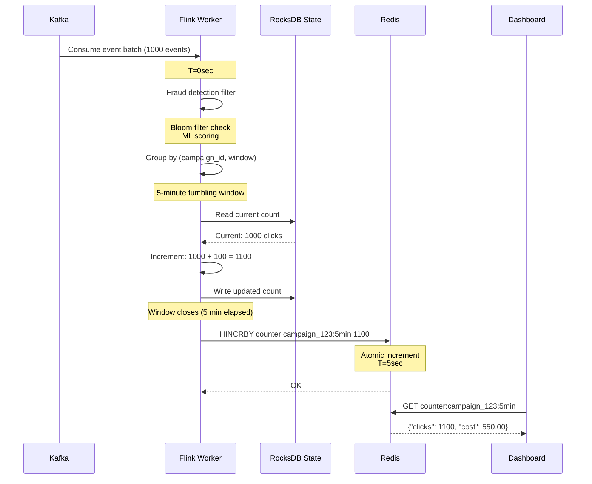

---

## 4. Fraud Detection Flow

**Flow:** Multi-stage fraud detection process applied to each click event.

**Detection Stages:**

1. Bloom filter (known bad actors)
2. Click pattern analysis (rate limiting)
3. ML model scoring
4. Decision: Clean, Suspicious, or Fraud

**Actions:**

- Clean (0.0-0.3): Count normally
- Suspicious (0.3-0.7): Count but flag for review
- Fraud (0.7-1.0): Drop immediately, log to fraud DB

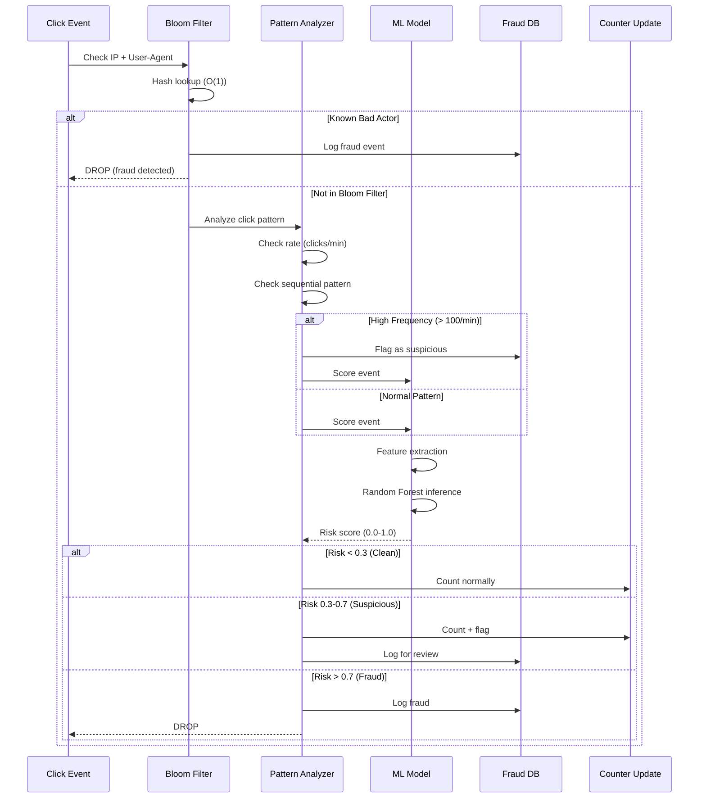

---

## 5. Batch Processing Flow

**Flow:** Nightly Spark batch job for accurate billing with deduplication and fraud removal.

**Steps:**

1. Read S3 Parquet files (last 24 hours)
2. Deduplication by event_id
3. Fraud removal (ML model batch inference)
4. Join with campaign metadata
5. Aggregate by campaign/day
6. Write to PostgreSQL billing DB

**Duration:** ~2 hours for 43.2 TB data

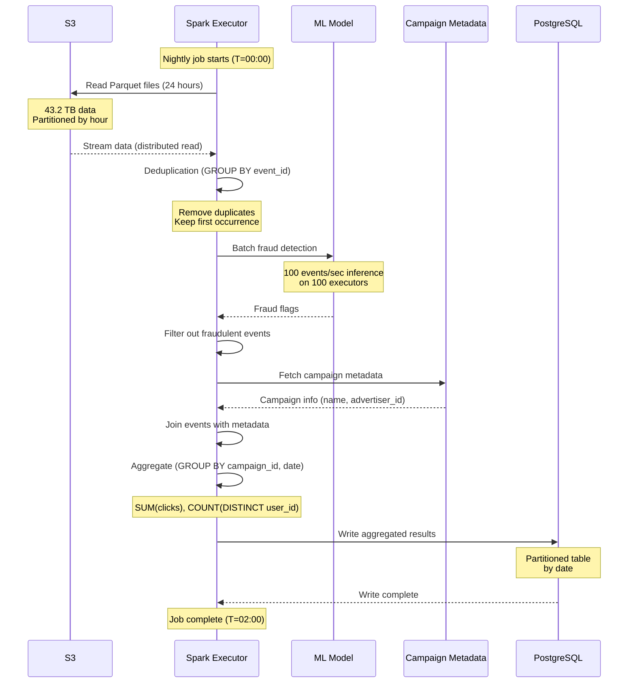

---

## 6. Dashboard Query Flow

**Flow:** How dashboard queries Redis for real-time campaign statistics.

**Query Types:**

1. Single campaign: GET counter:campaign_123:5min
2. Multiple dimensions: MGET with pattern
3. Aggregation: Pipeline multiple commands

**Performance:**

- Single key: < 1ms
- Multi-key (100 keys): < 10ms
- Pipeline (1000 keys): < 50ms

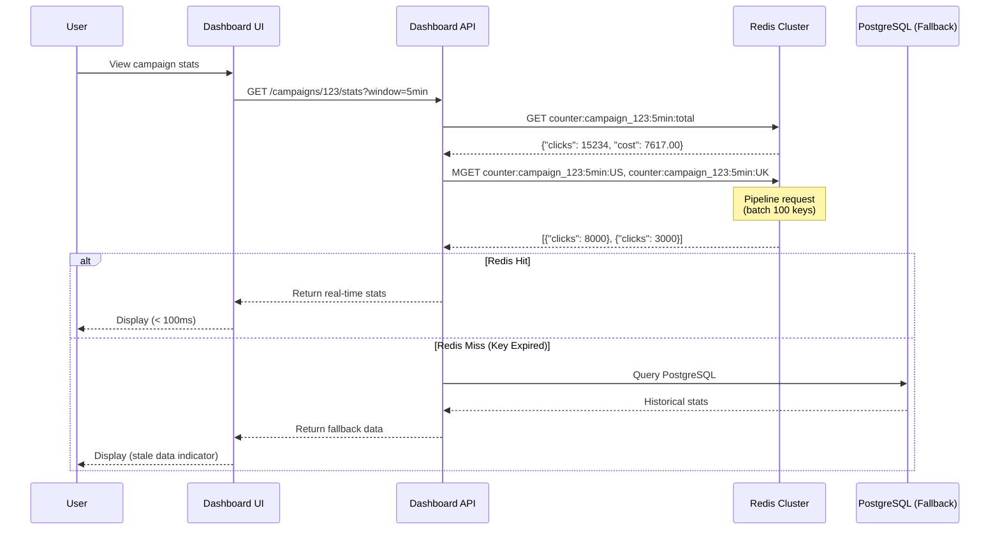

---

## 7. Kafka Partition Rebalancing

**Flow:** What happens when Kafka partitions rebalance due to consumer changes.

**Trigger Events:**

- Flink worker added/removed
- Flink worker crashes
- Kafka partition added

**Impact:**

- Brief processing pause during rebalance
- State reassignment
- Resume from last committed offset

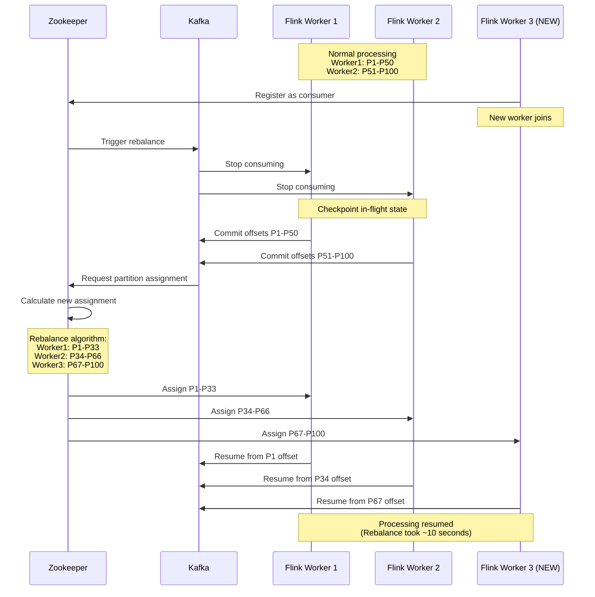

---

## 8. Flink Checkpoint and Recovery

**Flow:** How Flink checkpoints state for fault tolerance and recovers from failures.

**Checkpoint Process:**

1. Flink JobManager triggers checkpoint (every 60 seconds)
2. Workers snapshot state to RocksDB
3. Incremental snapshot uploaded to S3
4. Kafka offsets committed
5. Checkpoint complete

**Recovery:**

- Worker crashes
- Restart from last successful checkpoint
- Restore state from S3
- Resume from committed Kafka offset

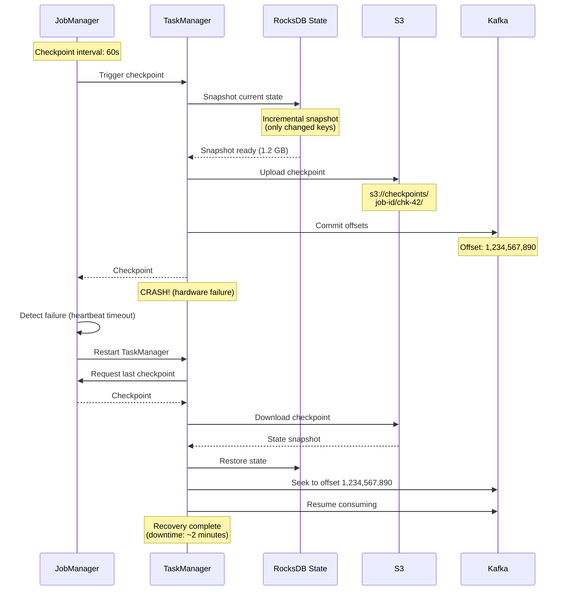

---

## 9. Redis Failover

**Flow:** Redis Sentinel-managed automatic failover when master fails.

**Failover Process:**

1. Sentinel detects master down (heartbeat timeout)
2. Sentinel elects new master from replicas
3. Sentinel reconfigures other replicas
4. Clients reconnect to new master
5. Old master rejoins as replica (when recovered)

**Downtime:** < 30 seconds

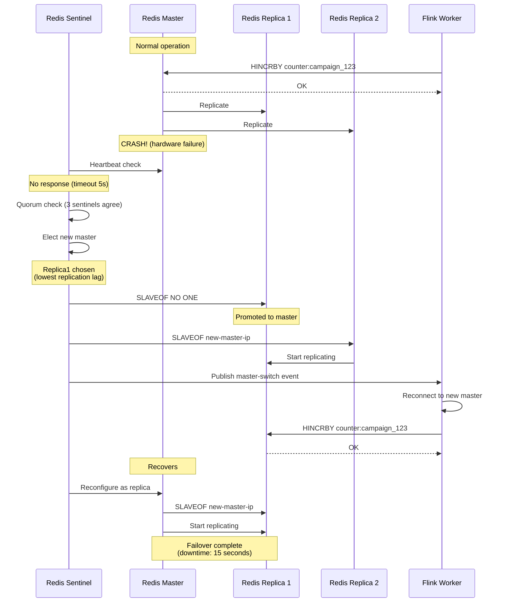

---

## 10. Late Arrival Handling

**Flow:** How the system handles events that arrive late (delayed network, clock skew).

**Strategy:**

- Real-time: Use watermarks (5-minute grace period)
- Batch: Reprocess last 7 days nightly to catch late arrivals
- Trade-off: Real-time slightly inaccurate, batch is source of truth

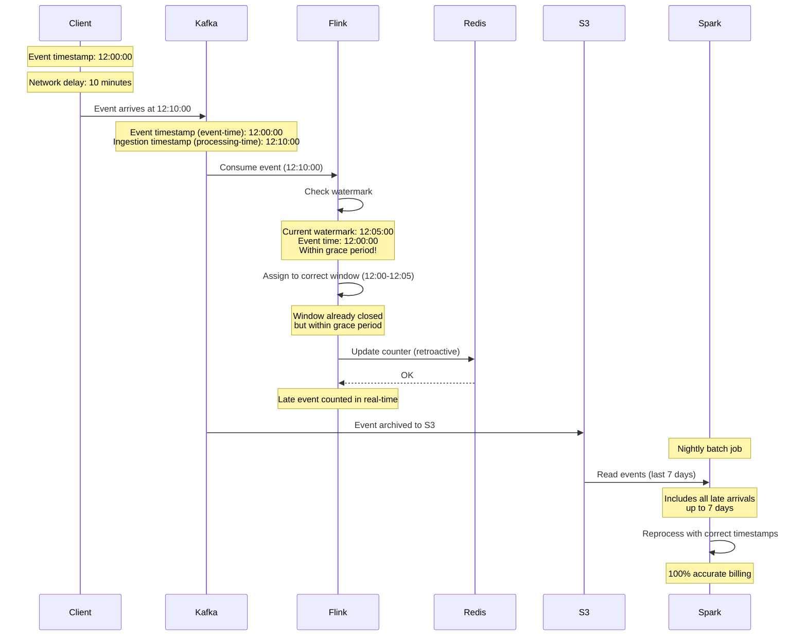

---

## 11. Reconciliation Process

**Flow:** Daily reconciliation between real-time (Redis) and batch (PostgreSQL) to detect discrepancies.

**Process:**

1. Compare real-time vs batch counts
2. Calculate discrepancy percentage
3. Alert if discrepancy > 5%
4. Investigate root cause

**Common Causes:**

- Late arrivals not yet in batch
- Redis evictions
- Flink lag during high load

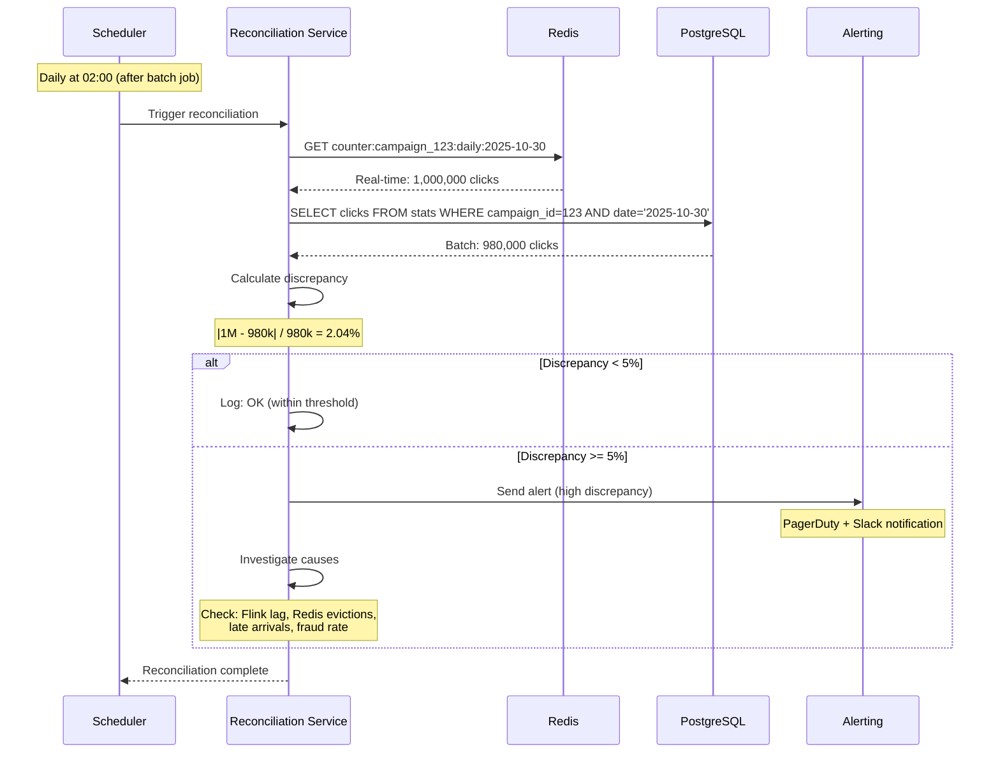

---

## 12. Multi-Region Replication

**Flow:** How events are replicated across regions for global low-latency ingestion.

**Strategy:**

- Regional ingestion (US, EU, AP)
- Kafka MirrorMaker 2 for cross-region replication
- Centralized batch processing in primary region

**Latency:**

- Regional ingestion: < 50ms
- Cross-region replication: < 5 seconds
- Trade-off: Slight delay in cross-region visibility

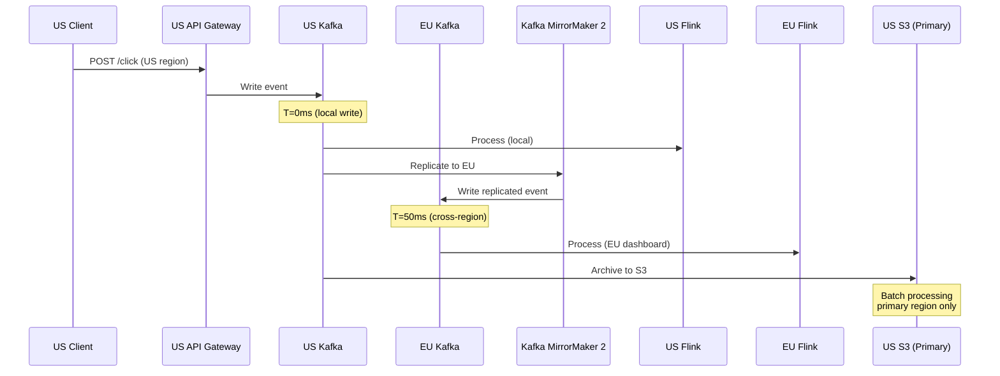