# YouTube Top K (Trending Algorithm) - High-Level Design

## Table of Contents

1. [System Architecture Overview](#1-system-architecture-overview)
2. [Lambda Architecture Pattern](#2-lambda-architecture-pattern)
3. [Event Ingestion Pipeline](#3-event-ingestion-pipeline)
4. [Kafka Cluster Design](#4-kafka-cluster-design)
5. [Flink Stream Processing](#5-flink-stream-processing)
6. [InfluxDB Time-Series Storage](#6-influxdb-time-series-storage)
7. [Ranking Service Architecture](#7-ranking-service-architecture)
8. [Redis Top K Storage](#8-redis-top-k-storage)
9. [Batch Processing Pipeline](#9-batch-processing-pipeline)
10. [Fraud Detection Flow](#10-fraud-detection-flow)
11. [Multi-Dimensional Trending](#11-multi-dimensional-trending)
12. [Multi-Region Deployment](#12-multi-region-deployment)

---

## 1. System Architecture Overview

**Flow Explanation:**

This diagram shows the end-to-end architecture for YouTube trending algorithm with Lambda pattern (speed + batch layers).

**Key Components:**

1. Client requests go through CDN and API Gateway
2. View events are ingested via Kafka (1M events/sec)
3. Speed layer processes events in real-time (Flink → InfluxDB → Redis)
4. Batch layer corrects fraud nightly (Spark → Cassandra → Redis)
5. Serving layer uses Redis Sorted Sets for sub-ms reads

**Benefits:**

- Real-time trending (< 5 min lag)
- High accuracy (batch fraud correction)
- Low latency reads (< 1ms from Redis)

**Trade-offs:**

- Complex architecture (two processing paths)
- Slight staleness in speed layer (acceptable)

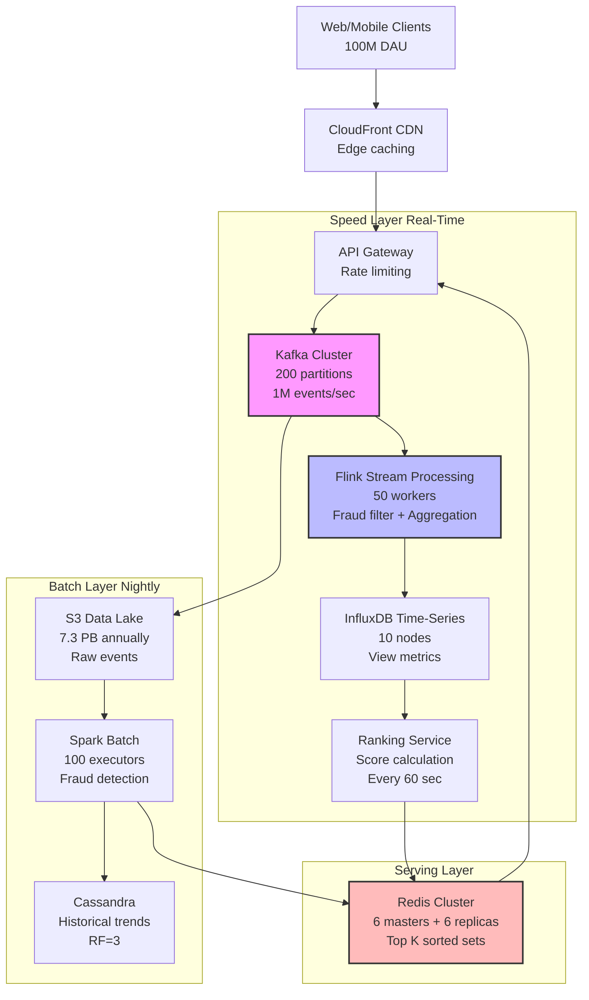

---

## 2. Lambda Architecture Pattern

**Flow Explanation:**

Shows the Lambda architecture with two parallel processing paths: speed (real-time) and batch (accuracy).

**Steps:**

1. Events flow into both speed and batch layers simultaneously
2. Speed layer provides low-latency approximate results
3. Batch layer provides high-accuracy corrected results
4. Serving layer merges both views

**Performance:**

- Speed layer: < 5 seconds lag
- Batch layer: 24 hours lag
- Accuracy: 98% (speed), 100% (batch)

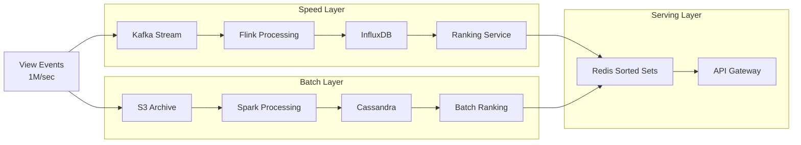

---

## 3. Event Ingestion Pipeline

**Flow Explanation:**

View events from clients are validated, enriched, and batched before being sent to Kafka.

**Steps:**

1. Client sends view event (play button clicked)
2. API Gateway validates schema and rate limits
3. Enrichment service adds geo, device info
4. Kafka producer batches and compresses
5. Events written to Kafka topic

**Performance:**

- Ingestion latency: < 10ms P99
- Throughput: 1M events/sec sustained
- Compression ratio: 3:1 (LZ4)

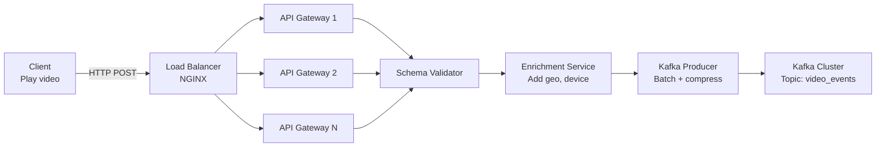

---

## 4. Kafka Cluster Design

**Configuration:**

- 10 brokers across 3 availability zones
- 200 partitions (sharded by video_id hash)
- Replication factor: 3
- Retention: 7 days

**Trade-offs:**

- More partitions = higher parallelism but more overhead
- 7-day retention supports replay and late arrivals

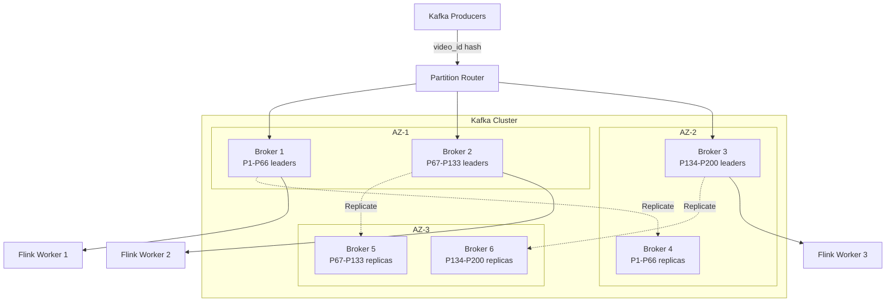

---

## 5. Flink Stream Processing

**Flow Explanation:**

Shows the complete Flink stream processing pipeline with fraud detection, windowed aggregation, and multiple sinks.

**Steps:**

1. Consume events from Kafka (200 parallel consumers)
2. Parse JSON and validate schema
3. Fraud detection filter (Bloom filter + ML)
4. Windowed aggregation (1-minute tumbling windows)
5. Write to InfluxDB (metrics) and S3 (archival)

**Performance:**

- Throughput: 1M events/sec
- Latency: < 2 seconds
- State size: 1 GB per worker

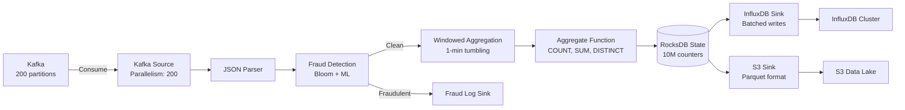

---

## 6. InfluxDB Time-Series Storage

**Flow Explanation:**

InfluxDB cluster architecture with sharding and replication for high write throughput.

**Configuration:**

- 10 data nodes (sharded by video_id)
- Write throughput: 5M points/sec
- Retention: 7 days (speed layer)
- Downsampling: 1min → 5min → 1hour

**Query Patterns:**

- Range queries: "Views in last 1 hour"
- Aggregations: SUM, AVG, COUNT
- Fast: 10ms P99

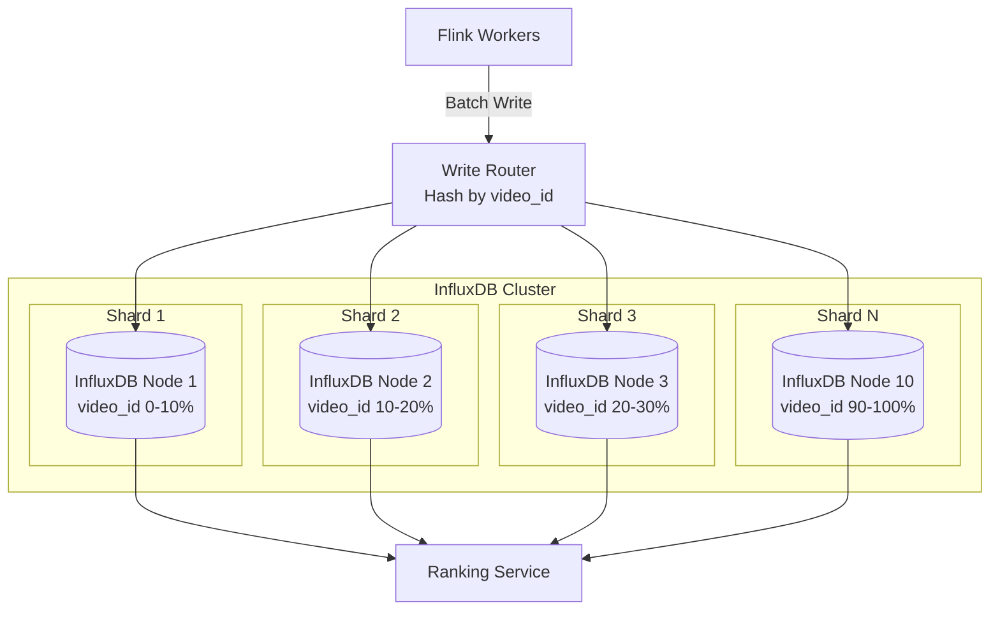

---

## 7. Ranking Service Architecture

**Flow Explanation:**

Ranking Service queries InfluxDB, calculates trending scores, and updates Redis every 60 seconds.

**Algorithm:**

- Decay function: Score = engagement^0.8 / (age + 2)^1.5
- Processes 10M active videos
- Parallelized across 100 workers

**Performance:**

- Computation time: < 10 seconds
- Update frequency: Every 60 seconds
- Score precision: float64

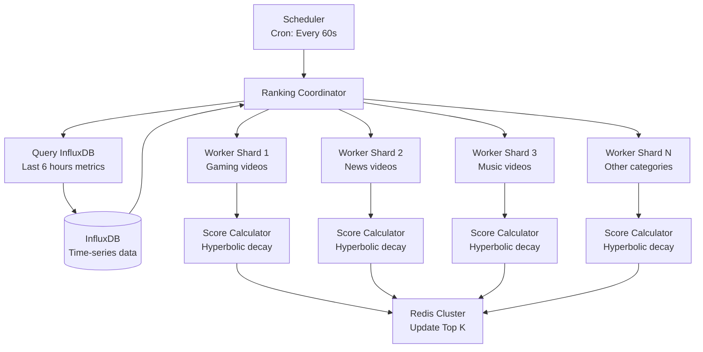

---

## 8. Redis Top K Storage

**Flow Explanation:**

Redis Cluster stores Top K lists using Sorted Sets (ZSET) sharded by dimension.

**Data Structure:**

- Key: trending:global:top100
- Members: video_id
- Scores: trending_score

**Sharding:**

- 6 master nodes + 6 replicas
- Sharded by dimension (global, regional, category)
- Read throughput: 100k QPS per node

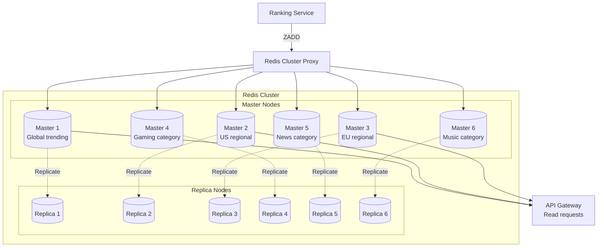

---

## 9. Batch Processing Pipeline

**Flow Explanation:**

Nightly Spark batch job reads S3, performs advanced fraud detection, and updates Redis with corrected scores.

**Steps:**

1. Read S3 Parquet files (last 24 hours)
2. Deduplication by event_id
3. Advanced fraud detection (ML model)
4. Recalculate scores with clean data
5. Write to Cassandra (historical)
6. Refresh Redis (corrected Top K)

**Performance:**

- Data processed: 20 TB/day
- Processing time: 2 hours
- Executors: 100 (Spark)

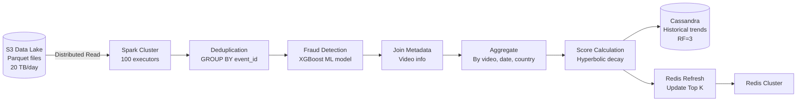

---

## 10. Fraud Detection Flow

**Flow Explanation:**

Multi-stage fraud detection pipeline with Bloom filter, rate limiting, and ML scoring.

**Stages:**

1. Bloom filter: Check known bots (O(k) lookup)
2. Rate limiting: Check per-user/IP rates (Redis)
3. ML model: Random Forest scoring (< 10ms)
4. Decision: Accept, flag, or reject event

**Thresholds:**

- Clean (0.0-0.3): Count normally
- Suspicious (0.3-0.7): Count + flag
- Fraud (0.7-1.0): Reject

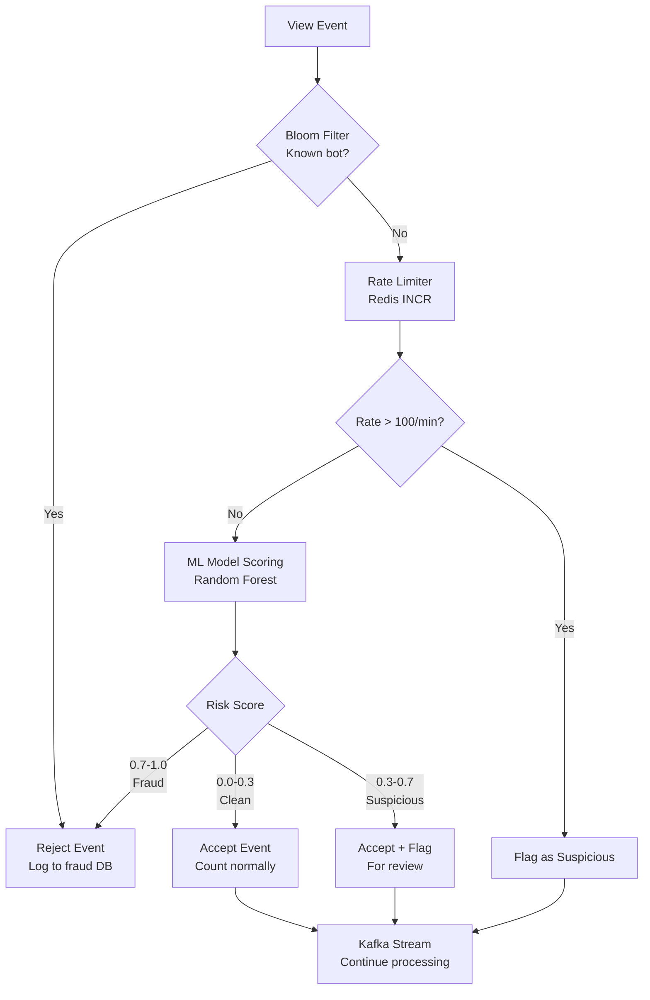

---

## 11. Multi-Dimensional Trending

**Flow Explanation:**

Shows how trending is calculated across multiple dimensions simultaneously.

**Dimensions:**

- Global: Top 100 worldwide
- Regional: Top 100 per country (200 countries)
- Category: Top 100 per category (20 categories)
- Language: Top 100 per language (50 languages)

**Total Lists:** 1 + 200 + 20 + 50 = 271 Top K lists

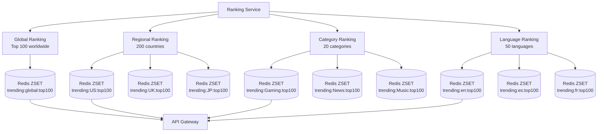

---

## 12. Multi-Region Deployment

**Flow Explanation:**

Global deployment with regional ingestion and centralized batch processing.

**Strategy:**

- Regional ingestion (US, EU, AP) for low latency
- Kafka MirrorMaker for cross-region replication
- Centralized batch in primary region only

**Latency:**

- Regional: < 30ms (ingestion)
- Cross-region: < 5 seconds (replication)

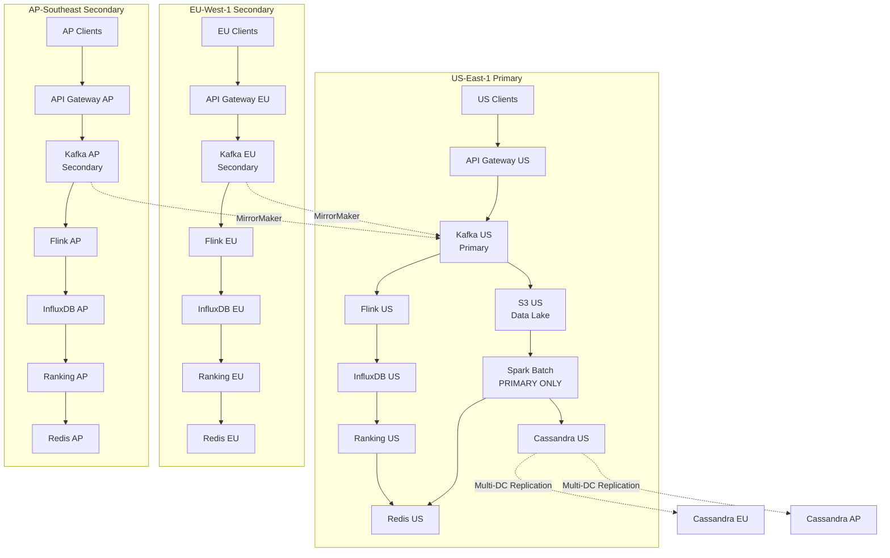