# YouTube Top K (Trending Algorithm) - Sequence Diagrams

## Table of Contents

1. [View Event Ingestion (Happy Path)](#1-view-event-ingestion-happy-path)
2. [View Event Ingestion (Failure Scenarios)](#2-view-event-ingestion-failure-scenarios)
3. [Real-Time Aggregation Flow](#3-real-time-aggregation-flow)
4. [Fraud Detection Flow](#4-fraud-detection-flow)
5. [Ranking Score Calculation](#5-ranking-score-calculation)
6. [Top K Update in Redis](#6-top-k-update-in-redis)
7. [Trending Page Query Flow](#7-trending-page-query-flow)
8. [Batch Processing Flow](#8-batch-processing-flow)
9. [Flink Checkpoint and Recovery](#9-flink-checkpoint-and-recovery)
10. [Redis Failover](#10-redis-failover)
11. [Multi-Dimensional Ranking Update](#11-multi-dimensional-ranking-update)
12. [Viral Video Spike Handling](#12-viral-video-spike-handling)

---

## 1. View Event Ingestion (Happy Path)

**Flow:**

Shows the complete flow of a user playing a video from client request to Kafka storage.

**Steps:**

1. User clicks play button (T=0ms)
2. Client sends HTTP POST to API Gateway (T=2ms)
3. Schema validation passes (T=3ms)
4. Event enriched with geo/device data (T=4ms)
5. Kafka producer batches and compresses (T=5ms)
6. Client receives 202 Accepted (T=5ms)
7. Event written to Kafka partition (T=15ms, durable)

**Performance:**

- Client latency: 5ms
- Kafka durability: 15ms
- Throughput: 1M events/sec sustained

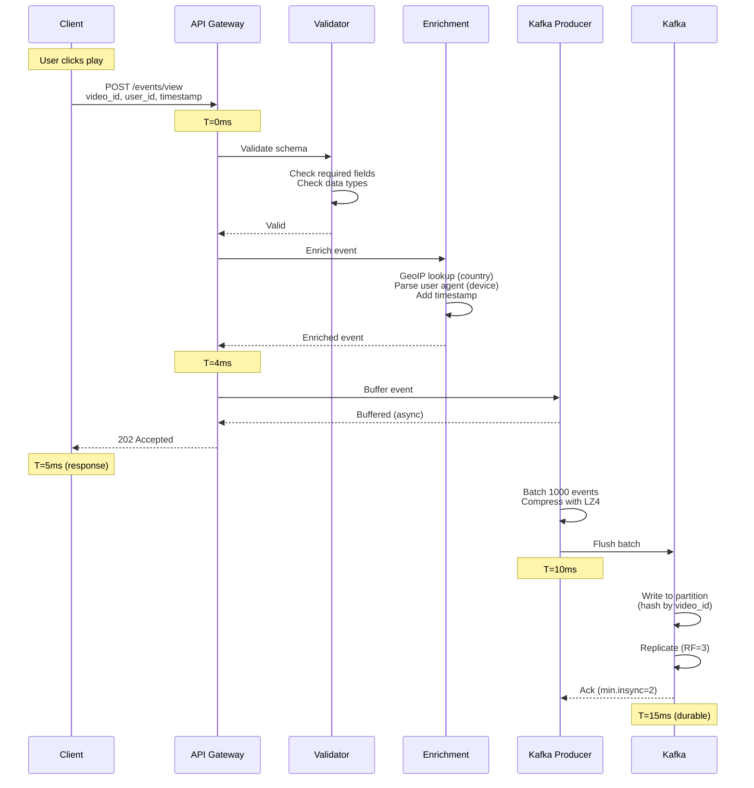

---

## 2. View Event Ingestion (Failure Scenarios)

**Flow:**

Handles various failure cases during event ingestion with retries and dead letter queue.

**Failure Cases:**

1. Invalid schema: Return 400 Bad Request
2. Rate limit exceeded: Return 429 Too Many Requests
3. Kafka timeout: Retry with exponential backoff (3 attempts)
4. Final failure: Write to Dead Letter Queue

**Recovery:**

- DLQ events replayed manually
- Monitoring alerts on DLQ growth

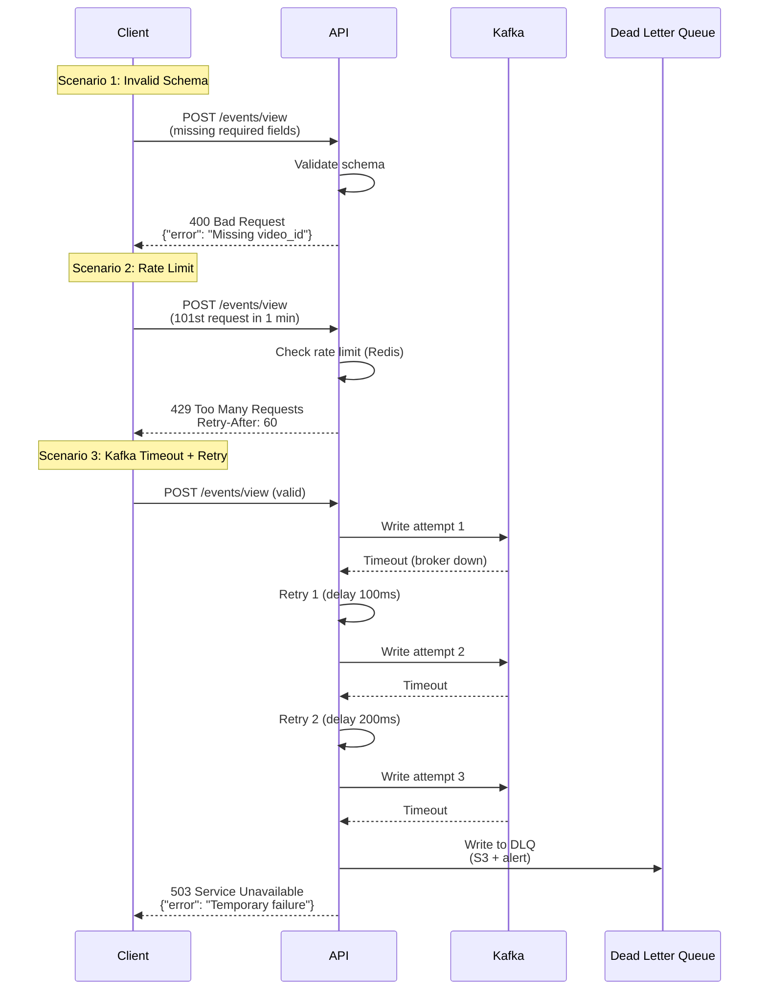

---

## 3. Real-Time Aggregation Flow

**Flow:**

Flink consumes events from Kafka, filters fraud, aggregates in windows, and writes to InfluxDB.

**Steps:**

1. Flink consumes batch of 1000 events (T=0s)
2. Fraud detection filters out 10-15% (T=0.5s)
3. Window aggregation (1-minute tumbling) (T=1s)
4. State update in RocksDB (T=1.5s)
5. Write to InfluxDB when window closes (T=2s)

**Performance:**

- End-to-end latency: < 2 seconds
- Throughput: 1M events/sec
- State size: 1 GB per worker

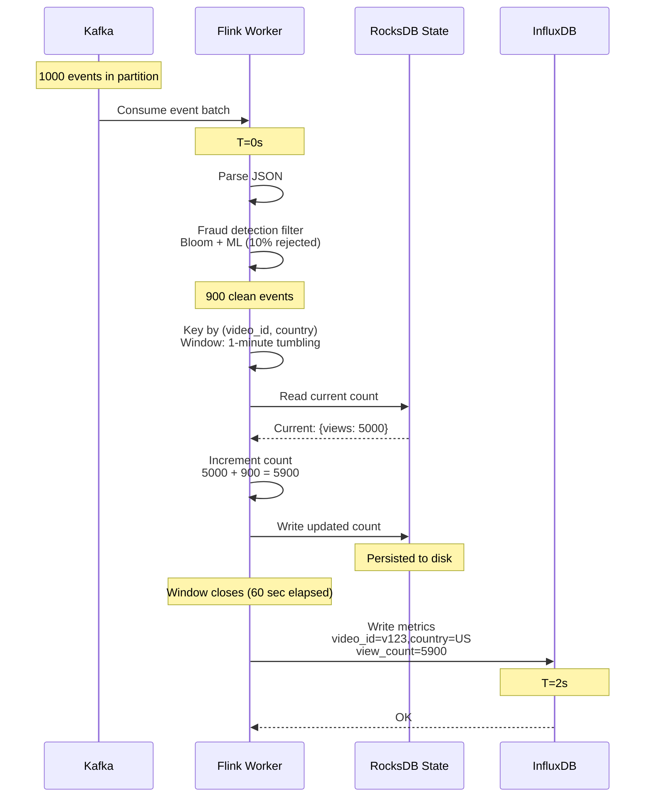

---

## 4. Fraud Detection Flow

**Flow:**

Multi-stage fraud detection with Bloom filter, rate limiting, and ML scoring.

**Steps:**

1. Check Bloom filter for known bots (< 1ms)
2. Check rate limit in Redis (< 1ms)
3. ML model inference (< 10ms)
4. Decision based on risk score

**Thresholds:**

- Risk 0.0-0.3: Accept (clean)
- Risk 0.3-0.7: Flag for review
- Risk 0.7-1.0: Reject (fraud)

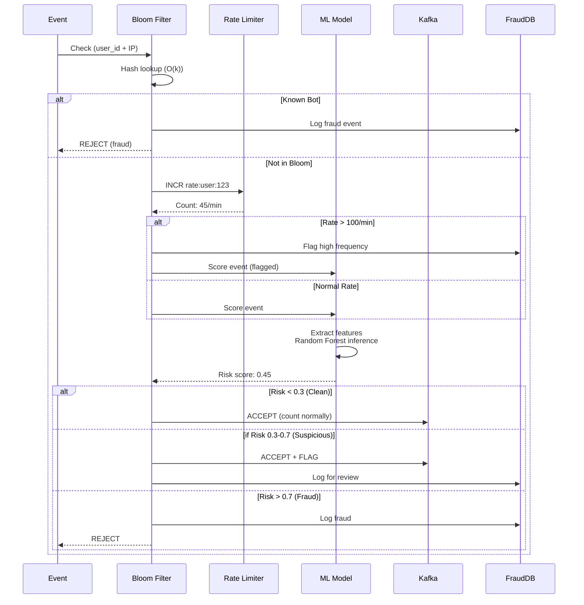

---

## 5. Ranking Score Calculation

**Flow:**

Ranking Service queries InfluxDB, calculates trending scores using hyperbolic decay, and returns Top K.

**Steps:**

1. Scheduler triggers ranking job (every 60 sec)
2. Query InfluxDB for last 6 hours of metrics
3. Calculate score for each video (hyperbolic decay)
4. Sort and return Top 100

**Formula:**

Score = (engagement^0.8) / (age + 2)^1.5

**Performance:**

- Videos processed: 10M
- Computation time: < 10 seconds
- Workers: 100 (parallel)

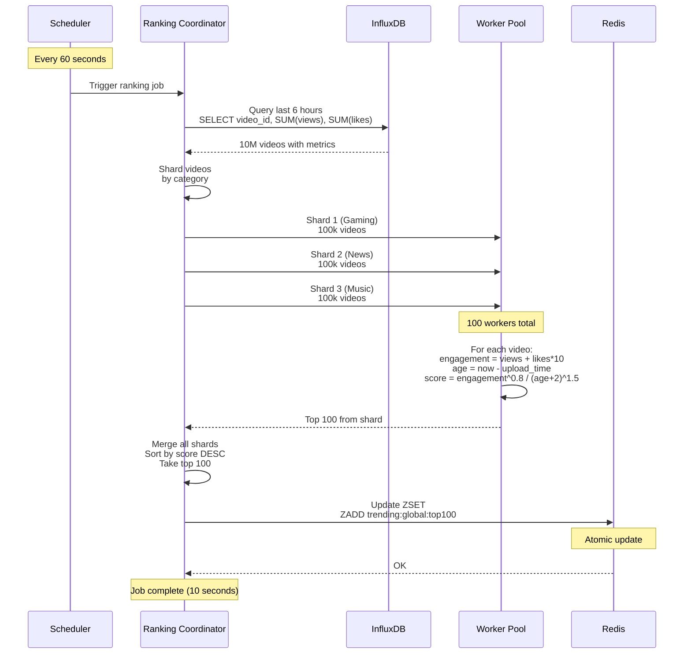

---

## 6. Top K Update in Redis

**Flow:**

Ranking Service updates multiple Redis Sorted Sets (global, regional, category) atomically.

**Steps:**

1. Ranking Service computes scores
2. Open Redis pipeline (batch mode)
3. ZADD for each dimension (global, US, Gaming, etc.)
4. ZREMRANGEBYRANK (keep only top 100)
5. Execute pipeline atomically

**Performance:**

- Dimensions updated: 271 (global + regional + category)
- Update time: < 1 second
- Operations: Pipelined (atomic)

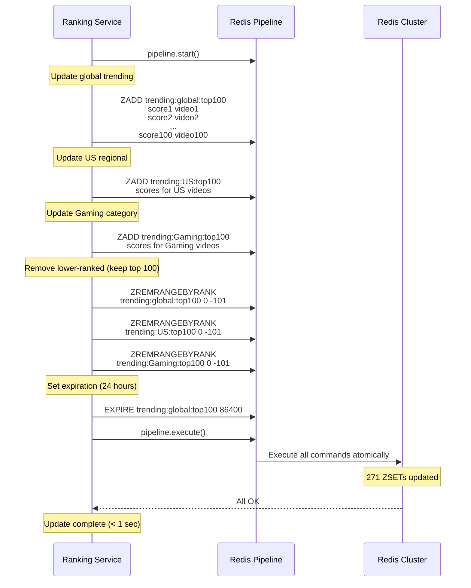

---

## 7. Trending Page Query Flow

**Flow:**

User requests trending page, API Gateway queries Redis, returns Top 100 with video metadata.

**Steps:**

1. User opens trending page
2. CDN cache miss (or expired)
3. API Gateway queries Redis
4. Fetch video metadata from cache
5. Return response to client

**Performance:**

- Redis query: < 1ms
- Metadata fetch: < 5ms
- Total: < 10ms (CDN hit: < 1ms)

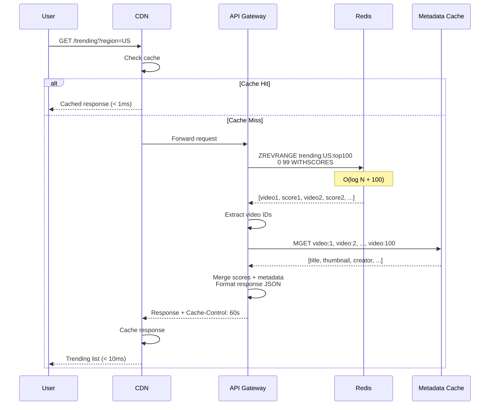

---

## 8. Batch Processing Flow

**Flow:**

Nightly Spark job reads S3, performs advanced fraud detection, recalculates scores, and updates Redis.

**Steps:**

1. Spark reads S3 Parquet files (last 24 hours) - T=0
2. Deduplication by event_id - T=15 min
3. Advanced fraud detection (XGBoost ML) - T=45 min
4. Recalculate scores - T=1 hour
5. Write to Cassandra (historical) - T=1.5 hours
6. Refresh Redis Top K - T=2 hours

**Performance:**

- Data processed: 20 TB
- Total time: 2 hours
- Executors: 100

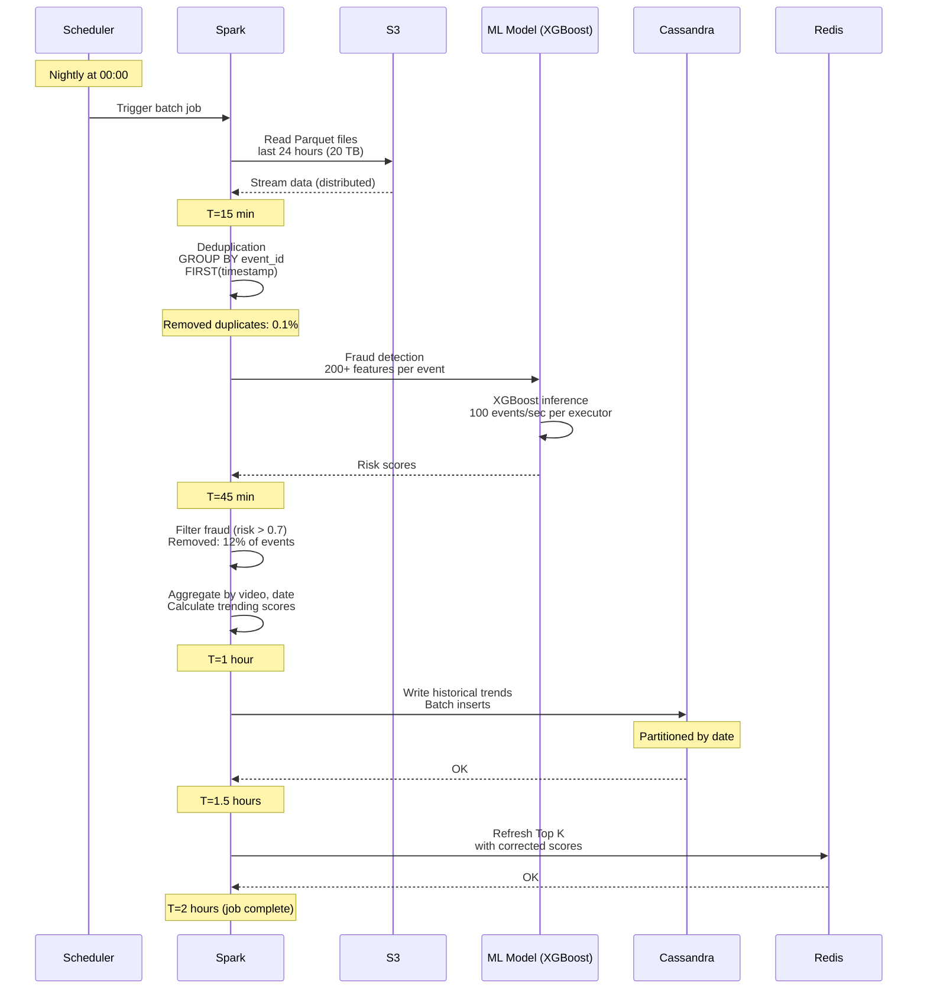

---

## 9. Flink Checkpoint and Recovery

**Flow:**

Flink checkpoints state to S3 every 60 seconds. On failure, recovers from last checkpoint.

**Steps:**

1. JobManager triggers checkpoint
2. TaskManager snapshots RocksDB state to S3
3. Commit Kafka offsets
4. On failure, restart from last checkpoint

**Recovery:**

- Checkpoint interval: 60 seconds
- Recovery time: < 5 minutes
- State size: 1 GB per worker

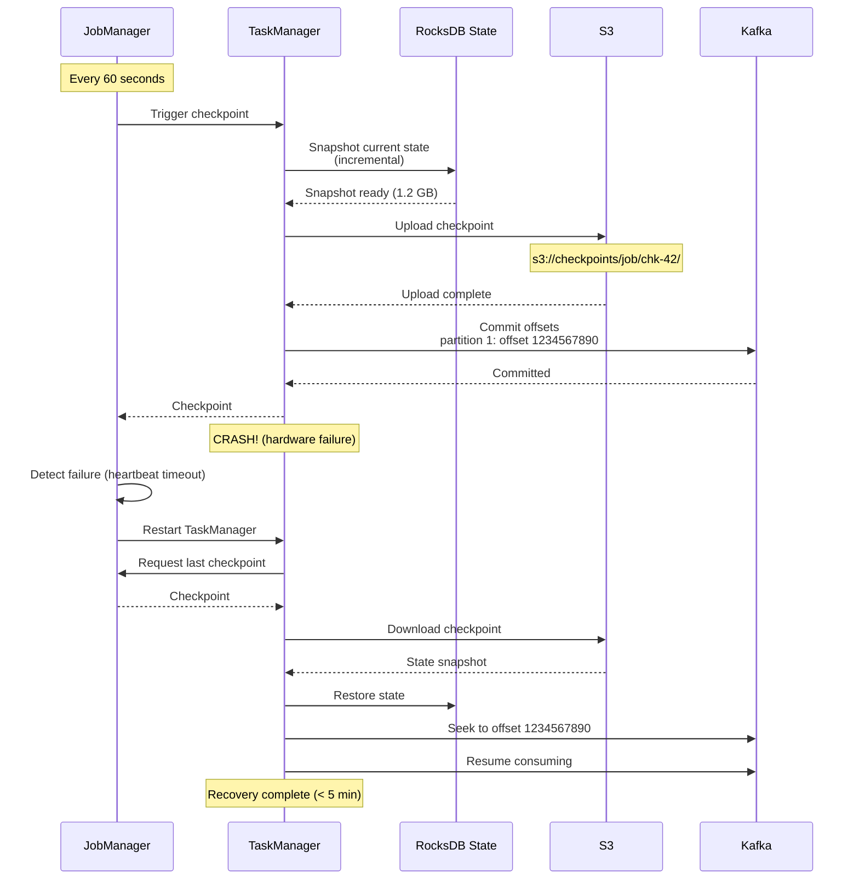

---

## 10. Redis Failover

**Flow:**

Redis Sentinel detects master failure, promotes replica to master, reconfigures clients.

**Steps:**

1. Sentinel detects master down (heartbeat timeout)
2. Sentinel quorum elects new master
3. Promote replica to master
4. Notify clients of new master
5. Old master becomes replica when recovered

**Downtime:**

- Detection: 5 seconds
- Promotion: 10 seconds
- Total: < 30 seconds

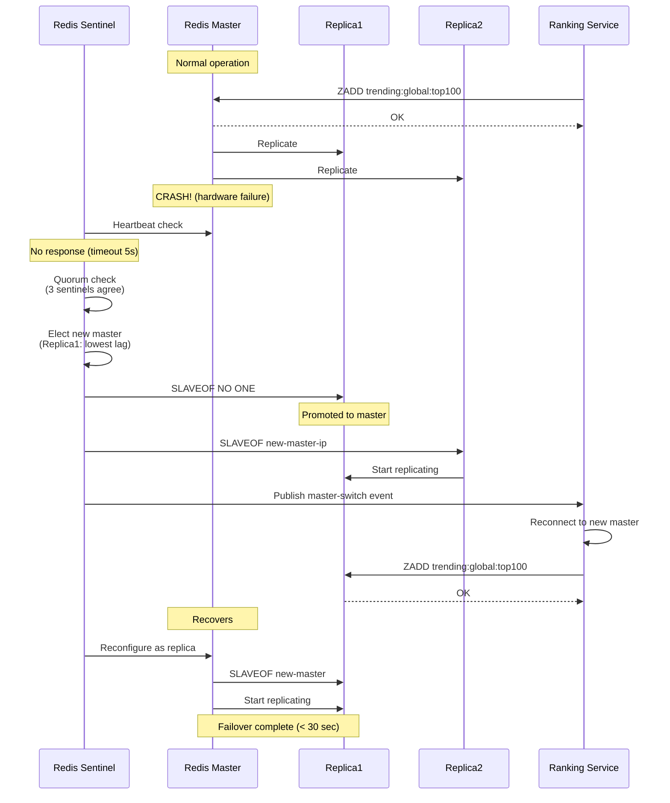

---

## 11. Multi-Dimensional Ranking Update

**Flow:**

Ranking Service updates multiple dimensions (global, regional, category) in parallel.

**Steps:**

1. Ranking Coordinator distributes work to workers
2. Each worker computes scores for its dimension
3. Workers update Redis in parallel
4. Coordinator waits for all to complete

**Dimensions:**

- 1 global
- 200 regional (by country)
- 20 category
- 50 language

**Total:** 271 Top K lists updated

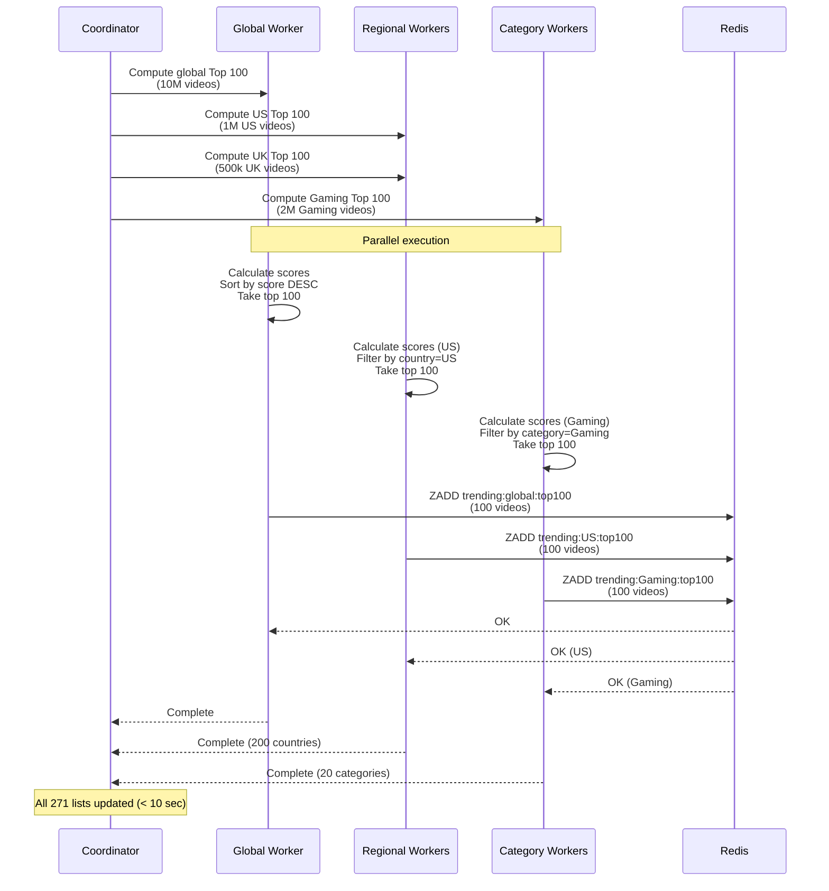

---

## 12. Viral Video Spike Handling

**Flow:**

Shows system behavior when a video goes viral (10x normal views).

**Steps:**

1. Video receives 10x views in 5 minutes
2. Kafka handles burst (partitions scale linearly)
3. Flink auto-scales workers (HPA)
4. InfluxDB buffers writes
5. Ranking Service detects spike and updates Redis

**Auto-Scaling:**

- Flink: 50 → 100 workers (< 2 min)
- Kafka: No scaling needed (over-provisioned)
- InfluxDB: Write cache absorbs burst

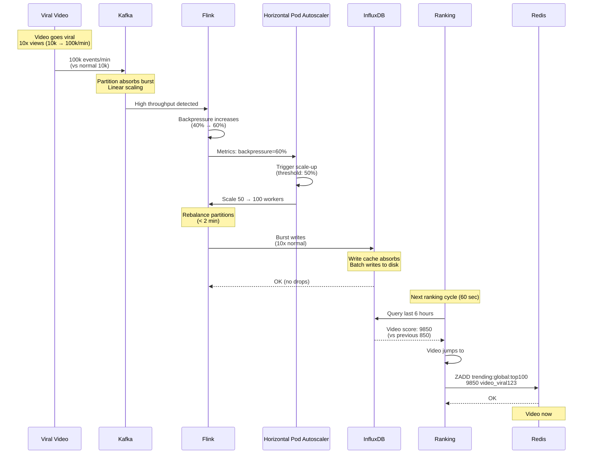