# Instagram/Pinterest Feed - High-Level Design

## Table of Contents

1. [Overall System Architecture](#1-overall-system-architecture)
2. [Media Upload Pipeline](#2-media-upload-pipeline)
3. [Feed Generation Architecture](#3-feed-generation-architecture)
4. [Hybrid Fanout Strategy](#4-hybrid-fanout-strategy)
5. [Recommendation Engine Architecture](#5-recommendation-engine-architecture)
6. [Engagement System Architecture](#6-engagement-system-architecture)
7. [Multi-Layer Caching Architecture](#7-multi-layer-caching-architecture)
8. [Image Processing Pipeline](#8-image-processing-pipeline)
9. [Visual Search Architecture](#9-visual-search-architecture)
10. [Multi-Region Deployment](#10-multi-region-deployment)
11. [Database Sharding Strategy](#11-database-sharding-strategy)
12. [CDN Distribution Architecture](#12-cdn-distribution-architecture)
13. [Feed Stitcher Component](#13-feed-stitcher-component)
14. [Monitoring and Observability](#14-monitoring-and-observability)

---

## 1. Overall System Architecture

**Flow Explanation:**

This diagram shows the complete end-to-end architecture of the Instagram/Pinterest feed system, from client request to
data storage layers.

**Components:**

1. **Client Layer**: Mobile and web applications
2. **API Gateway**: Rate limiting, authentication, and routing
3. **Service Layer**: Upload, Feed, and Engagement microservices
4. **Processing Layer**: Media pipeline and recommendation engine
5. **Storage Layer**: Object store (S3), Redis cache, and PostgreSQL
6. **CDN**: Global content delivery network

**Benefits:**

- **Scalability**: Each layer scales independently
- **Separation of Concerns**: Clear responsibility boundaries
- **High Availability**: Multiple redundant components

**Trade-offs:**

- **Complexity**: Many moving parts require coordination
- **Latency**: Multiple hops between layers
- **Cost**: Maintaining multiple infrastructure layers

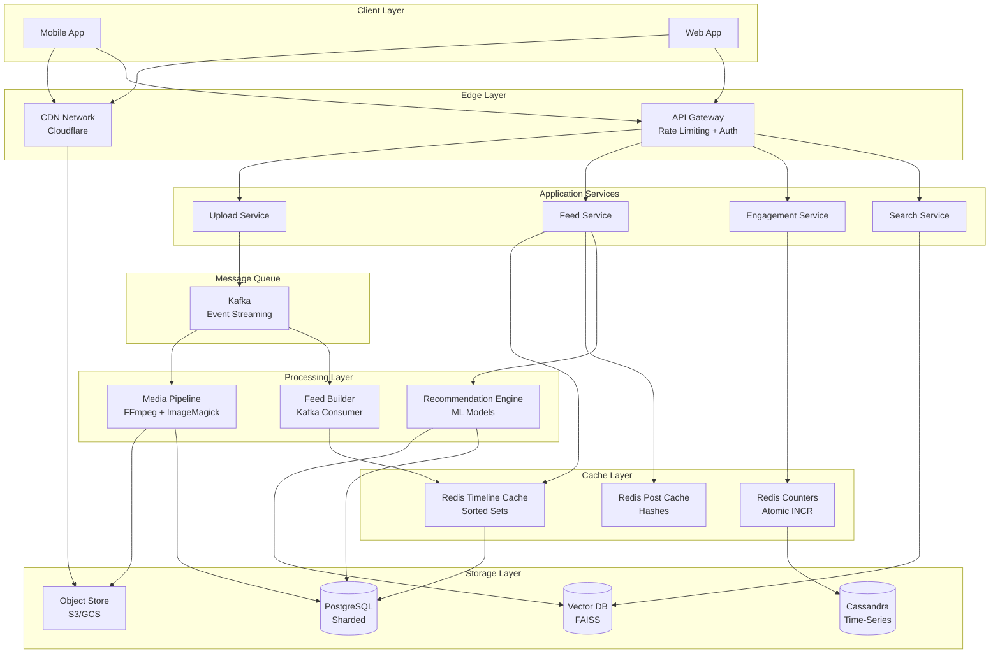

---

## 2. Media Upload Pipeline

**Flow Explanation:**

This diagram illustrates the asynchronous media upload and processing pipeline, which separates upload acknowledgment
from heavy processing tasks.

**Steps:**

1. **Client Request**: User uploads media file (image or video)
2. **Pre-signed URL**: Upload service generates S3 pre-signed URL
3. **Direct Upload**: Client uploads directly to S3 (bypasses server)
4. **Event Trigger**: S3 triggers Lambda or publishes to Kafka
5. **Async Processing**: Worker pool processes media (resize, transcode)
6. **Multi-Resolution Generation**: Create 8+ versions of each image
7. **Metadata Storage**: Save post metadata and URLs to PostgreSQL
8. **Timeline Fanout**: Trigger fanout to followers' timelines

**Performance:**

- **Upload Latency**: Client receives success in <2 seconds
- **Processing Time**: Background processing takes 3-10 seconds
- **Throughput**: 17k uploads/sec peak capacity

**Benefits:**

- **Fast Response**: User doesn't wait for processing
- **Scalability**: Worker pool scales independently
- **Fault Tolerance**: Failed jobs can be retried

**Trade-offs:**

- **Eventual Consistency**: Post visible before all thumbnails ready
- **Complexity**: Need job queue management
- **Cost**: More infrastructure components

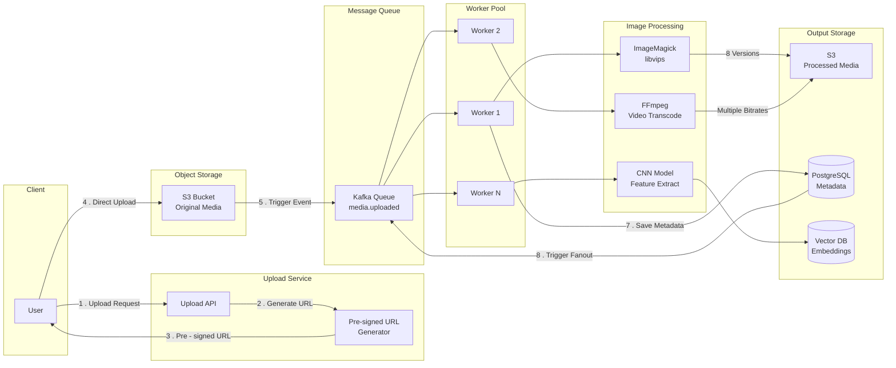

---

## 3. Feed Generation Architecture

**Flow Explanation:**

This diagram shows how the personalized feed is generated by combining multiple data sources and applying ML-based
ranking.

**Steps:**

1. **User Request**: User opens app and requests feed
2. **Feed Service**: Routes to appropriate feed generation logic
3. **Parallel Fetch**: Simultaneously fetch from 3 sources
    - Follower posts from Redis timeline cache
    - Celebrity posts from database (fanout-on-read)
    - Recommended posts from ML recommendation engine
4. **Feed Stitcher**: Merges all sources with configurable ratio (60/30/10)
5. **Ranking Model**: Applies final ML model for personalized ordering
6. **Hydration**: Fetches full post details from cache or database
7. **Response**: Returns top 50 posts to client

**Performance:**

- **Total Latency**: <150ms end-to-end
- **Cache Hit Rate**: 85% for timeline, 70% for posts
- **Throughput**: 347k reads/sec peak

**Benefits:**

- **Low Latency**: Pre-computed timelines + caching
- **Personalized**: ML-driven recommendations
- **Fresh Content**: Mix of social graph and discovery

**Trade-offs:**

- **Eventual Consistency**: Timeline may be seconds stale
- **Complexity**: Multiple data sources to merge
- **Cost**: Expensive ML inference

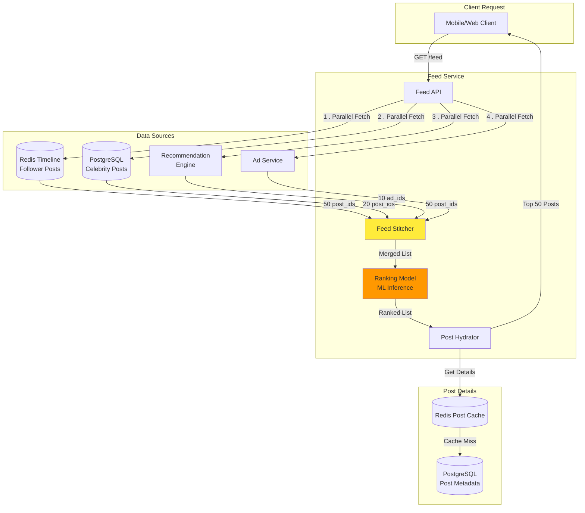

---

## 4. Hybrid Fanout Strategy

**Flow Explanation:**

This diagram illustrates the hybrid fanout strategy that combines fanout-on-write (for regular users) and
fanout-on-read (for celebrities) to optimize write amplification and read latency.

**Decision Logic:**

- **Regular User** (< 10K followers): Fanout-on-write
    - Pre-compute timelines for all followers
    - Write post_id to Redis timeline cache
    - Guarantees instant feed updates

- **Celebrity** (> 10K followers): Fanout-on-read
    - Don't pre-compute timelines
    - Fetch posts at read time from database
    - Prevents write amplification (1 post → 10M writes)

**Steps:**

1. User posts new content
2. Check follower count
3. If < 10K: Fanout-on-write path
4. If > 10K: Skip fanout, rely on fanout-on-read

**Benefits:**

- **Write Efficiency**: Prevents celebrity write storms
- **Read Performance**: Pre-computed timelines for most users
- **Scalability**: Handles both high-follower and low-follower users

**Trade-offs:**

- **Complexity**: Two different code paths
- **Consistency**: Celebrity posts may appear slightly delayed
- **Threshold Management**: 10K threshold needs tuning

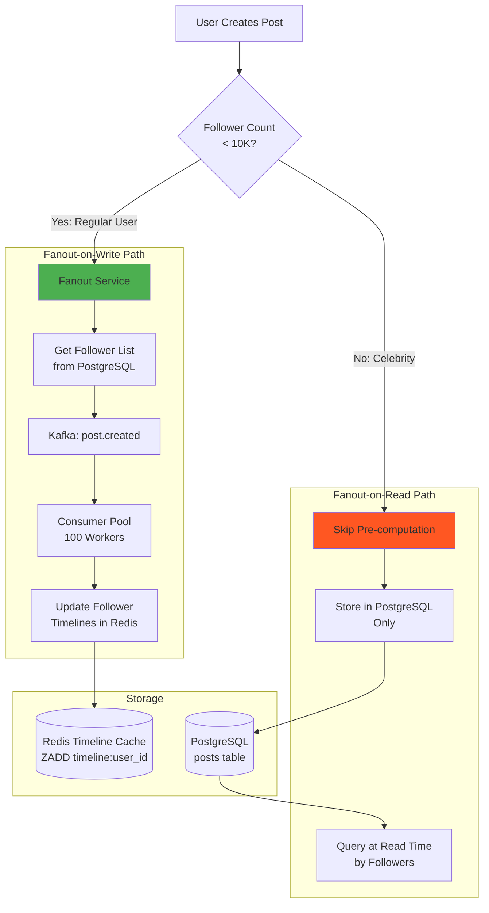

---

## 5. Recommendation Engine Architecture

**Flow Explanation:**

This diagram shows the two-stage recommendation architecture: offline training pipeline and online serving
infrastructure.

**Offline Training (Batch):**

1. **Data Collection**: Collect 30 days of user interactions from data warehouse
2. **Feature Engineering**: Extract user features, post features, visual features
3. **Model Training**: Train two-tower model on Spark/GPU cluster
4. **Model Validation**: Evaluate on holdout set
5. **Model Deployment**: Deploy to TensorFlow Serving

**Online Serving (Real-time):**

1. **Candidate Generation**: Fetch 1000 candidate posts from multiple sources
2. **Feature Extraction**: Extract real-time user context
3. **Batch Inference**: Score all candidates with ML model
4. **Re-ranking**: Apply business rules (diversity, freshness)
5. **Return Top-K**: Return top 50 posts

**Performance:**

- **Training Time**: 8-12 hours on 100 GPUs
- **Inference Latency**: <50ms for 1000 candidates
- **Model Update Frequency**: Daily

**Benefits:**

- **Personalization**: Tailored to individual user preferences
- **Discovery**: Helps users find new content beyond social graph
- **Engagement**: Increases time spent on platform

**Trade-offs:**

- **Staleness**: Model trained on yesterday's data
- **Cost**: Expensive GPU training and inference
- **Complexity**: ML pipeline requires data science expertise

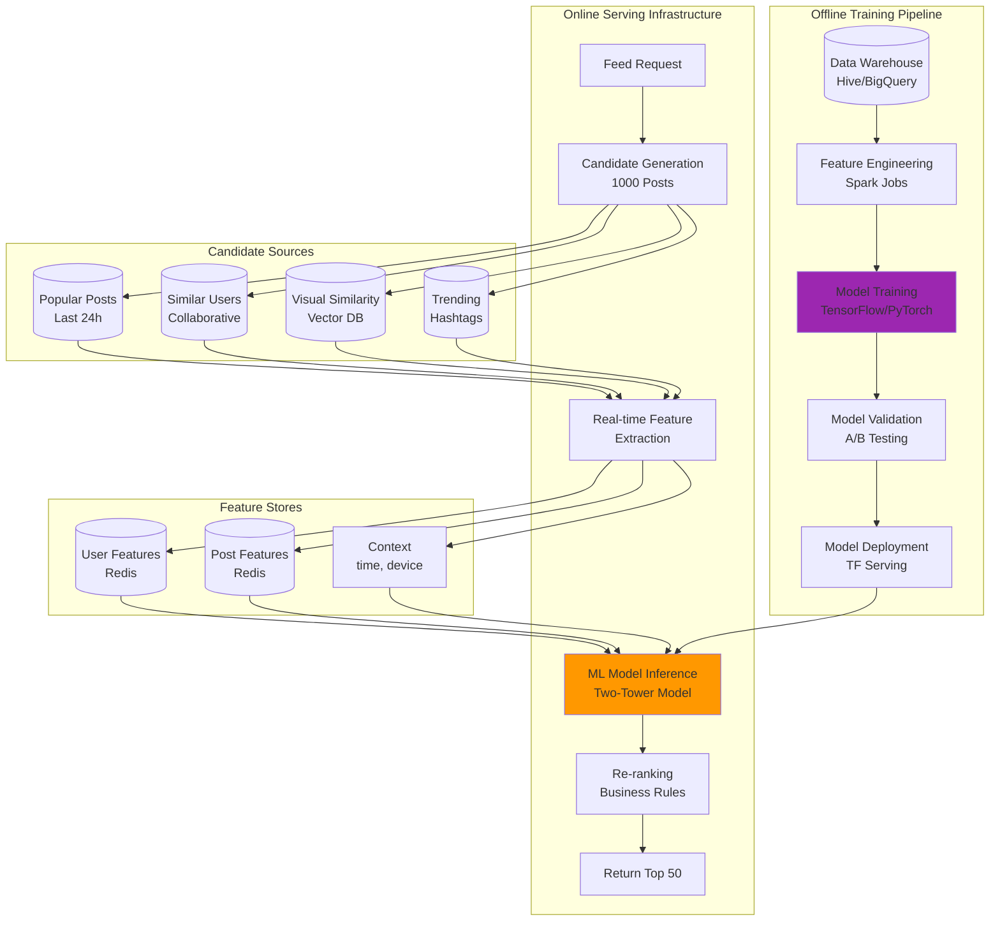

---

## 6. Engagement System Architecture

**Flow Explanation:**

This diagram shows the multi-layer engagement system that handles likes, comments, and shares with high throughput and
low latency.

**Write Path (Like Action):**

1. **User Clicks Like**: Client sends POST /like request
2. **API Gateway**: Rate limiting and authentication
3. **Engagement Service**: Validates request (not already liked)
4. **Layer 1 - Redis**: Atomic counter increment (immediate response <1ms)
5. **Layer 2 - Cassandra**: Durable write (async, within 10ms)
6. **Layer 3 - PostgreSQL**: Batch update every 5 minutes (aggregated)

**Read Path:**

1. **Get Like Count**: Fetch from Redis counter
2. **Cache Miss**: Fall back to PostgreSQL
3. **Hydrate User List**: Fetch recent likers from Cassandra

**Performance:**

- **Write Latency**: <5ms (Redis response)
- **Write Throughput**: 578k likes/sec peak
- **Cache Hit Rate**: 90% for counters

**Benefits:**

- **Immediate Feedback**: User sees like instantly
- **Durability**: Multiple layers ensure no data loss
- **Scalability**: Redis cluster handles high write load

**Trade-offs:**

- **Eventual Consistency**: PostgreSQL count may be minutes stale
- **Hot Key Problem**: Viral posts need distributed counters
- **Cost**: Three storage layers to maintain

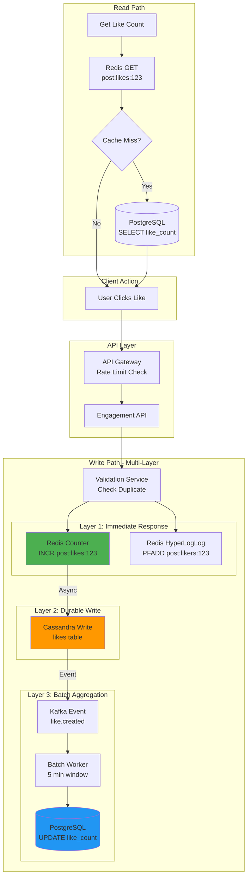

---

## 7. Multi-Layer Caching Architecture

**Flow Explanation:**

This diagram illustrates the multi-tier caching strategy that reduces latency and backend load through progressive
caching layers.

**Layers:**

1. **L1 - Client Cache**: Mobile app cache (30% hit rate, 1 hour TTL)
2. **L2 - CDN Cache**: Cloudflare edge (90% hit rate, 7 days TTL)
3. **L3 - Redis Timeline Cache**: Feed post IDs (85% hit rate, 24 hours TTL)
4. **L4 - Redis Post Cache**: Post metadata (70% hit rate, 1 hour TTL)
5. **L5 - Database**: PostgreSQL source of truth

**Request Flow:**

1. Client checks local cache → hit or miss
2. If miss, request to CDN → hit or miss
3. If miss, request to Redis → hit or miss
4. If miss, query PostgreSQL → cache result

**Cache Invalidation:**

- **Post Update**: Invalidate L4 + publish event
- **Post Delete**: Invalidate L3, L4 + purge CDN
- **User Update**: Invalidate user cache

**Performance:**

- **Effective Hit Rate**: 95%+ (combined layers)
- **Average Latency**: 50ms (mostly served from cache)
- **Database Load**: Reduced by 20x

**Benefits:**

- **Ultra-Low Latency**: Most requests served from edge
- **Reduced Backend Load**: 95% traffic never hits database
- **Cost Efficiency**: Fewer database queries

**Trade-offs:**

- **Cache Consistency**: Invalidation complexity
- **Memory Cost**: Large Redis clusters
- **Debugging**: Harder to trace cache bugs

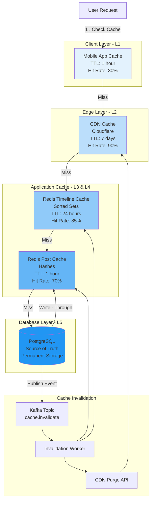

---

## 8. Image Processing Pipeline

**Flow Explanation:**

This diagram shows the complete image processing workflow from upload to multi-resolution storage and CDN distribution.

**Processing Steps:**

1. **Upload**: Client uploads original high-res image
2. **Validation**: Check file type, size, dimensions
3. **EXIF Stripping**: Remove GPS and privacy metadata
4. **Parallel Processing**: Generate 8 versions simultaneously
    - Original (backup)
    - Feed Large (1080x1080)
    - Feed Medium (640x640)
    - Thumbnail (150x150)
    - AVIF format (modern browsers)
    - WebP format (Chrome)
    - BlurHash (placeholder)
5. **Filter Application**: Apply Instagram-style filters
6. **Visual Feature Extraction**: Run CNN model for recommendations
7. **Upload to S3**: Store all versions
8. **CDN Distribution**: Push to CDN origin

**Performance:**

- **Processing Time**: 3-5 seconds per image
- **Parallelization**: 8 workers per image
- **Throughput**: 5,780 images/sec

**Benefits:**

- **Multi-Device Support**: Optimized sizes for each device
- **Bandwidth Savings**: Serve smallest appropriate size
- **Fast Load Times**: Progressive loading with BlurHash

**Trade-offs:**

- **Storage Cost**: 8x more storage per image
- **Processing Cost**: CPU-intensive transformations
- **Complexity**: Managing multiple versions

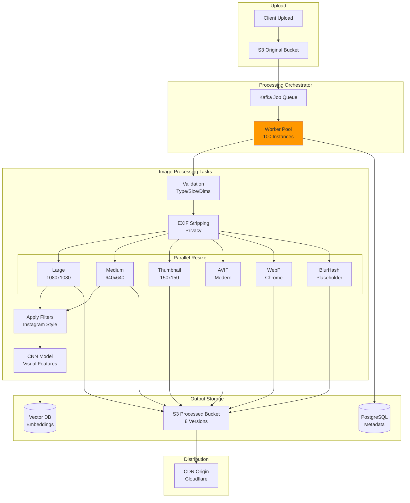

---

## 9. Visual Search Architecture

**Flow Explanation:**

This diagram shows the visual similarity search system that enables users to find images similar to a given image using
deep learning embeddings.

**Indexing Flow (Offline):**

1. **Image Upload**: User uploads new image
2. **Feature Extraction**: ResNet-50 CNN extracts 2048-dim embedding
3. **Vector Storage**: Store embedding in FAISS vector database
4. **Index Update**: Update nearest neighbor index

**Search Flow (Online):**

1. **User Query**: User clicks "Find Similar" on an image
2. **Fetch Embedding**: Retrieve pre-computed embedding from vector DB
3. **ANN Search**: Run approximate nearest neighbor search using HNSW algorithm
4. **Retrieve Top-K**: Get top 100 similar post IDs
5. **Apply Filters**: Remove seen posts, apply personalization
6. **Rank Results**: Apply engagement and freshness ranking
7. **Return**: Send top 50 similar posts to user

**Performance:**

- **Index Size**: 10B images × 2048 dims = 80 TB
- **Search Latency**: <50ms for 100 nearest neighbors
- **Accuracy**: 95% recall@100

**Benefits:**

- **Visual Discovery**: Find similar content without text
- **User Engagement**: Increases time spent browsing
- **Content Understanding**: Understands image semantics

**Trade-offs:**

- **Storage Cost**: 80TB vector index
- **Index Update Lag**: Eventual consistency (1-hour delay)
- **Compute Cost**: CNN inference on all images

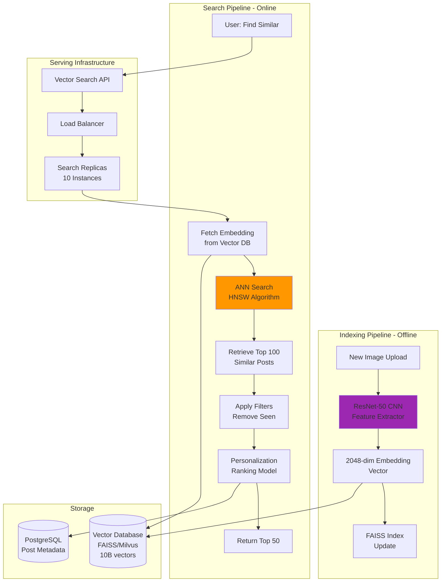

---

## 10. Multi-Region Deployment

**Flow Explanation:**

This diagram shows the global multi-region active-active deployment strategy for low latency and high availability.

**Architecture:**

- **3 Regions**: US-East, EU-West, Asia-Pacific
- **Geo-Routing**: Route users to nearest region via DNS
- **Data Replication**:
    - PostgreSQL: Synchronous replication (strong consistency)
    - Redis: Asynchronous replication (eventual consistency)
    - S3: Cross-region replication
- **Write Strategy**: Route writes to user's home region (by user_id hash)
- **Read Strategy**: Serve from nearest region

**Failover:**

1. **Health Checks**: Monitor region health every 10 seconds
2. **Auto-Failover**: Route53 detects failure and redirects traffic
3. **Replica Promotion**: Promote read replica to primary
4. **Recovery Time**: <30 seconds

**Performance:**

- **Latency Reduction**: 50-100ms faster for distant users
- **Availability**: 99.99% (survives single region failure)
- **Data Loss**: RPO < 1 second (synchronous replication)

**Benefits:**

- **Low Latency**: Users served from nearby region
- **High Availability**: Survives regional outages
- **Data Sovereignty**: Store data in local regions

**Trade-offs:**

- **Complexity**: Multi-region coordination
- **Cost**: 3x infrastructure in each region
- **Replication Lag**: Cross-region eventual consistency

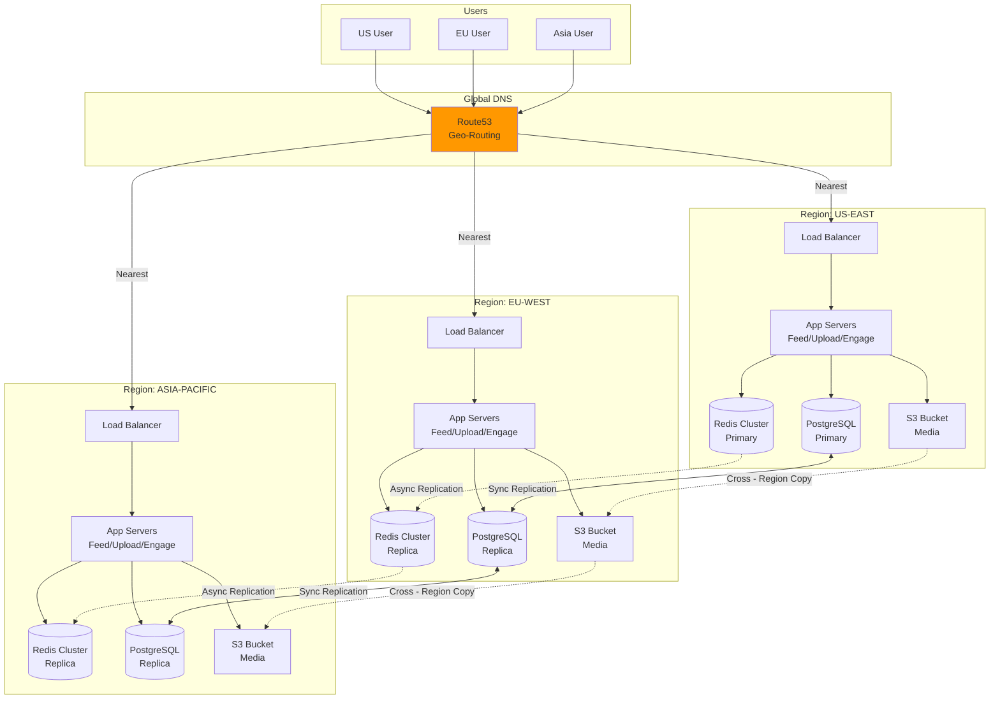

---

## 11. Database Sharding Strategy

**Flow Explanation:**

This diagram shows the database sharding strategy using consistent hashing to distribute data across multiple PostgreSQL
shards.

**Sharding Logic:**

1. **Shard Key**: user_id (ensures user data co-located)
2. **Shard Function**: `shard_id = hash(user_id) % 16`
3. **16 Shards**: Each shard handles 1/16th of users
4. **Read Replicas**: Each shard has 2 read replicas

**Data Distribution:**

- **Users Table**: Sharded by user_id
- **Posts Table**: Sharded by user_id (co-located with user)
- **Follows Table**: Sharded by follower_id
- **Global Tables**: Replicated to all shards (e.g., hashtags)

**Query Routing:**

1. Client sends query with user_id
2. API Gateway computes shard_id
3. Routes query to appropriate shard
4. Shard processes query and returns result

**Scalability:**

- **Horizontal Scaling**: Add more shards (16 → 32 → 64)
- **Resharding**: Use consistent hashing for minimal data movement
- **Capacity**: Each shard handles 125M users (2B total / 16)

**Benefits:**

- **Horizontal Scaling**: Add shards to scale
- **Isolation**: Failure of one shard doesn't affect others
- **Performance**: Parallel query execution

**Trade-offs:**

- **Cross-Shard Queries**: Complex and slow
- **Rebalancing**: Resharding is expensive
- **Transactions**: No cross-shard ACID

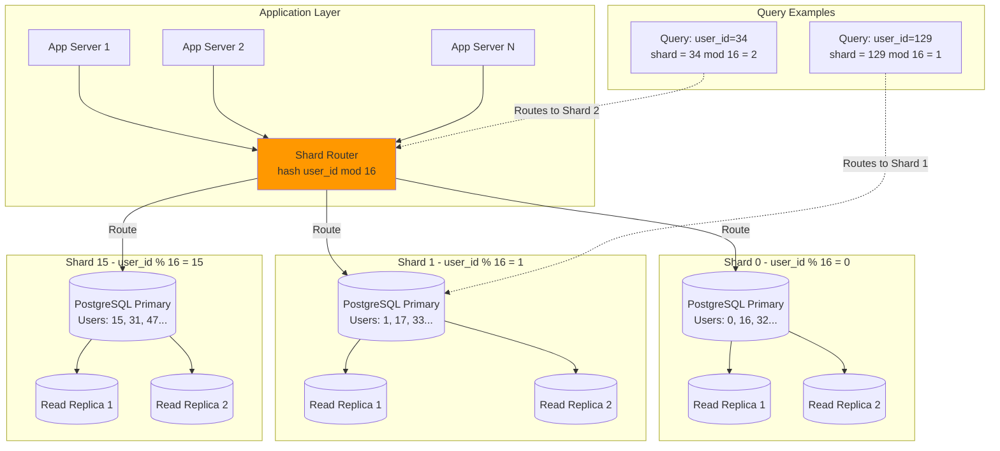

---

## 12. CDN Distribution Architecture

**Flow Explanation:**

This diagram shows the three-tier CDN architecture that serves media files globally with high cache hit rates and low
latency.

**Architecture:**

1. **Tier 1 - Origin**: S3 buckets in 3 regions (US, EU, Asia)
2. **Tier 2 - Shield**: Regional PoPs reduce origin load
3. **Tier 3 - Edge**: 200+ edge locations worldwide

**Request Flow:**

1. User requests image: `https://cdn.instagram.com/image/12345.jpg`
2. DNS routes to nearest edge location
3. Edge checks cache:
    - **Hit**: Return immediately (90% of requests)
    - **Miss**: Request from shield
4. Shield checks cache:
    - **Hit**: Return to edge
    - **Miss**: Request from origin (S3)
5. Origin returns image
6. Shield caches (7 days TTL)
7. Edge caches (7 days TTL)

**Performance:**

- **Edge Latency**: <20ms (served from nearest location)
- **Cache Hit Rate**: 90% at edge, 95% at shield
- **Origin Load**: Only 5% of requests reach S3
- **Bandwidth Savings**: $75M/month vs direct serving

**Benefits:**

- **Low Latency**: Edge locations near all users
- **Reduced Origin Load**: 95% of traffic cached
- **Cost Savings**: CDN bandwidth cheaper than origin egress

**Trade-offs:**

- **Cache Consistency**: Invalidation takes minutes
- **Cost**: $150M/month CDN costs
- **Complexity**: Managing multi-tier cache

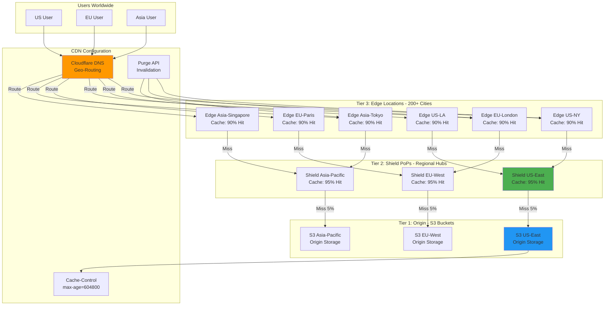

---

## 13. Feed Stitcher Component

**Flow Explanation:**

This diagram zooms into the Feed Stitcher component, which is the critical piece that merges follower posts, celebrity
posts, recommended posts, and ads into a unified, ranked feed.

**Steps:**

1. **Parallel Fetch**: Simultaneously fetch from 4 sources
    - Follower posts from Redis (pre-computed timeline)
    - Celebrity posts from PostgreSQL (fanout-on-read)
    - Recommended posts from ML engine
    - Ads from ad service
2. **Merge Strategy**: Mix with ratio 60% follower : 30% reco : 10% ads
3. **Deduplication**: Remove posts user has already seen (Bloom filter)
4. **Final Ranking**: Apply ML model for personalized ordering
5. **Return**: Top 50 posts

**Algorithm:**

```
feed = []
for i in 0..49:
  if i % 10 < 6:
    feed.add(follower_posts.pop())
  elif i % 10 < 9:
    feed.add(recommended_posts.pop())
  else:
    feed.add(ads.pop())

feed = ranking_model.score(feed, user_context)
return feed.sort_by_score()
```

**Performance:**

- **Latency**: 30-50ms total
- **Throughput**: 347k requests/sec
- **Accuracy**: 85% user engagement rate

**Benefits:**

- **Balanced Feed**: Social + discovery + monetization
- **Personalized**: ML ranking adapts to user preferences
- **Scalable**: Parallel fetching reduces latency

**Trade-offs:**

- **Complexity**: Many moving parts
- **Tuning**: Mix ratios need A/B testing
- **Staleness**: Pre-computed timelines may be minutes old

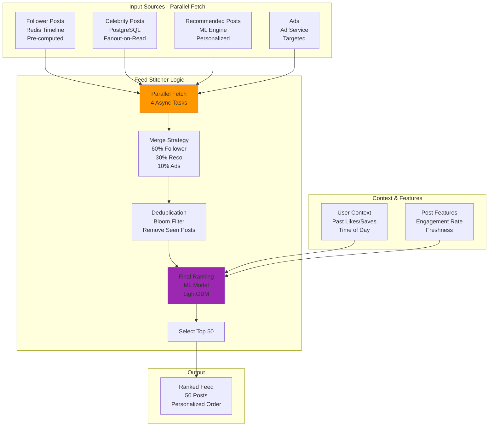

---

## 14. Monitoring and Observability

**Flow Explanation:**

This diagram shows the comprehensive monitoring and observability infrastructure that tracks system health, performance,
and user behavior.

**Monitoring Layers:**

1. **Application Metrics**: Prometheus collects metrics from all services
2. **Distributed Tracing**: Jaeger tracks request flow across microservices
3. **Logging**: ELK stack aggregates logs from all components
4. **Alerting**: PagerDuty notifies on-call engineers
5. **Dashboards**: Grafana visualizes metrics in real-time

**Key Metrics Tracked:**

- **Latency**: Feed load p50, p95, p99
- **Throughput**: QPS per service
- **Error Rate**: 4xx, 5xx responses
- **Cache Hit Rate**: Redis, CDN
- **Database Performance**: Query latency, connection pool
- **ML Model**: Inference latency, accuracy
- **Infrastructure**: CPU, memory, network

**Alerting Rules:**

- Feed latency p95 > 300ms → Page on-call
- Error rate > 1% → Page on-call
- CDN hit rate < 85% → Investigate
- Database replica lag > 10 seconds → Alert

**Benefits:**

- **Proactive Detection**: Catch issues before users notice
- **Root Cause Analysis**: Quickly identify bottlenecks
- **Performance Optimization**: Data-driven decisions

**Trade-offs:**

- **Cost**: Monitoring infrastructure overhead
- **Alert Fatigue**: Too many alerts = ignored alerts
- **Complexity**: Many tools to learn and maintain

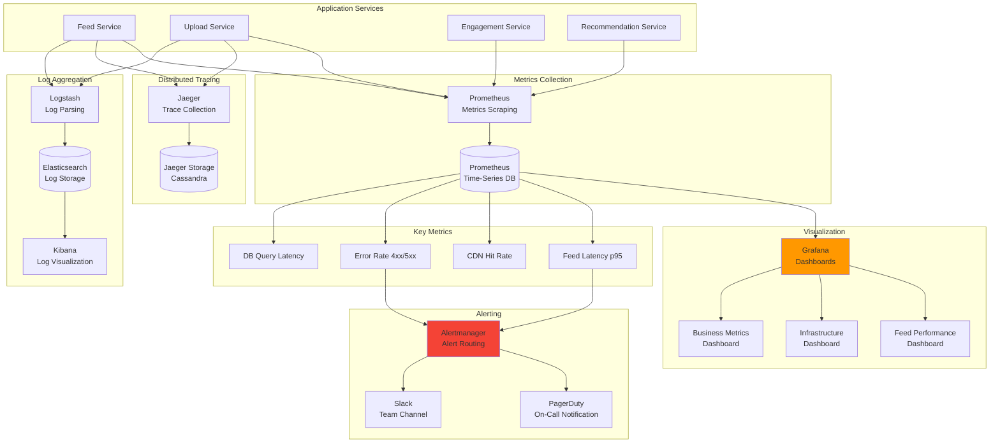