# Instagram/Pinterest Feed - Sequence Diagrams

## Table of Contents

1. [Media Upload Flow (Happy Path)](#1-media-upload-flow-happy-path)
2. [Feed Generation Flow](#2-feed-generation-flow)
3. [Like Post Flow (Real-Time Engagement)](#3-like-post-flow-real-time-engagement)
4. [Fanout-on-Write Flow](#4-fanout-on-write-flow)
5. [Fanout-on-Read Flow (Celebrity)](#5-fanout-on-read-flow-celebrity)
6. [Visual Search Flow](#6-visual-search-flow)
7. [Cache Invalidation Flow](#7-cache-invalidation-flow)
8. [Post Deletion Flow](#8-post-deletion-flow)
9. [Recommendation Engine Query Flow](#9-recommendation-engine-query-flow)
10. [Multi-Region Write Flow](#10-multi-region-write-flow)
11. [CDN Cache Miss Flow](#11-cdn-cache-miss-flow)
12. [Failed Upload Retry Flow](#12-failed-upload-retry-flow)
13. [Hot Key Mitigation Flow](#13-hot-key-mitigation-flow)
14. [Redis Cache Failure Fallback](#14-redis-cache-failure-fallback)

---

## 1. Media Upload Flow (Happy Path)

**Flow:**

This sequence shows the complete end-to-end flow of a user uploading an image, from initial request to fanout
completion.

**Steps:**

1. **Client Request** (0ms): User clicks "Upload" and selects image in mobile app
2. **Upload Service** (10ms): Generates pre-signed S3 URL with 15-minute expiry
3. **S3 Direct Upload** (2000ms): Client uploads 10MB image directly to S3 (bypasses server)
4. **S3 Event Trigger** (5ms): S3 triggers event notification to Kafka
5. **Kafka Queue** (10ms): Message enqueued in `media.uploaded` topic
6. **Worker Pick-up** (50ms): Media worker consumes job from queue
7. **Image Processing** (3000ms): Generate 8 versions (thumbnails, WebP, AVIF, etc.)
8. **Feature Extraction** (500ms): CNN model extracts visual embeddings
9. **Database Write** (50ms): Save post metadata to PostgreSQL
10. **Fanout Trigger** (20ms): Publish `post.created` event to Kafka
11. **Fanout Workers** (5000ms): Update followers' Redis timelines (async)
12. **Client Notification** (100ms): Push notification sent to followers

**Performance:**

- **User Response Time**: 2 seconds (receives success after S3 upload)
- **Total Processing Time**: ~10 seconds (background, user doesn't wait)
- **Throughput**: 5,780 uploads/sec sustained, 17k peak

**Edge Cases:**

- Upload failure → Retry with exponential backoff
- Processing failure → Job re-queued, max 3 attempts
- Fanout failure → Eventually consistent, retry later

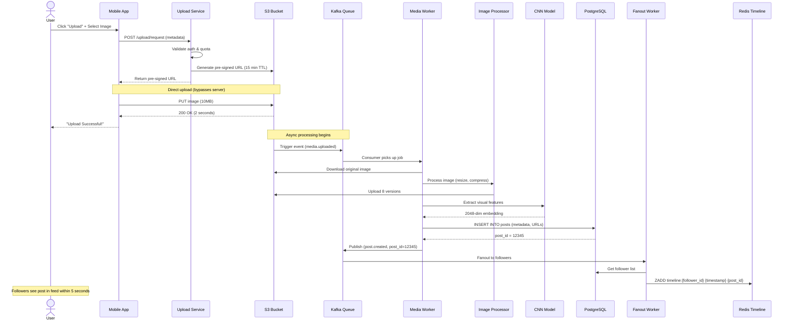

---

## 2. Feed Generation Flow

**Flow:**

This sequence demonstrates how a personalized feed is generated by combining multiple data sources in parallel and
applying ML ranking.

**Steps:**

1. **User Request** (0ms): User opens app, requests feed
2. **API Gateway** (5ms): Authenticates JWT token, checks rate limit
3. **Feed Service** (10ms): Initiates parallel fetch from 4 sources
4. **Parallel Fetch** (starts at 10ms, completes by 35ms):
    - **Redis Timeline** (15ms): Fetch 50 follower post IDs from pre-computed timeline
    - **PostgreSQL** (25ms): Fetch 20 celebrity post IDs (fanout-on-read)
    - **Recommendation Engine** (30ms): Fetch 50 recommended post IDs from ML model
    - **Ad Service** (20ms): Fetch 10 targeted ads
5. **Feed Stitcher** (40ms): Merges all sources with 60/30/10 ratio
6. **Deduplication** (45ms): Remove posts user has already seen (Bloom filter check)
7. **Final Ranking** (60ms): Apply LightGBM model for personalized ordering
8. **Hydration** (75ms): Fetch full post details from Redis cache (batch HGETALL)
9. **Response** (80ms): Return top 50 posts to client

**Performance:**

- **Total Latency**: 80-120ms (p50), 150ms (p95)
- **Cache Hit Rate**: 85% for timeline, 70% for post details
- **Throughput**: 347k requests/sec peak

**Optimization:**

- Parallel fetching reduces latency by 3x (vs sequential)
- Redis pipelining for hydration (50 posts in 1 round trip)

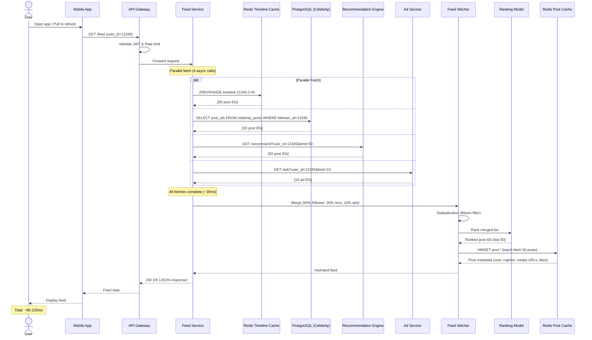

---

## 3. Like Post Flow (Real-Time Engagement)

**Flow:**

This sequence shows the multi-layer write path for handling a like action with immediate user feedback and eventual
durability.

**Steps:**

1. **User Action** (0ms): User double-taps image to like
2. **Optimistic UI Update** (0ms): Client immediately shows heart animation
3. **API Request** (10ms): POST /like sent to API gateway
4. **Rate Limit Check** (15ms): Verify user hasn't exceeded 100 likes/minute
5. **Engagement Service** (20ms): Validate user hasn't already liked this post
6. **Layer 1 - Redis Counter** (22ms): Atomic INCR on `post:likes:{post_id}` (immediate)
7. **Layer 1 - Redis HLL** (23ms): PFADD on `post:likers:{post_id}` (track unique users)
8. **Response** (25ms): Return 200 OK to client (user sees confirmation)
9. **Layer 2 - Cassandra** (50ms): Async write to likes table (durable storage)
10. **Layer 3 - Kafka Event** (60ms): Publish `like.created` event
11. **Layer 3 - Batch Worker** (300,000ms): Every 5 minutes, aggregate Redis → PostgreSQL

**Performance:**

- **User-Perceived Latency**: 25ms (from click to confirmation)
- **Write Throughput**: 578k likes/sec sustained
- **Durability**: Cassandra write completes within 50ms

**Failure Handling:**

- Redis down → Write to Cassandra directly (slower, 100ms)
- Cassandra down → Queue write, retry exponentially
- Batch worker down → PostgreSQL count may be stale (acceptable)

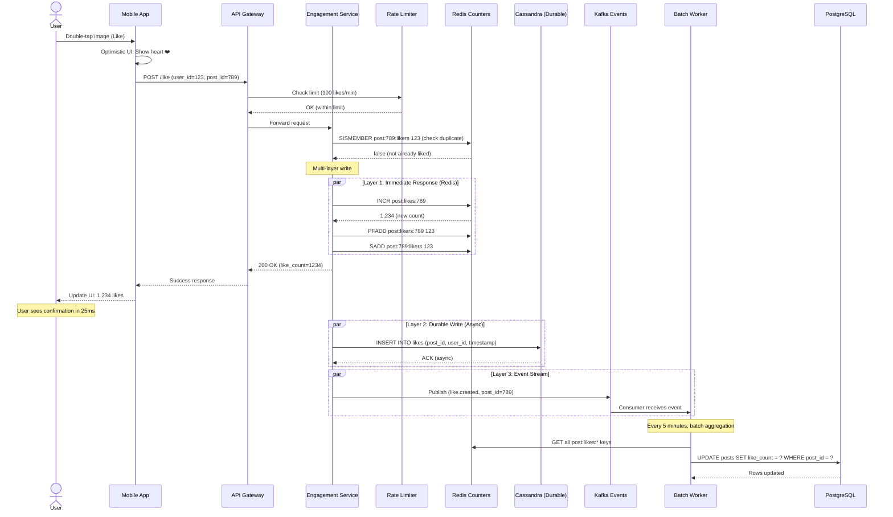

---

## 4. Fanout-on-Write Flow

**Flow:**

This sequence illustrates the fanout-on-write strategy for regular users (< 10K followers), where new posts are
pre-computed into followers' timelines.

**Steps:**

1. **Post Created** (0ms): User publishes new post
2. **PostgreSQL Write** (50ms): Insert post metadata
3. **Kafka Event** (60ms): Publish `post.created` event
4. **Fanout Service** (70ms): Consumer picks up event
5. **Get Followers** (90ms): Query `follows` table for follower list (e.g., 5,000 followers)
6. **Partition Followers** (100ms): Split into batches of 100
7. **Parallel Redis Writes** (150-5000ms): 50 workers write to Redis timelines
    - Each worker: `ZADD timeline:{follower_id} {timestamp} {post_id}`
8. **Completion** (5000ms): All 5,000 followers' timelines updated

**Performance:**

- **Fanout Time**: 5 seconds for 5,000 followers
- **Write Amplification**: 1 post → 5,000 Redis writes
- **Worker Pool**: 50 workers × 100 followers/batch

**Scalability:**

- Users with > 10K followers → Skip fanout-on-write, use fanout-on-read instead
- Prevents celebrity write storms (1 post → 100M writes)

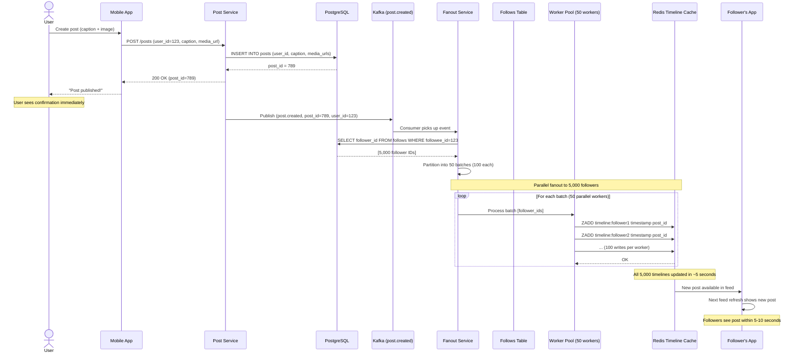

---

## 5. Fanout-on-Read Flow (Celebrity)

**Flow:**

This sequence shows the fanout-on-read strategy for celebrities (> 10K followers), where posts are fetched at read time
instead of pre-computed.

**Steps:**

1. **Celebrity Posts** (0ms): Celebrity publishes new post
2. **PostgreSQL Write** (50ms): Insert post metadata only (no fanout)
3. **User Feed Request** (1000ms): Follower opens app and requests feed
4. **Check Celebrity Following** (1010ms): Feed service detects user follows 3 celebrities
5. **Fanout-on-Read Query** (1030ms): Query PostgreSQL for recent posts from those 3 celebrities
6. **Merge with Pre-Computed** (1040ms): Combine celebrity posts with regular timeline
7. **Return Feed** (1050ms): Send merged feed to user

**Performance:**

- **Write Savings**: 1 post → 1 database write (vs 100M timeline writes)
- **Read Overhead**: +20ms per feed request (celebrity query)
- **Trade-off**: Slightly slower feed generation, but massive write savings

**When to Use:**

- User has > 10K followers (celebrity threshold)
- Prevents fanout write amplification
- Acceptable for users with high follower counts (read latency still < 150ms)

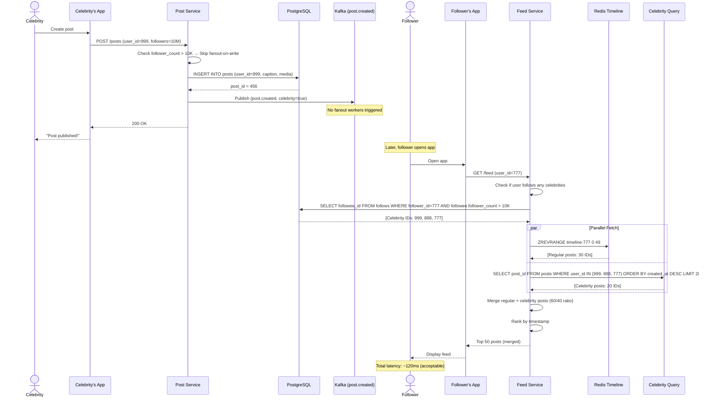

---

## 6. Visual Search Flow

**Flow:**

This sequence demonstrates the visual similarity search feature, where users can find images similar to a given image
using CNN embeddings and vector search.

**Steps:**

1. **User Action** (0ms): User clicks "Find Similar" on an image
2. **API Request** (10ms): GET /visual-search?post_id=789
3. **Fetch Embedding** (20ms): Retrieve pre-computed 2048-dim vector from vector DB
4. **ANN Search** (50ms): Run approximate nearest neighbor search using HNSW algorithm
5. **Retrieve Candidates** (70ms): Get top 100 similar post IDs
6. **Filter** (80ms): Remove posts user has already seen (Bloom filter)
7. **Personalization** (100ms): Apply user's preference model to re-rank
8. **Hydration** (120ms): Fetch post metadata from Redis/PostgreSQL
9. **Response** (130ms): Return top 50 similar posts

**Performance:**

- **Search Latency**: <50ms for 100 nearest neighbors
- **Index Size**: 10B images × 2048 dims = 80 TB
- **Accuracy**: 95% recall@100 (finds 95 of top 100 truly similar images)

**Index Update:**

- New images indexed every hour (batch process)
- Eventual consistency acceptable for discovery feature

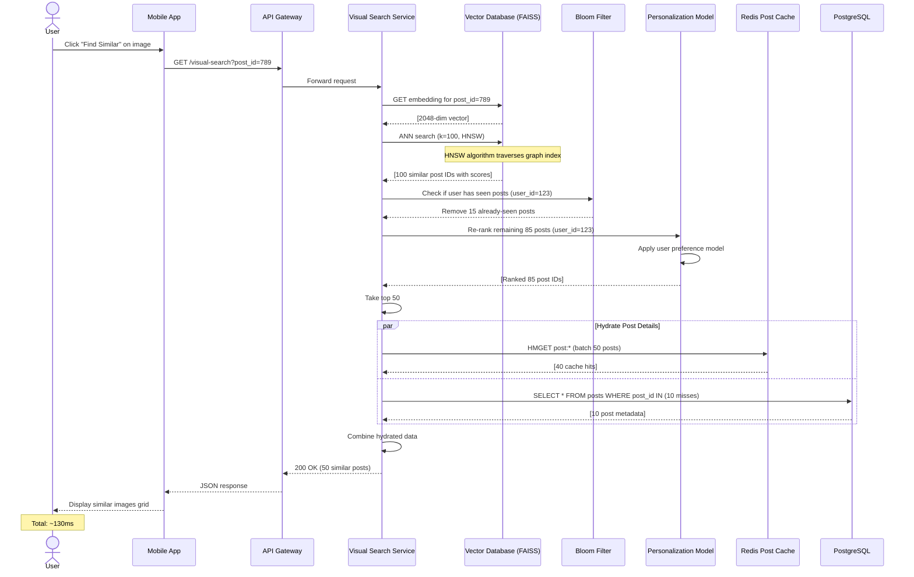

---

## 7. Cache Invalidation Flow

**Flow:**

This sequence shows the cache invalidation workflow when a user edits or deletes a post, ensuring all caches are updated
across multiple layers.

**Steps:**

1. **User Action** (0ms): User edits post caption or deletes post
2. **API Request** (10ms): PUT /posts/789 or DELETE /posts/789
3. **PostgreSQL Update** (30ms): Update or soft-delete post in database (source of truth)
4. **Kafka Event** (40ms): Publish `post.updated` or `post.deleted` event
5. **Cache Invalidation Worker** (50ms): Consumer picks up event
6. **Layer 1 - Redis Post Cache** (60ms): DELETE `post:789` key
7. **Layer 2 - Redis Timeline Cache** (80ms): ZREM from all affected timelines
8. **Layer 3 - CDN Purge** (200ms): Send purge request to Cloudflare API
9. **CDN Propagation** (60,000ms): Purge propagates to 200+ edge locations in ~1 minute

**Performance:**

- **Database Consistency**: Immediate (strong consistency)
- **Redis Consistency**: <100ms (eventual)
- **CDN Consistency**: ~1 minute (eventual)

**Trade-offs:**

- **Eventual Consistency**: Users may see stale content for up to 1 minute
- **Acceptable**: Post edits are rare compared to reads (1:10,000 ratio)

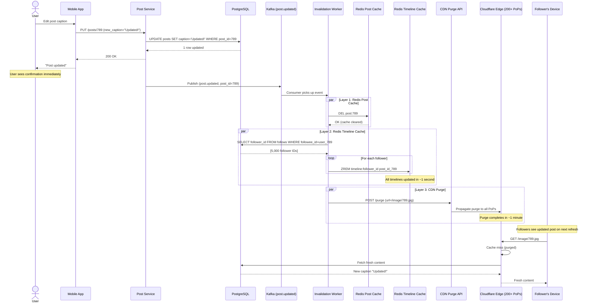

---

## 8. Post Deletion Flow

**Flow:**

This sequence shows the comprehensive post deletion workflow, ensuring the post is removed from all storage layers and
timelines.

**Steps:**

1. **User Action** (0ms): User deletes post
2. **Soft Delete** (30ms): Mark post as deleted in PostgreSQL (don't physically delete)
3. **Kafka Event** (40ms): Publish `post.deleted` event
4. **Timeline Cleanup** (1000ms): Remove from all followers' timelines
5. **Cache Cleanup** (50ms): Delete from Redis caches
6. **CDN Cleanup** (60,000ms): Purge media files from CDN
7. **Object Storage** (background): Archive media files (move to glacier after 90 days)

**Performance:**

- **User Confirmation**: <100ms (after soft delete)
- **Timeline Cleanup**: ~1 second for 5,000 followers
- **Full Cleanup**: ~1 minute (CDN propagation)

**Data Retention:**

- **Soft Delete**: Allows recovery within 30 days (user can undo)
- **Hard Delete**: After 30 days, permanently delete from object storage
- **Compliance**: GDPR right to deletion (expedited process)

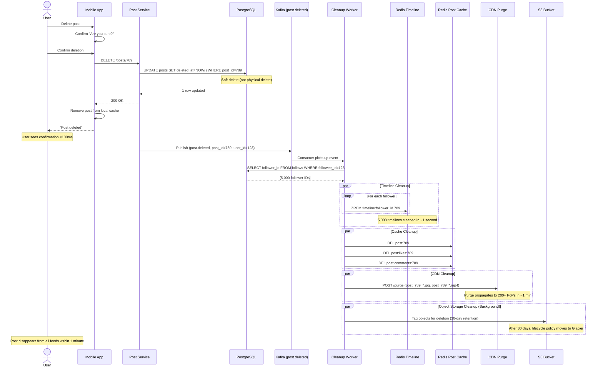

---

## 9. Recommendation Engine Query Flow

**Flow:**

This sequence shows the online serving flow of the recommendation engine, fetching personalized content recommendations
using ML models.

**Steps:**

1. **Feed Request** (0ms): User opens app, feed service needs recommendations
2. **Candidate Generation** (20ms): Fetch 1000 candidate posts from multiple sources
    - Popular posts (last 24 hours)
    - Posts from similar users
    - Trending hashtags
    - Visual similarity
3. **Feature Extraction** (30ms): Fetch user features, post features from Redis
4. **Batch Inference** (60ms): Run LightGBM model to score all 1000 candidates
5. **Re-ranking** (70ms): Apply business rules (diversity, freshness, novelty)
6. **Return Top-K** (75ms): Return top 50 posts

**Performance:**

- **Total Latency**: <80ms for 1000 candidates
- **Throughput**: 347k requests/sec (recommendation requests)
- **Model Size**: 500 MB (deployed in memory)

**Model Serving:**

- **Deployment**: TensorFlow Serving or custom REST API
- **Replicas**: 100 instances for high availability
- **Load Balancing**: Round-robin with health checks

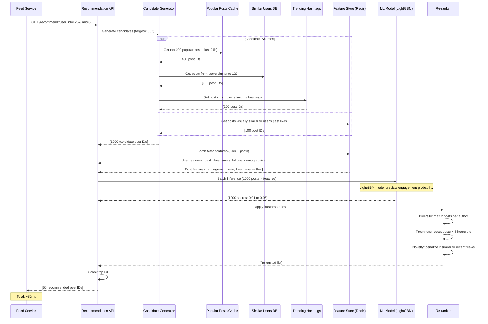

---

## 10. Multi-Region Write Flow

**Flow:**

This sequence demonstrates how writes are handled in a multi-region active-active deployment, ensuring data consistency
and low latency.

**Steps:**

1. **User Post** (0ms): User in Europe creates post
2. **Geo-Routing** (10ms): Route53 routes request to EU region (nearest)
3. **Home Region Determination** (20ms): Compute user's home region by `hash(user_id) % 3`
4. **Cross-Region Write** (50ms): If home region is US, forward write to US
5. **PostgreSQL Write** (70ms): Write to primary database in home region
6. **Sync Replication** (80ms): Synchronously replicate to other 2 regions
7. **Acknowledgment** (90ms): Return success to user
8. **Async Cache** (150ms): Update Redis caches in all 3 regions

**Performance:**

- **Same-Region Write**: 50ms (no cross-region hop)
- **Cross-Region Write**: 150ms (additional 100ms for replication)
- **Data Loss**: RPO < 1 second (synchronous replication)

**Consistency:**

- **Strong Consistency**: For writes (sync replication)
- **Eventual Consistency**: For caches (async replication)

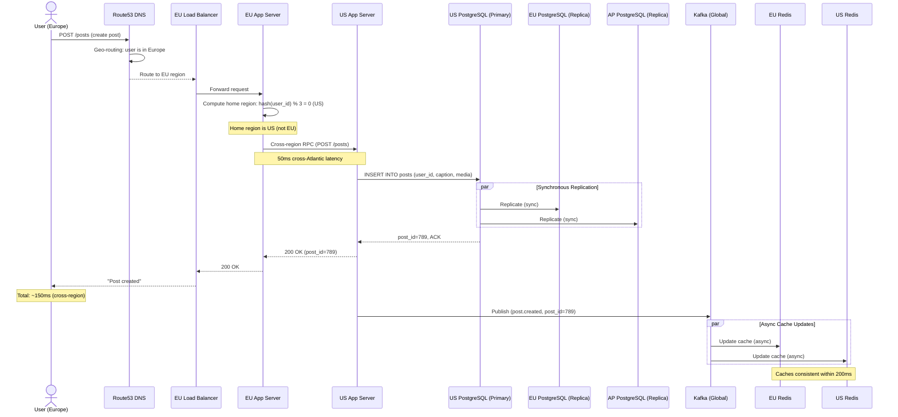

---

## 11. CDN Cache Miss Flow

**Flow:**

This sequence shows what happens when a user requests an image that is not cached at the CDN edge, requiring a cache
miss and origin fetch.

**Steps:**

1. **User Request** (0ms): User's device requests image URL
2. **Edge Cache Check** (5ms): Cloudflare edge checks local cache
3. **Edge Cache Miss** (5ms): Image not found in edge cache
4. **Shield Cache Check** (50ms): Request forwarded to regional shield PoP
5. **Shield Cache Miss** (50ms): Image not in shield cache either
6. **Origin Fetch** (150ms): Shield requests from S3 origin (US)
7. **S3 Response** (200ms): S3 returns image (10MB takes 1 second)
8. **Shield Cache** (1200ms): Shield caches image (7-day TTL)
9. **Edge Cache** (1250ms): Edge caches image (7-day TTL)
10. **User Response** (1300ms): Image delivered to user

**Performance:**

- **Cache Hit (Edge)**: 5-20ms (90% of requests)
- **Cache Hit (Shield)**: 50-100ms (5% of requests)
- **Cache Miss (Origin)**: 1-2 seconds (5% of requests)

**Optimization:**

- **Pre-warming**: Popular images pre-pushed to CDN after upload
- **Stale-While-Revalidate**: Serve stale content while fetching fresh version

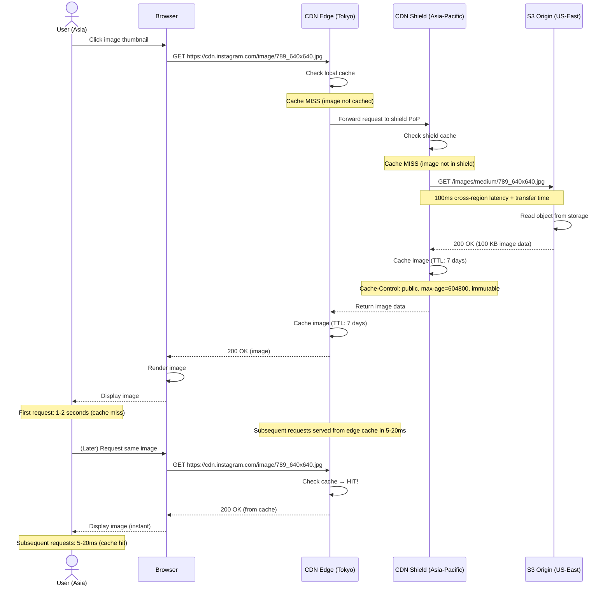

---

## 12. Failed Upload Retry Flow

**Flow:**

This sequence demonstrates the retry mechanism when an image upload fails, ensuring reliable delivery despite transient
failures.

**Steps:**

1. **Upload Attempt** (0ms): Client uploads image to S3
2. **Network Failure** (2000ms): Connection drops mid-upload
3. **Client Retry** (3000ms): Client retries with exponential backoff
4. **S3 Multipart Upload** (3100ms): Use S3 multipart upload for resumability
5. **Partial Upload** (5000ms): Upload completes partially (3/5 parts)
6. **Failure Again** (5100ms): Another network failure
7. **Resume Upload** (6000ms): Client resumes from part 4 (doesn't re-upload parts 1-3)
8. **Success** (8000ms): All parts uploaded
9. **Complete Multipart** (8100ms): Client sends complete multipart request
10. **S3 Assembly** (8500ms): S3 assembles parts into final object
11. **Trigger Event** (9000ms): S3 triggers Kafka event for processing

**Performance:**

- **Retry Backoff**: 1s, 2s, 4s, 8s (exponential)
- **Max Retries**: 5 attempts before giving up
- **Success Rate**: 99.9% after retries

**User Experience:**

- **Progress Bar**: Shows upload progress (resumable)
- **Background Upload**: Continues even if app is closed (iOS/Android background task)

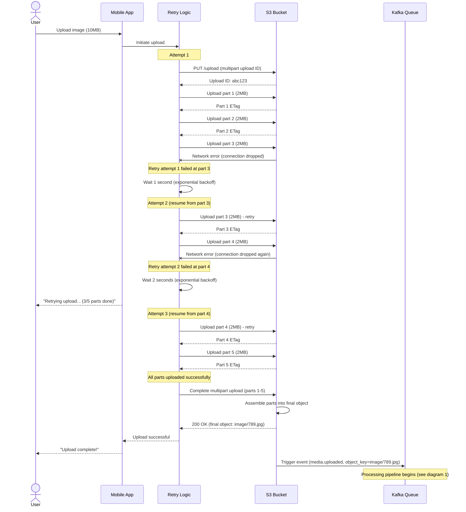

---

## 13. Hot Key Mitigation Flow

**Flow:**

This sequence shows how the system mitigates the hot key problem when a viral post receives millions of likes per
minute, using distributed counters.

**Steps:**

1. **Viral Post** (0ms): Celebrity post goes viral, receiving 100k likes/second
2. **Shard Counter** (1ms): Each like is routed to one of 100 counter shards
3. **Hash User ID** (1ms): `shard = hash(user_id) % 100`
4. **Distributed INCR** (2ms): Increment specific shard counter
5. **Read Aggregation** (when reading): SUM all 100 shards to get total count
6. **Async Flush** (every 100ms): Flush local buffer to Redis

**Performance:**

- **Write Distribution**: 100k likes/sec distributed across 100 shards = 1k/sec per shard
- **Redis Capacity**: Each shard handles 1k writes/sec easily (vs 100k would overwhelm single key)
- **Read Overhead**: Reading requires SUM of 100 keys (~10ms vs 1ms for single key)

**Trade-offs:**

- **Write Scalability**: Can handle 10M+ likes/sec
- **Read Latency**: 10ms vs 1ms (acceptable for rare reads)
- **Complexity**: More complex counter logic

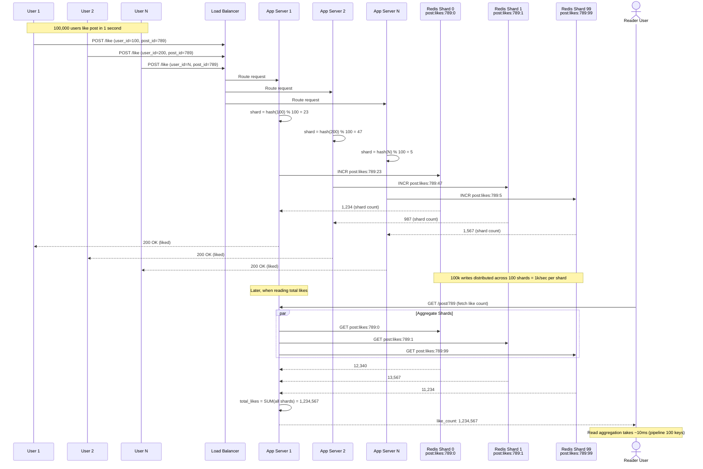

---

## 14. Redis Cache Failure Fallback

**Flow:**

This sequence demonstrates the circuit breaker pattern when Redis timeline cache fails, falling back to PostgreSQL with
graceful degradation.

**Steps:**

1. **Feed Request** (0ms): User requests feed
2. **Redis Query** (10ms): Attempt to fetch timeline from Redis
3. **Redis Failure** (20ms): Redis cluster is down (timeout after 10ms)
4. **Circuit Breaker Open** (20ms): After 50% failure rate, open circuit breaker
5. **Skip Redis** (25ms): Stop calling Redis for next 30 seconds
6. **Fallback to PostgreSQL** (100ms): Query PostgreSQL directly
7. **Rebuild Timeline** (150ms): Generate timeline from database
8. **Return Feed** (200ms): Return feed to user (slower, but functional)
9. **Background: Retry Redis** (30,000ms): Every 30 seconds, test if Redis is back
10. **Circuit Breaker Close** (30,100ms): If Redis responds, close circuit breaker

**Performance:**

- **Normal Latency**: 80ms (with Redis)
- **Degraded Latency**: 200ms (fallback to PostgreSQL)
- **User Impact**: Acceptable (still sub-300ms)

**Benefits:**

- **Graceful Degradation**: System remains operational
- **Self-Healing**: Automatically recovers when Redis is back

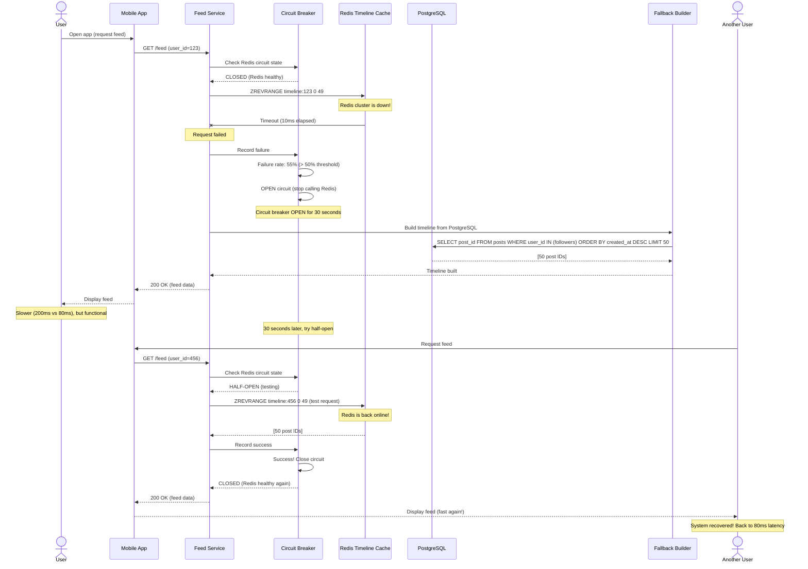