# Live Commenting - High-Level Design

## Table of Contents

1. [Complete System Architecture](#1-complete-system-architecture)
2. [Comment Ingestion Pipeline](#2-comment-ingestion-pipeline)
3. [Broadcast and Fanout Architecture](#3-broadcast-and-fanout-architecture)
4. [WebSocket Connection Management](#4-websocket-connection-management)
5. [Moderation Service Flow](#5-moderation-service-flow)
6. [Adaptive Throttling System](#6-adaptive-throttling-system)
7. [Redis Pub/Sub Sharding](#7-redis-pubsub-sharding)
8. [Emoji Reaction Aggregation](#8-emoji-reaction-aggregation)
9. [Connection Registry and Routing](#9-connection-registry-and-routing)
10. [Multi-Region Deployment](#10-multi-region-deployment)
11. [Fault Tolerance and Failover](#11-fault-tolerance-and-failover)
12. [Bandwidth Optimization](#12-bandwidth-optimization)
13. [Storage Architecture](#13-storage-architecture)
14. [Monitoring and Observability](#14-monitoring-and-observability)

---

## 1. Complete System Architecture

**Flow Explanation:**

This diagram shows the complete end-to-end architecture of the live commenting system, from client connections through
ingestion, processing, broadcast, and storage layers.

**Components:**

1. **Client Layer**: 5M concurrent viewers connected via WebSocket
2. **WebSocket Cluster**: 5,000 servers maintaining persistent connections
3. **API Gateway**: Rate limiting, authentication, routing
4. **Ingestion Service**: Accepts and validates comments
5. **Kafka**: Event streaming buffer for comment processing
6. **Moderation Service**: Real-time spam/hate speech detection
7. **Broadcast Coordinator**: Fanout orchestration
8. **Redis Pub/Sub**: Internal message routing
9. **Cassandra**: Persistent comment storage

**Benefits:**

- **Scalability**: Each component scales independently
- **Separation of Concerns**: Clear responsibility boundaries
- **High Availability**: Multiple redundant layers

**Trade-offs:**

- **Complexity**: Many moving parts require coordination
- **Latency**: Multiple hops (75ms total)
- **Cost**: Distributed infrastructure


---

## 2. Comment Ingestion Pipeline

**Flow Explanation:**

This diagram illustrates the complete comment ingestion flow from client submission through validation, Kafka
publication, moderation, and persistence.

**Steps:**

1. **Client Submission**: User sends comment via WebSocket
2. **API Gateway**: Validates JWT token, checks rate limits
3. **Ingestion Service**: Validates comment format, length
4. **Kafka Publish**: Writes to `comments` topic (partitioned by stream_id)
5. **Async Moderation**: Moderation service consumes Kafka, runs ML model
6. **Broadcast Decision**: Comment immediately broadcasted (don't wait for moderation)
7. **Delete if Flagged**: If moderation flags comment, publish delete event

**Performance:**

- **Ingestion Latency**: <50ms (client → Kafka)
- **Moderation Latency**: 50-100ms (async, non-blocking)
- **Throughput**: 10k comments/sec peak

**Benefits:**

- **Fast Response**: User sees confirmation immediately
- **Scalability**: Kafka buffers high write bursts
- **Fault Tolerance**: Failed moderation jobs can be retried

**Trade-offs:**

- **Eventual Consistency**: Offensive content visible 1-2 seconds before deletion
- **Complexity**: Need event sourcing for moderation actions


---

## 3. Broadcast and Fanout Architecture

**Flow Explanation:**

This diagram shows the two-tier fanout architecture that delivers one comment to millions of viewers efficiently using
Kafka → Redis Pub/Sub → WebSocket servers.

**Tier 1: Kafka to Broadcast Coordinator**

- Kafka partition holds comment stream (partitioned by stream_id)
- Broadcast Coordinator reads from Kafka
- Publishes to Redis Pub/Sub channel

**Tier 2: Redis Pub/Sub to WebSocket Servers**

- Redis Pub/Sub automatically duplicates message to all subscribers
- 5,000 WebSocket servers subscribe to channel
- Each server pushes to its connected clients

**Performance:**

- **Total Latency**: 75ms (p50), 150ms (p95)
- **Fanout Rate**: 50B pushes/sec peak (10k comments × 5M viewers)
- **Throughput**: 10k comments/sec processed

**Benefits:**

- **Low Latency**: <100ms end-to-end delivery
- **Automatic Fanout**: Redis handles message duplication
- **Decoupling**: WebSocket servers don't know about each other

**Trade-offs:**

- **Redis Hot Key**: Single Pub/Sub channel can become bottleneck (mitigated by sharding)
- **Message Loss**: If Redis crashes, messages lost (mitigated by Kafka retention)


---

## 4. WebSocket Connection Management

**Flow Explanation:**

This diagram shows how WebSocket connections are established, maintained, and routed in the system.

**Steps:**

1. **Connection Request**: Client initiates WebSocket handshake
2. **Load Balancer**: Routes to available WebSocket server
3. **Authentication**: Server validates JWT token
4. **Connection Registry**: Store mapping in Redis (`conn:user:{user_id}`)
5. **Subscribe**: Server subscribes to Redis Pub/Sub channel for stream
6. **Heartbeat**: Client and server exchange ping/pong every 30 seconds
7. **Disconnect**: Remove from registry, unsubscribe from channel

**Connection Scaling:**

- **Per Server**: 1M concurrent connections
- **Total Servers**: 5,000 servers
- **Memory**: 4 KB per connection (20 GB total)

**Benefits:**

- **Connection Affinity**: Registry enables targeted routing
- **Scalability**: Horizontal scaling across servers
- **Efficiency**: Minimal memory footprint per connection

**Trade-offs:**

- **Registry Overhead**: Redis lookups add latency
- **Connection Migration**: Reconnection needed during server scaling


---

## 5. Moderation Service Flow

**Flow Explanation:**

This diagram shows the asynchronous moderation pipeline that processes comments without blocking broadcast.

**Processing Stages:**

1. **Comment Received**: Kafka consumer picks up comment
2. **Stage 1 - Rule-Based**: Check blacklisted words (fast, 5ms)
3. **Stage 2 - ML Model**: Toxicity prediction (slower, 50ms)
4. **Stage 3 - User Reputation**: Lower threshold for repeat offenders
5. **Decision**: ACCEPT, REJECT, SHADOW_BAN, or FLAG
6. **Action**: If REJECT/SHADOW_BAN, publish delete event

**Performance:**

- **Processing Time**: 50-100ms per comment
- **Throughput**: 10k comments/sec (with 100 workers)
- **False Positive Rate**: <1%

**Benefits:**

- **Non-Blocking**: Comments broadcasted immediately
- **Scalable**: Horizontal worker scaling
- **Accurate**: Multi-stage filtering reduces false positives

**Trade-offs:**

- **Eventual Consistency**: Offensive content visible 1-2 seconds
- **Resource Intensive**: ML model requires GPU workers


---

## 6. Adaptive Throttling System

**Flow Explanation:**

This diagram shows the adaptive throttling system that samples comments during extreme traffic to prevent bandwidth
saturation.

**Throttling Logic:**

1. **Monitor Rate**: Track comments/sec for each stream
2. **Threshold Check**: Compare against thresholds (5k, 20k, 50k)
3. **Sampling Decision**: Determine sample rate based on current rate
4. **Broadcast or Store**: Sample broadcasts, store all comments
5. **User Notification**: Display banner about sampling

**Sampling Rates:**

- **Normal** (< 5k/sec): 100% broadcast
- **Moderate** (5k-20k/sec): 50% broadcast
- **High** (20k-50k/sec): 10% broadcast
- **Extreme** (> 50k/sec): 5% broadcast

**Performance:**

- **Bandwidth Savings**: 80-95% reduction during peak
- **Latency Impact**: +10ms (acceptable)
- **User Experience**: Acceptable (users notified)

**Benefits:**

- **Cost Reduction**: 80% bandwidth savings
- **System Stability**: Prevents overload
- **Transparency**: Users informed about sampling

**Trade-offs:**

- **Incomplete Visibility**: Not all comments shown
- **UX Impact**: Users may miss some comments (mitigated by pause feature)


---

## 7. Redis Pub/Sub Sharding

**Flow Explanation:**

This diagram shows how Redis Pub/Sub channels are sharded to prevent hot key bottlenecks when a single stream receives
millions of viewers.

**Sharding Strategy:**

1. **Shard Calculation**: Hash stream_id to determine shard (0-99)
2. **Channel Naming**: `stream:{stream_id}:comments:shard{shard_id}`
3. **Coordinator Publishing**: Publish to all 100 shards (parallel)
4. **Server Subscription**: Each WebSocket server subscribes to 1 shard
5. **Load Distribution**: 5,000 servers ÷ 100 shards = 50 servers per shard

**Benefits:**

- **Load Distribution**: 100x reduction in per-key load
- **Scalability**: Handles larger streams without bottlenecks
- **Isolation**: One shard failure doesn't affect others

**Trade-offs:**

- **Complexity**: Need to publish to multiple channels
- **Duplicate Messages**: Server receives same comment (deduplication needed)


---

## 8. Emoji Reaction Aggregation

**Flow Explanation:**

This diagram shows how emoji reactions (fire, heart, etc.) are aggregated locally before broadcasting to reduce
network traffic by 99.9%.

**Aggregation Flow:**

1. **Client Sends Reaction**: User clicks emoji
2. **Local Buffer**: WebSocket server buffers reaction locally
3. **Aggregation Window**: Collect reactions for 500ms
4. **Flush to Redis**: Send aggregated count to Redis
5. **Broadcast Update**: Send aggregated total to all viewers
6. **Client Display**: Show running total (not per-reaction)

**Performance:**

- **Reaction Rate**: 100k reactions/sec (without aggregation)
- **After Aggregation**: 2 updates/sec (50,000x reduction)
- **Bandwidth Savings**: 99.99% reduction

**Benefits:**

- **Traffic Reduction**: 99.99% bandwidth savings
- **User Experience**: Running total (better than spam)
- **System Stability**: Prevents reaction spam overload

**Trade-offs:**

- **Latency**: 500ms delay before update (acceptable for reactions)
- **Granularity**: Lose per-reaction timing (not needed for UX)

```mermaid
graph TB
    subgraph "Clients"
        Client1[User 1: 🔥]
        Client2[User 2: ❤️]
        Client3[User N: 🔥]
    end

    subgraph "WebSocket Server"
        WSServer[WebSocket Server]
        LocalBuffer[Local Buffer<br/>500ms window]
        Aggregator[Aggregator<br/>Count by Type]
    end

    subgraph "Storage"
        RedisReactions[(Redis<br/>reactions:stream:789)]
    end

    subgraph "Broadcast"
        BroadcastCoord[Broadcast Coordinator]
        RedisPubSub[Redis Pub/Sub]
    end

    subgraph "All Viewers"
        AllClients[All Connected Clients<br/>Receive Update]
    end

    Client1 --> WSServer
    Client2 --> WSServer
    Client3 --> WSServer

    WSServer --> LocalBuffer
    LocalBuffer --> Aggregator

    Aggregator --> RedisReactions
    Aggregator --> BroadcastCoord

    BroadcastCoord --> RedisPubSub
    RedisPubSub --> AllClients

    style Aggregator fill: #4caf50
    style LocalBuffer fill: #ff9800
```



---

## 9. Connection Registry and Routing

**Flow Explanation:**

This diagram shows how the connection registry enables targeted message routing by tracking which WebSocket server holds
each user's connection.

**Registry Operations:**

1. **Connection Registration**: On connect, store mapping in Redis
2. **Route Lookup**: Broadcast coordinator queries registry
3. **Targeted Broadcast**: Send message to specific server
4. **Connection Cleanup**: Remove mapping on disconnect

**Data Structure:**

```
Key: conn:user:{user_id}
Fields:
  - stream_id: BIGINT
  - ws_server: "ws-server-42.example.com"
  - connected_at: TIMESTAMP
```

**Benefits:**

- **Targeted Routing**: Don't broadcast to all servers
- **Ban Operations**: Can disconnect specific users
- **Connection Migration**: Track connections during scaling

**Trade-offs:**

- **Lookup Overhead**: Redis query adds 1ms latency
- **Registry Size**: 5M entries × 200 bytes = 1 GB (acceptable)


---

## 10. Multi-Region Deployment

**Flow Explanation:**

This diagram shows how the system is deployed across multiple regions for global low-latency access and high
availability.

**Regional Architecture:**

- **US-EAST**: Primary region (Kafka primary, most servers)
- **EU-WEST**: Secondary region (Kafka replica, 2k servers)
- **ASIA-PACIFIC**: Tertiary region (Kafka replica, 1k servers)

**Replication:**

- **Kafka**: MirrorMaker 2 for cross-region replication (100ms lag)
- **Cassandra**: Multi-datacenter replication (eventual consistency)
- **Redis**: No replication (local cache, can rebuild)

**Benefits:**

- **Low Latency**: Users served from nearest region
- **High Availability**: Survives single region failure
- **Data Sovereignty**: Store data in local regions

**Trade-offs:**

- **Complexity**: Cross-region coordination
- **Cost**: 3x infrastructure in each region
- **Consistency**: Eventual consistency across regions


---

## 11. Fault Tolerance and Failover

**Flow Explanation:**

This diagram shows the failover mechanisms when critical components fail, ensuring graceful degradation.

**Failure Scenarios:**

1. **Redis Pub/Sub Down**: Fallback to Kafka direct broadcast (slower but functional)
2. **WebSocket Server Down**: Load balancer routes new connections, clients reconnect
3. **Kafka Partition Down**: Replica promotion, 30-second recovery
4. **Moderation Service Down**: Skip moderation, allow all comments (temporary)

**Circuit Breaker Pattern:**

- **Closed**: Normal operation
- **Open**: Stop calling failed service, use fallback
- **Half-Open**: Test if service recovered

**Benefits:**

- **Graceful Degradation**: System remains operational
- **Auto-Recovery**: Automatically retry when service restores
- **User Experience**: Minimal disruption

**Trade-offs:**

- **Degraded Performance**: Fallback slower (acceptable temporarily)
- **Partial Functionality**: Some features disabled during failure


---

## 12. Bandwidth Optimization

**Flow Explanation:**

This diagram shows the multiple optimization techniques applied to reduce bandwidth from 10 TB/sec to 0.5 TB/sec.

**Optimization Layers:**

1. **MessagePack Serialization**: 50% smaller than JSON
2. **WebSocket Compression**: permessage-deflate (60% reduction)
3. **Delta Encoding**: Send only changed fields
4. **Adaptive Sampling**: 80-95% reduction during peak

**Compression Pipeline:**

```
Original JSON: {"user": "john", "message": "Hello"}  // 40 bytes
↓ MessagePack
MessagePack: \x82\xa4user\xa4john\xa7message\xa5Hello  // 20 bytes
↓ WebSocket Compression
Compressed: \x78\x9c\xab\x56...  // 8 bytes
↓ Adaptive Sampling (if peak)
Final: 1.6 bytes (5% sample)  // 95% reduction
```

**Benefits:**

- **Cost Savings**: 20x bandwidth reduction ($1.5M → $75k/month)
- **System Stability**: Prevents network saturation
- **User Experience**: No noticeable impact

**Trade-offs:**

- **CPU Overhead**: Compression adds 5ms latency
- **Sampling**: Not all comments shown (user notified)


---

## 13. Storage Architecture

**Flow Explanation:**

This diagram shows the multi-tier storage architecture for comments, metadata, and connection state.

**Storage Tiers:**

1. **PostgreSQL**: Stream metadata, user profiles (relational, ACID)
2. **Cassandra**: Comment history (time-series, partitioned by stream_id)
3. **Redis**: Connection registry, active stream cache (ephemeral, fast)
4. **Kafka**: Event log (7-day retention, replay capability)

**Data Flow:**

- **Write Path**: Comments → Kafka → Cassandra (async)
- **Read Path**: Recent comments from Redis cache, historical from Cassandra
- **Connection State**: Redis only (rebuilt on restart)

**Benefits:**

- **Optimized Reads**: Redis cache for hot data
- **Durable Writes**: Kafka + Cassandra ensure no data loss
- **Scalability**: Each tier scales independently

**Trade-offs:**

- **Eventual Consistency**: Cassandra writes async (acceptable for comments)
- **Memory Cost**: Redis cache uses significant RAM


---

## 14. Monitoring and Observability

**Flow Explanation:**

This diagram shows the comprehensive monitoring infrastructure tracking system health, performance, and user behavior.

**Monitoring Layers:**

1. **Metrics**: Prometheus scrapes application metrics (latency, throughput)
2. **Traces**: OpenTelemetry tracks request flow across services
3. **Logs**: Elasticsearch aggregates structured logs
4. **Alerts**: Alertmanager routes critical alerts to on-call engineers

**Key Metrics:**

- Comment latency (p50, p95, p99)
- WebSocket connection count
- Redis Pub/Sub latency
- Kafka consumer lag
- Moderation queue depth

**Benefits:**

- **Proactive Detection**: Catch issues before users notice
- **Root Cause Analysis**: Quickly identify bottlenecks
- **Performance Optimization**: Data-driven decisions

**Trade-offs:**

- **Infrastructure Cost**: Monitoring overhead (5% of total)
- **Alert Fatigue**: Too many alerts = ignored alerts (need tuning)


---

This completes the high-level design diagrams for the Live Commenting system. Each diagram illustrates critical
architectural components with detailed flow explanations, performance characteristics, and trade-off analysis.

