# Live Commenting - Sequence Diagrams

## Table of Contents

1. [Comment Submission Flow](#1-comment-submission-flow)
2. [Broadcast Fanout Flow](#2-broadcast-fanout-flow)
3. [WebSocket Connection Establishment](#3-websocket-connection-establishment)
4. [Async Moderation Flow](#4-async-moderation-flow)
5. [Adaptive Throttling Decision](#5-adaptive-throttling-decision)
6. [Emoji Reaction Aggregation](#6-emoji-reaction-aggregation)
7. [Comment Deletion Flow](#7-comment-deletion-flow)
8. [Connection Registry Lookup](#8-connection-registry-lookup)
9. [Redis Pub/Sub Failover](#9-redis-pubsub-failover)
10. [Multi-Region Comment Replication](#10-multi-region-comment-replication)
11. [Rate Limiting Check](#11-rate-limiting-check)
12. [Connection Heartbeat](#12-connection-heartbeat)
13. [Server Scaling Connection Migration](#13-server-scaling-connection-migration)
14. [Moderation Delete Event Broadcast](#14-moderation-delete-event-broadcast)

---

## 1. Comment Submission Flow

**Flow:**

This sequence shows the complete flow of a user submitting a comment, from WebSocket message to Kafka publication and
immediate broadcast.

**Steps:**

1. **Client Submission** (0ms): User types comment, presses send
2. **WebSocket Send** (5ms): Client sends WebSocket message
3. **API Gateway** (10ms): Validates JWT token, checks rate limit
4. **Ingestion Service** (15ms): Validates comment format, length
5. **Kafka Publish** (20ms): Writes to Kafka topic (partition by stream_id)
6. **Return Success** (25ms): User sees confirmation (optimistic UI)
7. **Async Processing** (background): Moderation, broadcast continue

**Performance:**

- **User Response Time**: 25ms (user sees confirmation)
- **Kafka Write Latency**: 5ms (p50)
- **Throughput**: 10k comments/sec sustained

**Edge Cases:**

- Rate limit exceeded → Return error immediately (no Kafka write)
- Kafka down → Queue in Redis, retry with exponential backoff
- Invalid format → Return validation error (no Kafka write)

---

## 2. Broadcast Fanout Flow

**Flow:**

This sequence demonstrates how a single comment is broadcasted to 5 million viewers through the two-tier fanout
architecture.

**Steps:**

1. **Kafka Consumer** (0ms): Broadcast coordinator consumes comment
2. **Redis Pub/Sub Publish** (5ms): Publishes to channel `stream:789:comments`
3. **Redis Fanout** (10ms): Redis automatically duplicates to all subscribers
4. **WebSocket Server Receive** (15ms): 5,000 servers receive message
5. **WebSocket Push** (50ms): Each server pushes to connected clients
6. **Client Display** (75ms total): Viewers see comment

**Performance:**

- **Total Latency**: 75ms (p50), 150ms (p95)
- **Fanout Rate**: 50B pushes/sec peak (10k comments × 5M viewers)
- **Redis Pub/Sub Latency**: <10ms for fanout

**Optimization:**

- Batch multiple comments (send 10 comments in one WebSocket frame)
- Parallel publishing to Redis shards (100 shards)
- Connection pooling for Redis (reuse connections)

---

## 3. WebSocket Connection Establishment

**Flow:**

This sequence shows how a WebSocket connection is established, authenticated, registered, and subscribed to comment
streams.

**Steps:**

1. **Client Request** (0ms): Client initiates WebSocket handshake
2. **Load Balancer** (5ms): Routes to available WebSocket server
3. **Server Accept** (10ms): Server accepts connection
4. **Authentication** (15ms): Server validates JWT token
5. **Connection Registry** (20ms): Store mapping in Redis
6. **Subscribe** (25ms): Server subscribes to Redis Pub/Sub channel
7. **Heartbeat Setup** (30ms): Client and server establish ping/pong
8. **Ready** (35ms): Connection ready to receive comments

**Performance:**

- **Connection Time**: 35ms total
- **Throughput**: 5k connections/sec per server
- **Memory Overhead**: 4 KB per connection

**Edge Cases:**

- Invalid JWT → Close connection immediately
- Redis registry down → Store in local cache, retry later
- Server at capacity → Reject connection, client retries

---

## 4. Async Moderation Flow

**Flow:**

This sequence shows how comments are moderated asynchronously without blocking broadcast, allowing offensive content to be
visible for 1-2 seconds before deletion.

**Steps:**

1. **Comment Published** (0ms): Comment written to Kafka
2. **Moderation Worker** (10ms): Worker consumes comment from Kafka
3. **Stage 1: Rule Filter** (15ms): Check blacklisted words
4. **Stage 2: ML Model** (65ms): Run toxicity prediction model
5. **Stage 3: User Reputation** (70ms): Check user's past violations
6. **Decision** (75ms): ACCEPT, REJECT, SHADOW_BAN, or FLAG
7. **Action** (80ms): If REJECT, publish delete event
8. **Delete Broadcast** (150ms): Delete event broadcasted to viewers

**Performance:**

- **Processing Time**: 50-100ms per comment
- **Throughput**: 10k comments/sec (with 100 workers)
- **False Positive Rate**: <1%

**Trade-offs:**

- **Eventual Consistency**: Offensive content visible 1-2 seconds
- **Resource Intensive**: ML model requires GPU workers

---

## 5. Adaptive Throttling Decision

**Flow:**

This sequence shows how the system decides whether to broadcast a comment or only store it based on current comment rate
and adaptive throttling rules.

**Steps:**

1. **Comment Received** (0ms): Comment arrives at broadcast coordinator
2. **Rate Monitor** (5ms): Query current comment rate for stream
3. **Threshold Check** (10ms): Compare against thresholds (5k, 20k, 50k/sec)
4. **Sample Calculation** (15ms): Calculate sample rate (5%, 10%, 20%, 50%, or 100%)
5. **Random Decision** (20ms): Random number < sample rate?
6. **Action** (25ms): Broadcast if sampled, store-only if not
7. **User Notification** (30ms): Display banner if sampling active

**Performance:**

- **Decision Latency**: 30ms (negligible impact)
- **Bandwidth Savings**: 80-95% during peak traffic
- **User Experience**: Acceptable (users notified)

---

## 6. Emoji Reaction Aggregation

**Flow:**

This sequence demonstrates how emoji reactions are aggregated locally before broadcasting to reduce network traffic by
99.99%.

**Steps:**

1. **Client Reaction** (0ms): User clicks emoji (fire, heart, etc.)
2. **WebSocket Send** (5ms): Client sends reaction message
3. **Local Buffer** (10ms): Server buffers reaction in local memory
4. **Aggregation Window** (500ms): Collect reactions for 500ms
5. **Flush to Redis** (510ms): Send aggregated count to Redis
6. **Broadcast Update** (520ms): Broadcast aggregated total to all viewers
7. **Client Display** (525ms): Show updated reaction count

**Performance:**

- **Aggregation Window**: 500ms (vs instant broadcast)
- **Traffic Reduction**: 99.99% (100k reactions/sec → 2 updates/sec)
- **User Experience**: Running total (better than spam)

---

## 7. Comment Deletion Flow

**Flow:**

This sequence shows how a comment is deleted (either by moderation or user action) and removed from all viewers'
streams.

**Steps:**

1. **Delete Trigger** (0ms): Moderation flags comment OR user deletes own comment
2. **Publish Delete Event** (5ms): Write to Kafka `comment.deleted` topic
3. **Delete Consumer** (10ms): Worker consumes delete event
4. **Update Cassandra** (15ms): Mark comment as deleted in database
5. **Broadcast Delete** (20ms): Publish delete event to Redis Pub/Sub
6. **WebSocket Push** (50ms): All WebSocket servers push delete to clients
7. **Client Remove** (75ms): Viewers see comment disappear from UI

**Performance:**

- **Deletion Latency**: 75ms (p50)
- **Throughput**: 1k deletions/sec
- **Cache Invalidation**: Immediate (Redis key deleted)

---

## 8. Connection Registry Lookup

**Flow:**

This sequence demonstrates how the connection registry is used to route messages to specific users during targeted
operations (like bans or direct messages).

**Steps:**

1. **Targeted Operation** (0ms): System needs to send message to specific user
2. **Registry Lookup** (5ms): Query Redis for user's connection mapping
3. **Server Identification** (10ms): Get WebSocket server ID from registry
4. **Direct Route** (15ms): Route message to specific server (skip broadcast)
5. **Server Push** (50ms): Server pushes message to user's connection
6. **User Receives** (75ms): User receives targeted message

**Performance:**

- **Lookup Latency**: 5ms (Redis GET)
- **Targeted Delivery**: 75ms vs 150ms broadcast (2x faster)
- **Efficiency**: No unnecessary fanout to all servers

**Use Cases:**

- User ban (disconnect specific user)
- Direct message to broadcaster
- Moderator action notification

---

## 9. Redis Pub/Sub Failover

**Flow:**

This sequence shows the failover mechanism when Redis Pub/Sub fails, falling back to Kafka direct broadcast with
graceful degradation.

**Steps:**

1. **Normal Operation** (0ms): Redis Pub/Sub functioning normally
2. **Failure Detection** (5ms): Circuit breaker detects Redis timeouts
3. **Circuit Open** (10ms): Stop calling Redis, use fallback
4. **Kafka Direct Broadcast** (15ms): Write to Kafka `ws-messages` topic
5. **WebSocket Consumer** (20ms): Servers consume from Kafka directly
6. **Message Delivery** (200ms): Clients receive messages (slower but functional)
7. **Recovery** (30s later): Circuit breaker half-open, test Redis
8. **Restore Normal** (35s): Redis restored, resume Pub/Sub

**Performance:**

- **Normal Latency**: 75ms (with Redis)
- **Degraded Latency**: 200ms (Kafka direct)
- **Recovery Time**: 30-60 seconds

**Trade-offs:**

- **3x Higher Latency**: Acceptable during failure
- **System Remains Operational**: No service disruption

---

## 10. Multi-Region Comment Replication

**Flow:**

This sequence demonstrates how comments are replicated across regions for global low-latency access while maintaining
eventual consistency.

**Steps:**

1. **Comment Published** (0ms): Comment written to Kafka in US-EAST
2. **Local Broadcast** (75ms): Immediately broadcasted to US viewers
3. **MirrorMaker Replication** (100ms): Kafka MirrorMaker replicates to EU-WEST
4. **EU Broadcast** (175ms): EU coordinator broadcasts to EU viewers
5. **Asia Replication** (200ms): Further replication to ASIA-PACIFIC
6. **Asia Broadcast** (275ms): Asia viewers receive comment

**Performance:**

- **Same-Region Latency**: 75ms (optimal)
- **Cross-Region Latency**: 275ms (acceptable for global)
- **Replication Lag**: 100ms (eventual consistency)

**Benefits:**

- **Low Latency**: Users served from nearest region
- **High Availability**: Survives single region failure
- **Global Scale**: Supports worldwide events

---

## 11. Rate Limiting Check

**Flow:**

This sequence shows the multi-layer rate limiting system that prevents spam and bot attacks.

**Steps:**

1. **Comment Request** (0ms): User attempts to send comment
2. **Per-User Check** (5ms): Check user's comment count in last minute
3. **Per-IP Check** (10ms): Check IP address comment count
4. **Per-Stream Check** (15ms): Check stream's total comment rate
5. **Global Check** (20ms): Check global comment rate
6. **Decision** (25ms): Allow or reject based on all checks
7. **Response** (30ms): Return success or rate limit error

**Performance:**

- **Check Latency**: 30ms (multiple Redis queries)
- **Throughput**: 10k checks/sec per rate limiter
- **False Positive Rate**: <0.1% (legitimate users rarely hit limits)

```mermaid
sequenceDiagram
    participant Client as Client
    participant Gateway as API Gateway
    participant RateLimiter as Rate Limiter
    participant Redis as Redis Counters
    participant IngestAPI as Ingestion API

    Client ->> Gateway: Send Comment<br/>user_id=123, ip=1.2.3.4
    
    Gateway ->> RateLimiter: Check Rate Limits
    
    RateLimiter ->> Redis: GET rate:user:123<br/>(Check per-user limit)
    Redis -->> RateLimiter: Count: 5<br/>Limit: 10/min → OK
    
    RateLimiter ->> Redis: GET rate:ip:1.2.3.4<br/>(Check per-IP limit)
    Redis -->> RateLimiter: Count: 50<br/>Limit: 100/min → OK
    
    RateLimiter ->> Redis: GET rate:stream:789<br/>(Check per-stream limit)
    Redis -->> RateLimiter: Count: 8000<br/>Limit: 10000/sec → OK
    
    RateLimiter ->> Redis: GET rate:global<br/>(Check global limit)
    Redis -->> RateLimiter: Count: 900k<br/>Limit: 1M/sec → OK
    
    RateLimiter ->> Redis: INCR rate:user:123<br/>INCR rate:ip:1.2.3.4<br/>INCR rate:stream:789<br/>INCR rate:global
    
    RateLimiter -->> Gateway: All Checks Passed
    
    Gateway ->> IngestAPI: Forward Comment
    IngestAPI -->> Client: 200 OK
    
    alt Rate Limit Exceeded
        RateLimiter -->> Gateway: Rate Limit Exceeded<br/>Wait 30 seconds
        Gateway -->> Client: 429 Too Many Requests
    end
```

---

## 12. Connection Heartbeat

**Flow:**

This sequence shows how WebSocket connections are kept alive through periodic ping/pong heartbeats and what happens
when a connection is detected as dead.

**Steps:**

1. **Server Ping** (0ms): Server sends ping frame every 30 seconds
2. **Client Pong** (50ms): Client responds with pong frame
3. **Connection Active** (60ms): Server updates last_heartbeat timestamp
4. **Dead Connection** (30s later): If no pong received, mark as dead
5. **Cleanup** (35s): Remove from registry, unsubscribe from channels
6. **Client Reconnect** (40s): Client detects connection lost, reconnects

**Performance:**

- **Heartbeat Interval**: 30 seconds
- **Ping/Pong Overhead**: 20 bytes per heartbeat
- **Connection Timeout**: 60 seconds (2 missed heartbeats)

**Benefits:**

- **Detect Dead Connections**: Clean up stale connections
- **Network Monitoring**: Detect network issues early
- **Resource Cleanup**: Free memory from dead connections

---

## 13. Server Scaling Connection Migration

**Flow:**

This sequence shows what happens when new WebSocket servers are added during scaling, with graceful connection
migration.

**Steps:**

1. **Scale-Up Trigger** (0ms): Auto-scaler detects high connection count
2. **New Server Starts** (10s): Kubernetes deploys new WebSocket server
3. **Load Balancer Update** (15s): Load balancer includes new server
4. **New Connections** (20s): New clients connect to new server
5. **Old Connections** (ongoing): Existing connections remain on old servers
6. **Stable State** (60s): System balanced across all servers

**Performance:**

- **Server Startup**: 10-15 seconds
- **Connection Migration**: No forced migration (new connections only)
- **Zero Downtime**: No disruption to existing connections

**Benefits:**

- **Horizontal Scaling**: Add capacity without downtime
- **Gradual Migration**: New connections naturally balance
- **No Forced Disconnect**: Users don't experience reconnections

---

## 14. Moderation Delete Event Broadcast

**Flow:**

This sequence shows how a comment that was initially broadcasted is later deleted after moderation flags it, and how
the delete event is broadcasted to all viewers.

**Steps:**

1. **Comment Broadcast** (0ms): Comment initially broadcasted (optimistic)
2. **Moderation Processing** (50ms): Moderation worker processes comment
3. **Toxicity Detected** (100ms): ML model flags comment as toxic
4. **Delete Event** (105ms): Publish delete event to Kafka
5. **Broadcast Delete** (110ms): Broadcast coordinator publishes to Redis
6. **WebSocket Push** (150ms): All servers push delete to clients
7. **UI Update** (200ms): Viewers see comment disappear

**Performance:**

- **Delete Latency**: 150ms from moderation decision
- **Visibility Window**: 1-2 seconds (comment visible before deletion)
- **Throughput**: 100 deletions/sec (10% of comments flagged)

**Trade-offs:**

- **Eventual Consistency**: Offensive content briefly visible (acceptable)
- **User Experience**: Smooth deletion (no jarring removal)

---

This completes the sequence diagrams for the Live Commenting system. Each diagram illustrates critical interaction flows
with detailed step-by-step explanations, performance characteristics, and failure handling scenarios.

