# Yelp/Google Maps - High-Level Design

## Table of Contents

1. [Complete System Architecture](#1-complete-system-architecture)
2. [Geo-Spatial Indexing Architecture](#2-geo-spatial-indexing-architecture)
3. [Elasticsearch Search Engine](#3-elasticsearch-search-engine)
4. [POI Data Model and Storage](#4-poi-data-model-and-storage)
5. [Geohash Query Processing](#5-geohash-query-processing)
6. [Adjacent Cell Boundary Handling](#6-adjacent-cell-boundary-handling)
7. [Hierarchical Sharding Strategy](#7-hierarchical-sharding-strategy)
8. [Hotspot Mitigation](#8-hotspot-mitigation)
9. [Caching Architecture](#9-caching-architecture)
10. [Review Storage and Denormalization](#10-review-storage-and-denormalization)
11. [Multi-Region Deployment](#11-multi-region-deployment)
12. [Filtering and Ranking Pipeline](#12-filtering-and-ranking-pipeline)
13. [Auto-complete Service](#13-auto-complete-service)
14. [Map Tile Serving](#14-map-tile-serving)
15. [Monitoring and Observability](#15-monitoring-and-observability)

---

## 1. Complete System Architecture

**Flow Explanation:**

This diagram shows the complete end-to-end architecture for the Yelp/Google Maps geo-spatial search system, from user
queries through geo-indexing, search, ranking, and response delivery.

**Components:**

1. **Client Layer**: Mobile apps and web browsers requesting POI searches
2. **API Gateway**: Rate limiting, authentication, geo-aware routing
3. **Search Service**: Orchestrates geo-indexing, Elasticsearch queries, and ranking
4. **Geo-Indexer**: Converts lat/lng to Geohash and calculates adjacent cells
5. **Elasticsearch Cluster**: Primary search engine with geo_point indexes
6. **PostgreSQL**: POI metadata with ACID guarantees
7. **MongoDB**: Review storage, sharded by POI ID
8. **Redis Cache**: Popular queries and ranked results
9. **CDN**: Serves POI photos and map tiles

**Benefits:**

- **Low Latency**: <100ms end-to-end through caching and optimized queries
- **Scalability**: Horizontal scaling via Elasticsearch sharding
- **High Availability**: Multi-region deployment with failover

**Trade-offs:**

- **Complexity**: Multiple data stores require careful coordination
- **Eventual Consistency**: Review aggregates updated asynchronously
- **Infrastructure Cost**: Elasticsearch + PostgreSQL + MongoDB clusters

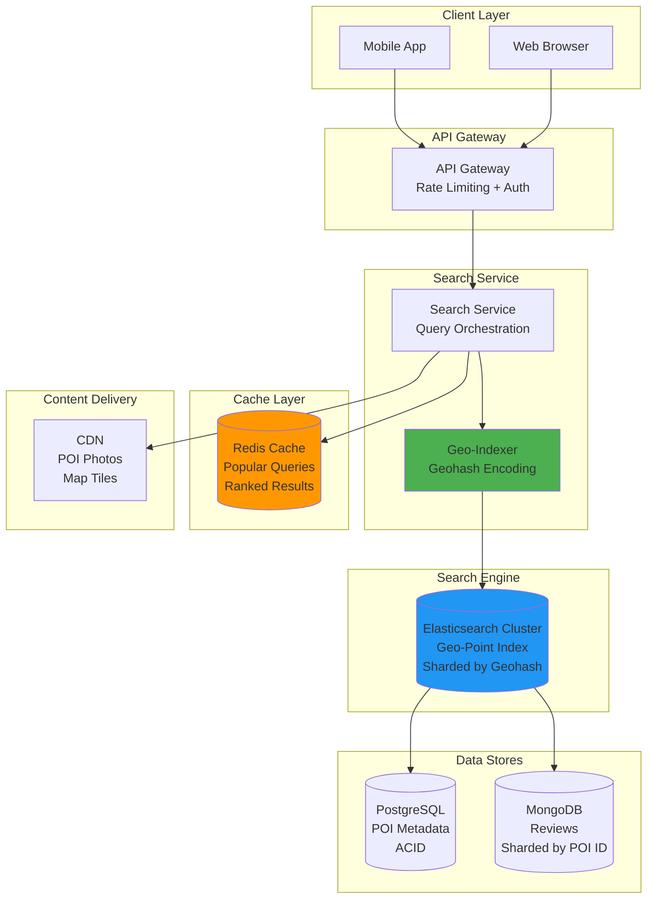
```mermaid
graph TB
    subgraph "Client Layer"
        MobileApp[Mobile App]
        WebBrowser[Web Browser]
    end

    subgraph "API Gateway"
        Gateway[API Gateway<br/>Rate Limiting + Auth]
    end

    subgraph "Search Service"
        SearchSvc[Search Service<br/>Query Orchestration]
        GeoIndexer[Geo-Indexer<br/>Geohash Encoding]
    end

    subgraph "Search Engine"
        ESCluster[(Elasticsearch Cluster<br/>Geo-Point Index<br/>Sharded by Geohash)]
    end

    subgraph "Data Stores"
        PostgresDB[(PostgreSQL<br/>POI Metadata<br/>ACID)]
        MongoDB[(MongoDB<br/>Reviews<br/>Sharded by POI ID)]
    end

    subgraph "Cache Layer"
        RedisCache[(Redis Cache<br/>Popular Queries<br/>Ranked Results)]
    end

    subgraph "Content Delivery"
        CDN[CDN<br/>POI Photos<br/>Map Tiles]
    end

    MobileApp --> Gateway
    WebBrowser --> Gateway
    Gateway --> SearchSvc
    SearchSvc --> GeoIndexer
    GeoIndexer --> ESCluster
    SearchSvc --> RedisCache
    ESCluster --> PostgresDB
    ESCluster --> MongoDB
    SearchSvc --> CDN
    style ESCluster fill: #2196f3
    style GeoIndexer fill: #4caf50
    style RedisCache fill: #ff9800
```

---

## 2. Geo-Spatial Indexing Architecture

**Flow Explanation:**

This diagram illustrates how 2D geographic coordinates (latitude, longitude) are transformed into a 1D searchable
Geohash index, enabling fast proximity queries in Elasticsearch.

**Steps:**

1. **Input**: POI location lat=37.7749, lng=-122.4194 (San Francisco)
2. **Geohash Encoding**: Convert to geohash string "9q8yy9m" (7 chars = ~153m precision)
3. **Elasticsearch Index**: Store in geo_point field with geohash as keyword
4. **Proximity Query**: Query by geohash prefix + adjacent cells
5. **Distance Filter**: Filter results by exact distance calculation
6. **Result**: Return POIs within radius, sorted by distance

**Benefits:**

- **Fast Lookups**: O(log N) for indexed queries
- **Prefix Matching**: Nearby locations share common prefixes
- **Range Queries**: Single index scan for proximity search

**Trade-offs:**

- **Boundary Issues**: POIs near cell edges may require adjacent cell queries
- **Fixed Grid**: Doesn't adapt to POI density (H3 is better for dynamic scenarios)

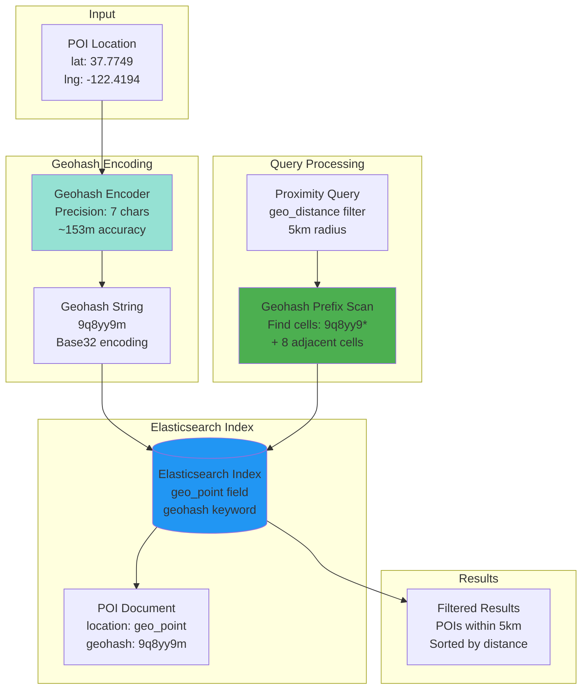
```mermaid
graph TB
    subgraph "Input"
        POILocation[POI Location<br/>lat: 37.7749<br/>lng: -122.4194]
    end

subgraph "Geohash Encoding"
GeohashEncoder[Geohash Encoder<br/>Precision: 7 chars<br/>~153m accuracy]
GeohashStr[Geohash String<br/>9q8yy9m<br/>Base32 encoding]
end

subgraph "Elasticsearch Index"
ESIndex[(Elasticsearch Index<br/>geo_point field<br/>geohash keyword)]
POIDoc[POI Document<br/>location: geo_point<br/>geohash: 9q8yy9m]
end

subgraph "Query Processing"
ProximityQuery[Proximity Query<br/>geo_distance filter<br/>5km radius]
PrefixScan[Geohash Prefix Scan<br/>Find cells: 9q8yy9*<br/>+ 8 adjacent cells]
end

subgraph "Results"
FilteredResults[Filtered Results<br/>POIs within 5km<br/>Sorted by distance]
end

POILocation --> GeohashEncoder
GeohashEncoder --> GeohashStr
GeohashStr --> ESIndex
ESIndex --> POIDoc
ProximityQuery --> PrefixScan
PrefixScan --> ESIndex
ESIndex --> FilteredResults

style GeohashEncoder fill: #95e1d3
style ESIndex fill: #2196f3
style PrefixScan fill: #4caf50
```

---

## 3. Elasticsearch Search Engine

**Flow Explanation:**

This diagram shows how Elasticsearch processes complex geo-spatial queries with multiple filters (category, rating,
hours) using its inverted index and geo_point capabilities.

**Components:**

1. **Query Builder**: Constructs bool query with geo_distance + filters
2. **Index Shards**: Elasticsearch shards partitioned by Geohash prefix
3. **Filter Execution**: Applies category, rating, price_range filters
4. **Distance Calculation**: Computes exact distance for each POI
5. **Sorting**: Sorts by distance, then by rating
6. **Result Aggregation**: Combines results from multiple shards

**Benefits:**

- **Complex Queries**: Combine geo + text + filters in single query
- **Fast Filtering**: Inverted index for category/rating filters
- **Horizontal Scaling**: Shard by Geohash for geographic distribution

**Trade-offs:**

- **Latency**: Multi-shard queries require coordination (50-100ms)
- **Resource Usage**: Complex queries consume CPU/memory

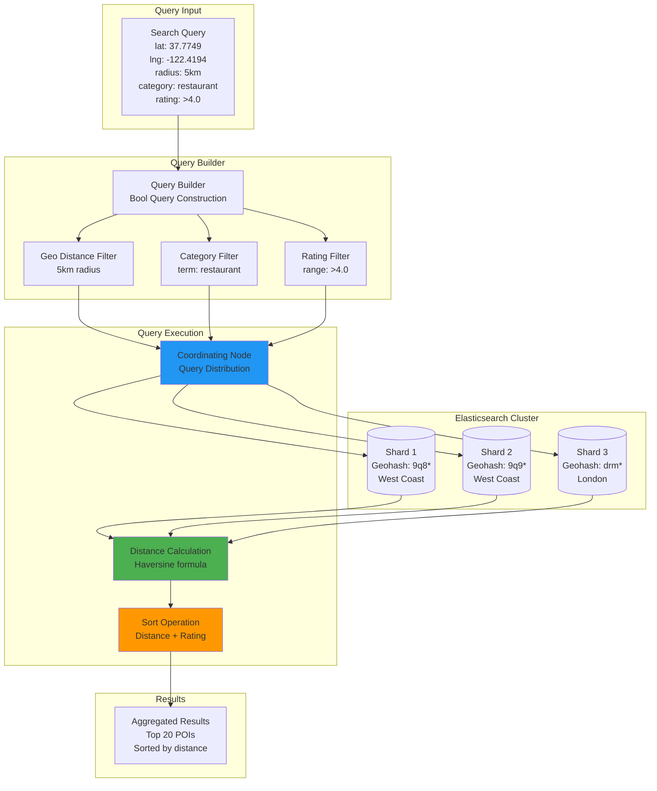
```mermaid
graph TB
    subgraph "Query Input"
        SearchQuery[Search Query<br/>lat: 37.7749<br/>lng: -122.4194<br/>radius: 5km<br/>category: restaurant<br/>rating: >4.0]
    end

    subgraph "Query Builder"
        QueryBuilder[Query Builder<br/>Bool Query Construction]
        GeoFilter[Geo Distance Filter<br/>5km radius]
        CategoryFilter[Category Filter<br/>term: restaurant]
        RatingFilter[Rating Filter<br/>range: >4.0]
    end

    subgraph "Elasticsearch Cluster"
        Shard1[(Shard 1<br/>Geohash: 9q8*<br/>West Coast)]
        Shard2[(Shard 2<br/>Geohash: 9q9*<br/>West Coast)]
        Shard3[(Shard 3<br/>Geohash: drm*<br/>London)]
    end

    subgraph "Query Execution"
        CoordNode[Coordinating Node<br/>Query Distribution]
        DistanceCalc[Distance Calculation<br/>Haversine formula]
        SortOp[Sort Operation<br/>Distance + Rating]
    end

    subgraph "Results"
        AggregatedResults[Aggregated Results<br/>Top 20 POIs<br/>Sorted by distance]
    end

    SearchQuery --> QueryBuilder
    QueryBuilder --> GeoFilter
    QueryBuilder --> CategoryFilter
    QueryBuilder --> RatingFilter
    GeoFilter --> CoordNode
    CategoryFilter --> CoordNode
    RatingFilter --> CoordNode
    CoordNode --> Shard1
    CoordNode --> Shard2
    CoordNode --> Shard3
    Shard1 --> DistanceCalc
    Shard2 --> DistanceCalc
    Shard3 --> DistanceCalc
    DistanceCalc --> SortOp
    SortOp --> AggregatedResults
    style CoordNode fill: #2196f3
    style DistanceCalc fill: #4caf50
    style SortOp fill: #ff9800
```

---

## 4. POI Data Model and Storage

**Flow Explanation:**

This diagram shows the data model architecture with normalized POI metadata in PostgreSQL, denormalized search data in
Elasticsearch, and review storage in MongoDB.

**Components:**

1. **PostgreSQL**: Source of truth for POI metadata (ACID)
2. **Elasticsearch**: Denormalized POI documents for fast search
3. **MongoDB**: Review documents sharded by POI ID
4. **Sync Process**: Asynchronously updates Elasticsearch from PostgreSQL
5. **Review Aggregation**: Periodically updates review_count and avg_rating in Elasticsearch

**Benefits:**

- **Data Integrity**: PostgreSQL ensures consistency
- **Search Performance**: Elasticsearch enables fast queries
- **Review Scalability**: MongoDB handles high write volume

**Trade-offs:**

- **Eventual Consistency**: Elasticsearch updates lag by 1-5 seconds
- **Storage Redundancy**: Data stored in multiple systems

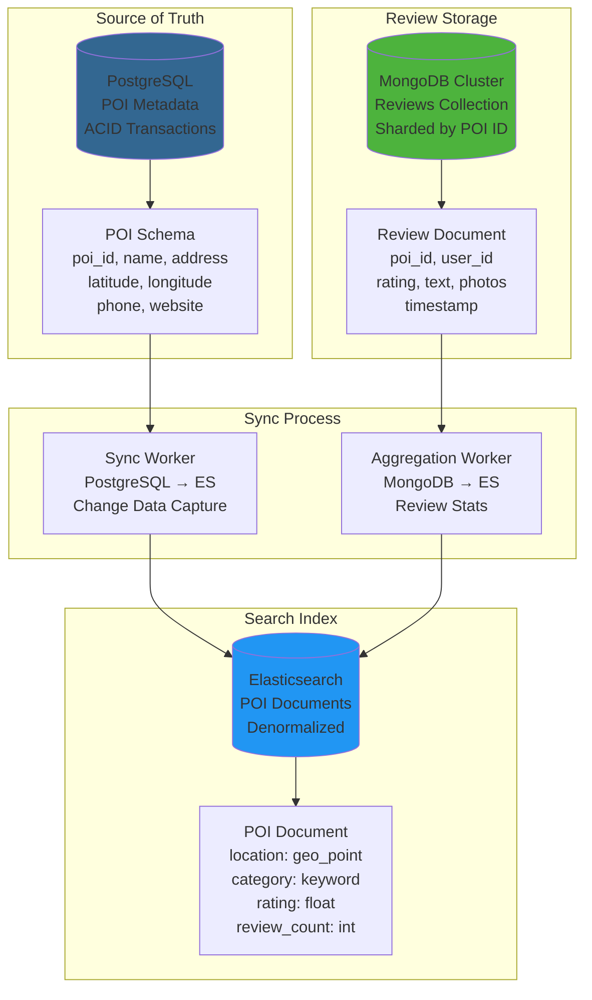
```mermaid
graph TB
    subgraph "Source of Truth"
        PostgresDB[(PostgreSQL<br/>POI Metadata<br/>ACID Transactions)]
        POISchema[POI Schema<br/>poi_id, name, address<br/>latitude, longitude<br/>phone, website]
    end

    subgraph "Search Index"
        ESIndex[(Elasticsearch<br/>POI Documents<br/>Denormalized)]
        ESDoc[POI Document<br/>location: geo_point<br/>category: keyword<br/>rating: float<br/>review_count: int]
    end

    subgraph "Review Storage"
        MongoCluster[(MongoDB Cluster<br/>Reviews Collection<br/>Sharded by POI ID)]
        ReviewDoc[Review Document<br/>poi_id, user_id<br/>rating, text, photos<br/>timestamp]
    end

subgraph "Sync Process"
SyncWorker[Sync Worker<br/>PostgreSQL → ES<br/>Change Data Capture]
AggWorker[Aggregation Worker<br/>MongoDB → ES<br/>Review Stats]
end

PostgresDB --> POISchema
POISchema --> SyncWorker
SyncWorker --> ESIndex
ESIndex --> ESDoc
MongoCluster --> ReviewDoc
ReviewDoc --> AggWorker
AggWorker --> ESIndex

style PostgresDB fill: #336791
style ESIndex fill: #2196f3
style MongoCluster fill: #4db33d
```

---

## 5. Geohash Query Processing

**Flow Explanation:**

This diagram illustrates the step-by-step process of converting a user's search query into a Geohash-based Elasticsearch
query, including precision calculation and adjacent cell expansion.

**Steps:**

1. **User Query**: Input lat/lng, radius (e.g., 5km)
2. **Precision Calculation**: Determine optimal Geohash precision based on radius
3. **Geohash Encoding**: Convert center point to Geohash string
4. **Adjacent Cells**: Calculate 8 neighboring cells (3×3 grid)
5. **Query Construction**: Build Elasticsearch query with geohash prefix filters
6. **Distance Filter**: Apply exact distance calculation to refine results
7. **Result Ranking**: Sort by distance, rating, relevance

**Benefits:**

- **Optimized Precision**: Larger radius uses lower precision (fewer cells to query)
- **Boundary Coverage**: Adjacent cells ensure no POIs are missed
- **Fast Execution**: Prefix matching is faster than full table scans

**Trade-offs:**

- **Over-Querying**: Adjacent cells may include POIs outside radius (filtered later)
- **Fixed Grid**: Doesn't adapt to POI density variations

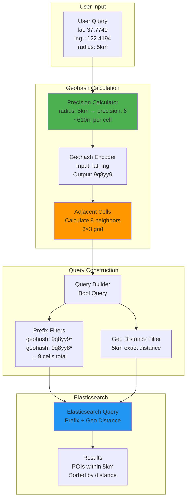
```mermaid
graph TB
    subgraph "User Input"
        UserQuery[User Query<br/>lat: 37.7749<br/>lng: -122.4194<br/>radius: 5km]
    end

subgraph "Geohash Calculation"
PrecisionCalc[Precision Calculator<br/>radius: 5km → precision: 6<br/>~610m per cell]
GeohashEncode[Geohash Encoder<br/>Input: lat, lng<br/>Output: 9q8yy9]
AdjacentCells[Adjacent Cells<br/>Calculate 8 neighbors<br/>3×3 grid]
end

subgraph "Query Construction"
QueryBuilder2[Query Builder<br/>Bool Query]
PrefixFilters[Prefix Filters<br/>geohash: 9q8yy9*<br/>geohash: 9q8yy8*<br/>... 9 cells total]
GeoDistance[Geo Distance Filter<br/>5km exact distance]
end

subgraph "Elasticsearch"
ESQuery[Elasticsearch Query<br/>Prefix + Geo Distance]
Results2[Results<br/>POIs within 5km<br/>Sorted by distance]
end

UserQuery --> PrecisionCalc
PrecisionCalc --> GeohashEncode
GeohashEncode --> AdjacentCells
AdjacentCells --> QueryBuilder2
QueryBuilder2 --> PrefixFilters
QueryBuilder2 --> GeoDistance
PrefixFilters --> ESQuery
GeoDistance --> ESQuery
ESQuery --> Results2

style PrecisionCalc fill: #4caf50
style AdjacentCells fill: #ff9800
style ESQuery fill: #2196f3
```

---

## 6. Adjacent Cell Boundary Handling

**Flow Explanation:**

This diagram demonstrates the critical boundary handling mechanism that ensures POIs near Geohash cell edges are not
missed during proximity searches.

**Problem:**

A POI at the edge of a Geohash cell may be within the search radius but in a different cell. Querying only the center
cell would miss it.

**Solution:**

Query center cell + 8 adjacent cells (3×3 grid), then filter by exact distance.

**Steps:**

1. **Center Cell**: Calculate Geohash for search center point
2. **Neighbor Calculation**: Compute 8 adjacent cells (N, NE, E, SE, S, SW, W, NW)
3. **Multi-Cell Query**: Query all 9 cells in Elasticsearch
4. **Distance Filter**: Apply exact distance calculation to filter false positives
5. **Result Set**: Return only POIs truly within radius

**Benefits:**

- **No Missed POIs**: Comprehensive coverage of search area
- **Accuracy**: Exact distance filter removes false positives

**Trade-offs:**

- **Query Overhead**: 9x more cells queried (acceptable for accuracy)
- **Filter Cost**: Distance calculation for all candidates (optimized with indexed queries)

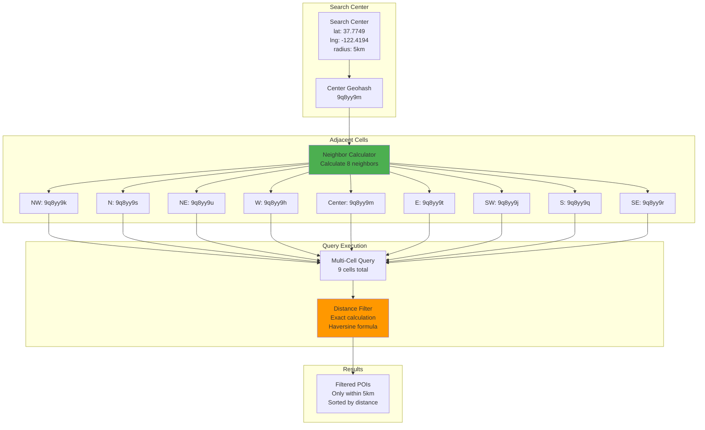
```mermaid
graph TB
    subgraph "Search Center"
        CenterPoint[Search Center<br/>lat: 37.7749<br/>lng: -122.4194<br/>radius: 5km]
        CenterGeohash[Center Geohash<br/>9q8yy9m]
    end

    subgraph "Adjacent Cells"
        NeighborCalc[Neighbor Calculator<br/>Calculate 8 neighbors]
        CellNW[NW: 9q8yy9k]
        CellN[N: 9q8yy9s]
        CellNE[NE: 9q8yy9u]
        CellW[W: 9q8yy9h]
        CellCenter[Center: 9q8yy9m]
        CellE[E: 9q8yy9t]
        CellSW[SW: 9q8yy9j]
        CellS[S: 9q8yy9q]
        CellSE[SE: 9q8yy9r]
    end

    subgraph "Query Execution"
        MultiCellQuery[Multi-Cell Query<br/>9 cells total]
        DistanceFilter[Distance Filter<br/>Exact calculation<br/>Haversine formula]
    end

    subgraph "Results"
        FilteredPOIs[Filtered POIs<br/>Only within 5km<br/>Sorted by distance]
    end

    CenterPoint --> CenterGeohash
    CenterGeohash --> NeighborCalc
    NeighborCalc --> CellNW
    NeighborCalc --> CellN
    NeighborCalc --> CellNE
    NeighborCalc --> CellW
    NeighborCalc --> CellCenter
    NeighborCalc --> CellE
    NeighborCalc --> CellSW
    NeighborCalc --> CellS
    NeighborCalc --> CellSE
    CellNW --> MultiCellQuery
    CellN --> MultiCellQuery
    CellNE --> MultiCellQuery
    CellW --> MultiCellQuery
    CellCenter --> MultiCellQuery
    CellE --> MultiCellQuery
    CellSW --> MultiCellQuery
    CellS --> MultiCellQuery
    CellSE --> MultiCellQuery
    MultiCellQuery --> DistanceFilter
    DistanceFilter --> FilteredPOIs
    style NeighborCalc fill: #4caf50
    style DistanceFilter fill: #ff9800
```

---

## 7. Hierarchical Sharding Strategy

**Flow Explanation:**

This diagram shows how the system uses hierarchical sharding to handle hotspots in densely populated areas (NYC, Tokyo)
by sub-sharding high-traffic Geohash prefixes.

**Sharding Levels:**

1. **Level 1 (Geohash Prefix)**: Shard by first 3 characters (e.g., `9q8` → Shard 1)
2. **Level 2 (Category)**: Sub-shard high-traffic prefixes by category (e.g., `9q8:restaurant` → Shard 1a)
3. **Level 3 (Rating)**: Further sub-shard by rating bucket (e.g., `9q8:restaurant:4-5` → Shard 1a1)

**Benefits:**

- **Load Distribution**: Spreads high-traffic regions across multiple shards
- **Query Optimization**: Category/rating filters can target specific sub-shards
- **Scalability**: Handles 10x more POIs in dense areas

**Trade-offs:**

- **Query Complexity**: Multi-shard queries require coordination
- **Routing Logic**: More complex shard key calculation

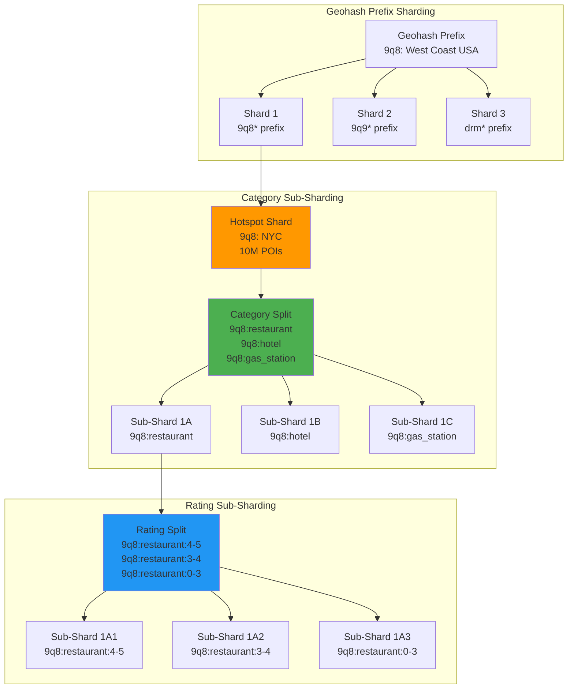
```mermaid
graph TB
    subgraph "Geohash Prefix Sharding"
        GeohashPrefix[Geohash Prefix<br/>9q8: West Coast USA]
        Shard1[Shard 1<br/>9q8* prefix]
        Shard2[Shard 2<br/>9q9* prefix]
        Shard3[Shard 3<br/>drm* prefix]
    end

    subgraph "Category Sub-Sharding"
        HotSpotShard[Hotspot Shard<br/>9q8: NYC<br/>10M POIs]
        CategorySplit[Category Split<br/>9q8:restaurant<br/>9q8:hotel<br/>9q8:gas_station]
        SubShard1A[Sub-Shard 1A<br/>9q8:restaurant]
        SubShard1B[Sub-Shard 1B<br/>9q8:hotel]
        SubShard1C[Sub-Shard 1C<br/>9q8:gas_station]
    end

    subgraph "Rating Sub-Sharding"
        RatingSplit[Rating Split<br/>9q8:restaurant:4-5<br/>9q8:restaurant:3-4<br/>9q8:restaurant:0-3]
        SubShard1A1[Sub-Shard 1A1<br/>9q8:restaurant:4-5]
        SubShard1A2[Sub-Shard 1A2<br/>9q8:restaurant:3-4]
        SubShard1A3[Sub-Shard 1A3<br/>9q8:restaurant:0-3]
    end

    GeohashPrefix --> Shard1
    GeohashPrefix --> Shard2
    GeohashPrefix --> Shard3
    Shard1 --> HotSpotShard
    HotSpotShard --> CategorySplit
    CategorySplit --> SubShard1A
    CategorySplit --> SubShard1B
    CategorySplit --> SubShard1C
    SubShard1A --> RatingSplit
    RatingSplit --> SubShard1A1
    RatingSplit --> SubShard1A2
    RatingSplit --> SubShard1A3
    style HotSpotShard fill: #ff9800
    style CategorySplit fill: #4caf50
    style RatingSplit fill: #2196f3
```

---

## 8. Hotspot Mitigation

**Flow Explanation:**

This diagram illustrates the strategy for handling hotspots in densely populated areas by implementing adaptive sharding
and query routing.

**Problem:**

NYC and Tokyo have 10x more POIs and queries than rural areas, overloading specific Geohash shards.

**Solutions:**

1. **Adaptive Sharding**: Detect high-traffic prefixes, split into sub-shards
2. **Query Routing**: Route queries to appropriate sub-shard based on filters
3. **Cache Aggression**: Aggressively cache popular queries in hotspot regions
4. **Read Replicas**: Deploy additional read replicas for high-traffic shards

**Benefits:**

- **Load Balancing**: Distributes traffic across multiple shards
- **Query Performance**: Smaller shards = faster queries
- **Scalability**: Handles 100x traffic spikes in dense areas

**Trade-offs:**

- **Complexity**: Requires dynamic shard management
- **Cache Invalidation**: More complex cache invalidation across sub-shards

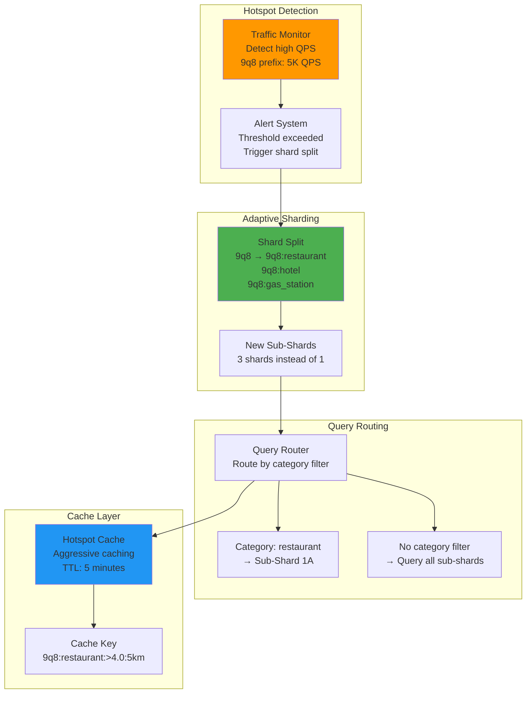
```mermaid
graph TB
    subgraph "Hotspot Detection"
        TrafficMonitor[Traffic Monitor<br/>Detect high QPS<br/>9q8 prefix: 5K QPS]
        AlertSystem[Alert System<br/>Threshold exceeded<br/>Trigger shard split]
    end

subgraph "Adaptive Sharding"
ShardSplit[Shard Split<br/>9q8 → 9q8:restaurant<br/>9q8:hotel<br/>9q8:gas_station]
NewShards[New Sub-Shards<br/>3 shards instead of 1]
end

subgraph "Query Routing"
QueryRouter[Query Router<br/>Route by category filter]
CategoryRoute[Category: restaurant<br/>→ Sub-Shard 1A]
NoCategoryRoute[No category filter<br/>→ Query all sub-shards]
end

subgraph "Cache Layer"
HotspotCache[Hotspot Cache<br/>Aggressive caching<br/>TTL: 5 minutes]
CacheKey[Cache Key<br/>9q8:restaurant:>4.0:5km]
end

TrafficMonitor --> AlertSystem
AlertSystem --> ShardSplit
ShardSplit --> NewShards
NewShards --> QueryRouter
QueryRouter --> CategoryRoute
QueryRouter --> NoCategoryRoute
QueryRouter --> HotspotCache
HotspotCache --> CacheKey

style TrafficMonitor fill: #ff9800
style ShardSplit fill: #4caf50
style HotspotCache fill: #2196f3
```

---

## 9. Caching Architecture

**Flow Explanation:**

This diagram shows the multi-tier caching strategy to achieve 80% cache hit rate for popular queries, reducing
Elasticsearch load and improving latency.

**Cache Tiers:**

1. **L1 Cache (Application)**: In-memory cache for recent queries (TTL: 1 minute)
2. **L2 Cache (Redis)**: Popular queries and ranked results (TTL: 5 minutes)
3. **L3 Cache (CDN)**: Static POI data and map tiles (TTL: 24 hours)

**Cache Keys:**

- **Query Cache**: `search:{lat}:{lng}:{radius}:{filters}`
- **POI Cache**: `poi:{poi_id}`
- **Ranked Results**: `ranked:{geohash}:{category}:{rating}`

**Benefits:**

- **Low Latency**: Cache hits return in <10ms (vs 50-100ms for Elasticsearch)
- **Reduced Load**: 80% cache hit rate = 80% fewer Elasticsearch queries
- **Cost Savings**: Lower infrastructure costs

**Trade-offs:**

- **Staleness**: Cached results may be 1-5 minutes old
- **Memory Cost**: Redis cluster requires significant RAM

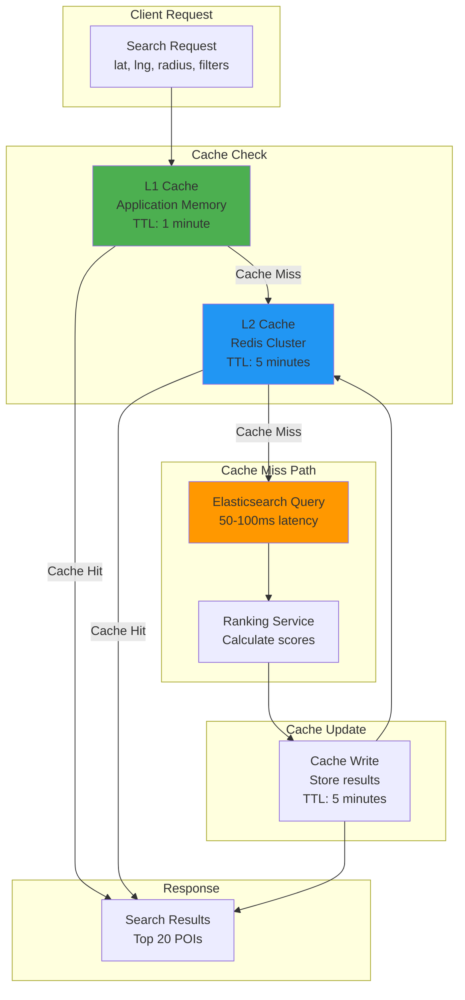
```mermaid
graph TB
    subgraph "Client Request"
        SearchRequest[Search Request<br/>lat, lng, radius, filters]
    end

    subgraph "Cache Check"
        L1Cache[L1 Cache<br/>Application Memory<br/>TTL: 1 minute]
        L2Cache[L2 Cache<br/>Redis Cluster<br/>TTL: 5 minutes]
    end

    subgraph "Cache Miss Path"
        ElasticsearchQuery[Elasticsearch Query<br/>50-100ms latency]
        RankingService[Ranking Service<br/>Calculate scores]
    end

    subgraph "Cache Update"
        CacheWrite[Cache Write<br/>Store results<br/>TTL: 5 minutes]
    end

    subgraph "Response"
        SearchResults[Search Results<br/>Top 20 POIs]
    end

    SearchRequest --> L1Cache
    L1Cache -->|Cache Hit| SearchResults
    L1Cache -->|Cache Miss| L2Cache
    L2Cache -->|Cache Hit| SearchResults
    L2Cache -->|Cache Miss| ElasticsearchQuery
    ElasticsearchQuery --> RankingService
    RankingService --> CacheWrite
    CacheWrite --> L2Cache
    CacheWrite --> SearchResults
    style L1Cache fill: #4caf50
    style L2Cache fill: #2196f3
    style ElasticsearchQuery fill: #ff9800
```

---

## 10. Review Storage and Denormalization

**Flow Explanation:**

This diagram shows how review data is stored in MongoDB (source of truth) and denormalized into Elasticsearch POI
documents to eliminate joins and improve query performance.

**Data Flow:**

1. **Review Write**: User submits review → MongoDB (sharded by POI ID)
2. **Aggregation**: Background worker calculates review_count and avg_rating
3. **Elasticsearch Update**: Denormalized stats updated in POI document
4. **Query Path**: Search queries use denormalized data (no MongoDB join needed)

**Benefits:**

- **No Joins**: Search queries don't need to join MongoDB
- **Fast Queries**: Single Elasticsearch query returns all data
- **Scalability**: MongoDB handles high write volume independently

**Trade-offs:**

- **Eventual Consistency**: Review stats lag by 1-5 seconds
- **Storage Overhead**: Data duplicated in MongoDB and Elasticsearch

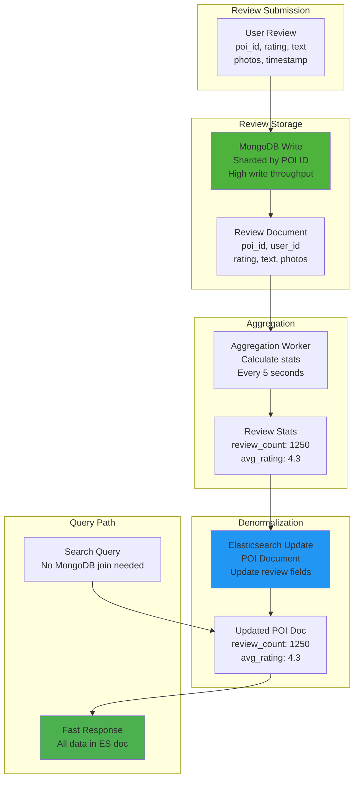
```mermaid
graph TB
    subgraph "Review Submission"
        UserReview[User Review<br/>poi_id, rating, text<br/>photos, timestamp]
    end

    subgraph "Review Storage"
        MongoWrite[MongoDB Write<br/>Sharded by POI ID<br/>High write throughput]
        ReviewDoc2[Review Document<br/>poi_id, user_id<br/>rating, text, photos]
    end

    subgraph "Aggregation"
        AggWorker2[Aggregation Worker<br/>Calculate stats<br/>Every 5 seconds]
        ReviewStats[Review Stats<br/>review_count: 1250<br/>avg_rating: 4.3]
    end

    subgraph "Denormalization"
        ESUpdate[Elasticsearch Update<br/>POI Document<br/>Update review fields]
        ESDoc2[Updated POI Doc<br/>review_count: 1250<br/>avg_rating: 4.3]
    end

    subgraph "Query Path"
        SearchQuery2[Search Query<br/>No MongoDB join needed]
        FastResponse[Fast Response<br/>All data in ES doc]
    end

    UserReview --> MongoWrite
    MongoWrite --> ReviewDoc2
    ReviewDoc2 --> AggWorker2
    AggWorker2 --> ReviewStats
    ReviewStats --> ESUpdate
    ESUpdate --> ESDoc2
    SearchQuery2 --> ESDoc2
    ESDoc2 --> FastResponse
    style MongoWrite fill: #4db33d
    style ESUpdate fill: #2196f3
    style FastResponse fill: #4caf50
```

---

## 11. Multi-Region Deployment

**Flow Explanation:**

This diagram shows the multi-region deployment strategy with geo-aware routing, regional data centers, and cross-region
replication for global availability.

**Regions:**

1. **US West**: San Francisco datacenter (covers West Coast)
2. **US East**: New York datacenter (covers East Coast)
3. **Europe**: London datacenter (covers Europe)
4. **Asia**: Tokyo datacenter (covers Asia-Pacific)

**Components:**

1. **Geo-Aware Routing**: Route requests to nearest datacenter
2. **Regional Elasticsearch**: Each region has its own cluster with local POIs
3. **Cross-Region Replication**: Sync popular POIs across regions
4. **Global CDN**: Serves static content from edge locations

**Benefits:**

- **Low Latency**: Regional queries return in <50ms
- **High Availability**: Regional failures don't affect other regions
- **Compliance**: Data residency requirements met

**Trade-offs:**

- **Data Consistency**: Cross-region replication lag (1-5 minutes)
- **Infrastructure Cost**: 4x datacenter costs

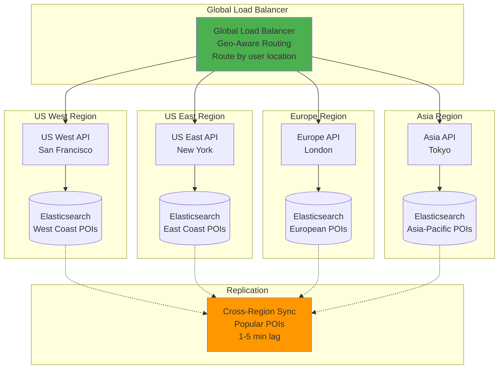
```mermaid
graph TB
    subgraph "Global Load Balancer"
        GLB[Global Load Balancer<br/>Geo-Aware Routing<br/>Route by user location]
    end

    subgraph "US West Region"
        USWestAPI[US West API<br/>San Francisco]
        USWestES[(Elasticsearch<br/>West Coast POIs)]
    end

    subgraph "US East Region"
        USEastAPI[US East API<br/>New York]
        USEastES[(Elasticsearch<br/>East Coast POIs)]
    end

    subgraph "Europe Region"
        EUAPI[Europe API<br/>London]
        EUES[(Elasticsearch<br/>European POIs)]
    end

    subgraph "Asia Region"
        AsiaAPI[Asia API<br/>Tokyo]
        AsiaES[(Elasticsearch<br/>Asia-Pacific POIs)]
    end

    subgraph "Replication"
        CrossRegionSync[Cross-Region Sync<br/>Popular POIs<br/>1-5 min lag]
    end

    GLB --> USWestAPI
    GLB --> USEastAPI
    GLB --> EUAPI
    GLB --> AsiaAPI
    USWestAPI --> USWestES
    USEastAPI --> USEastES
    EUAPI --> EUES
    AsiaAPI --> AsiaES
    USWestES -.-> CrossRegionSync
    USEastES -.-> CrossRegionSync
    EUES -.-> CrossRegionSync
    AsiaES -.-> CrossRegionSync
    style GLB fill: #4caf50
    style CrossRegionSync fill: #ff9800
```

---

## 12. Filtering and Ranking Pipeline

**Flow Explanation:**

This diagram shows the multi-stage filtering and ranking pipeline that processes search results through category
filters, rating filters, distance calculation, and relevance scoring.

**Pipeline Stages:**

1. **Geo Filter**: Initial proximity search (5km radius)
2. **Category Filter**: Filter by category (restaurant, hotel, etc.)
3. **Rating Filter**: Filter by minimum rating (>4.0)
4. **Hours Filter**: Filter by open status (open now)
5. **Distance Calculation**: Calculate exact distance for each POI
6. **Ranking**: Multi-factor ranking (distance, rating, popularity)
7. **Result Limiting**: Return top 20 POIs

**Benefits:**

- **Efficient Filtering**: Elasticsearch inverted index for fast filters
- **Accurate Ranking**: Multi-factor scoring balances distance and quality
- **Flexible Queries**: Supports complex combinations of filters

**Trade-offs:**

- **Query Complexity**: More filters = slower queries
- **Ranking Cost**: CPU-intensive scoring for large result sets

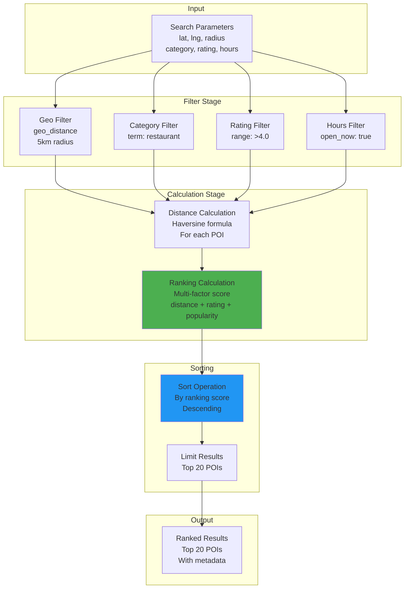
```mermaid
graph TB
    subgraph "Input"
        SearchParams[Search Parameters<br/>lat, lng, radius<br/>category, rating, hours]
    end

    subgraph "Filter Stage"
        GeoFilter2[Geo Filter<br/>geo_distance<br/>5km radius]
        CategoryFilter2[Category Filter<br/>term: restaurant]
        RatingFilter2[Rating Filter<br/>range: >4.0]
        HoursFilter[Hours Filter<br/>open_now: true]
    end

    subgraph "Calculation Stage"
        DistanceCalc2[Distance Calculation<br/>Haversine formula<br/>For each POI]
        RankingCalc[Ranking Calculation<br/>Multi-factor score<br/>distance + rating + popularity]
    end

    subgraph "Sorting"
        SortOp2[Sort Operation<br/>By ranking score<br/>Descending]
        LimitResults[Limit Results<br/>Top 20 POIs]
    end

    subgraph "Output"
        RankedResults[Ranked Results<br/>Top 20 POIs<br/>With metadata]
    end

    SearchParams --> GeoFilter2
    SearchParams --> CategoryFilter2
    SearchParams --> RatingFilter2
    SearchParams --> HoursFilter
    GeoFilter2 --> DistanceCalc2
    CategoryFilter2 --> DistanceCalc2
    RatingFilter2 --> DistanceCalc2
    HoursFilter --> DistanceCalc2
    DistanceCalc2 --> RankingCalc
    RankingCalc --> SortOp2
    SortOp2 --> LimitResults
    LimitResults --> RankedResults
    style RankingCalc fill: #4caf50
    style SortOp2 fill: #2196f3
```

---

## 13. Auto-complete Service

**Flow Explanation:**

This diagram shows the auto-complete service architecture that provides instant POI name suggestions as users type
search queries.

**Components:**

1. **Trie Index**: In-memory prefix tree for fast prefix matching
2. **Elasticsearch Suggester**: Alternative implementation using completion suggester
3. **Popular Queries Cache**: Cache frequent queries for instant results
4. **Ranking**: Sort suggestions by popularity, distance, relevance

**Benefits:**

- **Instant Suggestions**: <10ms response time
- **User Experience**: Reduces typing, improves discoverability
- **Search Optimization**: Guides users to valid POI names

**Trade-offs:**

- **Memory Usage**: Trie index requires significant RAM
- **Update Latency**: New POIs take 1-5 minutes to appear in suggestions

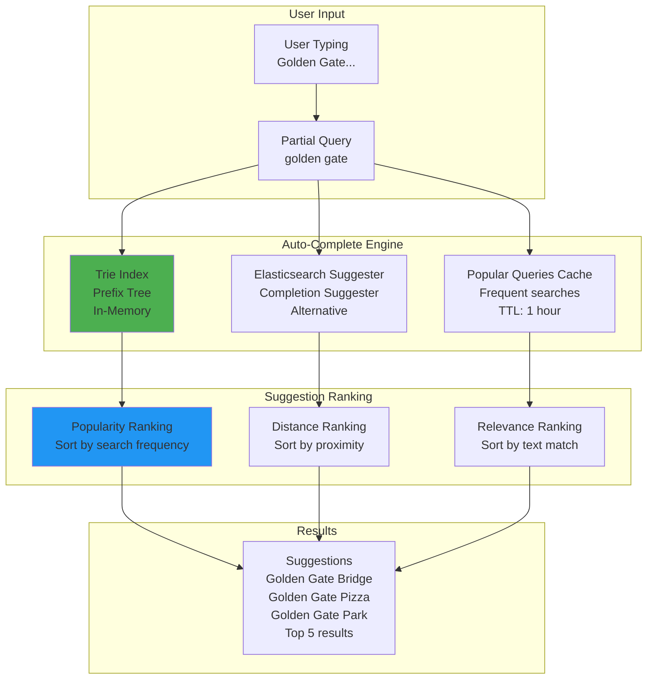
```mermaid
graph TB
    subgraph "User Input"
        UserTyping[User Typing<br/>Golden Gate...]
        PartialQuery[Partial Query<br/>golden gate]
    end

    subgraph "Auto-Complete Engine"
        TrieIndex[Trie Index<br/>Prefix Tree<br/>In-Memory]
        ESSuggester[Elasticsearch Suggester<br/>Completion Suggester<br/>Alternative]
        PopularCache[Popular Queries Cache<br/>Frequent searches<br/>TTL: 1 hour]
    end

    subgraph "Suggestion Ranking"
        PopularityRank[Popularity Ranking<br/>Sort by search frequency]
        DistanceRank[Distance Ranking<br/>Sort by proximity]
        RelevanceRank[Relevance Ranking<br/>Sort by text match]
    end

    subgraph "Results"
        Suggestions[Suggestions<br/>Golden Gate Bridge<br/>Golden Gate Pizza<br/>Golden Gate Park<br/>Top 5 results]
    end

    UserTyping --> PartialQuery
    PartialQuery --> TrieIndex
    PartialQuery --> ESSuggester
    PartialQuery --> PopularCache
    TrieIndex --> PopularityRank
    ESSuggester --> DistanceRank
    PopularCache --> RelevanceRank
    PopularityRank --> Suggestions
    DistanceRank --> Suggestions
    RelevanceRank --> Suggestions
    style TrieIndex fill: #4caf50
    style PopularityRank fill: #2196f3
```

---

## 14. Map Tile Serving

**Flow Explanation:**

This diagram shows how map tiles and POI markers are served through a CDN for fast global delivery with minimal latency.

**Components:**

1. **Tile Generator**: Generates map tiles at different zoom levels
2. **POI Marker Service**: Generates POI markers with clustering
3. **CDN**: Serves tiles and markers from edge locations
4. **Cache Strategy**: Aggressive caching (24-hour TTL) for static tiles

**Benefits:**

- **Low Latency**: CDN serves tiles in <50ms globally
- **Bandwidth Savings**: CDN reduces origin server load
- **Scalability**: Handles millions of tile requests

**Trade-offs:**

- **Cache Invalidation**: Tile updates require cache purge
- **Storage Cost**: CDN storage costs for billions of tiles

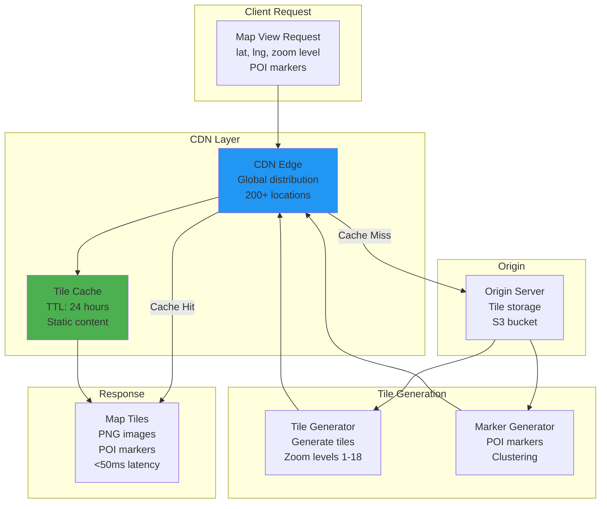
```mermaid
graph TB
    subgraph "Client Request"
        MapView[Map View Request<br/>lat, lng, zoom level<br/>POI markers]
    end

    subgraph "Tile Generation"
        TileGen[Tile Generator<br/>Generate tiles<br/>Zoom levels 1-18]
        MarkerGen[Marker Generator<br/>POI markers<br/>Clustering]
    end

    subgraph "CDN Layer"
        CDNEdge[CDN Edge<br/>Global distribution<br/>200+ locations]
        TileCache[Tile Cache<br/>TTL: 24 hours<br/>Static content]
    end

    subgraph "Origin"
        OriginServer[Origin Server<br/>Tile storage<br/>S3 bucket]
    end

    subgraph "Response"
        MapTiles[Map Tiles<br/>PNG images<br/>POI markers<br/><50ms latency]
    end

    MapView --> CDNEdge
    CDNEdge -->|Cache Hit| MapTiles
    CDNEdge -->|Cache Miss| OriginServer
    OriginServer --> TileGen
    OriginServer --> MarkerGen
    TileGen --> CDNEdge
    MarkerGen --> CDNEdge
    CDNEdge --> TileCache
    TileCache --> MapTiles
    style CDNEdge fill: #2196f3
    style TileCache fill: #4caf50
```

---

## 15. Monitoring and Observability

**Flow Explanation:**

This diagram shows the comprehensive monitoring and observability stack for tracking system health, query performance,
and business metrics.

**Monitoring Components:**

1. **Metrics Collection**: Prometheus collects metrics from all services
2. **Log Aggregation**: ELK stack (Elasticsearch, Logstash, Kibana) for log analysis
3. **Distributed Tracing**: Jaeger for request tracing across services
4. **Alerting**: PagerDuty for critical alerts
5. **Dashboards**: Grafana for visualization

**Key Metrics:**

- **Query Latency**: p50, p95, p99 latencies
- **Cache Hit Rate**: Percentage of cache hits
- **Error Rate**: 4xx and 5xx error rates
- **Throughput**: Queries per second
- **Elasticsearch Health**: Cluster status, shard health

**Benefits:**

- **Proactive Monitoring**: Detect issues before users are affected
- **Performance Optimization**: Identify slow queries and bottlenecks
- **Capacity Planning**: Track growth trends

**Trade-offs:**

- **Storage Cost**: Metrics and logs require significant storage
- **Alert Fatigue**: Too many alerts reduce effectiveness

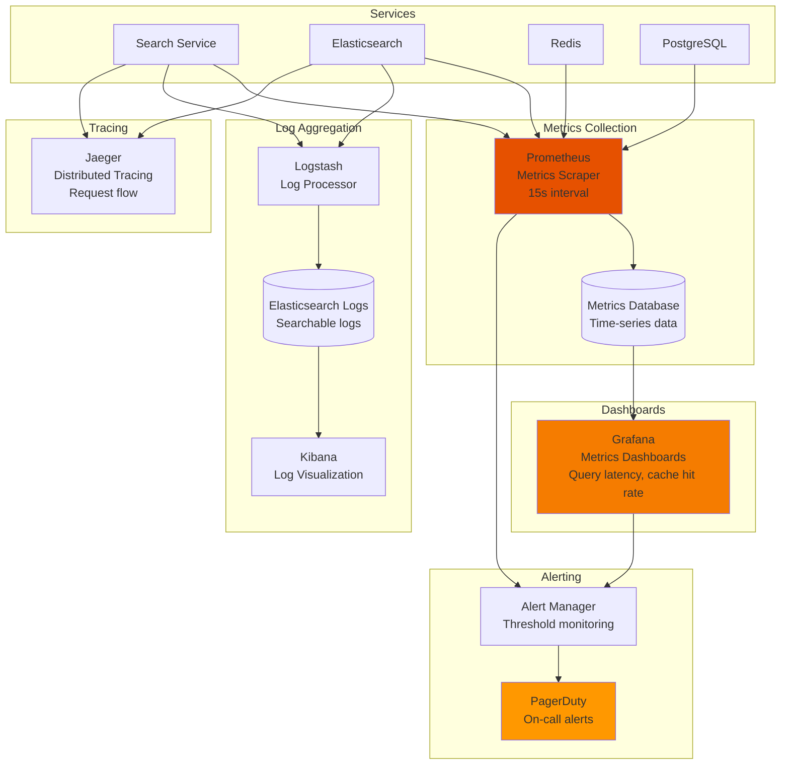
```mermaid
graph TB
    subgraph "Services"
        SearchService[Search Service]
        ElasticsearchService[Elasticsearch]
        RedisService[Redis]
        PostgresService[PostgreSQL]
    end

    subgraph "Metrics Collection"
        Prometheus[Prometheus<br/>Metrics Scraper<br/>15s interval]
        MetricsDB[(Metrics Database<br/>Time-series data)]
    end

    subgraph "Log Aggregation"
        Logstash[Logstash<br/>Log Processor]
        ElasticsearchLogs[(Elasticsearch Logs<br/>Searchable logs)]
        Kibana[Kibana<br/>Log Visualization]
    end

    subgraph "Tracing"
        Jaeger[Jaeger<br/>Distributed Tracing<br/>Request flow]
    end

    subgraph "Alerting"
        AlertManager[Alert Manager<br/>Threshold monitoring]
        PagerDuty[PagerDuty<br/>On-call alerts]
    end

    subgraph "Dashboards"
        Grafana[Grafana<br/>Metrics Dashboards<br/>Query latency, cache hit rate]
    end

    SearchService --> Prometheus
    ElasticsearchService --> Prometheus
    RedisService --> Prometheus
    PostgresService --> Prometheus
    Prometheus --> MetricsDB
    MetricsDB --> Grafana
    SearchService --> Logstash
    ElasticsearchService --> Logstash
    Logstash --> ElasticsearchLogs
    ElasticsearchLogs --> Kibana
    SearchService --> Jaeger
    ElasticsearchService --> Jaeger
    Prometheus --> AlertManager
    AlertManager --> PagerDuty
    Grafana --> AlertManager
    style Prometheus fill: #e65100
    style Grafana fill: #f57c00
    style PagerDuty fill: #ff9800
```