# Yelp/Google Maps - Sequence Diagrams

## Table of Contents

1. [POI Proximity Search Flow](#1-poi-proximity-search-flow)
2. [POI Details Lookup Flow](#2-poi-details-lookup-flow)
3. [Geohash Query with Adjacent Cells](#3-geohash-query-with-adjacent-cells)
4. [Filtered Search with Multiple Criteria](#4-filtered-search-with-multiple-criteria)
5. [Review Submission Flow](#5-review-submission-flow)
6. [Review Aggregation and Denormalization](#6-review-aggregation-and-denormalization)
7. [Cache Hit and Miss Flow](#7-cache-hit-and-miss-flow)
8. [POI Update Flow](#8-poi-update-flow)
9. [Hotspot Shard Split Flow](#9-hotspot-shard-split-flow)
10. [Auto-complete Suggestion Flow](#10-auto-complete-suggestion-flow)
11. [Multi-Region Query Routing](#11-multi-region-query-routing)
12. [Boundary Query Handling](#12-boundary-query-handling)
13. [Ranking and Sorting Flow](#13-ranking-and-sorting-flow)
14. [Map Tile Request Flow](#14-map-tile-request-flow)

---

## 1. POI Proximity Search Flow

**Flow:**

Shows the complete flow of a user searching for nearby POIs, from client request through geo-indexing, Elasticsearch
query, ranking, and response delivery.

**Steps:**

1. **Client Request** (0ms): User searches for "restaurants near me" with location
2. **API Gateway** (5ms): Authentication, rate limiting, geo-aware routing
3. **Search Service** (0ms): Receives request, starts query orchestration
4. **Geo-Indexer** (2ms): Converts lat/lng to Geohash, calculates adjacent cells
5. **Cache Check** (1ms): Check Redis for cached results (cache miss)
6. **Elasticsearch Query** (50ms): Query POIs in target Geohash cells with filters
7. **Distance Calculation** (10ms): Calculate exact distance for each POI
8. **Ranking** (5ms): Multi-factor ranking (distance, rating, popularity)
9. **Result Limiting** (1ms): Return top 20 POIs
10. **Cache Write** (2ms): Store results in Redis for future queries
11. **Response** (~75ms total): Return ranked POIs to client

**Performance:**

- **Total latency:** 75ms (p95)
- **Breakdown:** Geo-indexing (2ms) + Elasticsearch (50ms) + Ranking (10ms) + Cache (3ms)

**Benefits:**

- Fast response time meets <100ms requirement
- Caching reduces Elasticsearch load for popular queries
- Multi-factor ranking improves result quality

**Trade-offs:**

- Elasticsearch query is the bottleneck (50ms)
- Cache misses require full query execution

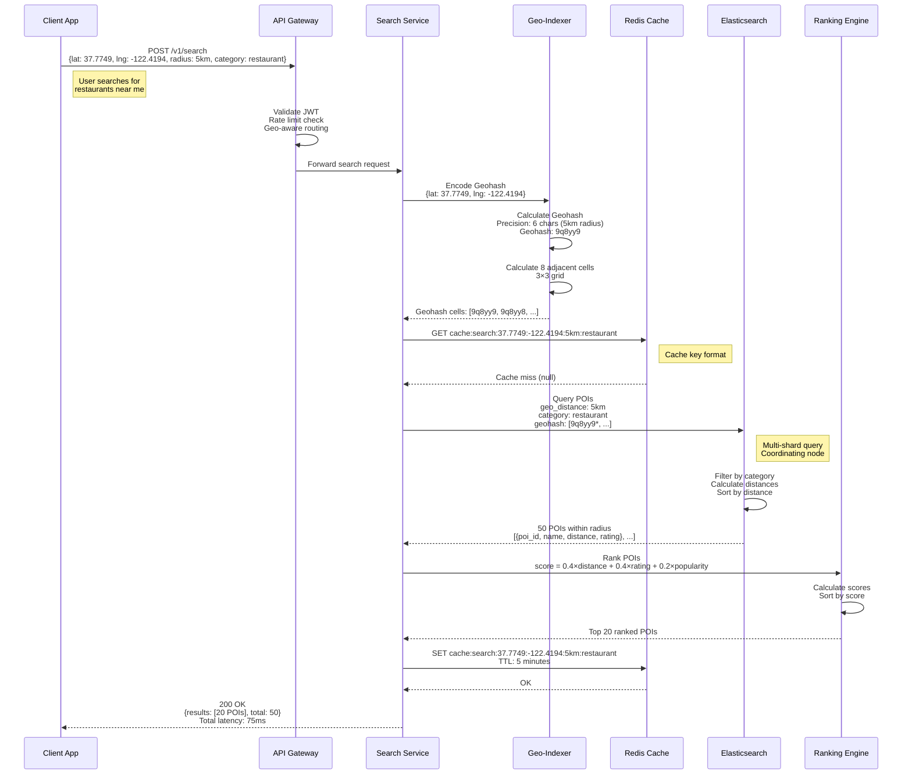
```mermaid
sequenceDiagram
    participant Client as Client App
    participant Gateway as API Gateway
    participant SearchSvc as Search Service
    participant GeoIndexer as Geo-Indexer
    participant RedisCache as Redis Cache
    participant Elasticsearch as Elasticsearch
    participant RankEngine as Ranking Engine
    Client ->> Gateway: POST /v1/search<br/>{lat: 37.7749, lng: -122.4194, radius: 5km, category: restaurant}
    Note right of Client: User searches for<br/>restaurants near me
    Gateway ->> Gateway: Validate JWT<br/>Rate limit check<br/>Geo-aware routing
    Gateway ->> SearchSvc: Forward search request
    SearchSvc ->> GeoIndexer: Encode Geohash<br/>{lat: 37.7749, lng: -122.4194}
    GeoIndexer ->> GeoIndexer: Calculate Geohash<br/>Precision: 6 chars (5km radius)<br/>Geohash: 9q8yy9
    GeoIndexer ->> GeoIndexer: Calculate 8 adjacent cells<br/>3×3 grid
    GeoIndexer -->> SearchSvc: Geohash cells: [9q8yy9, 9q8yy8, ...]
    SearchSvc ->> RedisCache: GET cache:search:37.7749:-122.4194:5km:restaurant
    Note right of RedisCache: Cache key format
    RedisCache -->> SearchSvc: Cache miss (null)
    SearchSvc ->> Elasticsearch: Query POIs<br/>geo_distance: 5km<br/>category: restaurant<br/>geohash: [9q8yy9*, ...]
    Note right of Elasticsearch: Multi-shard query<br/>Coordinating node
    Elasticsearch ->> Elasticsearch: Filter by category<br/>Calculate distances<br/>Sort by distance
    Elasticsearch -->> SearchSvc: 50 POIs within radius<br/>[{poi_id, name, distance, rating}, ...]
    SearchSvc ->> RankEngine: Rank POIs<br/>score = 0.4×distance + 0.4×rating + 0.2×popularity
    RankEngine ->> RankEngine: Calculate scores<br/>Sort by score
    RankEngine -->> SearchSvc: Top 20 ranked POIs
    SearchSvc ->> RedisCache: SET cache:search:37.7749:-122.4194:5km:restaurant<br/>TTL: 5 minutes
    RedisCache -->> SearchSvc: OK
    SearchSvc -->> Client: 200 OK<br/>{results: [20 POIs], total: 50}<br/>Total latency: 75ms
```

---

## 2. POI Details Lookup Flow

**Flow:**

Shows the flow of retrieving detailed information for a specific POI, including metadata from PostgreSQL and reviews
from MongoDB.

**Steps:**

1. **Client Request** (0ms): User clicks on a POI to view details
2. **API Gateway** (5ms): Authentication, rate limiting
3. **Search Service** (0ms): Receives POI ID
4. **Cache Check** (1ms): Check Redis for cached POI details
5. **PostgreSQL Query** (10ms): Fetch POI metadata (name, address, hours, phone)
6. **MongoDB Query** (20ms): Fetch recent reviews (limit 10)
7. **Data Aggregation** (5ms): Combine metadata and reviews
8. **Cache Write** (2ms): Store in Redis for future requests
9. **Response** (~45ms total): Return complete POI details

**Performance:**

- **Total latency:** 45ms (p95)
- **Breakdown:** PostgreSQL (10ms) + MongoDB (20ms) + Aggregation (5ms)

**Benefits:**

- Fast lookup for POI details
- Caching reduces database load
- Separate queries allow independent scaling

**Trade-offs:**

- Multiple database queries increase latency
- Cache invalidation required on POI updates

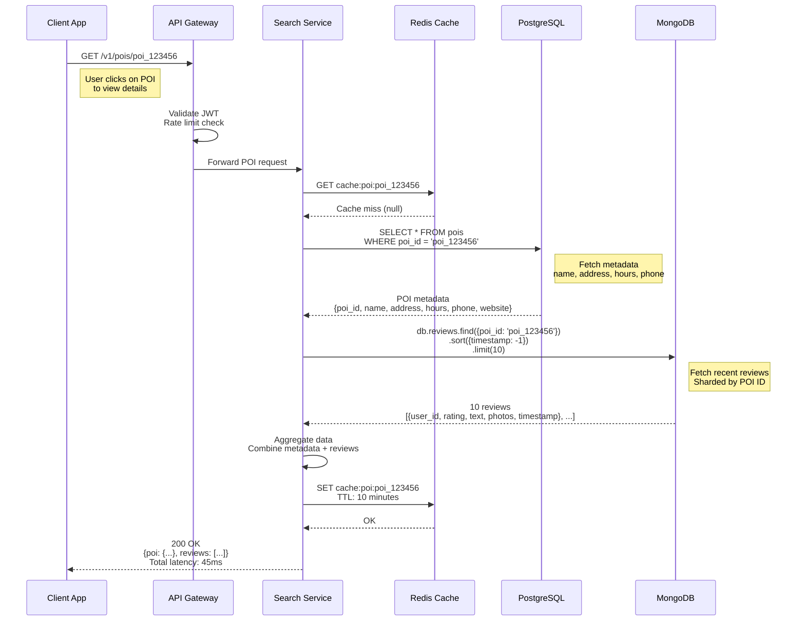
```mermaid
sequenceDiagram
    participant Client as Client App
    participant Gateway as API Gateway
    participant SearchSvc as Search Service
    participant RedisCache as Redis Cache
    participant PostgresDB as PostgreSQL
    participant MongoDB as MongoDB
    Client ->> Gateway: GET /v1/pois/poi_123456
    Note right of Client: User clicks on POI<br/>to view details
    Gateway ->> Gateway: Validate JWT<br/>Rate limit check
    Gateway ->> SearchSvc: Forward POI request
    SearchSvc ->> RedisCache: GET cache:poi:poi_123456
    RedisCache -->> SearchSvc: Cache miss (null)
    SearchSvc ->> PostgresDB: SELECT * FROM pois<br/>WHERE poi_id = 'poi_123456'
    Note right of PostgresDB: Fetch metadata<br/>name, address, hours, phone
    PostgresDB -->> SearchSvc: POI metadata<br/>{poi_id, name, address, hours, phone, website}
    SearchSvc ->> MongoDB: db.reviews.find({poi_id: 'poi_123456'})<br/>.sort({timestamp: -1})<br/>.limit(10)
    Note right of MongoDB: Fetch recent reviews<br/>Sharded by POI ID
    MongoDB -->> SearchSvc: 10 reviews<br/>[{user_id, rating, text, photos, timestamp}, ...]
    SearchSvc ->> SearchSvc: Aggregate data<br/>Combine metadata + reviews
    SearchSvc ->> RedisCache: SET cache:poi:poi_123456<br/>TTL: 10 minutes
    RedisCache -->> SearchSvc: OK
    SearchSvc -->> Client: 200 OK<br/>{poi: {...}, reviews: [...]}<br/>Total latency: 45ms
```

---

## 3. Geohash Query with Adjacent Cells

**Flow:**

Shows the detailed flow of querying multiple Geohash cells (center + 8 adjacent) to handle boundary cases and ensure no
POIs are missed.

**Steps:**

1. **Search Request** (0ms): User searches with lat/lng and radius
2. **Geohash Calculation** (2ms): Convert center point to Geohash
3. **Precision Selection** (1ms): Determine optimal precision based on radius
4. **Adjacent Cell Calculation** (3ms): Calculate 8 neighboring cells (N, NE, E, SE, S, SW, W, NW)
5. **Multi-Cell Query** (50ms): Query all 9 cells in Elasticsearch
6. **Distance Filtering** (10ms): Filter results by exact distance (remove false positives)
7. **Result Aggregation** (5ms): Combine results from all cells, remove duplicates
8. **Response** (~70ms total): Return filtered and ranked POIs

**Performance:**

- **Total latency:** 70ms (p95)
- **Query overhead:** 9 cells queried (vs 1), but ensures accuracy

**Benefits:**

- No POIs missed at boundaries
- Accurate distance filtering
- Handles edge cases correctly

**Trade-offs:**

- More cells queried increases query time
- Distance calculation for all candidates

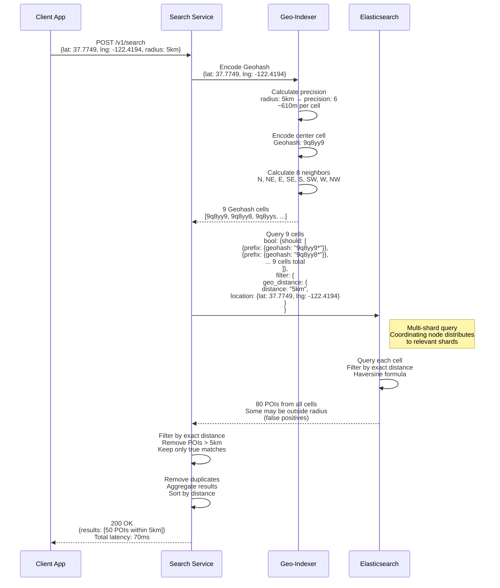
```mermaid
sequenceDiagram
    participant Client as Client App
    participant SearchSvc as Search Service
    participant GeoIndexer as Geo-Indexer
    participant Elasticsearch as Elasticsearch
    Client ->> SearchSvc: POST /v1/search<br/>{lat: 37.7749, lng: -122.4194, radius: 5km}
    SearchSvc ->> GeoIndexer: Encode Geohash<br/>{lat: 37.7749, lng: -122.4194}
    GeoIndexer ->> GeoIndexer: Calculate precision<br/>radius: 5km → precision: 6<br/>~610m per cell
    GeoIndexer ->> GeoIndexer: Encode center cell<br/>Geohash: 9q8yy9
    GeoIndexer ->> GeoIndexer: Calculate 8 neighbors<br/>N, NE, E, SE, S, SW, W, NW
    GeoIndexer -->> SearchSvc: 9 Geohash cells<br/>[9q8yy9, 9q8yy8, 9q8yys, ...]
    SearchSvc ->> Elasticsearch: Query 9 cells<br/>bool: {should: [<br/> {prefix: {geohash: "9q8yy9*"}},<br/> {prefix: {geohash: "9q8yy8*"}},<br/> ... 9 cells total<br/>]},<br/>filter: {<br/> geo_distance: {<br/> distance: "5km",<br/> location: {lat: 37.7749, lng: -122.4194}<br/> }<br/>}
    Note right of Elasticsearch: Multi-shard query<br/>Coordinating node distributes<br/>to relevant shards
    Elasticsearch ->> Elasticsearch: Query each cell<br/>Filter by exact distance<br/>Haversine formula
    Elasticsearch -->> SearchSvc: 80 POIs from all cells<br/>Some may be outside radius<br/>(false positives)
    SearchSvc ->> SearchSvc: Filter by exact distance<br/>Remove POIs > 5km<br/>Keep only true matches
    SearchSvc ->> SearchSvc: Remove duplicates<br/>Aggregate results<br/>Sort by distance
    SearchSvc -->> Client: 200 OK<br/>{results: [50 POIs within 5km]}<br/>Total latency: 70ms
```

---

## 4. Filtered Search with Multiple Criteria

**Flow:**

Shows the flow of a complex search query with multiple filters (category, rating, price range, hours) combined with
geo-proximity search.

**Steps:**

1. **Client Request** (0ms): User searches with multiple filters
2. **Query Parsing** (1ms): Parse and validate filters
3. **Geohash Calculation** (2ms): Convert location to Geohash
4. **Elasticsearch Query** (60ms): Execute bool query with geo + filters
5. **Filter Execution** (10ms): Apply category, rating, price_range, hours filters
6. **Distance Calculation** (10ms): Calculate exact distance for filtered POIs
7. **Ranking** (5ms): Multi-factor ranking with filter weights
8. **Response** (~90ms total): Return top 20 filtered and ranked POIs

**Performance:**

- **Total latency:** 90ms (p95)
- **Filter complexity:** More filters = slightly slower queries

**Benefits:**

- Single query handles all filters
- Elasticsearch inverted index for fast filtering
- Flexible query combinations

**Trade-offs:**

- Complex queries take longer
- Multiple filters require careful indexing

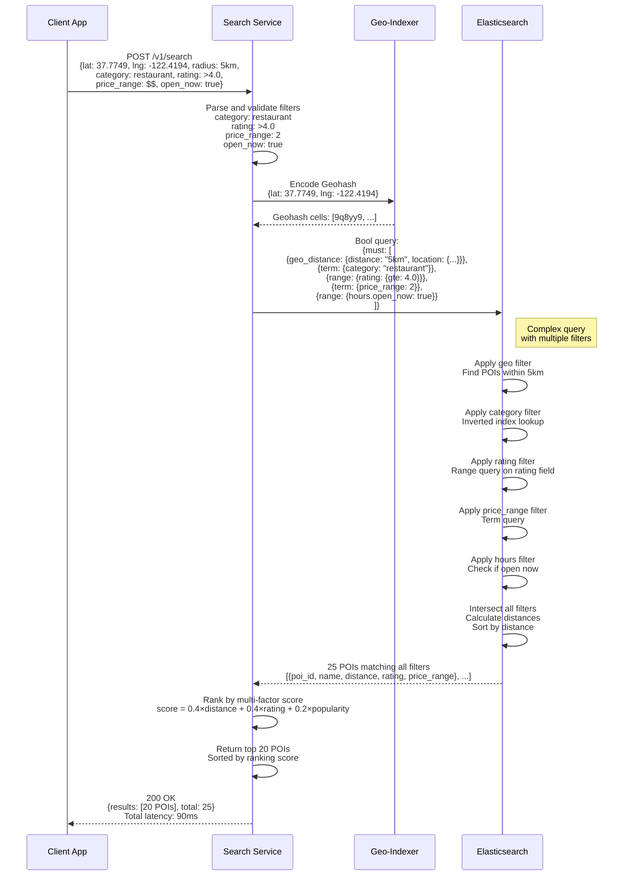
```mermaid
sequenceDiagram
    participant Client as Client App
    participant SearchSvc as Search Service
    participant GeoIndexer as Geo-Indexer
    participant Elasticsearch as Elasticsearch
    Client ->> SearchSvc: POST /v1/search<br/>{lat: 37.7749, lng: -122.4194, radius: 5km,<br/>category: restaurant, rating: >4.0,<br/>price_range: $$, open_now: true}
    SearchSvc ->> SearchSvc: Parse and validate filters<br/>category: restaurant<br/>rating: >4.0<br/>price_range: 2<br/>open_now: true
    SearchSvc ->> GeoIndexer: Encode Geohash<br/>{lat: 37.7749, lng: -122.4194}
    GeoIndexer -->> SearchSvc: Geohash cells: [9q8yy9, ...]
    SearchSvc ->> Elasticsearch: Bool query:<br/>{must: [<br/> {geo_distance: {distance: "5km", location: {...}}},<br/> {term: {category: "restaurant"}},<br/> {range: {rating: {gte: 4.0}}},<br/> {term: {price_range: 2}},<br/> {range: {hours.open_now: true}}<br/>]}
    Note right of Elasticsearch: Complex query<br/>with multiple filters
    Elasticsearch ->> Elasticsearch: Apply geo filter<br/>Find POIs within 5km
    Elasticsearch ->> Elasticsearch: Apply category filter<br/>Inverted index lookup
    Elasticsearch ->> Elasticsearch: Apply rating filter<br/>Range query on rating field
    Elasticsearch ->> Elasticsearch: Apply price_range filter<br/>Term query
    Elasticsearch ->> Elasticsearch: Apply hours filter<br/>Check if open now
    Elasticsearch ->> Elasticsearch: Intersect all filters<br/>Calculate distances<br/>Sort by distance
    Elasticsearch -->> SearchSvc: 25 POIs matching all filters<br/>[{poi_id, name, distance, rating, price_range}, ...]
    SearchSvc ->> SearchSvc: Rank by multi-factor score<br/>score = 0.4×distance + 0.4×rating + 0.2×popularity
    SearchSvc ->> SearchSvc: Return top 20 POIs<br/>Sorted by ranking score
    SearchSvc -->> Client: 200 OK<br/>{results: [20 POIs], total: 25}<br/>Total latency: 90ms
```

---

## 5. Review Submission Flow

**Flow:**

Shows the flow of a user submitting a review for a POI, from submission through storage in MongoDB and eventual
aggregation into Elasticsearch.

**Steps:**

1. **Client Request** (0ms): User submits review with rating, text, photos
2. **API Gateway** (5ms): Authentication, rate limiting
3. **Review Service** (0ms): Receives review submission
4. **Validation** (2ms): Validate rating (1-5), text length, photo count
5. **MongoDB Write** (15ms): Store review document, sharded by POI ID
6. **Async Notification** (5ms): Publish event to Kafka for aggregation
7. **Response** (~30ms total): Return success to client
8. **Background Aggregation** (async, 1-5s): Worker calculates review stats
9. **Elasticsearch Update** (async, 5s): Update POI document with new stats

**Performance:**

- **Client response:** 30ms (non-blocking)
- **Aggregation latency:** 1-5 seconds (acceptable for eventual consistency)

**Benefits:**

- Fast user response (non-blocking)
- High write throughput (MongoDB handles 1M+ reviews/day)
- Asynchronous aggregation reduces latency

**Trade-offs:**

- Review stats lag by 1-5 seconds
- Eventual consistency (acceptable for reviews)

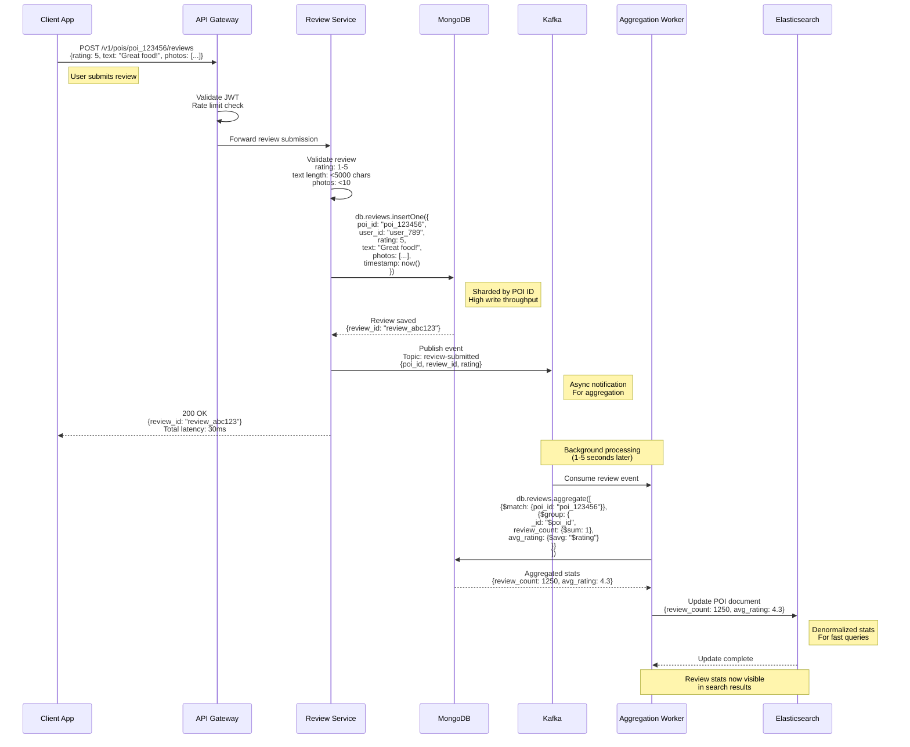
```mermaid
sequenceDiagram
    participant Client as Client App
    participant Gateway as API Gateway
    participant ReviewSvc as Review Service
    participant MongoDB as MongoDB
    participant Kafka as Kafka
    participant AggWorker as Aggregation Worker
    participant Elasticsearch as Elasticsearch
    Client ->> Gateway: POST /v1/pois/poi_123456/reviews<br/>{rating: 5, text: "Great food!", photos: [...]}
    Note right of Client: User submits review
    Gateway ->> Gateway: Validate JWT<br/>Rate limit check
    Gateway ->> ReviewSvc: Forward review submission
    ReviewSvc ->> ReviewSvc: Validate review<br/>rating: 1-5<br/>text length: <5000 chars<br/>photos: <10
    ReviewSvc ->> MongoDB: db.reviews.insertOne({<br/> poi_id: "poi_123456",<br/> user_id: "user_789",<br/> rating: 5,<br/> text: "Great food!",<br/> photos: [...],<br/> timestamp: now()<br/>})
    Note right of MongoDB: Sharded by POI ID<br/>High write throughput
    MongoDB -->> ReviewSvc: Review saved<br/>{review_id: "review_abc123"}
    ReviewSvc ->> Kafka: Publish event<br/>Topic: review-submitted<br/>{poi_id, review_id, rating}
    Note right of Kafka: Async notification<br/>For aggregation
    ReviewSvc -->> Client: 200 OK<br/>{review_id: "review_abc123"}<br/>Total latency: 30ms
    Note over Kafka, AggWorker: Background processing<br/>(1-5 seconds later)
    Kafka ->> AggWorker: Consume review event
    AggWorker ->> MongoDB: db.reviews.aggregate([<br/> {$match: {poi_id: "poi_123456"}},<br/> {$group: {<br/> _id: "$poi_id",<br/> review_count: {$sum: 1},<br/> avg_rating: {$avg: "$rating"}<br/> }}<br/>])
    MongoDB -->> AggWorker: Aggregated stats<br/>{review_count: 1250, avg_rating: 4.3}
    AggWorker ->> Elasticsearch: Update POI document<br/>{review_count: 1250, avg_rating: 4.3}
    Note right of Elasticsearch: Denormalized stats<br/>For fast queries
    Elasticsearch -->> AggWorker: Update complete
    Note over AggWorker, Elasticsearch: Review stats now visible<br/>in search results
```

---

## 6. Review Aggregation and Denormalization

**Flow:**

Shows the background process that aggregates review statistics and updates Elasticsearch POI documents with denormalized
data.

**Steps:**

1. **Kafka Event** (0ms): Review submitted event published to Kafka
2. **Aggregation Worker** (100ms): Consumer pulls event from Kafka
3. **MongoDB Aggregation** (200ms): Calculate review_count and avg_rating for POI
4. **Elasticsearch Update** (50ms): Update POI document with new stats
5. **Cache Invalidation** (10ms): Invalidate cached POI details
6. **Completion** (~360ms total): Stats now visible in search results

**Performance:**

- **Total latency:** 360ms (background process)
- **Update frequency:** Every 5 seconds (batch processing)

**Benefits:**

- Denormalized data eliminates joins in search queries
- Fast search performance (all data in Elasticsearch)
- Background processing doesn't block user requests

**Trade-offs:**

- Eventual consistency (1-5 second lag)
- Additional infrastructure (Kafka, workers)

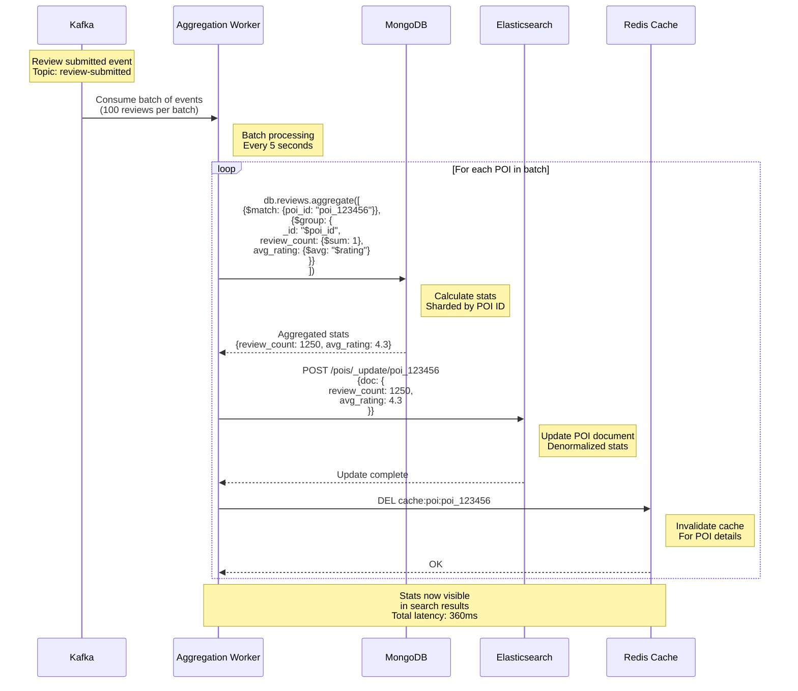
```mermaid
sequenceDiagram
    participant Kafka as Kafka
    participant AggWorker as Aggregation Worker
    participant MongoDB as MongoDB
    participant Elasticsearch as Elasticsearch
    participant RedisCache as Redis Cache
    Note over Kafka: Review submitted event<br/>Topic: review-submitted
    Kafka ->> AggWorker: Consume batch of events<br/>(100 reviews per batch)
    Note right of AggWorker: Batch processing<br/>Every 5 seconds

    loop For each POI in batch
        AggWorker ->> MongoDB: db.reviews.aggregate([<br/> {$match: {poi_id: "poi_123456"}},<br/> {$group: {<br/> _id: "$poi_id",<br/> review_count: {$sum: 1},<br/> avg_rating: {$avg: "$rating"}<br/> }}<br/>])
        Note right of MongoDB: Calculate stats<br/>Sharded by POI ID
        MongoDB -->> AggWorker: Aggregated stats<br/>{review_count: 1250, avg_rating: 4.3}
        AggWorker ->> Elasticsearch: POST /pois/_update/poi_123456<br/>{doc: {<br/> review_count: 1250,<br/> avg_rating: 4.3<br/>}}
        Note right of Elasticsearch: Update POI document<br/>Denormalized stats
        Elasticsearch -->> AggWorker: Update complete
        AggWorker ->> RedisCache: DEL cache:poi:poi_123456
        Note right of RedisCache: Invalidate cache<br/>For POI details
        RedisCache -->> AggWorker: OK
    end

    Note over AggWorker, RedisCache: Stats now visible<br/>in search results<br/>Total latency: 360ms
```

---

## 7. Cache Hit and Miss Flow

**Flow:**

Shows the cache lookup flow for both cache hits (fast path) and cache misses (slow path with Elasticsearch query).

**Steps:**

**Cache Hit Path:**

1. **Client Request** (0ms): User searches for popular query
2. **Cache Lookup** (1ms): Check Redis for cached results
3. **Cache Hit** (1ms): Return cached results immediately
4. **Response** (~2ms total): Fast response from cache

**Cache Miss Path:**

1. **Client Request** (0ms): User searches for new query
2. **Cache Lookup** (1ms): Check Redis (cache miss)
3. **Elasticsearch Query** (50ms): Execute full query
4. **Cache Write** (2ms): Store results in Redis
5. **Response** (~55ms total): Return results to client

**Performance:**

- **Cache hit:** 2ms (99th percentile)
- **Cache miss:** 55ms (p95)
- **Cache hit rate:** 80% (target)

**Benefits:**

- Fast response for popular queries (2ms)
- Reduced Elasticsearch load (80% fewer queries)
- Cost savings (lower infrastructure costs)

**Trade-offs:**

- Memory cost (Redis cluster)
- Cache invalidation complexity

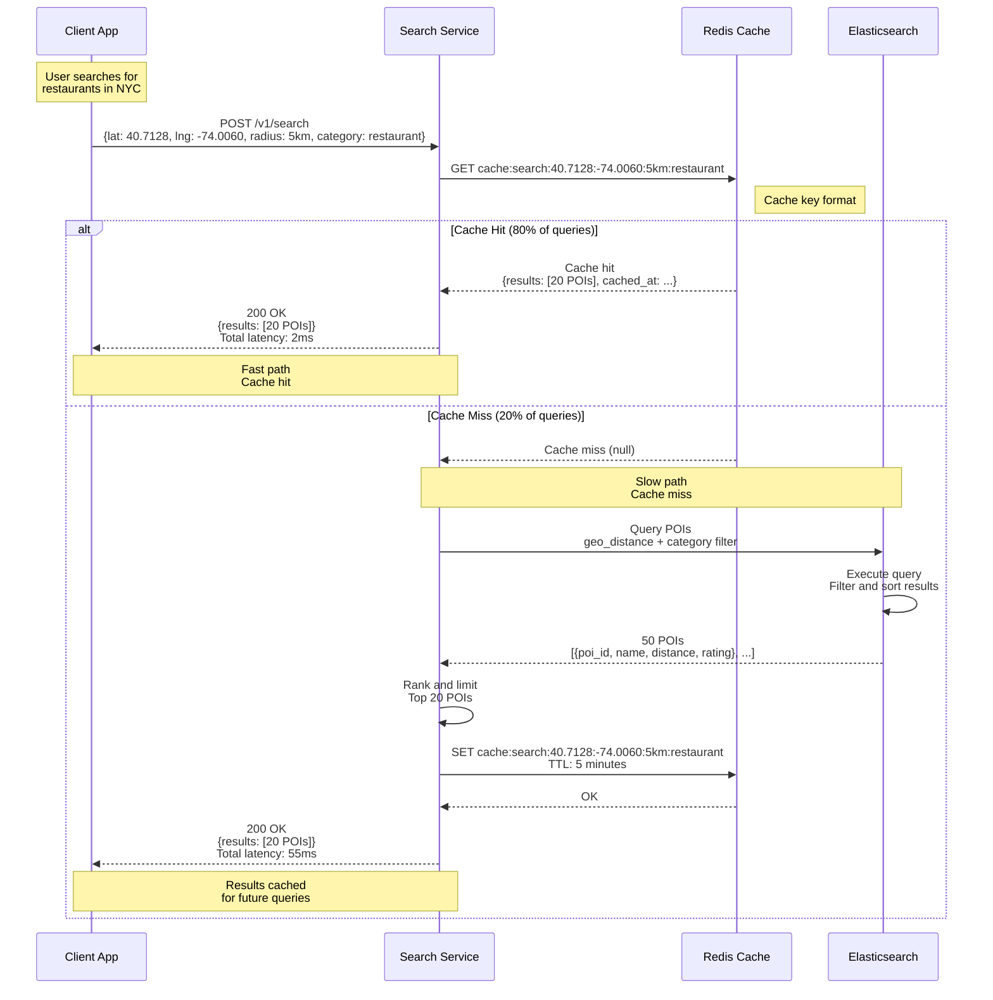
```mermaid
sequenceDiagram
    participant Client as Client App
    participant SearchSvc as Search Service
    participant RedisCache as Redis Cache
    participant Elasticsearch as Elasticsearch
    Note over Client: User searches for<br/>restaurants in NYC
    Client ->> SearchSvc: POST /v1/search<br/>{lat: 40.7128, lng: -74.0060, radius: 5km, category: restaurant}
    SearchSvc ->> RedisCache: GET cache:search:40.7128:-74.0060:5km:restaurant
    Note right of RedisCache: Cache key format

    alt Cache Hit (80% of queries)
        RedisCache -->> SearchSvc: Cache hit<br/>{results: [20 POIs], cached_at: ...}
        SearchSvc -->> Client: 200 OK<br/>{results: [20 POIs]}<br/>Total latency: 2ms
        Note over Client, SearchSvc: Fast path<br/>Cache hit
    else Cache Miss (20% of queries)
        RedisCache -->> SearchSvc: Cache miss (null)
        Note over SearchSvc, Elasticsearch: Slow path<br/>Cache miss
        SearchSvc ->> Elasticsearch: Query POIs<br/>geo_distance + category filter
        Elasticsearch ->> Elasticsearch: Execute query<br/>Filter and sort results
        Elasticsearch -->> SearchSvc: 50 POIs<br/>[{poi_id, name, distance, rating}, ...]
        SearchSvc ->> SearchSvc: Rank and limit<br/>Top 20 POIs
        SearchSvc ->> RedisCache: SET cache:search:40.7128:-74.0060:5km:restaurant<br/>TTL: 5 minutes
        RedisCache -->> SearchSvc: OK
        SearchSvc -->> Client: 200 OK<br/>{results: [20 POIs]}<br/>Total latency: 55ms
        Note over Client, SearchSvc: Results cached<br/>for future queries
    end
```

---

## 8. POI Update Flow

**Flow:**

Shows the flow of updating POI information (e.g., hours, phone number) with cache invalidation and Elasticsearch
synchronization.

**Steps:**

1. **Admin Request** (0ms): Admin updates POI information
2. **PostgreSQL Update** (15ms): Update POI in source of truth
3. **Change Notification** (5ms): Publish change event to Kafka
4. **Response** (~25ms total): Return success to admin
5. **Sync Worker** (async, 100ms): Consume change event
6. **Elasticsearch Update** (50ms): Update POI document in Elasticsearch
7. **Cache Invalidation** (10ms): Invalidate cached POI details
8. **Completion** (~160ms total): Update visible in search results

**Performance:**

- **Admin response:** 25ms (non-blocking)
- **Sync latency:** 160ms (acceptable for eventual consistency)

**Benefits:**

- Fast admin response
- Asynchronous sync doesn't block updates
- Cache invalidation ensures fresh data

**Trade-offs:**

- Eventual consistency (160ms lag)
- Complex cache invalidation

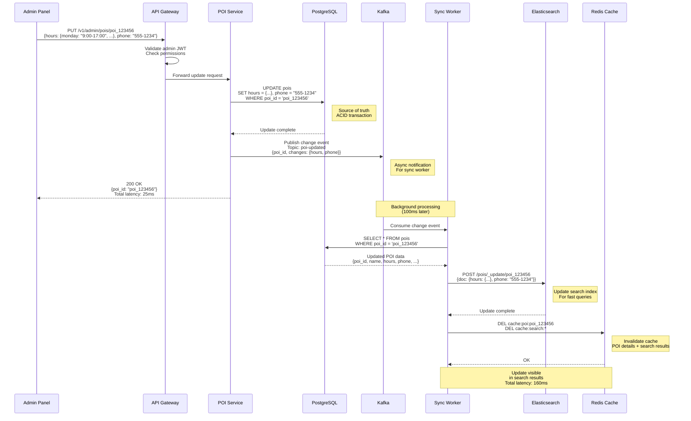
```mermaid
sequenceDiagram
    participant Admin as Admin Panel
    participant Gateway as API Gateway
    participant POISvc as POI Service
    participant PostgresDB as PostgreSQL
    participant Kafka as Kafka
    participant SyncWorker as Sync Worker
    participant Elasticsearch as Elasticsearch
    participant RedisCache as Redis Cache
    Admin ->> Gateway: PUT /v1/admin/pois/poi_123456<br/>{hours: {monday: "9:00-17:00", ...}, phone: "555-1234"}
    Gateway ->> Gateway: Validate admin JWT<br/>Check permissions
    Gateway ->> POISvc: Forward update request
    POISvc ->> PostgresDB: UPDATE pois<br/>SET hours = {...}, phone = "555-1234"<br/>WHERE poi_id = 'poi_123456'
    Note right of PostgresDB: Source of truth<br/>ACID transaction
    PostgresDB -->> POISvc: Update complete
    POISvc ->> Kafka: Publish change event<br/>Topic: poi-updated<br/>{poi_id, changes: {hours, phone}}
    Note right of Kafka: Async notification<br/>For sync worker
    POISvc -->> Admin: 200 OK<br/>{poi_id: "poi_123456"}<br/>Total latency: 25ms
    Note over Kafka, SyncWorker: Background processing<br/>(100ms later)
    Kafka ->> SyncWorker: Consume change event
    SyncWorker ->> PostgresDB: SELECT * FROM pois<br/>WHERE poi_id = 'poi_123456'
    PostgresDB -->> SyncWorker: Updated POI data<br/>{poi_id, name, hours, phone, ...}
    SyncWorker ->> Elasticsearch: POST /pois/_update/poi_123456<br/>{doc: {hours: {...}, phone: "555-1234"}}
    Note right of Elasticsearch: Update search index<br/>For fast queries
    Elasticsearch -->> SyncWorker: Update complete
    SyncWorker ->> RedisCache: DEL cache:poi:poi_123456<br/>DEL cache:search:*
    Note right of RedisCache: Invalidate cache<br/>POI details + search results
    RedisCache -->> SyncWorker: OK
    Note over SyncWorker, RedisCache: Update visible<br/>in search results<br/>Total latency: 160ms
```

---

## 9. Hotspot Shard Split Flow

**Flow:**

Shows the flow of detecting and handling hotspots in densely populated areas by splitting shards dynamically.

**Steps:**

1. **Traffic Monitor** (continuous): Monitor query rate per Geohash prefix
2. **Threshold Exceeded** (detected): 9q8 prefix exceeds 5K QPS threshold
3. **Alert System** (5ms): Trigger shard split alert
4. **Shard Split** (500ms): Split 9q8 shard into sub-shards by category
5. **Data Migration** (10s): Migrate POI data to new sub-shards
6. **Query Router Update** (10ms): Update routing logic to use sub-shards
7. **Completion** (~10s total): New queries routed to sub-shards

**Performance:**

- **Detection latency:** Real-time (continuous monitoring)
- **Split latency:** 10 seconds (one-time operation)

**Benefits:**

- Automatic load distribution
- Prevents shard overload
- Handles traffic spikes

**Trade-offs:**

- Split operation is disruptive (10s downtime)
- Complex routing logic

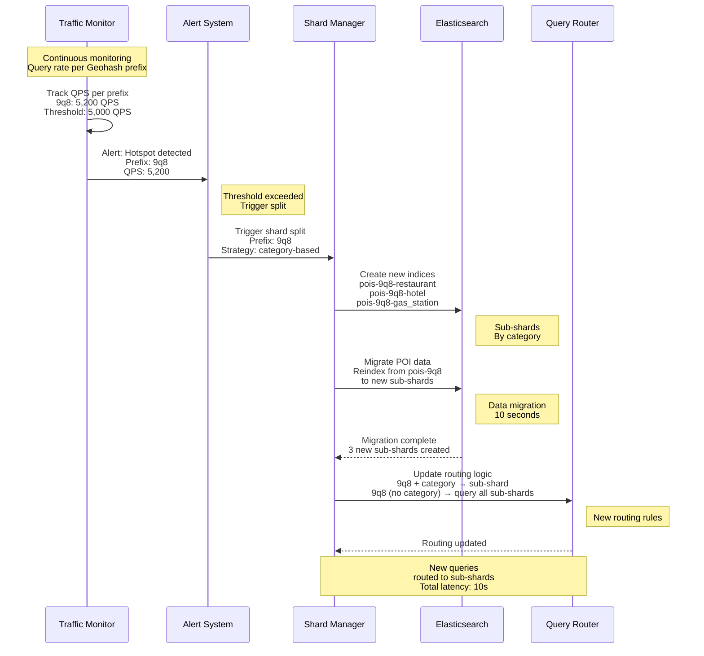
```mermaid
sequenceDiagram
    participant Monitor as Traffic Monitor
    participant AlertSystem as Alert System
    participant ShardManager as Shard Manager
    participant Elasticsearch as Elasticsearch
    participant QueryRouter as Query Router
    Note over Monitor: Continuous monitoring<br/>Query rate per Geohash prefix
    Monitor ->> Monitor: Track QPS per prefix<br/>9q8: 5,200 QPS<br/>Threshold: 5,000 QPS
    Monitor ->> AlertSystem: Alert: Hotspot detected<br/>Prefix: 9q8<br/>QPS: 5,200
    Note right of AlertSystem: Threshold exceeded<br/>Trigger split
    AlertSystem ->> ShardManager: Trigger shard split<br/>Prefix: 9q8<br/>Strategy: category-based
    ShardManager ->> Elasticsearch: Create new indices<br/>pois-9q8-restaurant<br/>pois-9q8-hotel<br/>pois-9q8-gas_station
    Note right of Elasticsearch: Sub-shards<br/>By category
    ShardManager ->> Elasticsearch: Migrate POI data<br/>Reindex from pois-9q8<br/>to new sub-shards
    Note right of Elasticsearch: Data migration<br/>10 seconds
    Elasticsearch -->> ShardManager: Migration complete<br/>3 new sub-shards created
    ShardManager ->> QueryRouter: Update routing logic<br/>9q8 + category → sub-shard<br/>9q8 (no category) → query all sub-shards
    Note right of QueryRouter: New routing rules
    QueryRouter -->> ShardManager: Routing updated
    Note over QueryRouter, ShardManager: New queries<br/>routed to sub-shards<br/>Total latency: 10s
```

---

## 10. Auto-complete Suggestion Flow

**Flow:**

Shows the flow of providing instant POI name suggestions as users type search queries.

**Steps:**

1. **User Typing** (0ms): User types "Golden Gate"
2. **Partial Query** (10ms): App sends partial query to API
3. **Trie Lookup** (2ms): Lookup prefix in Trie index
4. **Popular Queries** (1ms): Check cache for frequent queries
5. **Suggestion Ranking** (3ms): Rank suggestions by popularity, distance, relevance
6. **Response** (~15ms total): Return top 5 suggestions

**Performance:**

- **Total latency:** 15ms (p95)
- **Suggestion quality:** High (multi-factor ranking)

**Benefits:**

- Instant suggestions improve UX
- Reduces typing effort
- Guides users to valid POI names

**Trade-offs:**

- Memory cost (Trie index)
- Update latency (new POIs take 1-5 minutes)

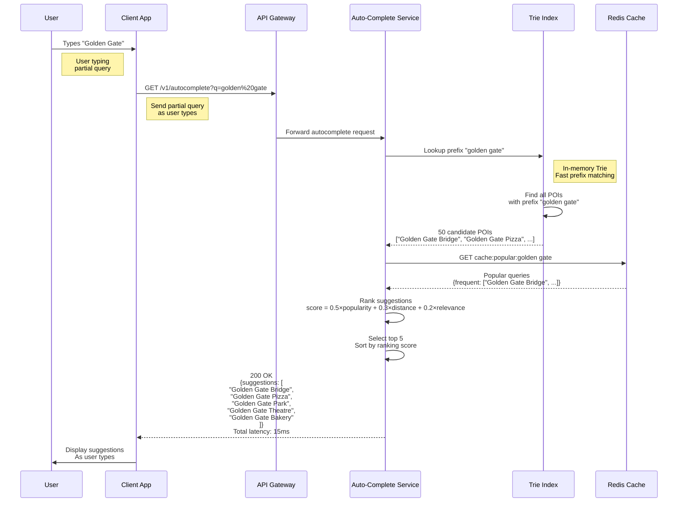
```mermaid
sequenceDiagram
    participant User as User
    participant Client as Client App
    participant Gateway as API Gateway
    participant AutoComplete as Auto-Complete Service
    participant TrieIndex as Trie Index
    participant RedisCache as Redis Cache
    User ->> Client: Types "Golden Gate"
    Note right of User: User typing<br/>partial query
    Client ->> Gateway: GET /v1/autocomplete?q=golden%20gate
    Note right of Client: Send partial query<br/>as user types
    Gateway ->> AutoComplete: Forward autocomplete request
    AutoComplete ->> TrieIndex: Lookup prefix "golden gate"
    Note right of TrieIndex: In-memory Trie<br/>Fast prefix matching
    TrieIndex ->> TrieIndex: Find all POIs<br/>with prefix "golden gate"
    TrieIndex -->> AutoComplete: 50 candidate POIs<br/>["Golden Gate Bridge", "Golden Gate Pizza", ...]
    AutoComplete ->> RedisCache: GET cache:popular:golden gate
    RedisCache -->> AutoComplete: Popular queries<br/>{frequent: ["Golden Gate Bridge", ...]}
    AutoComplete ->> AutoComplete: Rank suggestions<br/>score = 0.5×popularity + 0.3×distance + 0.2×relevance
    AutoComplete ->> AutoComplete: Select top 5<br/>Sort by ranking score
    AutoComplete -->> Client: 200 OK<br/>{suggestions: [<br/> "Golden Gate Bridge",<br/> "Golden Gate Pizza",<br/> "Golden Gate Park",<br/> "Golden Gate Theatre",<br/> "Golden Gate Bakery"<br/>]}<br/>Total latency: 15ms
    Client ->> User: Display suggestions<br/>As user types
```

---

## 11. Multi-Region Query Routing

**Flow:**

Shows the flow of routing queries to the nearest regional datacenter based on user location.

**Steps:**

1. **Client Request** (0ms): User in San Francisco searches for POIs
2. **Global Load Balancer** (5ms): Detect user location, route to nearest region
3. **Regional API** (0ms): US West API receives request
4. **Regional Elasticsearch** (50ms): Query local cluster (West Coast POIs)
5. **Response** (~60ms total): Return results from regional datacenter

**Performance:**

- **Total latency:** 60ms (p95, regional)
- **Global routing:** 5ms overhead

**Benefits:**

- Low latency (regional queries)
- High availability (regional failures don't affect others)
- Data residency compliance

**Trade-offs:**

- Cross-region replication lag (1-5 minutes)
- Infrastructure cost (multiple datacenters)

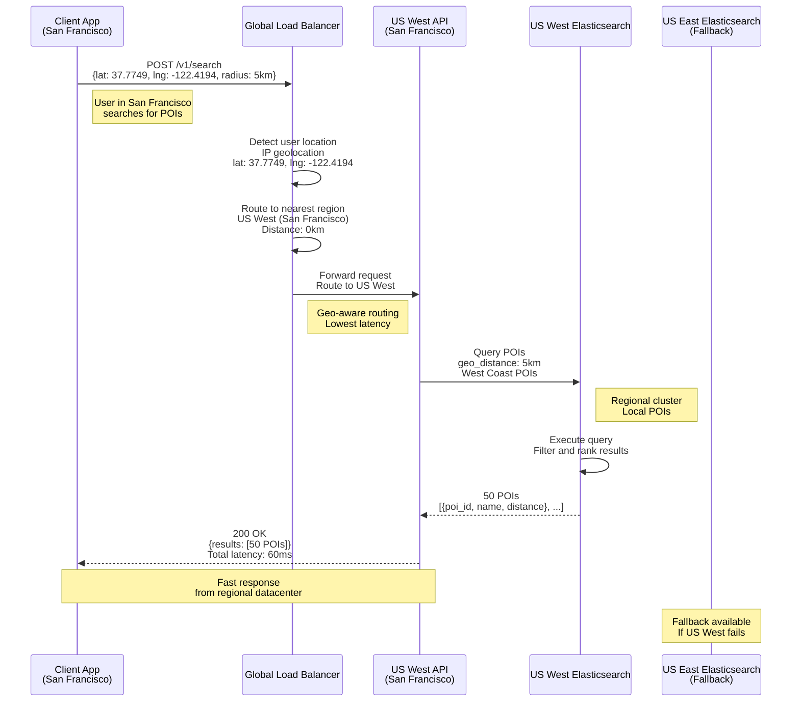
```mermaid
sequenceDiagram
    participant Client as Client App<br/>(San Francisco)
    participant GLB as Global Load Balancer
    participant USWestAPI as US West API<br/>(San Francisco)
    participant USWestES as US West Elasticsearch
    participant USEastES as US East Elasticsearch<br/>(Fallback)
    Client ->> GLB: POST /v1/search<br/>{lat: 37.7749, lng: -122.4194, radius: 5km}
    Note right of Client: User in San Francisco<br/>searches for POIs
    GLB ->> GLB: Detect user location<br/>IP geolocation<br/>lat: 37.7749, lng: -122.4194
    GLB ->> GLB: Route to nearest region<br/>US West (San Francisco)<br/>Distance: 0km
    GLB ->> USWestAPI: Forward request<br/>Route to US West
    Note right of GLB: Geo-aware routing<br/>Lowest latency
    USWestAPI ->> USWestES: Query POIs<br/>geo_distance: 5km<br/>West Coast POIs
    Note right of USWestES: Regional cluster<br/>Local POIs
    USWestES ->> USWestES: Execute query<br/>Filter and rank results
    USWestES -->> USWestAPI: 50 POIs<br/>[{poi_id, name, distance}, ...]
    USWestAPI -->> Client: 200 OK<br/>{results: [50 POIs]}<br/>Total latency: 60ms
    Note over Client, USWestAPI: Fast response<br/>from regional datacenter
    Note over USEastES: Fallback available<br/>If US West fails
```

---

## 12. Boundary Query Handling

**Flow:**

Shows the detailed flow of handling queries at Geohash cell boundaries to ensure no POIs are missed.

**Steps:**

1. **Boundary Query** (0ms): User searches near Geohash cell boundary
2. **Center Cell** (2ms): Calculate center cell Geohash
3. **Neighbor Detection** (3ms): Detect if query is near boundary
4. **Adjacent Calculation** (5ms): Calculate 8 adjacent cells
5. **Multi-Cell Query** (50ms): Query all 9 cells
6. **Distance Filter** (10ms): Filter by exact distance (remove false positives)
7. **Result Aggregation** (5ms): Combine and deduplicate results
8. **Response** (~75ms total): Return accurate results

**Performance:**

- **Total latency:** 75ms (p95)
- **Query overhead:** 9 cells (vs 1), but ensures accuracy

**Benefits:**

- No POIs missed at boundaries
- Accurate distance filtering
- Handles edge cases correctly

**Trade-offs:**

- More cells queried increases latency
- Distance calculation for all candidates

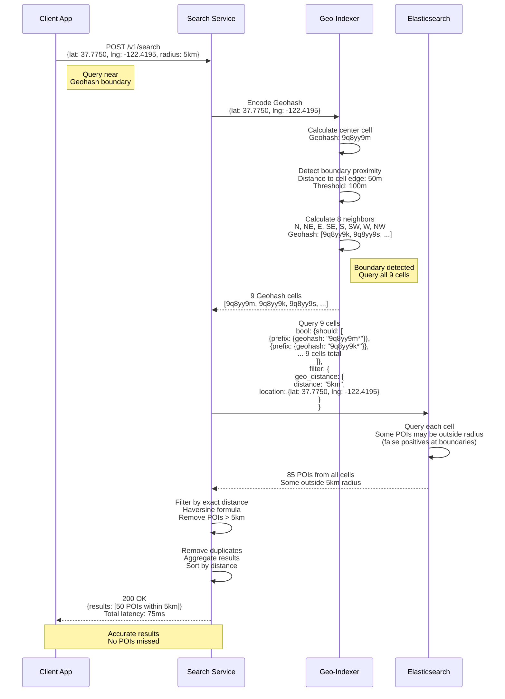
```mermaid
sequenceDiagram
    participant Client as Client App
    participant SearchSvc as Search Service
    participant GeoIndexer as Geo-Indexer
    participant Elasticsearch as Elasticsearch
    Client ->> SearchSvc: POST /v1/search<br/>{lat: 37.7750, lng: -122.4195, radius: 5km}
    Note right of Client: Query near<br/>Geohash boundary
    SearchSvc ->> GeoIndexer: Encode Geohash<br/>{lat: 37.7750, lng: -122.4195}
    GeoIndexer ->> GeoIndexer: Calculate center cell<br/>Geohash: 9q8yy9m
    GeoIndexer ->> GeoIndexer: Detect boundary proximity<br/>Distance to cell edge: 50m<br/>Threshold: 100m
    GeoIndexer ->> GeoIndexer: Calculate 8 neighbors<br/>N, NE, E, SE, S, SW, W, NW<br/>Geohash: [9q8yy9k, 9q8yy9s, ...]
    Note right of GeoIndexer: Boundary detected<br/>Query all 9 cells
    GeoIndexer -->> SearchSvc: 9 Geohash cells<br/>[9q8yy9m, 9q8yy9k, 9q8yy9s, ...]
    SearchSvc ->> Elasticsearch: Query 9 cells<br/>bool: {should: [<br/> {prefix: {geohash: "9q8yy9m*"}},<br/> {prefix: {geohash: "9q8yy9k*"}},<br/> ... 9 cells total<br/>]},<br/>filter: {<br/> geo_distance: {<br/> distance: "5km",<br/> location: {lat: 37.7750, lng: -122.4195}<br/> }<br/>}
    Elasticsearch ->> Elasticsearch: Query each cell<br/>Some POIs may be outside radius<br/>(false positives at boundaries)
    Elasticsearch -->> SearchSvc: 85 POIs from all cells<br/>Some outside 5km radius
    SearchSvc ->> SearchSvc: Filter by exact distance<br/>Haversine formula<br/>Remove POIs > 5km
    SearchSvc ->> SearchSvc: Remove duplicates<br/>Aggregate results<br/>Sort by distance
    SearchSvc -->> Client: 200 OK<br/>{results: [50 POIs within 5km]}<br/>Total latency: 75ms
    Note over Client, SearchSvc: Accurate results<br/>No POIs missed
```

---

## 13. Ranking and Sorting Flow

**Flow:**

Shows the detailed flow of ranking and sorting search results using a multi-factor scoring algorithm.

**Steps:**

1. **Search Results** (0ms): Elasticsearch returns 50 POIs within radius
2. **Distance Calculation** (10ms): Calculate exact distance for each POI
3. **Score Components** (5ms): Calculate distance_score, rating_score, popularity_score
4. **Multi-Factor Ranking** (5ms): Combine scores with weights
5. **Sorting** (2ms): Sort by final ranking score (descending)
6. **Result Limiting** (1ms): Return top 20 POIs
7. **Response** (~25ms total): Return ranked and sorted results

**Performance:**

- **Total latency:** 25ms (ranking overhead)
- **Ranking quality:** High (multi-factor scoring)

**Benefits:**

- Balanced ranking (distance + quality + popularity)
- User-friendly results
- Flexible scoring weights

**Trade-offs:**

- CPU cost (scoring for all candidates)
- Ranking complexity

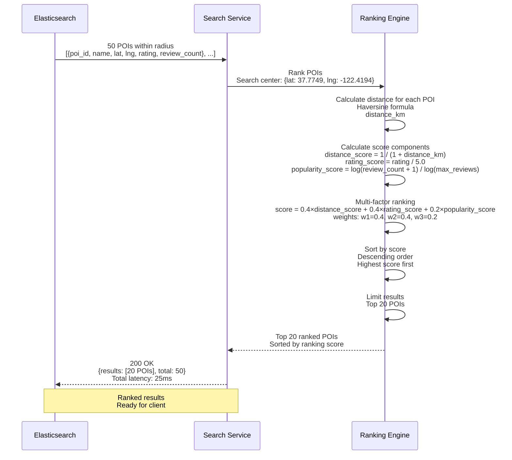
```mermaid
sequenceDiagram
    participant Elasticsearch as Elasticsearch
    participant SearchSvc as Search Service
    participant RankEngine as Ranking Engine
    Elasticsearch ->> SearchSvc: 50 POIs within radius<br/>[{poi_id, name, lat, lng, rating, review_count}, ...]
    SearchSvc ->> RankEngine: Rank POIs<br/>Search center: {lat: 37.7749, lng: -122.4194}
    RankEngine ->> RankEngine: Calculate distance for each POI<br/>Haversine formula<br/>distance_km
    RankEngine ->> RankEngine: Calculate score components<br/>distance_score = 1 / (1 + distance_km)<br/>rating_score = rating / 5.0<br/>popularity_score = log(review_count + 1) / log(max_reviews)
    RankEngine ->> RankEngine: Multi-factor ranking<br/>score = 0.4×distance_score + 0.4×rating_score + 0.2×popularity_score<br/>weights: w1=0.4, w2=0.4, w3=0.2
    RankEngine ->> RankEngine: Sort by score<br/>Descending order<br/>Highest score first
    RankEngine ->> RankEngine: Limit results<br/>Top 20 POIs
    RankEngine -->> SearchSvc: Top 20 ranked POIs<br/>Sorted by ranking score
    SearchSvc -->> Elasticsearch: 200 OK<br/>{results: [20 POIs], total: 50}<br/>Total latency: 25ms
    Note over SearchSvc, Elasticsearch: Ranked results<br/>Ready for client
```

---

## 14. Map Tile Request Flow

**Flow:**

Shows the flow of serving map tiles and POI markers through CDN for fast global delivery.

**Steps:**

1. **Client Request** (0ms): User requests map tiles for visible area
2. **CDN Check** (5ms): Check CDN edge cache for tiles
3. **Cache Hit** (10ms): Return cached tiles from CDN
4. **Cache Miss** (50ms): Fetch tiles from origin server
5. **Tile Generation** (100ms): Generate tiles if needed (zoom level, POI markers)
6. **CDN Cache** (10ms): Store tiles in CDN cache
7. **Response** (~15ms hit, ~170ms miss): Return tiles to client

**Performance:**

- **Cache hit:** 15ms (p95)
- **Cache miss:** 170ms (p95)
- **Cache hit rate:** 95% (static tiles)

**Benefits:**

- Fast global delivery (CDN edge locations)
- Reduced origin server load
- Bandwidth savings

**Trade-offs:**

- Cache invalidation complexity
- Storage cost (CDN storage)

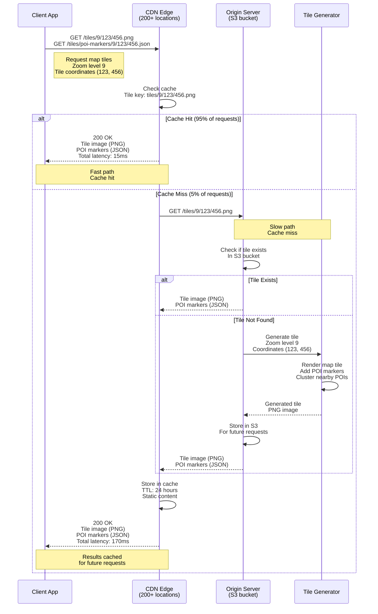
```mermaid
sequenceDiagram
    participant Client as Client App
    participant CDN as CDN Edge<br/>(200+ locations)
    participant Origin as Origin Server<br/>(S3 bucket)
    participant TileGen as Tile Generator
    Client ->> CDN: GET /tiles/9/123/456.png<br/>GET /tiles/poi-markers/9/123/456.json
    Note right of Client: Request map tiles<br/>Zoom level 9<br/>Tile coordinates (123, 456)
    CDN ->> CDN: Check cache<br/>Tile key: tiles/9/123/456.png

    alt Cache Hit (95% of requests)
        CDN -->> Client: 200 OK<br/>Tile image (PNG)<br/>POI markers (JSON)<br/>Total latency: 15ms
        Note over Client, CDN: Fast path<br/>Cache hit
    else Cache Miss (5% of requests)
        CDN ->> Origin: GET /tiles/9/123/456.png
        Note over Origin, TileGen: Slow path<br/>Cache miss
        Origin ->> Origin: Check if tile exists<br/>In S3 bucket

        alt Tile Exists
            Origin -->> CDN: Tile image (PNG)<br/>POI markers (JSON)
        else Tile Not Found
            Origin ->> TileGen: Generate tile<br/>Zoom level 9<br/>Coordinates (123, 456)
            TileGen ->> TileGen: Render map tile<br/>Add POI markers<br/>Cluster nearby POIs
            TileGen -->> Origin: Generated tile<br/>PNG image
            Origin ->> Origin: Store in S3<br/>For future requests
            Origin -->> CDN: Tile image (PNG)<br/>POI markers (JSON)
        end

        CDN ->> CDN: Store in cache<br/>TTL: 24 hours<br/>Static content
        CDN -->> Client: 200 OK<br/>Tile image (PNG)<br/>POI markers (JSON)<br/>Total latency: 170ms
        Note over Client, CDN: Results cached<br/>for future requests
    end
```

