# Authenticator App - High-Level Design

## Table of Contents

1. [System Architecture Overview](#system-architecture-overview)
2. [Client App Architecture](#client-app-architecture)
3. [TOTP Code Generation Flow](#totp-code-generation-flow)
4. [Account Setup Flow](#account-setup-flow)
5. [Background Sync Architecture](#background-sync-architecture)
6. [Multi-Device Sync Architecture](#multi-device-sync-architecture)
7. [Push Notification Architecture](#push-notification-architecture)
8. [Encryption and Key Management](#encryption-and-key-management)
9. [Server-Side Architecture](#server-side-architecture)
10. [Security Architecture](#security-architecture)
11. [Multi-Region Deployment](#multi-region-deployment)
12. [Storage Architecture](#storage-architecture)
13. [Time Synchronization Flow](#time-synchronization-flow)
14. [Backup and Restore Flow](#backup-and-restore-flow)

---

## System Architecture Overview

**Flow Explanation:**

This diagram shows the high-level architecture of the authenticator app system, highlighting the offline-first design where code generation happens entirely on-device, with optional cloud services for sync and push notifications.

**Key Components:**

1. **Mobile Devices**: iOS/Android apps that generate TOTP codes offline
2. **Device HSM**: Hardware Security Module (Keychain/Keystore) for key encryption
3. **Sync Service**: Optional service for account metadata synchronization
4. **Push Service**: Optional service for push notification approvals
5. **Database**: Encrypted storage for account metadata and device registrations

**Benefits:**

- **Offline Operation**: Codes generated without internet (100% availability)
- **Zero-Knowledge**: Server never sees plaintext secrets
- **Scalability**: Most operations client-side (minimal server load)

**Trade-offs:**

- Eventual consistency for account metadata (syncs when online)
- Cloud backup requires user password (no password reset)

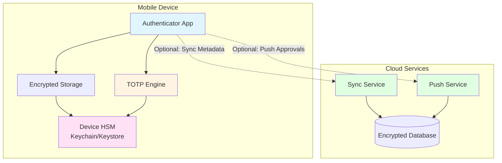

---

## Client App Architecture

**Flow Explanation:**

This diagram shows the internal architecture of the authenticator app client, including the TOTP engine, encrypted storage, HSM integration, and UI components.

**Key Components:**

1. **UI Layer**: User interface for displaying codes, managing accounts
2. **TOTP Engine**: Generates codes using HMAC-SHA1 algorithm
3. **Key Storage**: Encrypted database for account secrets
4. **HSM Integration**: Device Hardware Security Module for key encryption
5. **Sync Service**: Background service for metadata synchronization
6. **Push Handler**: Handles push notification approvals

**Steps:**

1. User opens app → UI Layer requests codes
2. TOTP Engine retrieves encrypted secrets from Key Storage
3. HSM decrypts secrets (biometric unlock required)
4. TOTP Engine generates codes using current time
5. UI displays codes to user
6. Background: Sync Service syncs metadata when online

**Benefits:**

- **Modular Design**: Clear separation of concerns
- **Security**: HSM integration for hardware-backed encryption
- **Offline-First**: TOTP Engine works without network

**Performance:**

- Code generation: <10ms (local computation)
- HSM unlock: <200ms (includes biometric prompt)

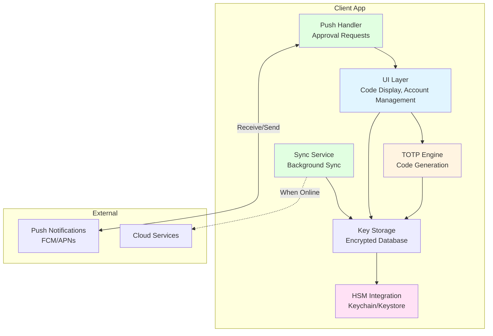

---

## TOTP Code Generation Flow

**Flow Explanation:**

This diagram shows how TOTP codes are generated entirely on-device using the shared secret and current time, with no network calls required.

**Steps:**

1. **User Opens App**: App requests codes for all accounts
2. **HSM Unlock**: Device HSM prompts for biometric (Face ID / fingerprint)
3. **Secret Decryption**: HSM decrypts secrets from encrypted storage
4. **Time Step Calculation**: Current Unix timestamp divided by 30 seconds
5. **HMAC Computation**: HMAC-SHA1(secret, time_step) → 20-byte hash
6. **Dynamic Truncation**: Extract 31-bit value from hash
7. **6-Digit Code**: Modulo 1,000,000 → format as 6-digit code
8. **Display**: Show codes to user (valid for 30 seconds)

**Benefits:**

- **Offline**: No internet required (works in airplane mode)
- **Fast**: <10ms computation time
- **Secure**: Secrets never leave device HSM

**Performance:**

- Code generation: <10ms (after HSM unlock)
- Code refresh: Every 30 seconds (automatic)

```mermaid
graph LR
    Start[User Opens App] --> Unlock[HSM Unlock<br/>Biometric Prompt]
    Unlock --> Decrypt[Decrypt Secrets<br/>from Storage]
    Decrypt --> Time[Get Current Time<br/>Unix Timestamp]
    Time --> Step[Calculate Time Step<br/>timestamp // 30]
    Step --> HMAC[HMAC-SHA1<br/>secret, time_step]
    HMAC --> Truncate[Dynamic Truncation<br/>Extract 31-bit value]
    Truncate --> Code[6-Digit Code<br/>value % 1000000]
    Code --> Display[Display Code<br/>Valid 30 seconds]
    Display --> Refresh[Auto-Refresh<br/>Every 30s]
    
    style Start fill:#e1f5ff
    style Unlock fill:#ffe1f5
    style HMAC fill:#fff4e1
    style Code fill:#e1ffe1
    style Display fill:#e1ffe1
```

---

## Account Setup Flow

**Flow Explanation:**

This diagram shows how users add accounts to the authenticator app, either by scanning a QR code or manually entering the secret key.

**Steps:**

1. **QR Code Scan**: User scans QR code containing otpauth:// URL
2. **Parse URL**: Extract secret, issuer, account name, algorithm, digits, period
3. **Validate Secret**: Check Base32 format and length
4. **HSM Encryption**: Encrypt secret with device HSM master key
5. **Store Account**: Save encrypted account record in local database
6. **Generate First Code**: Verify account works by generating code
7. **Optional Cloud Backup**: Upload encrypted account to cloud (if enabled)

**Benefits:**

- **Easy Setup**: QR code scanning (one tap)
- **Secure**: Secret encrypted immediately with HSM
- **Verification**: Generate first code to confirm setup

**Alternative Flow (Manual Entry):**

- User types secret manually (Base32 string)
- Same encryption and storage process

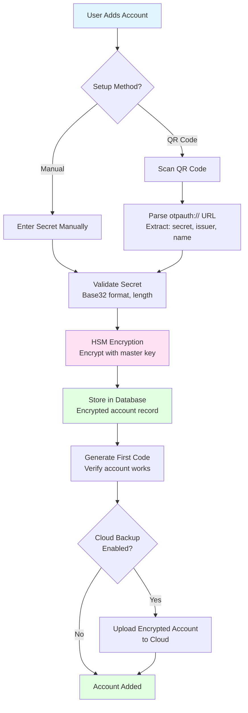

---

## Background Sync Architecture

**Flow Explanation:**

This diagram shows how the app syncs account metadata (name, icon, issuer) in the background when online, without affecting offline code generation.

**Steps:**

1. **Connectivity Check**: App detects internet connectivity
2. **Background Trigger**: Sync service triggers (every 6 hours, or on app open)
3. **Sync Request**: App sends account IDs and last sync timestamps
4. **Server Processing**: Server compares with latest metadata
5. **Response**: Server returns updates, deleted accounts, new accounts
6. **Local Update**: App updates local database with new metadata
7. **Sync Complete**: Update sync timestamps

**Benefits:**

- **Non-Blocking**: Sync happens in background (codes work offline)
- **Efficient**: Only syncs changed accounts (delta sync)
- **Privacy**: Server never sees secrets (only metadata)

**Trade-offs:**

- Eventual consistency (metadata may be stale if offline)
- Requires internet (but codes work without it)

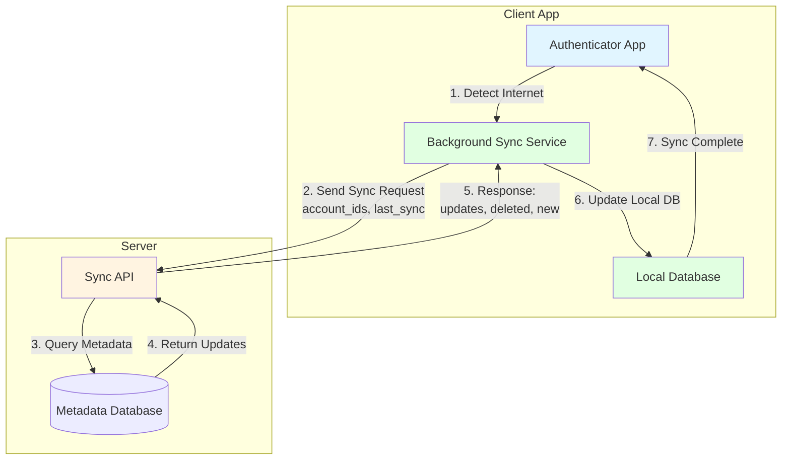

---

## Multi-Device Sync Architecture

**Flow Explanation:**

This diagram shows how accounts are synchronized across multiple devices (phone, tablet, watch) using encrypted cloud backup with user-controlled encryption.

**Steps:**

1. **Device 1 (Add Account)**: User adds account, secret encrypted with device HSM
2. **Cloud Backup Enable**: User enables cloud backup, enters password
3. **Cloud Key Derivation**: PBKDF2(password, salt, 100k iterations) → cloud key
4. **Account Encryption**: Encrypt account with cloud key (separate from HSM encryption)
5. **Upload**: Upload encrypted account to cloud
6. **Device 2 (Restore)**: User installs app on new device, enters cloud password
7. **Download**: Download encrypted accounts from cloud
8. **Decrypt**: Decrypt with cloud key
9. **Re-Encrypt**: Re-encrypt with Device 2's HSM master key
10. **Store**: Save in Device 2's local database

**Benefits:**

- **Zero-Knowledge**: Server never sees plaintext secrets
- **User Control**: User controls encryption key (password)
- **Multi-Device**: Same accounts on all devices

**Security:**

- Cloud key derived from password (PBKDF2, 100k iterations)
- Each device has its own HSM master key
- Server only stores encrypted data

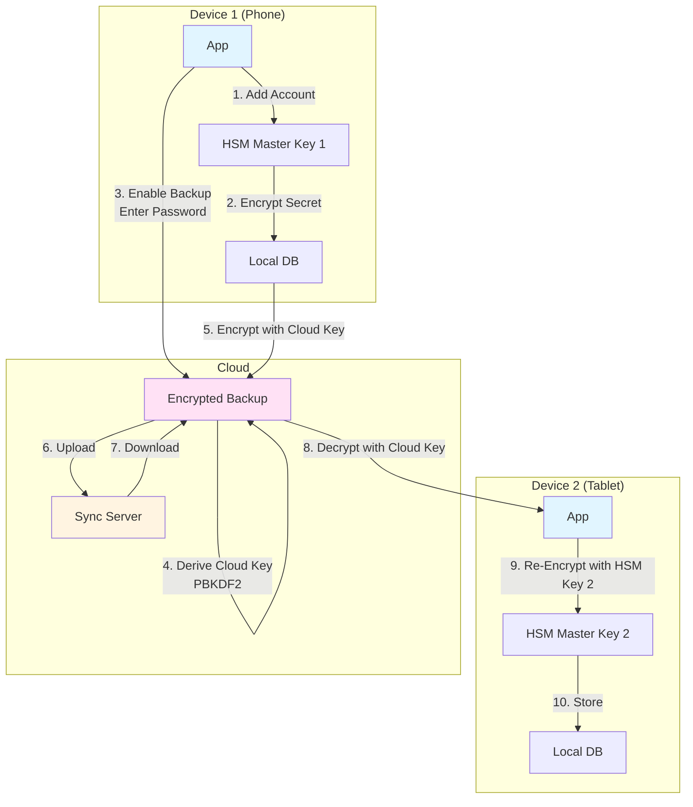

---

## Push Notification Architecture

**Flow Explanation:**

This diagram shows how push notification approvals work (Microsoft Authenticator style), allowing users to approve login requests with a tap instead of entering TOTP codes.

**Steps:**

1. **User Login**: User attempts login on website
2. **Approval Request**: Website sends request to authenticator service
3. **Device Lookup**: Service looks up user's registered devices
4. **Push Send**: Service sends push notification via FCM/APNs
5. **Notification Display**: User sees "Approve login?" notification
6. **User Action**: User taps "Approve" or "Deny"
7. **Response**: App sends approval/denial to service
8. **Website Notification**: Service notifies website via WebSocket
9. **Login Complete**: Website completes or rejects authentication

**Benefits:**

- **Convenient**: One-tap approval (no typing codes)
- **Fast**: <2 seconds end-to-end
- **Fallback**: TOTP codes always available if push fails

**Security:**

- 30-second timeout (prevents replay attacks)
- Device verification (only registered devices)
- Rate limiting (max 5 requests per 15 minutes)

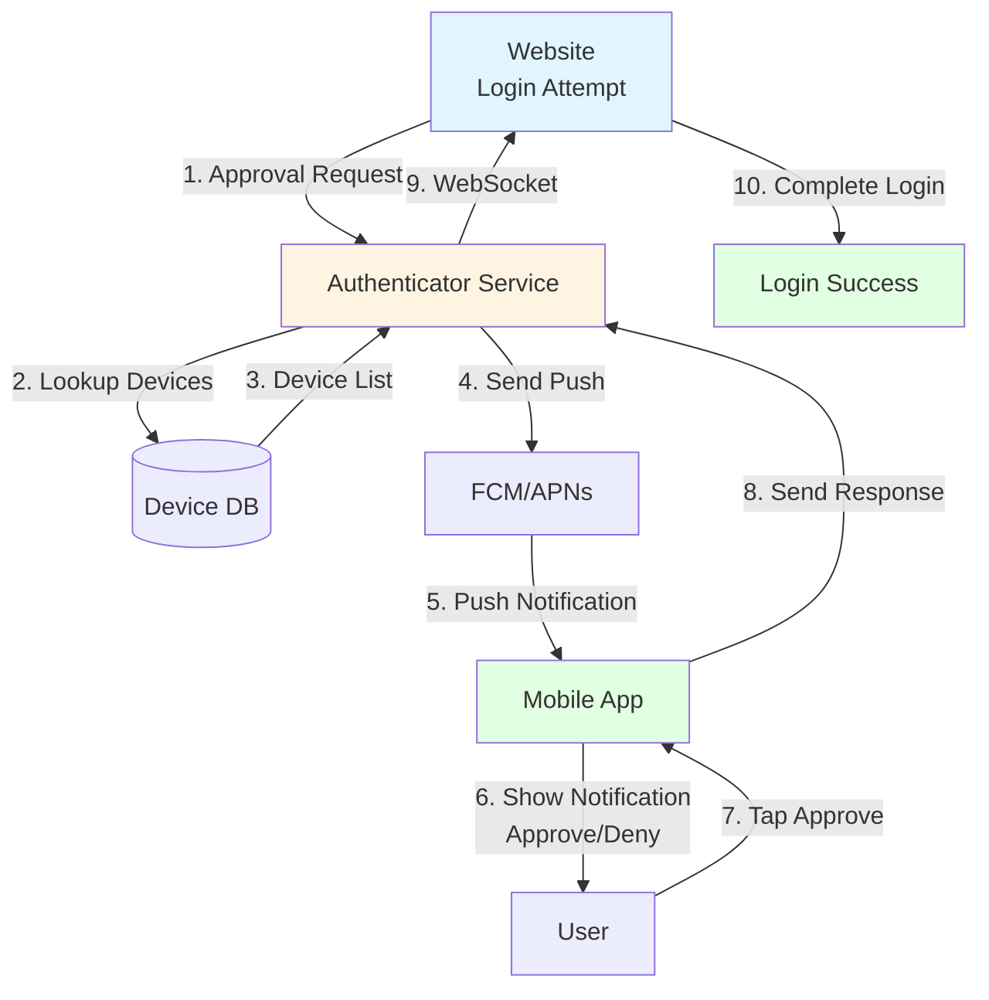

---

## Encryption and Key Management

**Flow Explanation:**

This diagram shows the multi-layer encryption architecture, including device HSM encryption, cloud backup encryption, and server-side encryption.

**Key Layers:**

1. **Device HSM**: Hardware-backed encryption (Keychain/Keystore)
2. **Cloud Key**: User password-derived key (PBKDF2)
3. **Server Encryption**: Database encryption at rest (AES-256-GCM)

**Flow:**

1. **Secret Storage**: Secret encrypted with device HSM master key
2. **Cloud Backup**: Account encrypted with cloud key (user password)
3. **Server Storage**: Encrypted data stored in database (server never sees plaintext)
4. **Decryption**: Reverse process when restoring/accessing

**Benefits:**

- **Zero-Knowledge**: Server never sees plaintext secrets
- **Hardware Security**: Device HSM (tamper-resistant)
- **User Control**: User controls cloud encryption key

**Security Properties:**

- Master key never leaves device HSM
- Cloud key derived from password (PBKDF2, 100k iterations)
- Server encryption for database at rest

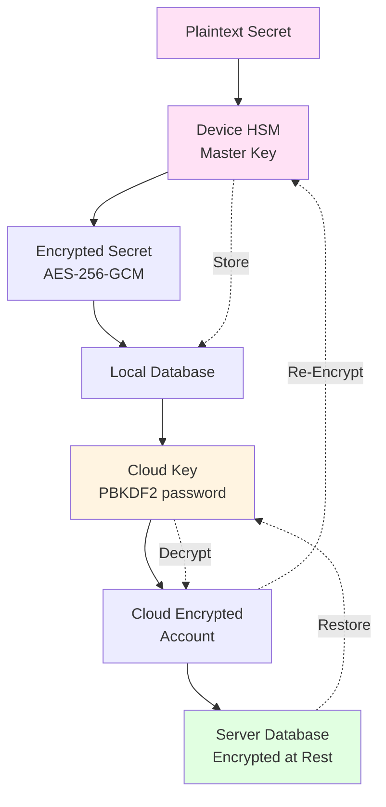

---

## Server-Side Architecture

**Flow Explanation:**

This diagram shows the server-side architecture for sync service, push notifications, and database storage.

**Components:**

1. **API Gateway**: Rate limiting, authentication, load balancing
2. **Sync Service**: Handles account metadata synchronization
3. **Push Service**: Manages push notification approvals
4. **Database**: Encrypted storage for metadata, device registrations
5. **Cache**: Redis for push tokens, sync state
6. **Message Queue**: RabbitMQ for push request queue

**Benefits:**

- **Scalability**: Auto-scaling based on load
- **Availability**: Multi-region deployment
- **Performance**: Caching for frequently accessed data

**Trade-offs:**

- Server required for sync/push (but codes work offline)
- Infrastructure cost (minimal due to client-side operations)

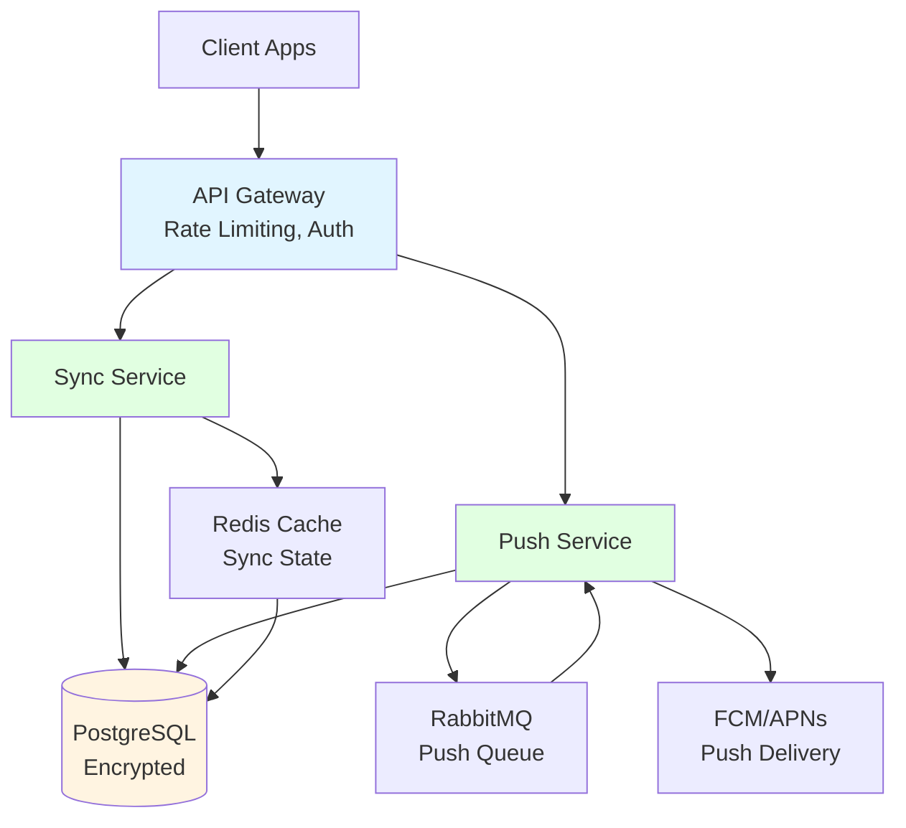

---

## Security Architecture

**Flow Explanation:**

This diagram shows the multi-layer security architecture, including device HSM, encryption at rest, encryption in transit, and zero-knowledge design.

**Security Layers:**

1. **Device HSM**: Hardware-backed encryption (Keychain/Keystore)
2. **Biometric Unlock**: Face ID / fingerprint authentication
3. **Encryption at Rest**: AES-256-GCM for database storage
4. **Encryption in Transit**: TLS 1.3 for all network communication
5. **Zero-Knowledge**: Server never sees plaintext secrets

**Benefits:**

- **Defense in Depth**: Multiple security layers
- **Hardware Security**: Device HSM (tamper-resistant)
- **Privacy**: Zero-knowledge architecture

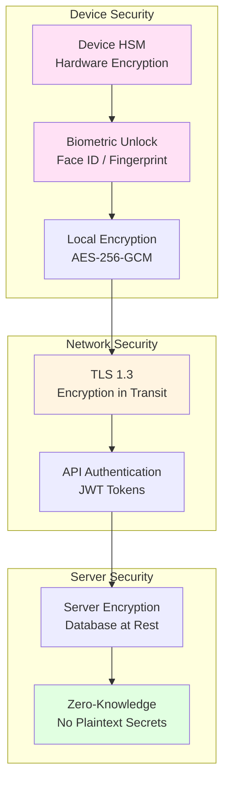

---

## Multi-Region Deployment

**Flow Explanation:**

This diagram shows the multi-region deployment architecture for the sync and push services, ensuring high availability and low latency.

**Regions:**

- **US-East**: Primary region (largest user base)
- **EU-West**: European users
- **AP-South**: Asia-Pacific users

**Components:**

- **Load Balancer**: Routes requests to nearest region
- **Sync Service**: Replicated across regions
- **Database**: Primary-replica setup (async replication)
- **CDN**: Cache account icons and metadata

**Benefits:**

- **High Availability**: 99.9% uptime (any 2 regions up)
- **Low Latency**: Requests routed to nearest region
- **Disaster Recovery**: Failover to other regions

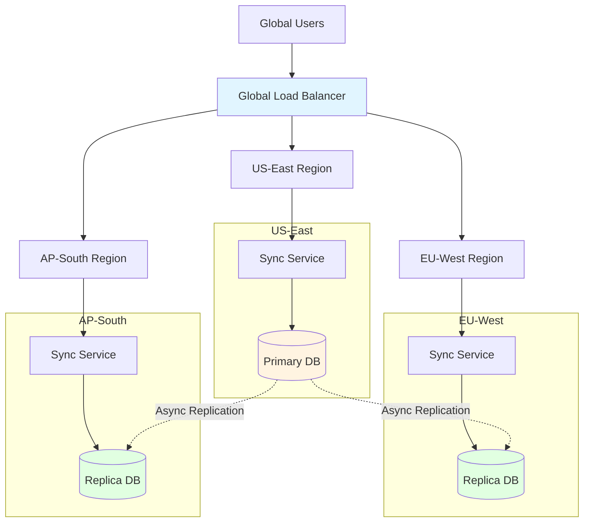

---

## Storage Architecture

**Flow Explanation:**

This diagram shows the storage architecture for both client-side (local database) and server-side (cloud database) storage.

**Client Storage:**

- **SQLite Database**: Encrypted account records
- **Keychain/Keystore**: HSM master keys
- **Cache**: Pre-computed codes, account icons

**Server Storage:**

- **PostgreSQL**: Encrypted account backups, device registrations
- **Redis**: Push tokens, sync state cache
- **Object Storage**: Account icons, metadata files

**Benefits:**

- **Local-First**: Most data stored on device (offline access)
- **Encrypted**: All sensitive data encrypted at rest
- **Scalable**: Server storage scales with user base

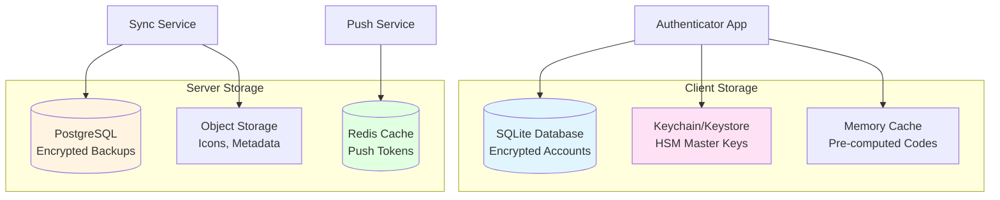

---

## Time Synchronization Flow

**Flow Explanation:**

This diagram shows how the authenticator app handles time synchronization to ensure TOTP codes remain valid even when device clocks drift from the server's time.

**The Problem:**

TOTP codes are time-based (30-second windows). If device clock is off by more than 30 seconds, codes will be rejected. Common causes:
- Device clock manually changed
- Time zone changes
- NTP sync failures
- Device in airplane mode for extended periods

**Solution:**

1. **NTP Sync**: App periodically syncs with NTP servers (when online)
2. **Clock Drift Detection**: Compare device time with server time during code validation
3. **Time Window Tolerance**: Server accepts codes from ±1 time step (90-second window)
4. **Offset Calculation**: Calculate and store time offset for offline use
5. **Fallback**: If NTP unavailable, use server time from API responses

**Steps:**

1. **App Startup**: Check if device time is synchronized
2. **NTP Query**: Query NTP server (pool.ntp.org) for accurate time
3. **Offset Calculation**: Calculate difference between device time and NTP time
4. **Offset Storage**: Store time offset in local database
5. **Code Generation**: Use adjusted time (device_time + offset) for TOTP
6. **Validation**: Server checks code with ±1 time step tolerance
7. **Auto-Correction**: If validation fails, re-sync time and retry

**Benefits:**

- **Resilient**: Handles clock drift gracefully
- **Offline Support**: Stored offset works when offline
- **Automatic**: No user intervention required
- **Secure**: Time sync doesn't expose secrets

**Trade-offs:**

- Requires periodic NTP sync (when online)
- Stored offset may become stale if offline for days

**Performance:**

- NTP query: <100ms (when online)
- Offset calculation: <1ms
- Code generation with offset: <10ms

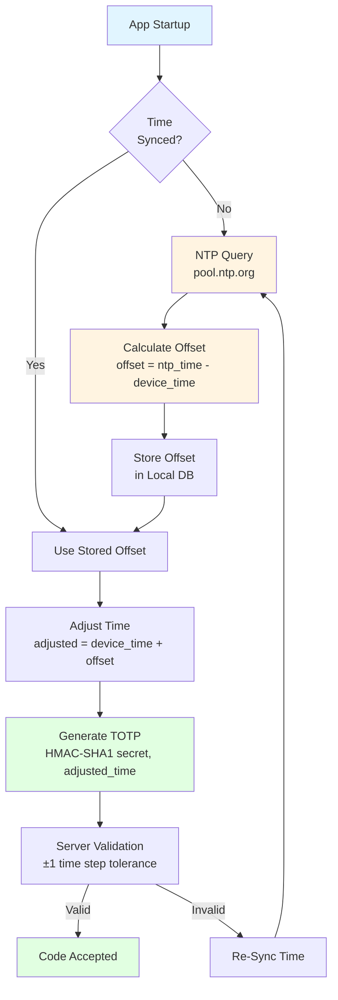

---

## Backup and Restore Flow

**Flow Explanation:**

This diagram shows how users can backup their accounts to the cloud and restore them on a new device, using zero-knowledge encryption where the server never sees plaintext secrets.

**Backup Process:**

1. **User Enables Backup**: User enables cloud backup in settings
2. **Password Entry**: User enters backup password (used to derive encryption key)
3. **Key Derivation**: PBKDF2(password, salt, 100k iterations) → cloud encryption key
4. **Account Encryption**: Encrypt each account with cloud key (separate from HSM encryption)
5. **Metadata Addition**: Add account metadata (issuer, name, icon) to encrypted blob
6. **Upload**: Upload encrypted accounts to server
7. **Verification**: Server stores encrypted data (never sees plaintext)

**Restore Process:**

1. **New Device Setup**: User installs app on new device
2. **Restore Option**: User selects "Restore from Backup"
3. **Password Entry**: User enters same backup password
4. **Key Derivation**: Derive same cloud key using PBKDF2
5. **Download**: Download encrypted accounts from server
6. **Decryption**: Decrypt accounts using cloud key
7. **Re-Encryption**: Re-encrypt with new device's HSM master key
8. **Storage**: Save accounts to new device's local database
9. **Verification**: Generate codes to verify restore successful

**Security Properties:**

- **Zero-Knowledge**: Server never sees plaintext secrets
- **User-Controlled**: User controls encryption key (password)
- **No Password Reset**: If password lost, backup cannot be decrypted (by design)
- **Device-Specific**: Each device has its own HSM master key

**Benefits:**

- **Account Recovery**: Restore accounts if device lost
- **Multi-Device**: Same accounts on all devices
- **Privacy**: Server cannot decrypt accounts
- **User Control**: User owns encryption key

**Trade-offs:**

- **No Password Recovery**: Lost password = lost backup (security feature)
- **Requires Internet**: Backup/restore needs connectivity
- **Password Strength**: Weak password = vulnerable backup

**Performance:**

- Key derivation: ~500ms (PBKDF2, 100k iterations)
- Account encryption: <50ms per account
- Upload/download: Depends on network (typically <2 seconds)
- Total restore: <5 seconds for 10 accounts

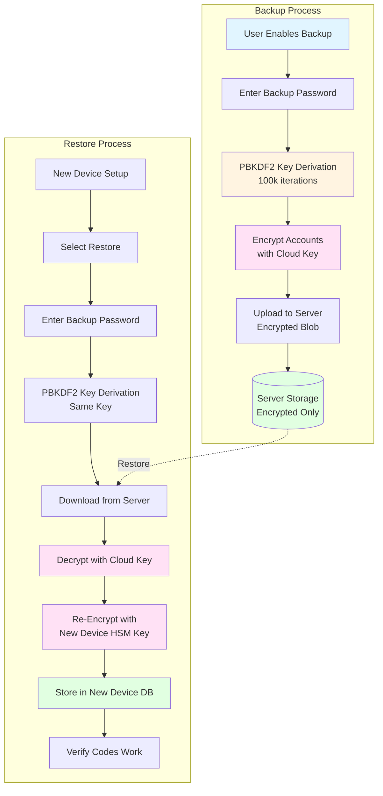

