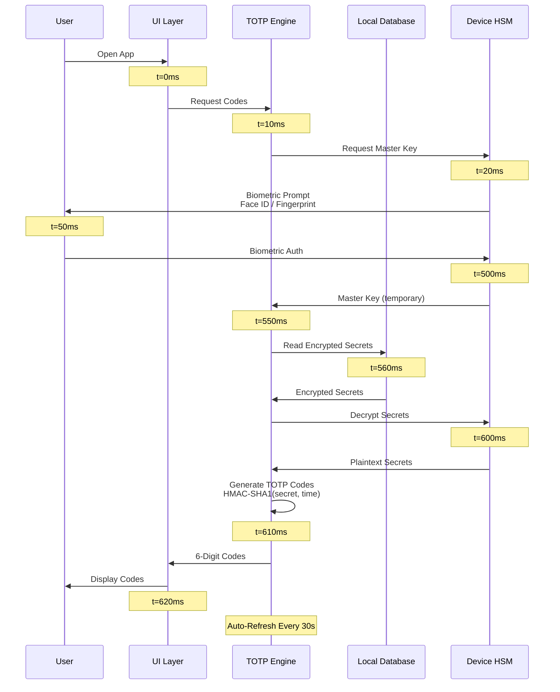
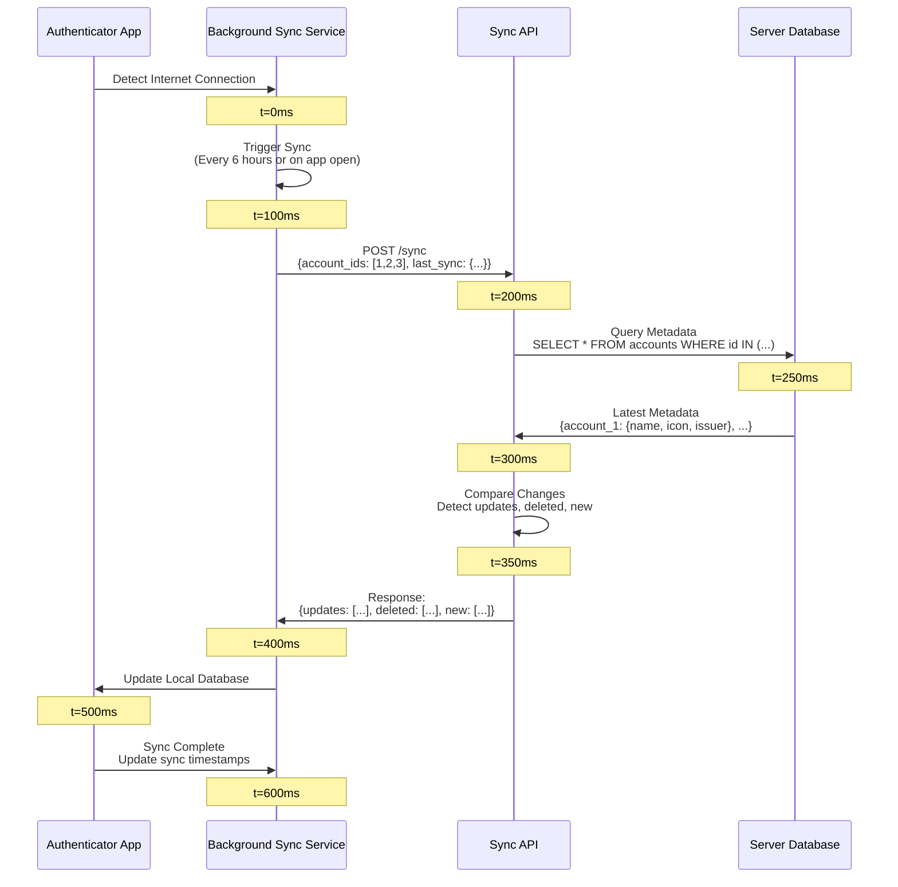
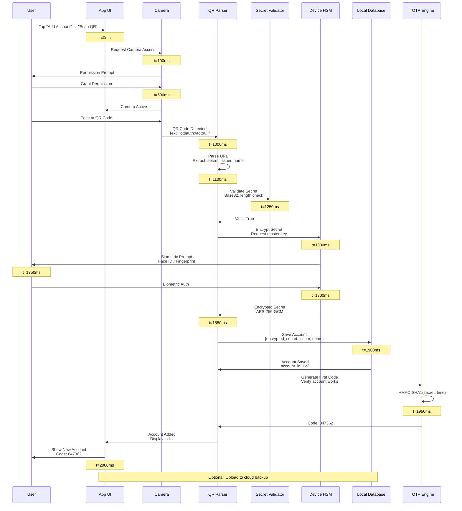
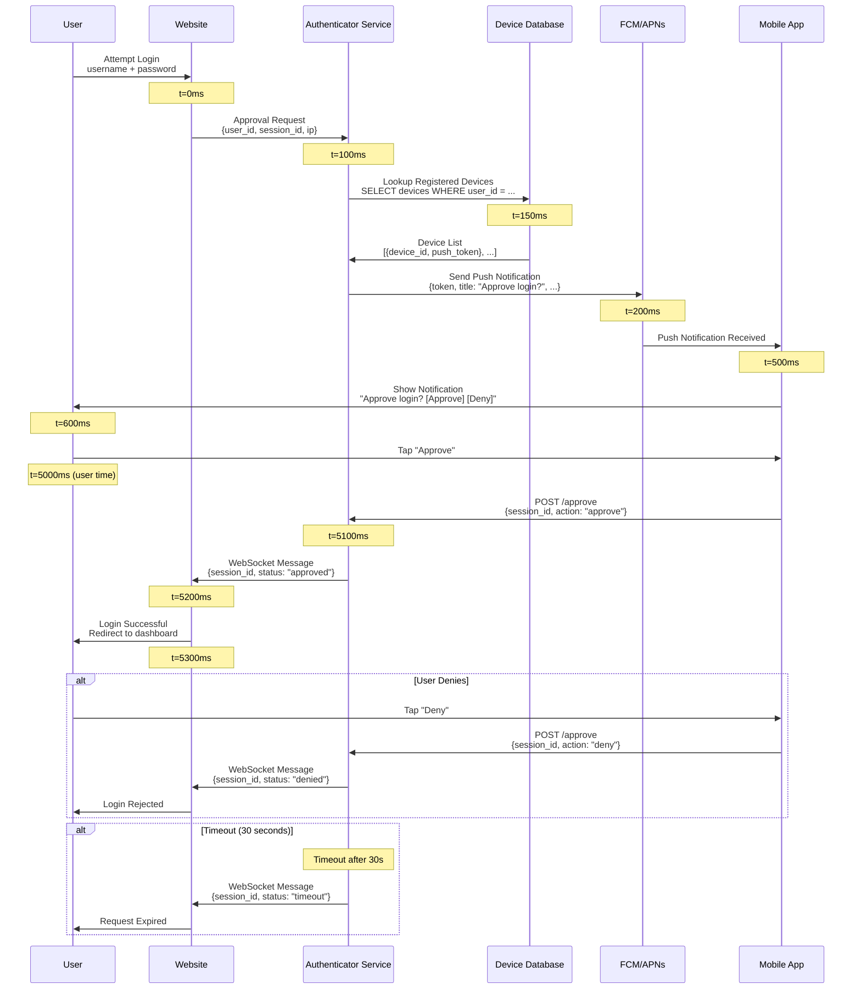
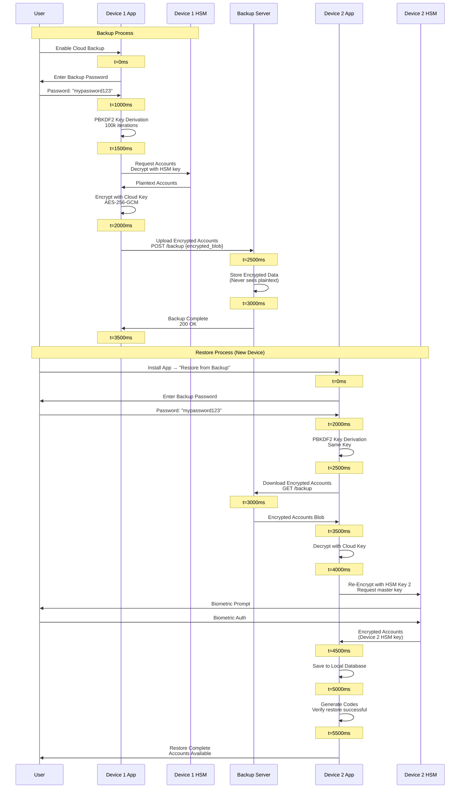

# Authenticator App - Sequence Diagrams

## Table of Contents

1. [Offline Code Generation Flow](#offline-code-generation-flow)
2. [Background Sync Flow](#background-sync-flow)
3. [QR Code Scanning Flow](#qr-code-scanning-flow)
4. [Push Notification Approval Flow](#push-notification-approval-flow)
5. [Backup and Restore Flow](#backup-and-restore-flow)

---

## Offline Code Generation Flow

**Flow:**

Shows the complete sequence of generating TOTP codes offline, from user opening the app to displaying codes, with no network calls required.

**Steps:**

1. **User Opens App** (0ms): User launches authenticator app
2. **UI Requests Codes** (10ms): UI layer requests codes for all accounts
3. **HSM Unlock Request** (20ms): TOTP engine requests master key from device HSM
4. **Biometric Prompt** (50ms): HSM prompts user for biometric authentication
5. **Biometric Auth** (500ms): User authenticates with Face ID / fingerprint
6. **Master Key Returned** (550ms): HSM returns temporary master key to TOTP engine
7. **Read Encrypted Secrets** (560ms): TOTP engine reads encrypted secrets from local database
8. **Secrets Decrypted** (600ms): HSM decrypts secrets using master key
9. **TOTP Generation** (610ms): TOTP engine generates codes using HMAC-SHA1 algorithm
10. **Codes Displayed** (620ms): UI displays 6-digit codes to user
11. **Auto-Refresh** (30s): Codes automatically refresh every 30 seconds

**Performance:**

- Total latency: <1 second (mostly biometric prompt)
- Code generation: <10ms (after HSM unlock)
- Works completely offline (no network calls)

**Key Points:**

- All operations are local (offline-first design)
- Secrets decrypted only when needed (HSM protected)
- Codes auto-refresh every 30 seconds

---

## Background Sync Flow

**Flow:**

Shows the background synchronization process when the app is online, updating account metadata (names, icons, issuer info) without affecting offline code generation.

**Steps:**

1. **Connectivity Detection** (0ms): App detects internet connection available
2. **Sync Trigger** (100ms): Background sync service triggers (every 6 hours, or on app open)
3. **Sync Request** (200ms): App sends account IDs and last sync timestamps to server
4. **Server Query** (250ms): Server queries metadata database for latest account information
5. **Metadata Retrieved** (300ms): Database returns latest metadata (names, icons, issuer)
6. **Change Detection** (350ms): Server compares client timestamps with server data
7. **Response Sent** (400ms): Server returns updates, deleted accounts, new accounts
8. **Local Update** (500ms): App updates local database with new metadata
9. **Sync Complete** (600ms): App updates sync timestamps

**Performance:**

- Total latency: <1 second
- Server processing: <200ms
- Works in background (non-blocking)

**Privacy:**

- Server only sees account IDs and timestamps
- Secrets never sent to server (zero-knowledge architecture)
- Only metadata is synchronized

**Key Points:**

- Non-blocking: Sync happens in background (codes work offline)
- Efficient: Only syncs changed accounts (delta sync)
- Privacy-preserving: Server never sees secrets

---

## QR Code Scanning Flow

**Flow:**

Shows the complete flow of scanning a QR code to add an account to the authenticator app, including camera access, QR parsing, validation, encryption, and storage.

**Steps:**

1. **User Initiates** (0ms): User taps "Add Account" → "Scan QR Code"
2. **Camera Permission** (100ms): App requests camera permission (if not granted)
3. **Permission Granted** (500ms): User grants camera permission
4. **QR Detection** (1000ms): Camera detects QR code pattern
5. **QR Decode** (1100ms): Extract text string from QR code (otpauth:// URL)
6. **URL Validation** (1150ms): Validate URL starts with `otpauth://totp/`
7. **Parse Parameters** (1200ms): Extract secret, issuer, account name, algorithm, digits, period
8. **Secret Validation** (1250ms): Validate secret is Base32 encoded, correct length
9. **HSM Encryption Request** (1300ms): Request HSM master key for encryption
10. **Biometric Prompt** (1350ms): HSM prompts user for biometric authentication
11. **Biometric Auth** (1800ms): User authenticates with Face ID / fingerprint
12. **Secret Encrypted** (1850ms): HSM encrypts secret with master key (AES-256-GCM)
13. **Account Saved** (1900ms): Save encrypted account to local database
14. **Code Verification** (1950ms): Generate first TOTP code to verify account works
15. **Account Displayed** (2000ms): Display new account in account list

**Performance:**

- Total latency: ~2 seconds (mostly camera detection and biometric)
- QR detection: <500ms (depends on camera quality)
- Encryption: <50ms (HSM operation)

**Error Handling:**

- Invalid QR code: Show error "Invalid QR code format"
- Duplicate account: Detect if account already exists
- Camera permission denied: Prompt user to grant permission
- HSM unavailable: Fallback to software encryption (less secure)

**Key Points:**

- Fast setup: One-tap account addition
- Secure: Secret encrypted immediately with HSM
- Validation: Verify account works before saving
- No network: All operations local

---

## Push Notification Approval Flow

**Flow:**

Shows how push notification approvals work (Microsoft Authenticator style), allowing users to approve login requests with a tap instead of entering TOTP codes.

**Steps:**

1. **User Login Attempt** (0ms): User attempts login on website
2. **Approval Request** (100ms): Website sends approval request to authenticator service
3. **Device Lookup** (150ms): Service looks up user's registered devices from database
4. **Push Notification Sent** (200ms): Service sends push notification via FCM/APNs
5. **Notification Received** (500ms): User's device receives push notification
6. **Notification Displayed** (600ms): User sees "Approve login?" notification
7. **User Action** (5000ms): User taps "Approve" or "Deny" (user time)
8. **Response Sent** (5100ms): App sends approval/denial to service
9. **Website Notification** (5200ms): Service notifies website via WebSocket
10. **Login Complete** (5300ms): Website completes or rejects authentication

**Performance:**

- End-to-end latency: <6 seconds (mostly user response time)
- Push delivery: <500ms (FCM/APNs)
- WebSocket notification: <100ms

**Security:**

- 30-second timeout (prevents replay attacks)
- Device verification (only registered devices)
- Rate limiting (max 5 requests per 15 minutes)
- Biometric confirmation (optional, for sensitive accounts)

**Key Points:**

- Convenient: One-tap approval (no typing codes)
- Fast: <2 seconds server processing
- Fallback: TOTP codes always available if push fails
- Secure: Timeout and device verification

---

## Backup and Restore Flow

**Flow:**

Shows how users backup their accounts to the cloud and restore them on a new device, using zero-knowledge encryption where the server never sees plaintext secrets.

**Backup Steps:**

1. **User Enables Backup** (0ms): User enables cloud backup in settings
2. **Password Entry** (1000ms): User enters backup password
3. **Key Derivation** (1500ms): PBKDF2(password, salt, 100k iterations) → cloud encryption key
4. **Account Encryption** (2000ms): Encrypt each account with cloud key (separate from HSM encryption)
5. **Upload Request** (2500ms): Prepare encrypted accounts blob for upload
6. **Server Storage** (3000ms): Server stores encrypted data (never sees plaintext)
7. **Backup Complete** (3500ms): User receives confirmation

**Restore Steps:**

1. **New Device Setup** (0ms): User installs app on new device
2. **Restore Option** (500ms): User selects "Restore from Backup"
3. **Password Entry** (2000ms): User enters same backup password
4. **Key Derivation** (2500ms): Derive same cloud key using PBKDF2
5. **Download Request** (3000ms): Request encrypted accounts from server
6. **Server Response** (3500ms): Server returns encrypted accounts blob
7. **Decryption** (4000ms): Decrypt accounts using cloud key
8. **Re-Encryption** (4500ms): Re-encrypt with new device's HSM master key
9. **Storage** (5000ms): Save accounts to new device's local database
10. **Verification** (5500ms): Generate codes to verify restore successful

**Performance:**

- Key derivation: ~500ms (PBKDF2, 100k iterations)
- Account encryption: <50ms per account
- Upload/download: Depends on network (typically <2 seconds)
- Total restore: <6 seconds for 10 accounts

**Security:**

- Zero-knowledge: Server never sees plaintext secrets
- User-controlled: User controls encryption key (password)
- No password reset: If password lost, backup cannot be decrypted (by design)
- Device-specific: Each device has its own HSM master key

**Key Points:**

- Account recovery: Restore accounts if device lost
- Multi-device: Same accounts on all devices
- Privacy: Server cannot decrypt accounts
- User control: User owns encryption key

