# Single Sign-On (SSO) System - High-Level Design

## Table of Contents

1. [System Architecture Overview](#system-architecture-overview)
2. [OAuth 2.0 / OIDC Architecture](#oauth-20--oidc-architecture)
3. [SAML 2.0 Architecture](#saml-20-architecture)
4. [Token Management Architecture](#token-management-architecture)
5. [Multi-Tenant Architecture](#multi-tenant-architecture)
6. [Identity Federation Architecture](#identity-federation-architecture)
7. [Session Management Architecture](#session-management-architecture)
8. [Token Validation Architecture](#token-validation-architecture)
9. [Database Sharding Architecture](#database-sharding-architecture)
10. [Multi-Region Deployment](#multi-region-deployment)
11. [Security Architecture](#security-architecture)
12. [Caching Architecture](#caching-architecture)

---

## System Architecture Overview

**Flow Explanation:**

This diagram shows the high-level architecture of the SSO system, including authentication APIs, token validation, identity database, and external identity providers.

**Key Components:**

1. **Applications**: Web apps, mobile apps, APIs that use SSO
2. **API Gateway**: Rate limiting, routing, TLS termination
3. **Auth API**: Handles login, token issuance
4. **Token API**: Validates tokens, highest QPS (50k QPS)
5. **User API**: User profile management
6. **Identity Database**: PostgreSQL, sharded by tenant_id
7. **Token Cache**: Redis for fast token validation
8. **External Providers**: Google, Microsoft, LDAP, Active Directory

**Benefits:**

- **Scalability**: Stateless services (horizontal scaling)
- **Performance**: Token caching (95% hit rate)
- **Multi-Protocol**: OAuth, SAML, OIDC support
- **Federation**: Connect with external providers

**Trade-offs:**

- Complexity: Multiple protocols, token management
- Dependency: Relies on external providers for federation

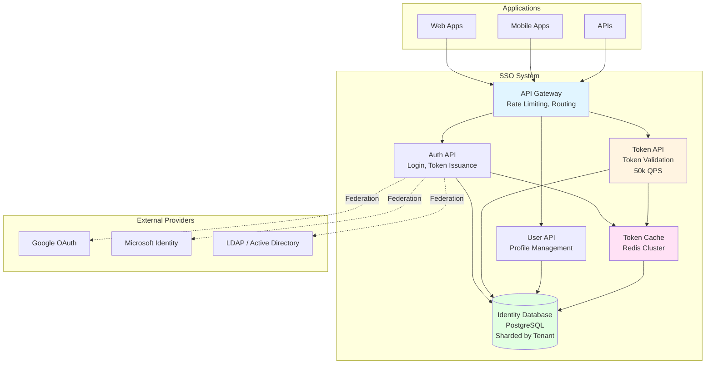

---

## OAuth 2.0 / OIDC Architecture

**Flow Explanation:**

This diagram shows the OAuth 2.0 / OIDC architecture, including authorization server, resource server, and token flow.

**Key Components:**

1. **Authorization Server**: Issues access tokens, refresh tokens, ID tokens
2. **Resource Server**: Validates tokens, serves protected resources
3. **Client Application**: Requests authorization, uses tokens
4. **User**: Grants authorization, authenticates

**Flow:**

1. User requests access → Client redirects to Authorization Server
2. User authenticates → Authorization Server issues authorization code
3. Client exchanges code → Authorization Server issues tokens
4. Client uses access token → Resource Server validates token
5. Resource Server grants access → Returns protected resource

**Benefits:**

- **Stateless**: JWT tokens (no server-side session)
- **Scalable**: Horizontal scaling (no shared state)
- **Secure**: Industry-standard protocol

**Trade-offs:**

- Token revocation: Can't revoke JWT immediately (until expiration)
- Complexity: Multiple grant types, scopes

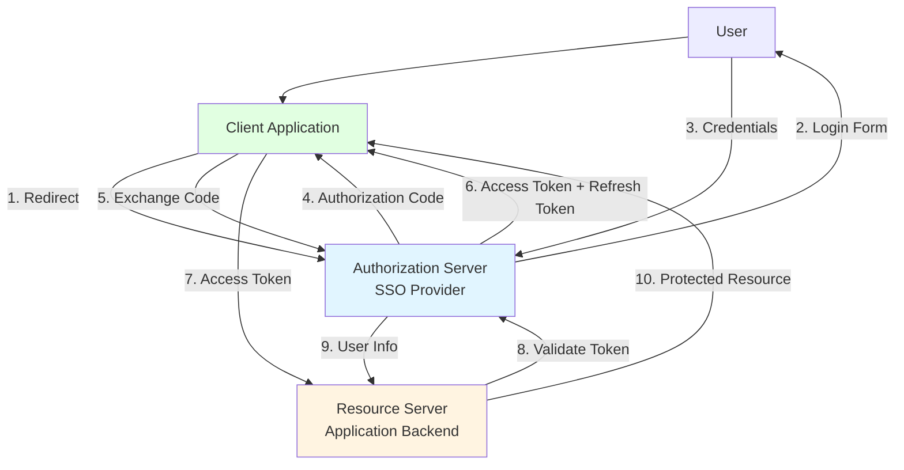

---

## SAML 2.0 Architecture

**Flow Explanation:**

This diagram shows the SAML 2.0 architecture for enterprise SSO, including identity provider (IdP) and service provider (SP).

**Key Components:**

1. **Identity Provider (IdP)**: SSO provider, authenticates users, issues SAML assertions
2. **Service Provider (SP)**: Application, consumes SAML assertions
3. **User**: Accesses application, redirected to IdP for authentication

**Flow:**

1. User accesses application → SP redirects to IdP
2. User authenticates → IdP generates SAML assertion (XML)
3. IdP redirects to SP → SP receives SAML assertion
4. SP validates assertion → Creates session
5. User accesses application → Session-based access

**Benefits:**

- **Enterprise Standard**: Active Directory integration
- **Single Sign-Out**: SLO support
- **Attribute-Based**: Rich user attributes in assertion

**Trade-offs:**

- **Complexity**: XML parsing, complex protocol
- **Performance**: Slower than OAuth (XML overhead)

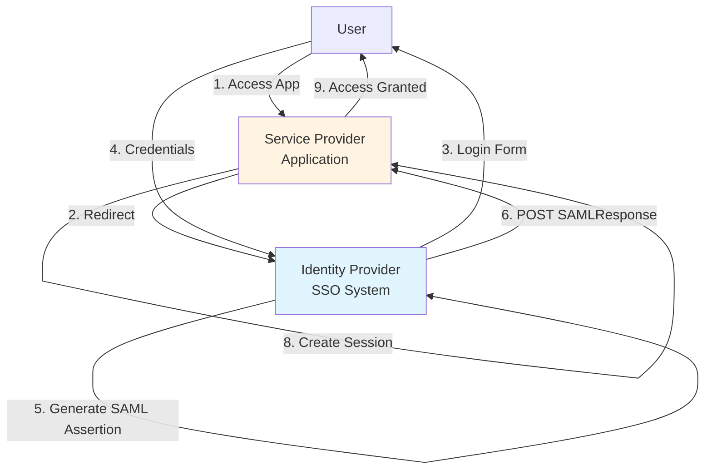

---

## Token Management Architecture

**Flow Explanation:**

This diagram shows the token management architecture, including access tokens, refresh tokens, ID tokens, and token lifecycle.

**Token Types:**

1. **Access Token (JWT)**: Short-lived (15 minutes), contains user info and permissions
2. **Refresh Token**: Long-lived (30 days), used to get new access tokens
3. **ID Token (JWT)**: Contains user identity (OIDC), short-lived (15 minutes)

**Token Storage:**

- **Access Token**: Client-side (HttpOnly cookie or memory)
- **Refresh Token**: HttpOnly cookie (more secure) or encrypted database
- **Token Blacklist**: Redis for revoked tokens (TTL = token expiration)

**Token Rotation:**

- Client uses refresh_token → Server issues new access_token + new refresh_token
- Old refresh_token invalidated → Prevents token theft

**Benefits:**

- **Security**: Short-lived access tokens (limits damage if stolen)
- **User Experience**: Refresh tokens (fewer logins)
- **Revocation**: Token blacklist (immediate revocation)

**Trade-offs:**

- **Complexity**: Token rotation, blacklist management
- **Storage**: Refresh tokens require database storage

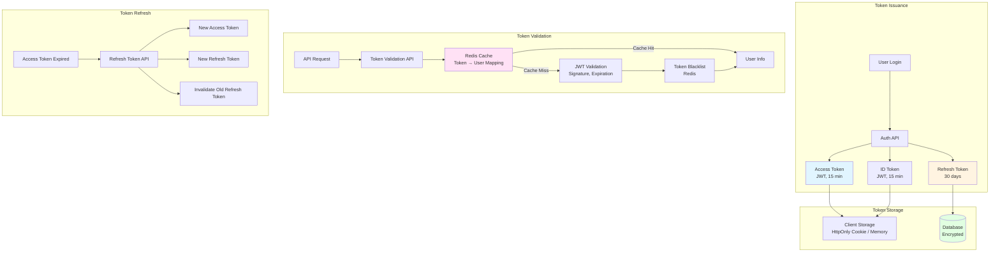

---

## Multi-Tenant Architecture

**Flow Explanation:**

This diagram shows the multi-tenant architecture with tenant isolation, sharding, and data segregation.

**Sharding Strategy:**

- Shard by tenant_id: hash(tenant_id) % 64
- All tenant data on same shard (fast queries)
- Even distribution across shards

**Isolation:**

- Row-level security (PostgreSQL)
- Tenant context in all queries
- Separate client_id per tenant

**Benefits:**

- **Isolation**: Tenant data completely isolated
- **Performance**: Fast queries (all tenant data on same shard)
- **Scalability**: Horizontal scaling (64 shards)

**Trade-offs:**

- **Complexity**: Sharding logic, tenant context management
- **Cross-Tenant Queries**: Difficult (requires querying all shards)

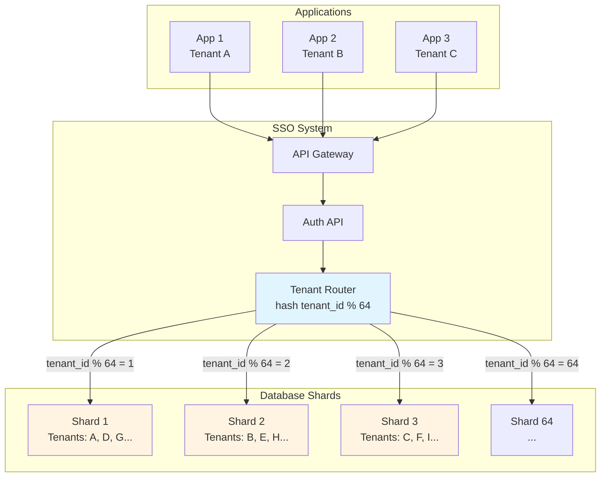

---

## Identity Federation Architecture

**Flow Explanation:**

This diagram shows the identity federation architecture, connecting with external identity providers (Google, Microsoft, LDAP).

**Federation Types:**

1. **Social Login**: Google, Facebook, Microsoft, GitHub, Apple
2. **Enterprise**: LDAP, Active Directory, Azure AD
3. **Other SSO Providers**: Okta, Auth0 (federation)

**Flow:**

1. User selects "Login with Google" → SSO redirects to Google
2. User authenticates with Google → Google returns authorization code
3. SSO exchanges code → Google returns user info
4. SSO creates/links local account → Issues access token
5. User accesses application → Uses SSO access token

**Benefits:**

- **User Experience**: No password creation (uses existing account)
- **Security**: Leverages provider's security (Google, Microsoft)
- **Flexibility**: Multiple identity sources

**Trade-offs:**

- **Dependency**: Relies on external providers (availability)
- **Complexity**: Multiple provider integrations

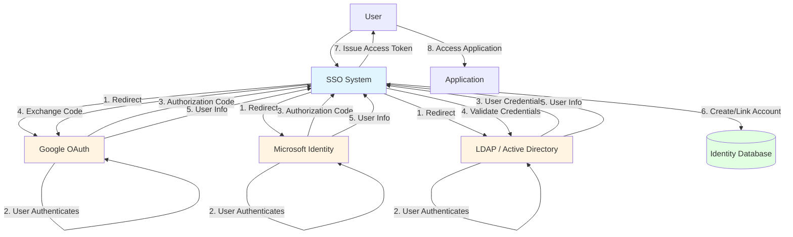

---

## Session Management Architecture

**Flow Explanation:**

This diagram shows the session management architecture, including stateless JWT tokens and stateful refresh tokens.

**Session Types:**

1. **Stateless (JWT)**: Access token contains all user info, no server-side storage
2. **Stateful (Refresh Token)**: Stored in database, can be revoked immediately

**Hybrid Approach:**

- Access token: JWT (stateless, 15 minutes)
- Refresh token: Stateful (Redis/database, 30 days)
- Benefits: Fast validation (JWT), immediate revocation (refresh token)

**Benefits:**

- **Scalability**: Stateless access tokens (horizontal scaling)
- **Revocation**: Stateful refresh tokens (immediate revocation)
- **Performance**: JWT validation (<50ms)

**Trade-offs:**

- **Complexity**: Two token types, different storage strategies
- **Storage**: Refresh tokens require database storage

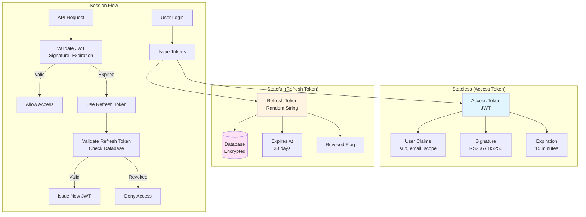

---

## Token Validation Architecture

**Flow Explanation:**

This diagram shows the token validation architecture, including JWT validation, caching, and blacklist checking.

**Validation Flow:**

1. **Cache Lookup**: Check Redis cache (token → user mapping)
2. **Cache Hit**: Return user info (<1ms)
3. **Cache Miss**: Validate JWT signature, expiration, claims
4. **Blacklist Check**: Verify token not revoked
5. **Cache Store**: Store token → user mapping (TTL = token expiration)

**Performance:**

- Cache hit rate: 95% (most tokens validated multiple times)
- Average latency: <5ms (cache hit) vs <50ms (cache miss)
- QPS: 50k QPS (peak)

**Benefits:**

- **Fast**: Redis cache (95% hit rate)
- **Scalable**: Horizontal scaling (Redis cluster)
- **Secure**: JWT signature validation, blacklist checking

**Trade-offs:**

- **Memory**: Redis cache requires memory (token → user mappings)
- **Consistency**: Cache may be stale (acceptable for token validation)

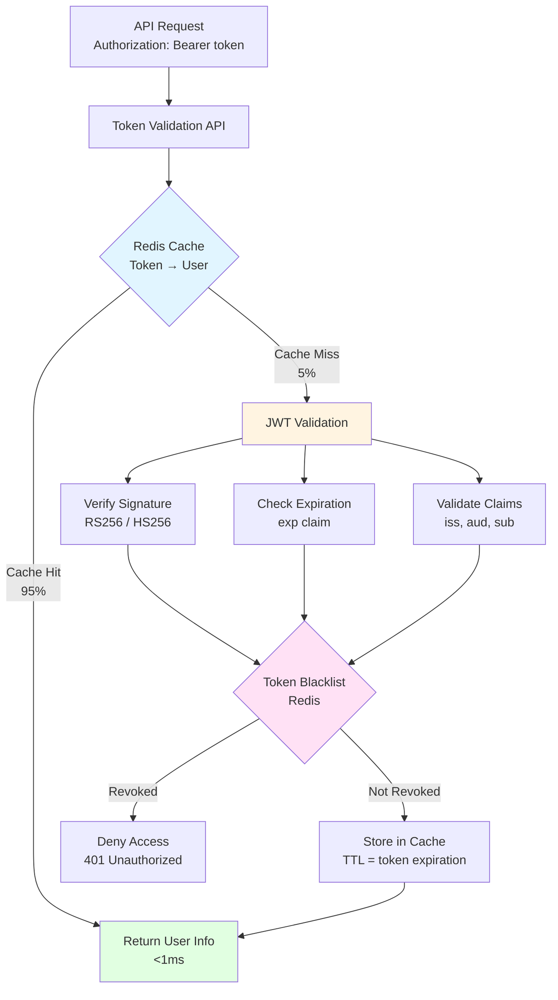

---

## Database Sharding Architecture

**Flow Explanation:**

This diagram shows the database sharding architecture, sharding by tenant_id across 64 shards.

**Sharding Strategy:**

- Shard calculation: hash(tenant_id) % 64
- All tenant data on same shard (users, applications, tokens)
- Even distribution across shards

**Benefits:**

- **Performance**: Fast queries (all tenant data on same shard)
- **Scalability**: Horizontal scaling (64 shards)
- **Isolation**: Tenant data completely isolated

**Trade-offs:**

- **Complexity**: Sharding logic, cross-shard queries difficult
- **Rebalancing**: Difficult if shard distribution becomes uneven

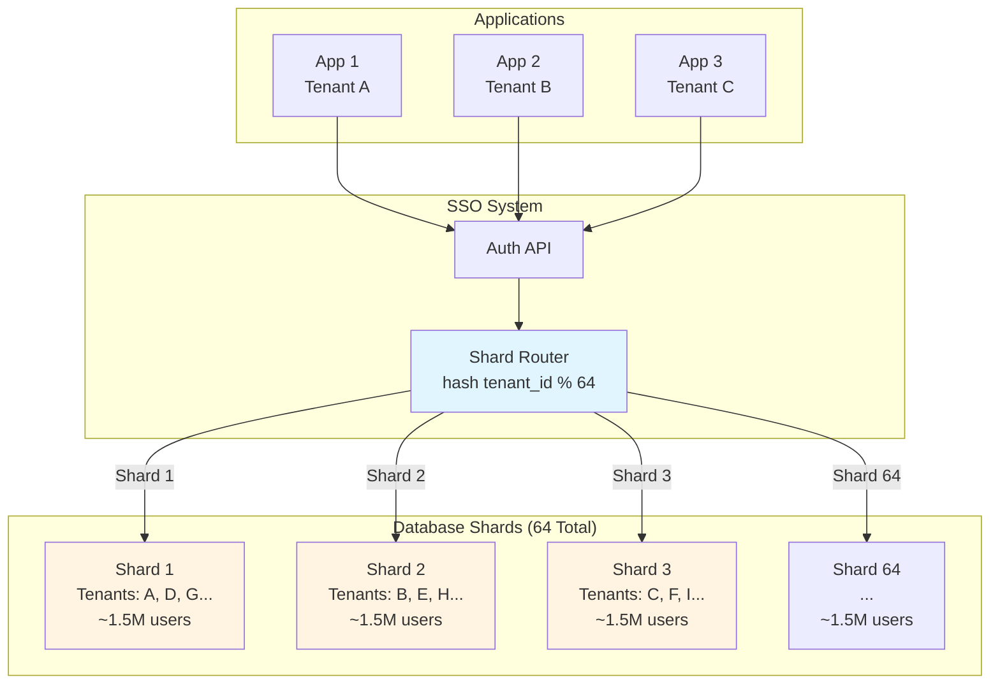

---

## Multi-Region Deployment

**Flow Explanation:**

This diagram shows the multi-region deployment architecture for high availability and low latency.

**Regions:**

- **US-East**: Primary region (70% traffic)
- **EU-West**: Secondary region (20% traffic)
- **AP-South**: Tertiary region (10% traffic)

**Components:**

- **Load Balancer**: Global load balancer (route to nearest region)
- **API Services**: Auto-scaling (2-100 instances per region)
- **Database**: PostgreSQL (primary + read replicas per region)
- **Cache**: Redis Cluster (multi-region replication)

**Benefits:**

- **High Availability**: 99.99% uptime (any 2 regions up)
- **Low Latency**: Requests routed to nearest region
- **Disaster Recovery**: Failover to other regions

**Trade-offs:**

- **Complexity**: Multi-region replication, data consistency
- **Cost**: Higher infrastructure cost (3 regions)

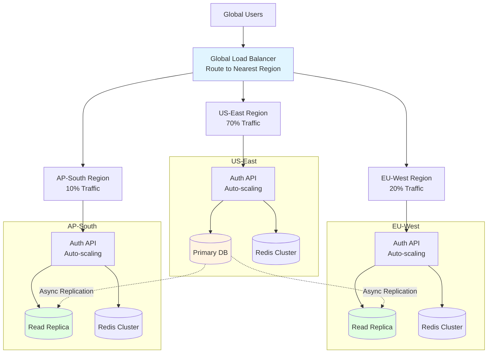

---

## Security Architecture

**Flow Explanation:**

This diagram shows the multi-layer security architecture, including encryption, token signing, and secure storage.

**Security Layers:**

1. **Encryption in Transit**: TLS 1.3 for all network communication
2. **Encryption at Rest**: Database encryption (AES-256-GCM)
3. **Token Signing**: JWT signed with RS256 (RSA) or HS256 (HMAC)
4. **Password Hashing**: bcrypt (cost factor 10, ~100ms)
5. **Token Storage**: HttpOnly cookies (XSS protection)
6. **Rate Limiting**: Prevent brute force attacks

**Benefits:**

- **Defense in Depth**: Multiple security layers
- **Industry Standards**: TLS, bcrypt, JWT signing
- **Compliance**: SOC 2, GDPR, HIPAA

**Security Properties:**

- Passwords never stored in plaintext
- Tokens signed and encrypted
- Secure cookie flags (HttpOnly, Secure, SameSite)

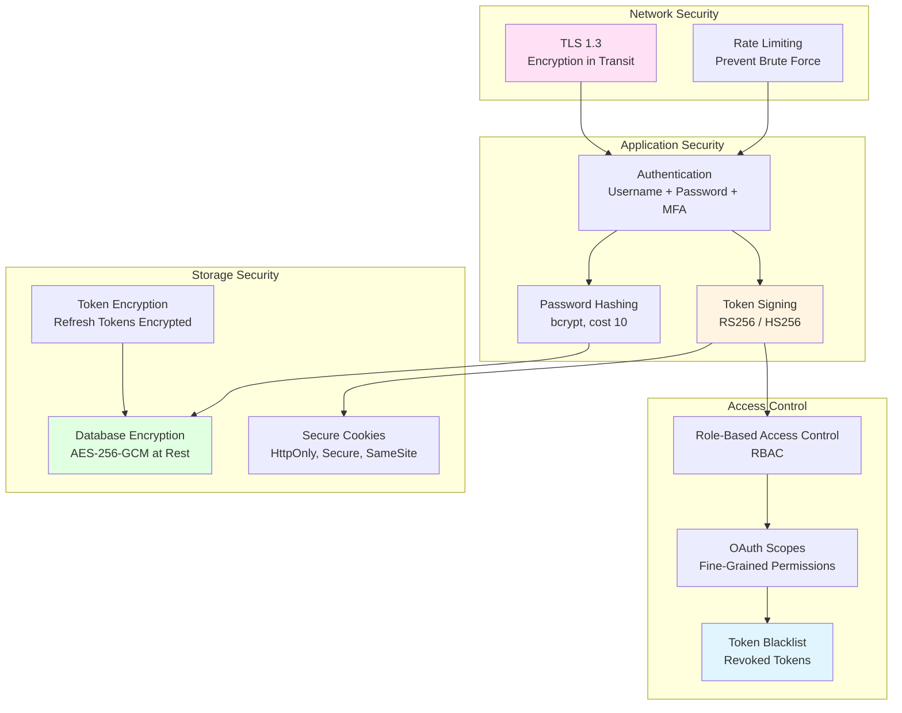

---

## Caching Architecture

**Flow Explanation:**

This diagram shows the caching architecture for token validation, authorization codes, and session data.

**Cache Layers:**

1. **Token Cache**: Access token → user mapping (Redis, 95% hit rate)
2. **Authorization Code Cache**: Code → user mapping (Redis, 10-minute TTL)
3. **Token Blacklist**: Revoked tokens (Redis, TTL = token expiration)
4. **User Profile Cache**: User profile data (Redis, 1-hour TTL)

**Benefits:**

- **Performance**: Fast token validation (<5ms cache hit)
- **Scalability**: Redis cluster (horizontal scaling)
- **Reduced Load**: 95% cache hit rate (reduces database load)

**Trade-offs:**

- **Memory**: Redis cache requires memory (token → user mappings)
- **Consistency**: Cache may be stale (acceptable for token validation)

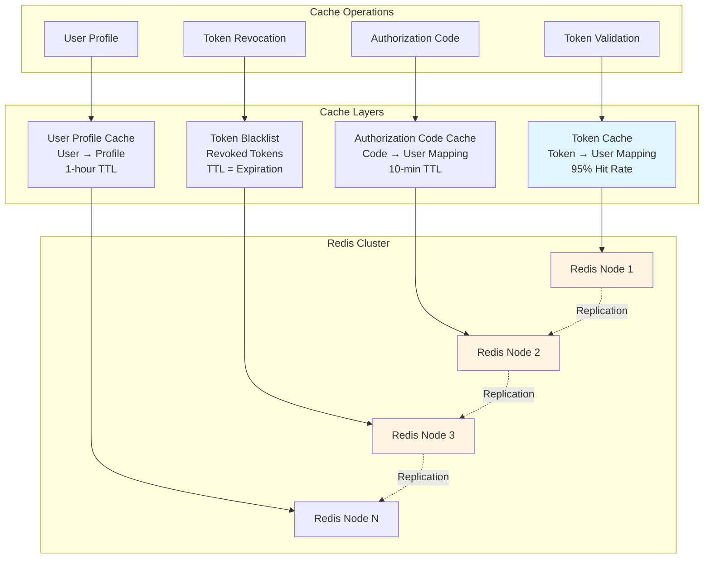

