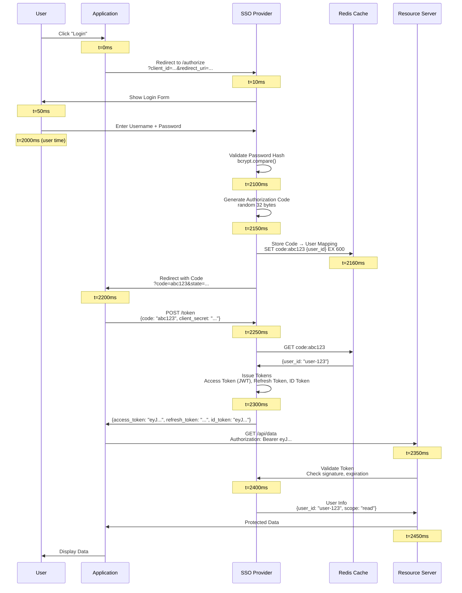
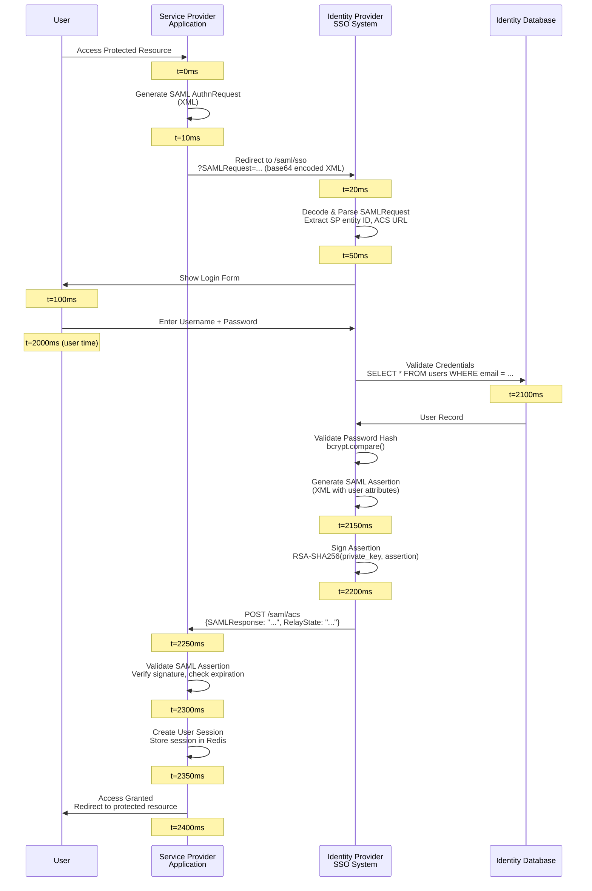
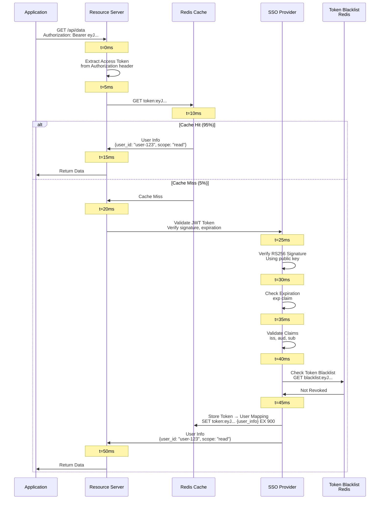
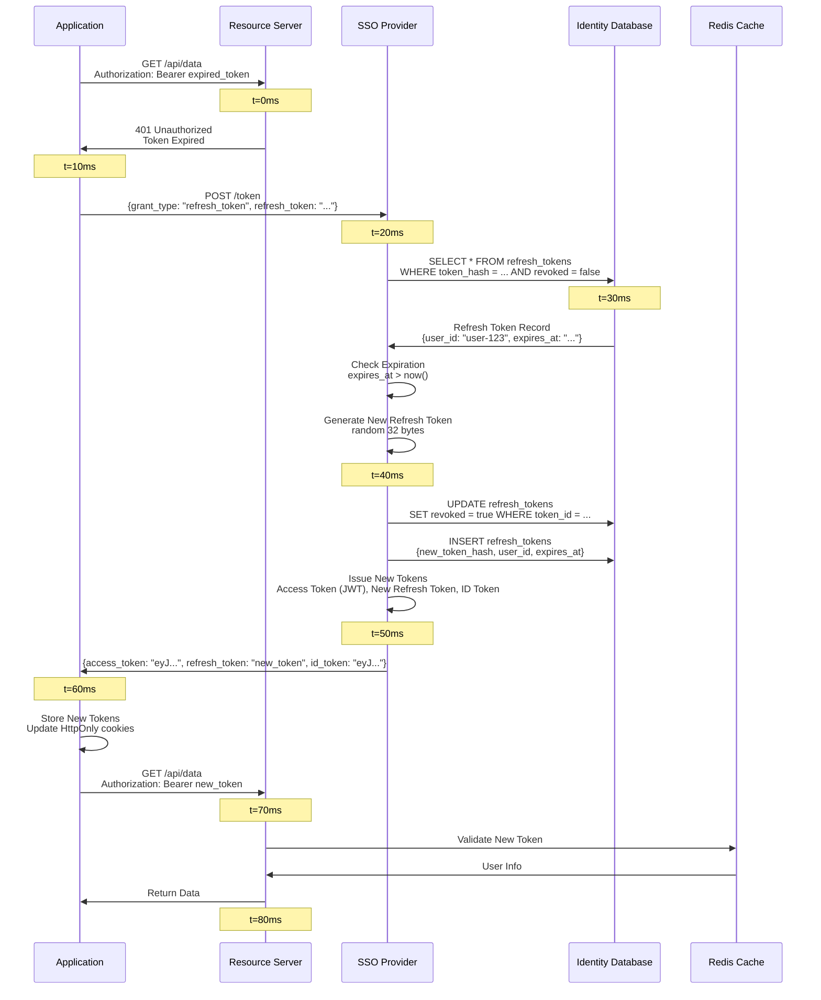
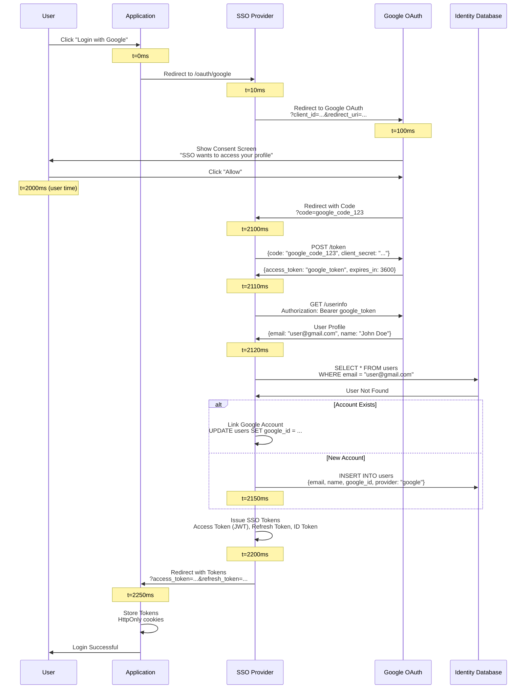
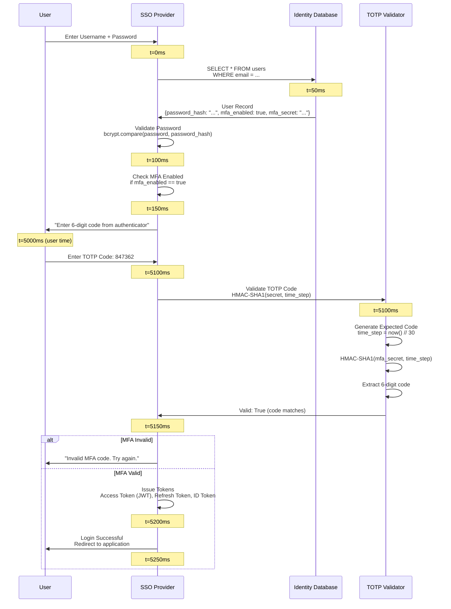
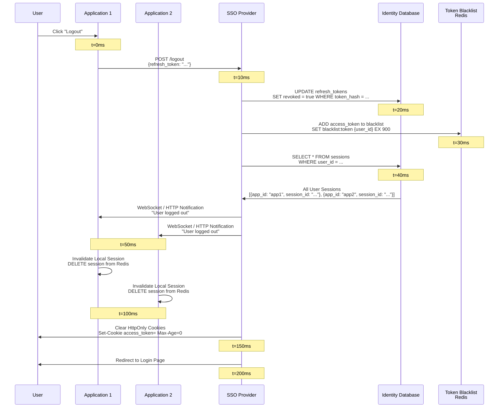
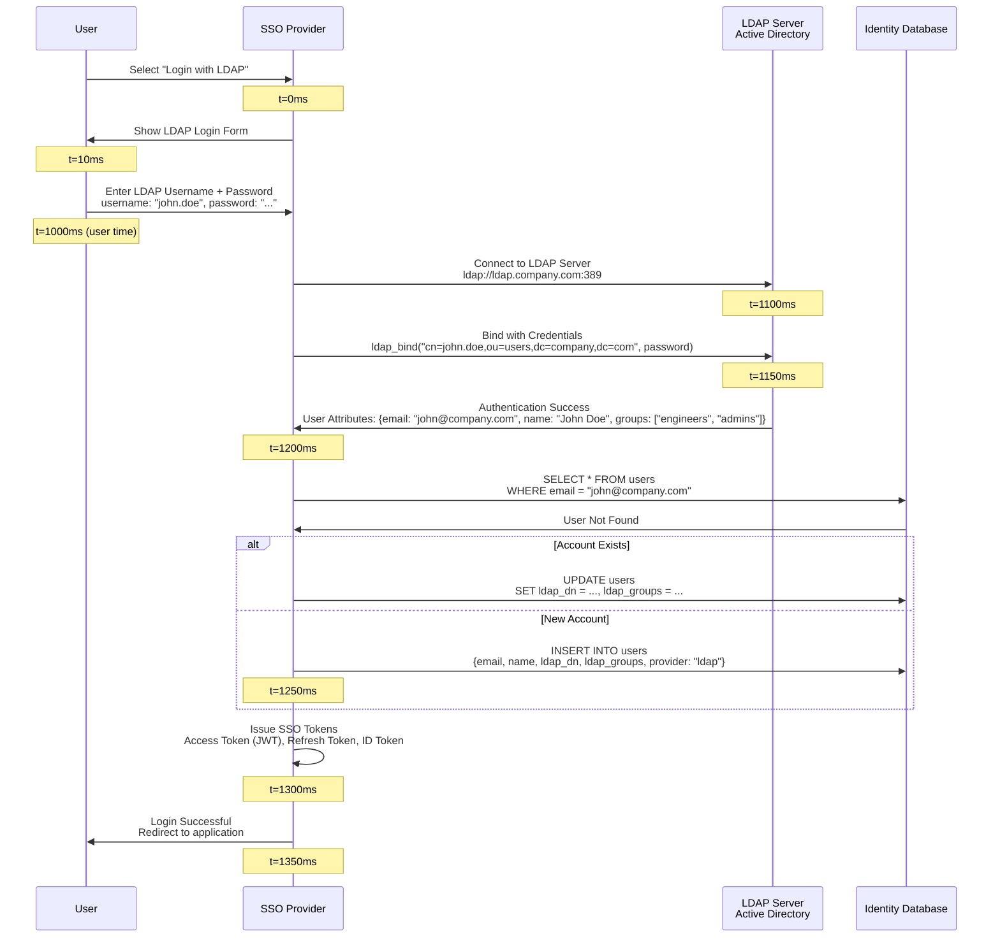

# Single Sign-On (SSO) System - Sequence Diagrams

## Table of Contents

1. [OAuth 2.0 Authorization Code Flow](#oauth-20-authorization-code-flow)
2. [SAML 2.0 SSO Flow](#saml-20-sso-flow)
3. [Token Validation Flow](#token-validation-flow)
4. [Token Refresh Flow](#token-refresh-flow)
5. [Social Login Flow (Google OAuth)](#social-login-flow-google-oauth)
6. [Multi-Factor Authentication (MFA) Flow](#multi-factor-authentication-mfa-flow)
7. [Single Sign-Out (SSO Logout) Flow](#single-sign-out-sso-logout-flow)
8. [Identity Federation Flow (LDAP)](#identity-federation-flow-ldap)

---

## OAuth 2.0 Authorization Code Flow

**Flow:**

Shows the complete OAuth 2.0 Authorization Code Flow, from user login request to accessing protected resources with access token.

**Steps:**

1. **User Requests Access** (0ms): User clicks "Login" on application
2. **Application Redirects** (10ms): Application redirects to SSO /authorize endpoint
3. **SSO Shows Login Form** (50ms): SSO displays login form to user
4. **User Enters Credentials** (2000ms): User enters username + password (user time)
5. **SSO Validates Credentials** (2100ms): SSO validates password hash, checks MFA
6. **SSO Generates Authorization Code** (2150ms): SSO generates random code, stores in Redis (10-min TTL)
7. **SSO Redirects with Code** (2200ms): SSO redirects user to application with authorization_code
8. **Application Exchanges Code** (2250ms): Application sends code + client_secret to SSO /token endpoint
9. **SSO Issues Tokens** (2300ms): SSO validates code, issues access_token (JWT), refresh_token, id_token
10. **Application Uses Access Token** (2350ms): Application uses access_token to access protected resources
11. **Resource Validates Token** (2400ms): Resource server validates JWT signature, expiration
12. **Resource Returns Data** (2450ms): Resource server returns protected data to application

**Performance:**

- Total latency: ~2.5 seconds (mostly user time entering credentials)
- Token issuance: <100ms
- Token validation: <50ms (JWT signature check)

**Security:**

- Authorization code: 10-minute TTL (prevents replay attacks)
- Access token: 15-minute lifetime (limits damage if stolen)
- Refresh token: 30-day lifetime (with rotation)

---

## SAML 2.0 SSO Flow

**Flow:**

Shows the SAML 2.0 SSO flow for enterprise authentication, including SAML request generation, assertion creation, and validation.

**Steps:**

1. **User Accesses Application** (0ms): User tries to access protected resource
2. **Application Generates SAML Request** (10ms): Application generates SAML AuthnRequest (XML)
3. **Application Redirects to SSO** (20ms): Application redirects user to SSO /saml/sso endpoint
4. **SSO Parses SAML Request** (50ms): SSO parses XML, extracts SP entity ID, ACS URL
5. **SSO Shows Login Form** (100ms): SSO displays login form (if user not authenticated)
6. **User Enters Credentials** (2000ms): User enters username + password (user time)
7. **SSO Validates Credentials** (2100ms): SSO validates password, checks MFA
8. **SSO Generates SAML Assertion** (2150ms): SSO creates SAML assertion (XML) with user attributes
9. **SSO Signs Assertion** (2200ms): SSO signs SAML assertion with private key
10. **SSO POSTs to Application** (2250ms): SSO POSTs SAMLResponse to application ACS URL
11. **Application Validates Assertion** (2300ms): Application validates signature, checks expiration
12. **Application Creates Session** (2350ms): Application creates user session
13. **User Accesses Resource** (2400ms): User can now access protected resources

**Performance:**

- Total latency: ~2.4 seconds (mostly user time)
- SAML assertion generation: <100ms
- SAML validation: <50ms

**Security:**

- SAML assertion signed with RSA private key
- Assertion valid for 5 minutes
- NotOnOrAfter timestamp prevents replay

---

## Token Validation Flow

**Flow:**

Shows the token validation flow, including cache lookup, JWT validation, and blacklist checking.

**Steps:**

1. **Application Sends Request** (0ms): Application sends API request with access token
2. **Resource Server Receives Request** (5ms): Resource server extracts access token from Authorization header
3. **Check Redis Cache** (10ms): Resource server checks Redis cache for token → user mapping
4. **Cache Hit (95% of time)** (15ms): If cache hit, return user info immediately
5. **Cache Miss (5% of time)** (20ms): If cache miss, validate JWT signature
6. **Verify JWT Signature** (25ms): Verify RS256 signature using SSO public key
7. **Check Expiration** (30ms): Check exp claim (token not expired)
8. **Validate Claims** (35ms): Validate iss (issuer), aud (audience), sub (subject)
9. **Check Token Blacklist** (40ms): Verify token not in blacklist (Redis)
10. **Store in Cache** (45ms): Store token → user mapping in Redis (TTL = token expiration)
11. **Return User Info** (50ms): Return user info to resource server
12. **Resource Server Grants Access** (55ms): Resource server grants access based on user info

**Performance:**

- Cache hit: <5ms (95% of requests)
- Cache miss: <50ms (5% of requests)
- Average: <10ms

**Key Points:**

- 95% cache hit rate (most tokens validated multiple times)
- JWT validation only on cache miss
- Token blacklist for immediate revocation

---

## Token Refresh Flow

**Flow:**

Shows the token refresh flow when access token expires, including refresh token validation and token rotation.

**Steps:**

1. **Access Token Expired** (0ms): Application receives 401 Unauthorized (token expired)
2. **Application Uses Refresh Token** (10ms): Application sends refresh_token to SSO /token endpoint
3. **SSO Validates Refresh Token** (20ms): SSO checks database for refresh token, validates expiration
4. **Check Token Revoked** (30ms): SSO checks if refresh token is revoked
5. **Token Rotation** (40ms): SSO generates new refresh_token, invalidates old one
6. **Issue New Tokens** (50ms): SSO issues new access_token (JWT), new refresh_token, id_token
7. **Application Updates Tokens** (60ms): Application stores new tokens
8. **Retry Original Request** (70ms): Application retries original request with new access_token
9. **Request Succeeds** (80ms): Resource server validates new token, grants access

**Performance:**

- Total latency: <100ms
- Token rotation: <50ms
- Prevents token theft (old refresh token invalidated)

**Security:**

- Refresh token rotation (new token on each use)
- Old refresh token invalidated immediately
- Detects token theft (if old token used, it's revoked)

---

## Social Login Flow (Google OAuth)

**Flow:**

Shows the social login flow using Google OAuth, including OAuth redirect, user consent, and account linking.

**Steps:**

1. **User Clicks "Login with Google"** (0ms): User selects Google as identity provider
2. **SSO Redirects to Google** (10ms): SSO redirects user to Google OAuth endpoint
3. **Google Shows Consent Screen** (100ms): Google displays consent screen to user
4. **User Grants Permission** (2000ms): User clicks "Allow" (user time)
5. **Google Redirects with Code** (2100ms): Google redirects to SSO callback with authorization code
6. **SSO Exchanges Code** (2110ms): SSO exchanges code for access token with Google
7. **SSO Gets User Info** (2120ms): SSO uses access token to get user profile from Google
8. **SSO Creates/Links Account** (2150ms): SSO creates local account or links to existing account
9. **SSO Issues Tokens** (2200ms): SSO issues access_token, refresh_token, id_token
10. **Application Receives Tokens** (2250ms): Application receives tokens, user can access resources

**Performance:**

- Total latency: ~2.3 seconds (mostly user time)
- Google OAuth: <200ms
- Account creation/linking: <50ms

**Key Points:**

- No password required (uses Google account)
- Account linking (if user already has SSO account)
- JIT provisioning (create account on first login)

---

## Multi-Factor Authentication (MFA) Flow

**Flow:**

Shows the MFA flow after initial password authentication, including TOTP code validation.

**Steps:**

1. **User Enters Password** (0ms): User enters username + password
2. **SSO Validates Password** (50ms): SSO validates password hash using bcrypt
3. **SSO Checks MFA Enabled** (100ms): SSO checks if user has MFA enabled
4. **SSO Requests MFA Code** (150ms): SSO prompts user for MFA code (TOTP)
5. **User Enters TOTP Code** (5000ms): User opens authenticator app, enters 6-digit code (user time)
6. **SSO Validates TOTP** (5100ms): SSO validates TOTP code using HMAC-SHA1
7. **MFA Valid** (5150ms): TOTP code valid, proceed with authentication
8. **SSO Issues Tokens** (5200ms): SSO issues access_token, refresh_token, id_token
9. **User Authenticated** (5250ms): User can now access applications

**Performance:**

- Total latency: ~5.3 seconds (mostly user time entering TOTP)
- Password validation: <100ms
- TOTP validation: <10ms

**Security:**

- MFA required for sensitive accounts
- TOTP time window: ±1 time step (90 seconds)
- Rate limiting: Max 5 MFA attempts per 15 minutes

---

## Single Sign-Out (SSO Logout) Flow

**Flow:**

Shows the single sign-out flow, invalidating all sessions and tokens across all applications.

**Steps:**

1. **User Clicks Logout** (0ms): User clicks "Logout" on any application
2. **Application Sends Logout Request** (10ms): Application sends logout request to SSO
3. **SSO Invalidates Refresh Token** (20ms): SSO marks refresh token as revoked in database
4. **SSO Adds to Blacklist** (30ms): SSO adds access token to blacklist (Redis, TTL = token expiration)
5. **SSO Gets All Sessions** (40ms): SSO retrieves all user sessions from database
6. **SSO Notifies Applications** (50ms): SSO sends logout notifications to all applications (WebSocket/HTTP)
7. **Applications Invalidate Sessions** (100ms): Applications invalidate local sessions
8. **SSO Clears Cookies** (150ms): SSO clears HttpOnly cookies
9. **User Logged Out** (200ms): User logged out from all applications

**Performance:**

- Total latency: <200ms
- Token revocation: <50ms
- Application notifications: <100ms

**Key Points:**

- Single sign-out (logout from all apps)
- Token blacklist (immediate revocation)
- Session invalidation across all applications

---

## Identity Federation Flow (LDAP)

**Flow:**

Shows the identity federation flow with LDAP/Active Directory, including LDAP authentication and account linking.

**Steps:**

1. **User Selects LDAP Login** (0ms): User selects "Login with LDAP"
2. **SSO Shows LDAP Form** (10ms): SSO displays LDAP login form
3. **User Enters LDAP Credentials** (1000ms): User enters LDAP username + password (user time)
4. **SSO Connects to LDAP** (1100ms): SSO connects to LDAP server
5. **SSO Authenticates with LDAP** (1150ms): SSO binds to LDAP with user credentials
6. **LDAP Returns User Attributes** (1200ms): LDAP returns user attributes (email, name, groups)
7. **SSO Creates/Links Account** (1250ms): SSO creates local account or links to existing account
8. **SSO Issues Tokens** (1300ms): SSO issues access_token, refresh_token, id_token
9. **User Authenticated** (1350ms): User can now access applications

**Performance:**

- Total latency: ~1.4 seconds
- LDAP bind: <100ms
- Account creation/linking: <50ms

**Key Points:**

- Enterprise authentication (Active Directory integration)
- Account linking (if user already has SSO account)
- User attributes from LDAP (groups, roles)

