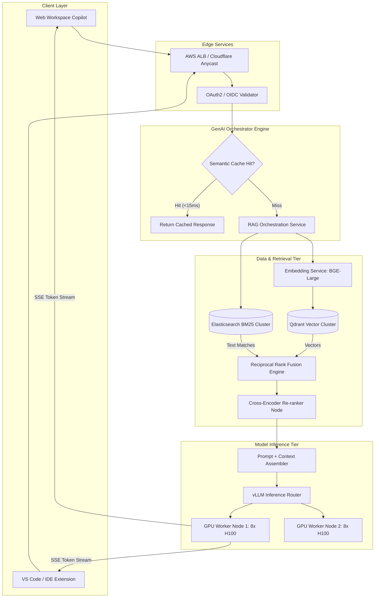
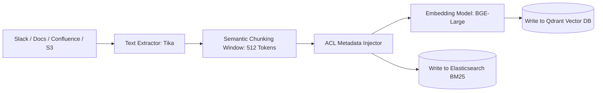
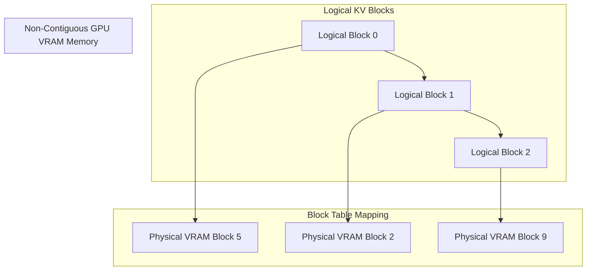

# HLD Architecture Diagrams: Enterprise LLM & RAG Copilot

## 1. End-to-End System Architecture

```mermaid
flowchart TD
    subgraph Client Layer
        Web[Web Workspace Copilot]
        IDE[VS Code / IDE Extension]
    end

    subgraph Edge Services
        LB[AWS ALB / Cloudflare Anycast]
        Auth[OAuth2 / OIDC Validator]
    end

    Web --> LB
    IDE --> LB
    LB --> Auth

    subgraph GenAI Orchestrator Engine
        Auth --> CacheCheck{Semantic Cache Hit?}
        CacheCheck -- Hit (<15ms) --> ReturnCache[Return Cached Response]
        CacheCheck -- Miss --> RAGOrchestrator[RAG Orchestration Service]
    end

    subgraph Data & Retrieval Tier
        RAGOrchestrator --> EmbSvc[Embedding Service: BGE-Large]
        EmbSvc --> Qdrant[(Qdrant Vector Cluster)]
        RAGOrchestrator --> ES[(Elasticsearch BM25 Cluster)]
        
        Qdrant -- Vectors --> RRF[Reciprocal Rank Fusion Engine]
        ES -- Text Matches --> RRF
        RRF --> Reranker[Cross-Encoder Re-ranker Node]
    end

    subgraph Model Inference Tier
        Reranker --> PromptAssembly[Prompt + Context Assembler]
        PromptAssembly --> vLLMCluster[vLLM Inference Router]
        
        vLLMCluster --> GPU1[GPU Worker Node 1: 8x H100]
        vLLMCluster --> GPU2[GPU Worker Node 2: 8x H100]
    end

    GPU1 -- SSE Token Stream --> Web
    GPU1 -- SSE Token Stream --> IDE
```

## 2. Document Ingestion & Chunking Pipeline

```mermaid
flowchart LR
    Source[Slack / Docs / Confluence / S3] --> Extractor[Text Extractor: Tika]
    Extractor --> Chunker[Semantic Chunking Window: 512 Tokens]
    Chunker --> ACLInjector[ACL Metadata Injector]
    ACLInjector --> EmbGen[Embedding Model: BGE-Large]
    EmbGen --> QdrantWrite[(Write to Qdrant Vector DB)]
    ACLInjector --> ESWrite[(Write to Elasticsearch BM25)]
```

## 3. PagedAttention KV Cache Allocation

```mermaid
flowchart TD
    subgraph Logical KV Blocks
        B0[Logical Block 0] --> B1[Logical Block 1] --> B2[Logical Block 2]
    end

    subgraph Block Table Mapping
        B0 --> P5[Physical Page 5]
        B1 --> P2[Physical Page 2]
        B2 --> P9[Physical Page 9]
    end

    subgraph Non-Contiguous GPU VRAM Memory
        P2[Physical VRAM Block 2]
        P5[Physical VRAM Block 5]
        P9[Physical VRAM Block 9]
    end
```
