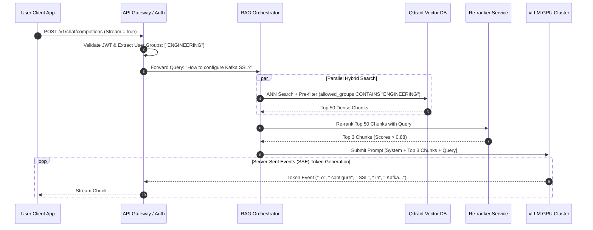

# Sequence Diagrams: Enterprise LLM & RAG Copilot

## 1. RAG Retrieval & Token Streaming Sequence

```mermaid
sequenceDiagram
    autonumber
    participant Client as User Client App
    participant Gateway as API Gateway / Auth
    participant RAG as RAG Orchestrator
    participant Qdrant as Qdrant Vector DB
    participant Reranker as Re-ranker Service
    participant vLLM as vLLM GPU Cluster

    Client->>Gateway: POST /v1/chat/completions (Stream = true)
    Gateway->>Gateway: Validate JWT & Extract User Groups: ["ENGINEERING"]
    Gateway->>RAG: Forward Query: "How to configure Kafka SSL?"
    
    par Parallel Hybrid Search
        RAG->>Qdrant: ANN Search + Pre-filter (allowed_groups CONTAINS "ENGINEERING")
        Qdrant-->>RAG: Top 50 Dense Chunks
    end

    RAG->>Reranker: Re-rank Top 50 Chunks with Query
    Reranker-->>RAG: Top 3 Chunks (Scores > 0.88)

    RAG->>vLLM: Submit Prompt [System + Top 3 Chunks + Query]
    
    loop Server-Sent Events (SSE) Token Generation
        vLLM-->>Gateway: Token Event ("To", " configure", " SSL", " in", " Kafka...")
        Gateway-->>Client: Stream Chunk
    end
```
