# Stock Exchange Matching Engine - Sequence Diagrams

## Table of Contents

1. [Limit Order Submission (Happy Path)](#1-limit-order-submission-happy-path)
2. [Market Order Execution (Immediate Match)](#2-market-order-execution-immediate-match)
3. [Partial Fill Scenario](#3-partial-fill-scenario)
4. [Order Cancellation](#4-order-cancellation)
5. [Flash Crash Circuit Breaker](#5-flash-crash-circuit-breaker)
6. [Matching Engine Crash Recovery](#6-matching-engine-crash-recovery)
7. [Multi-Level Matching (Price Walking)](#7-multi-level-matching-price-walking)
8. [IOC Order (Immediate-or-Cancel)](#8-ioc-order-immediate-or-cancel)
9. [Market Data Fanout](#9-market-data-fanout)
10. [Audit Log Async Write](#10-audit-log-async-write)
11. [Hot Standby Failover](#11-hot-standby-failover)
12. [DPDK Packet Processing](#12-dpdk-packet-processing)

---

## 1. Limit Order Submission (Happy Path)

**Flow:**

Shows the complete flow of a limit order submission from client to order book, with all latency breakdowns.

**Steps:**

1. **Client Request** (0μs): Trader submits limit order (BUY 100 shares @ $100.50) via FIX protocol
2. **Gateway Receive** (5μs): DPDK kernel bypass receives packet, validates JWT token (cached in memory)
3. **Order Validation** (10μs): Check order size limits, price collar, account balance
4. **Ring Buffer Enqueue** (15μs): Lock-free enqueue to shared memory queue (atomic CAS operation)
5. **Matching Engine Dequeue** (20μs): Single-threaded engine polls ring buffer, dequeues order
6. **Order Book Insert** (50μs): Red-Black Tree insert at price $100.50, append to linked list (no match, passive order)
7. **Audit Log Write** (55μs): Async write to ring buffer (non-blocking, background thread handles disk flush)
8. **ACK to Client** (60μs): Order accepted, assigned order_id, sent back via TCP
9. **Market Data Publish** (80μs): Top-of-book update published to Kafka (if best bid/ask changed)
10. **Ledger Update** (1ms): Async Kafka consumer updates PostgreSQL ledger (eventual consistency)

**Performance:**

- **Client response:** 60μs (user sees order accepted)
- **Order book updated:** 50μs
- **Fully durable:** 1-10ms (audit log flushed to disk)

**Trade-offs:**

- ✅ **Fast acknowledgment:** Client doesn't wait for disk I/O
- ⚠️ **Eventual durability:** Last 1-10ms at risk if crash (mitigated by battery-backed cache)

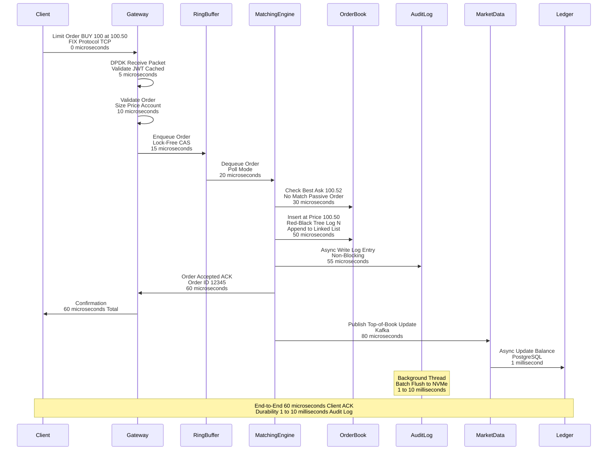

---

## 2. Market Order Execution (Immediate Match)

**Flow:**

Shows a market order that executes immediately against the best available price in the order book.

**Steps:**

1. **Client Request** (0μs): Trader submits market order (SELL 100 shares at market price)
2. **Gateway Processing** (10μs): Validates order, enqueues to ring buffer
3. **Matching Engine Dequeue** (15μs): Polls ring buffer, receives market order
4. **Best Bid Lookup** (20μs): O(1) lookup (cached at tree root) - Best bid = $100.50 with 100 shares
5. **Execute Match** (30μs): Remove best bid order from book, generate execution event
6. **Update Order Book** (35μs): Remove filled order from tree and hash map
7. **Audit Log Write** (40μs): Log both the market order and execution event (async)
8. **Execution Report** (50μs): Send execution report to both buyer and seller
9. **Market Data Publish** (60μs): Broadcast trade execution (price $100.50, volume 100) + new best bid
10. **Ledger Update** (1ms): Credit seller account, debit buyer account (async, ACID in PostgreSQL)

**Performance:**

- **Execution latency:** 30μs (from dequeue to match)
- **Client notification:** 50μs
- **Market data broadcast:** 60μs

**Key Insight:**

Market orders execute at best available price, not a fixed price. In this case, seller gets $100.50 (best bid).

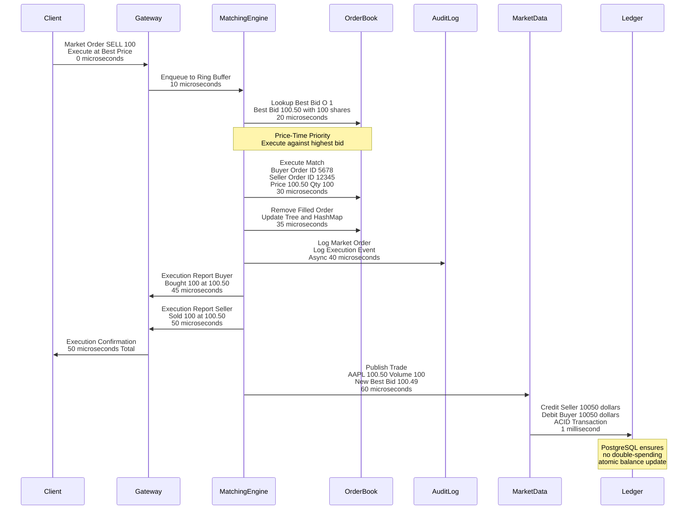

---

## 3. Partial Fill Scenario

**Flow:**

Shows a large order that partially matches against available liquidity, with the remainder staying in the order book.

**Steps:**

1. **Large Order** (0μs): Client submits SELL 500 shares at $100.48 (aggressive limit order)
2. **First Match** (20μs): Best bid is $100.50 with 100 shares - MATCH (buyer's order fully filled, removed)
3. **Second Match** (30μs): Next best bid is $100.49 with 200 shares - MATCH (buyer's order fully filled, removed)
4. **Third Match** (40μs): Next best bid is $100.49 with 150 shares - PARTIAL MATCH (buyer has 150, seller needs 200)
5. **Remaining** (45μs): Seller order still has 200 shares unfilled (500 - 100 - 200 = 200)
6. **Insert Remainder** (55μs): Insert remaining 200 shares at price $100.48 into ask side of order book
7. **Status Update** (60μs): Order status = PARTIAL_FILL (filled_quantity = 300, remaining = 200)
8. **Execution Reports** (70μs): Send 3 execution reports (one for each match) to all parties
9. **Market Data** (80μs): Publish 3 trade executions + updated order book depth
10. **Client Notification** (90μs): Send partial fill notification to seller

**Performance:**

- **Multi-level matching:** 40μs for 3 matches (13μs per match)
- **Tree updates:** 3 deletions + 1 insertion = 4 × O(log N)

**Key Insight:**

Large orders "walk the book" - executing at multiple price levels until fully filled or liquidity exhausted.

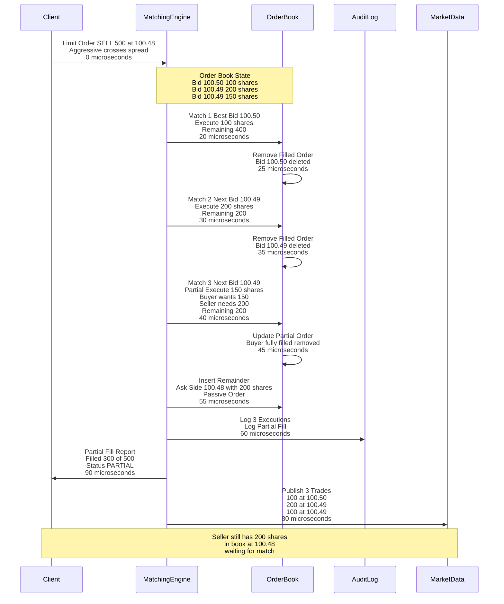

---

## 4. Order Cancellation

**Flow:**

Shows a client cancelling an existing order in the order book.

**Steps:**

1. **Cancel Request** (0μs): Client sends cancel request for order_id 12345
2. **Gateway Validation** (5μs): Verify client owns order_id 12345 (lookup in hash map)
3. **Matching Engine Dequeue** (10μs): Receives cancel request from ring buffer
4. **Hash Map Lookup** (15μs): O(1) lookup in orders hash map - finds order_id 12345 at price $100.50
5. **Remove from Order Book** (25μs): Remove from linked list (O(1)) + update tree if price level now empty (O(log N))
6. **Update Status** (30μs): Set order status = CANCELLED
7. **Audit Log** (35μs): Log cancellation event (async)
8. **ACK to Client** (40μs): Cancellation confirmed
9. **Market Data** (50μs): Publish top-of-book update if best bid/ask changed
10. **Ledger Update** (1ms): Release reserved balance (async)

**Performance:**

- **Cancellation latency:** 40μs (hash map lookup + tree/list removal)
- **No matching required:** Faster than execution

**Edge Case:**

If order already partially filled, only cancel the remaining quantity. Return partial fill status.

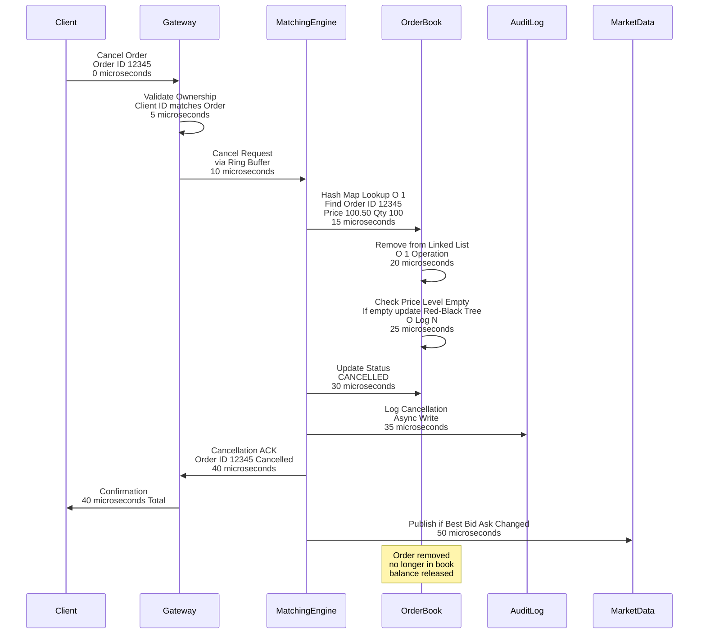

---

## 5. Flash Crash Circuit Breaker

**Flow:**

Shows the circuit breaker system detecting abnormal price movement and halting trading to prevent a flash crash.

**Steps:**

1. **Normal Trading** (0s): AAPL trading at $100.50, VWAP (volume-weighted average price) = $100.45
2. **Price Drop** (60s): Series of sell orders execute, price drops to $95.00 (5.5% drop)
3. **Monitor Detection** (120s): Monitor thread (runs every 1 second) detects price drop >5% in 2 minutes
4. **Level 1 Warning** (121s): Circuit breaker Level 1 triggered - slow down order acceptance (rate limiting)
5. **Continued Drop** (180s): Price continues to drop to $88.00 (12.5% drop from VWAP)
6. **Level 2 Halt** (181s): Circuit breaker Level 2 triggered - HALT trading
7. **Reject Orders** (182s): All new orders rejected with "Trading Halted" message
8. **Cancel Aggressive** (183s): Cancel all market orders and aggressive limit orders
9. **Preserve Passive** (184s): Keep passive limit orders in book
10. **Notify Participants** (185s): Broadcast halt message to all connected clients via Kafka + WebSocket
11. **Operator Review** (5 minutes): Manual review of market conditions, check for erroneous trades
12. **Resume Trading** (10 minutes): Operator manually resumes trading, orders accepted again

**Performance:**

- **Detection latency:** 1 second (monitor thread polling interval)
- **Halt execution:** <1 second (stop accepting orders)

**Key Insight:**

Circuit breakers prevent cascading liquidations and give market participants time to assess abnormal conditions.

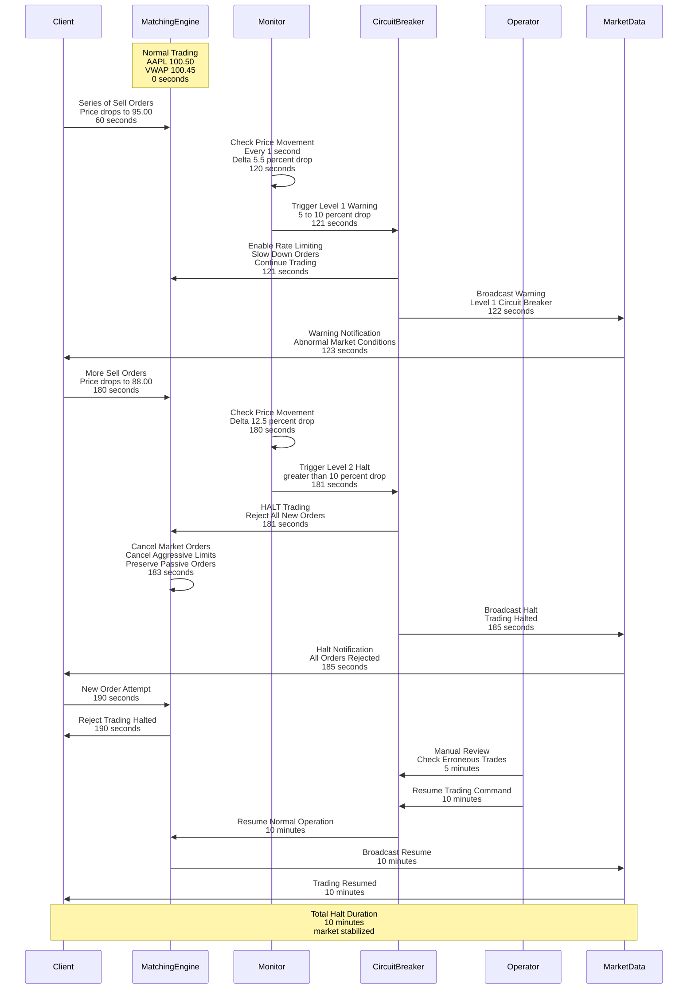

---

## 6. Matching Engine Crash Recovery

**Flow:**

Shows the crash recovery process with hot standby failover and audit log replay.

**Steps:**

1. **Normal Operation** (0s): Primary matching engine processing orders, standby engine receiving audit log replication
2. **Primary Crash** (60s): Primary matching engine crashes (hardware failure, software bug, etc.)
3. **Heartbeat Timeout** (61s): Monitoring system detects missing heartbeat (1-second timeout)
4. **Failover Decision** (62s): Auto-failover system decides to promote standby to primary
5. **Promote Standby** (63s): Standby engine promoted to primary, starts accepting orders
6. **Audit Log Gap** (64s): Check for any missing log entries (last 10ms of primary's buffer)
7. **Replay Gap** (65s): Replay missing log entries from shared storage (if any)
8. **Resume Trading** (66s): New primary fully operational, accepts orders
9. **Client Reconnect** (67s): Clients automatically reconnect to new primary (failover transparent)
10. **Total Downtime** (6 seconds): Clients experience 6 seconds of rejected orders

**Cold Start Alternative:**

If no hot standby, read audit log from disk, replay all events:
- Read time: 90ms (272 MB at 3 GB/sec)
- Replay time: 1 second (1M orders at 1μs each)
- Total: ~1 second downtime

**Performance:**

- **Hot standby failover:** 5-10 seconds
- **Cold start recovery:** 1-60 seconds
- **Data loss:** 0 orders (with battery-backed cache)

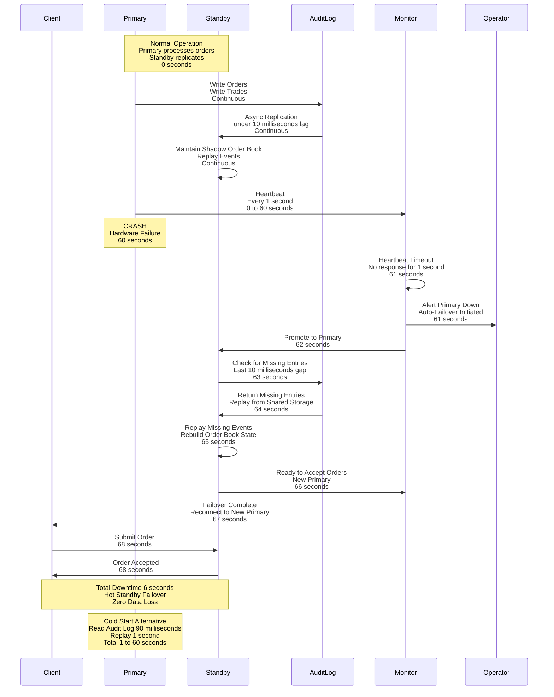

---

## 7. Multi-Level Matching (Price Walking)

**Flow:**

Shows a large market order that "walks the book" - executing at multiple price levels as it exhausts available liquidity.

**Steps:**

1. **Large Market Order** (0μs): Client submits SELL 1000 shares at market price
2. **First Price Level** (10μs): Best bid $100.50 with 100 shares - MATCH all 100
3. **Second Price Level** (20μs): Next bid $100.49 with 300 shares - MATCH all 300
4. **Third Price Level** (30μs): Next bid $100.48 with 200 shares - MATCH all 200
5. **Fourth Price Level** (40μs): Next bid $100.47 with 400 shares - MATCH all 400
6. **Fully Filled** (45μs): Order fully executed (100 + 300 + 200 + 400 = 1000 shares)
7. **Execution Reports** (50μs): Generate 4 execution reports (one per price level)
8. **VWAP Calculation** (55μs): Calculate volume-weighted average price = $100.478
9. **Market Data** (60μs): Publish 4 trade executions + updated order book depth
10. **Ledger Update** (1ms): Credit seller based on VWAP ($100,478 total)

**Performance:**

- **Multi-level matching:** 45μs for 4 matches (11μs per match)
- **Tree traversal:** 4 × O(log N) lookups

**Key Insight:**

Market orders provide immediate execution but sacrifice price control - seller gets average of available bids.

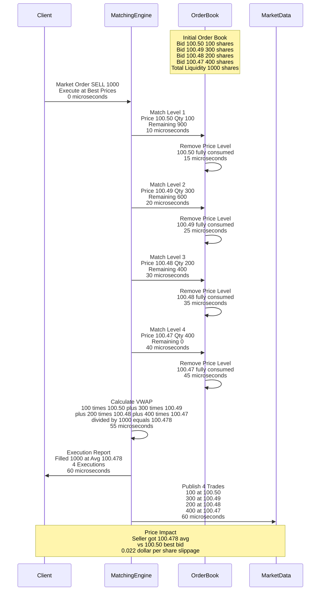

---

## 8. IOC Order (Immediate-or-Cancel)

**Flow:**

Shows an IOC (Immediate-or-Cancel) order that executes available quantity and cancels the rest.

**Steps:**

1. **IOC Order** (0μs): Client submits SELL 500 shares at $100.48 IOC (must execute immediately or cancel)
2. **Check Liquidity** (10μs): Matching engine scans bid side for available liquidity at $100.48 or better
3. **Available Liquidity** (15μs): Best bid $100.50 with 100 shares, next bid $100.49 with 200 shares (total 300 shares)
4. **Partial Execution** (25μs): Execute 300 shares (100 @ $100.50, 200 @ $100.49)
5. **Cancel Remainder** (30μs): Cancel remaining 200 shares (cannot be filled immediately)
6. **Execution + Cancel Report** (40μs): Send report: "Filled 300 of 500, Cancelled 200"
7. **No Passive Order** (45μs): IOC does not insert remainder into order book (key difference from limit order)
8. **Market Data** (50μs): Publish 2 trade executions (no order book update, nothing added)

**Performance:**

- **IOC latency:** 40μs (same as normal execution + cancel)
- **No order book pollution:** Prevents passive orders sitting in book

**Use Case:**

HFT algorithms use IOC to test liquidity without leaving footprint in order book.

**Key Difference:**

- **Limit Order:** Unfilled portion stays in book (passive)
- **IOC:** Unfilled portion cancelled immediately (aggressive)

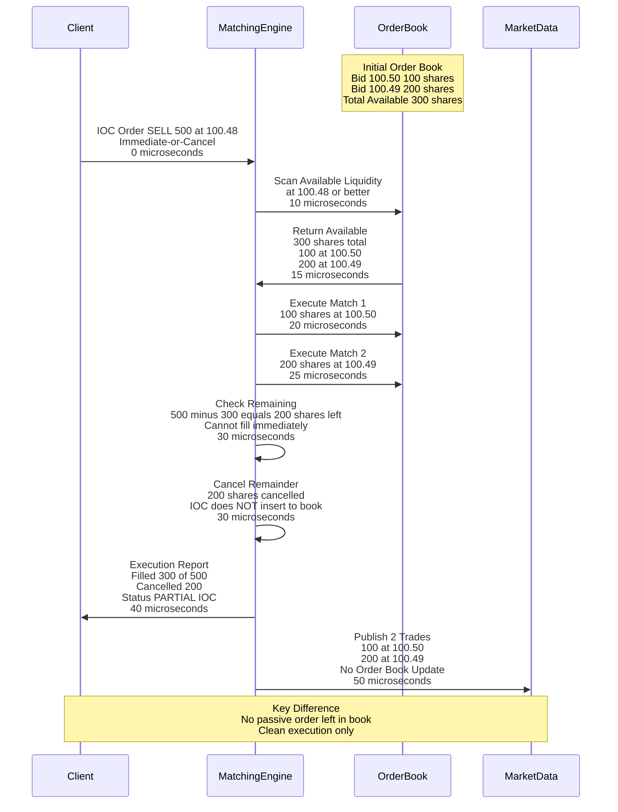

---

## 9. Market Data Fanout

**Flow:**

Shows how a single trade execution is fanned out to millions of subscribers via hierarchical broadcast.

**Steps:**

1. **Trade Execution** (0μs): Matching engine executes trade (AAPL: 100 shares @ $100.50)
2. **Publish to Kafka** (100μs): Matching engine publishes execution event to Kafka topic (100 partitions)
3. **Kafka Persistence** (200μs): Kafka persists to disk (3 replicas for durability)
4. **Market Data Services** (300μs): 100 Market Data Services consume Kafka (each handles 1 partition)
5. **Filter Subscriptions** (400μs): Each service filters by client subscriptions (who subscribes to AAPL?)
6. **Conflation** (500μs): Conflate multiple updates within 10ms window (reduce message count 10×)
7. **Protocol Buffers** (600μs): Encode message as Protocol Buffers (16 bytes vs 48 bytes JSON)
8. **WebSocket Broadcast** (700μs): Send to 100 WebSocket servers (each handles 10K clients)
9. **Client Receive** (1ms): 1M clients receive trade execution update
10. **HFT Direct Feed** (10μs): HFT clients co-located in datacenter receive direct feed (bypass Kafka)

**Performance:**

- **Standard clients:** 1ms latency (Kafka + WebSocket)
- **HFT clients:** 10μs latency (direct feed, co-location)

**Scalability:**

- 100K updates/sec × 1M clients = 100B messages/sec (hierarchical fanout required)
- Conflation reduces to 10K updates/sec × 1M clients = 10B messages/sec (manageable)

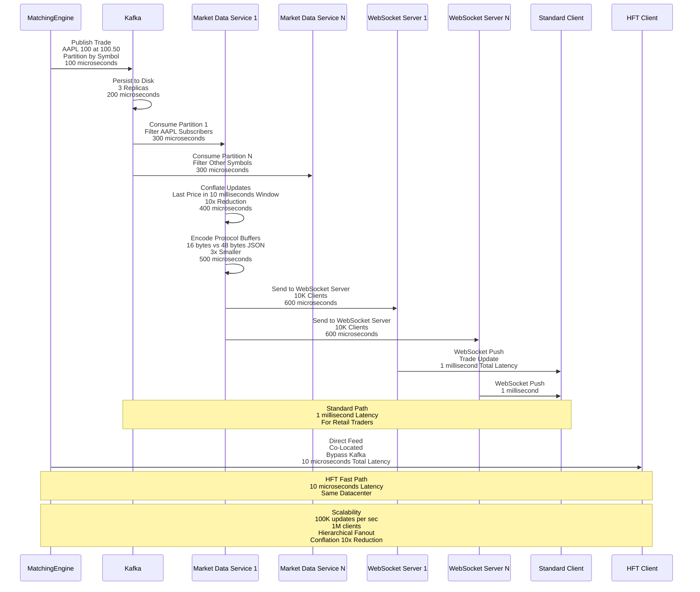

---

## 10. Audit Log Async Write

**Flow:**

Shows the async audit log write strategy that avoids blocking the matching engine.

**Steps:**

1. **Order Processed** (0μs): Matching engine processes order, generates log entry
2. **Copy to Ring Buffer** (5μs): Copy log entry to ring buffer (shared memory, lock-free)
3. **Return to Matching** (10μs): Matching engine immediately returns to processing next order (non-blocking)
4. **Background Thread** (Async): Separate thread consumes ring buffer
5. **Batch Accumulation** (1ms): Accumulate 1000 log entries in batch buffer (1000 × 272 bytes = 272 KB)
6. **Disk Write** (2ms): Single write syscall for entire batch (amortizes fsync overhead)
7. **fsync** (3ms): Force flush to NVMe SSD (durability guaranteed)
8. **Battery-Backed Cache** (On power loss): Capacitor backup ensures writes persisted even on power failure

**Performance:**

- **Matching engine:** 5μs overhead (just copy to ring buffer)
- **Background thread:** 272 MB/sec throughput (1M entries/sec × 272 bytes)
- **Durability:** 1-10ms lag (acceptable for financial systems)

**Trade-offs:**

- ✅ **Non-blocking writes:** Matching engine never waits for disk I/O
- ⚠️ **Crash window:** Last 1-10ms at risk (mitigated by battery backup)

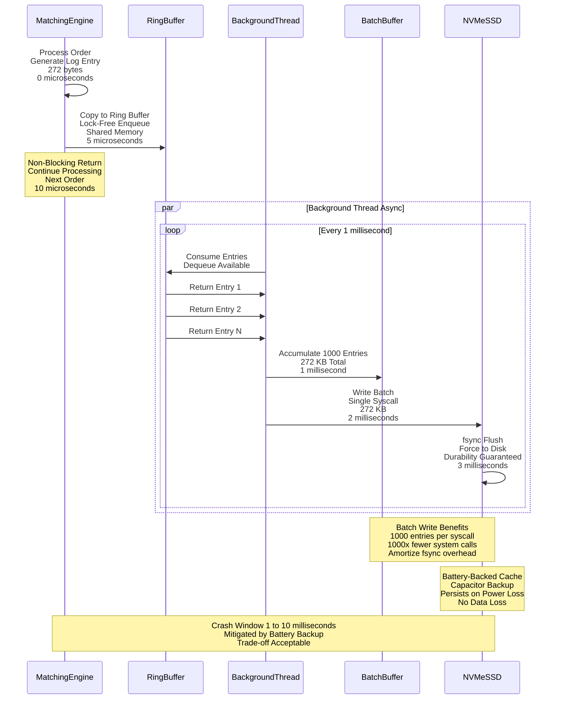

---

## 11. Hot Standby Failover

**Flow:**

Shows the hot standby failover process for high availability with minimal downtime.

**Steps:**

1. **Primary Active** (0s): Primary matching engine processing orders, writing audit log
2. **Standby Replication** (Continuous): Standby engine receives audit log replication (async, <10ms lag)
3. **Shadow Order Book** (Continuous): Standby maintains shadow order book by replaying audit log events
4. **Heartbeat Monitoring** (Every 1s): Monitoring system checks primary heartbeat
5. **Primary Failure** (60s): Primary crashes (hardware failure, software bug, power loss)
6. **Heartbeat Miss** (61s): Monitor detects missing heartbeat (1-second timeout)
7. **Failover Trigger** (62s): Monitor triggers auto-failover to standby
8. **Check Lag** (63s): Standby checks audit log for missing entries (last 10ms)
9. **Replay Gap** (64s): Replay any missing entries from shared storage
10. **Promote Standby** (65s): Standby promoted to primary, starts accepting orders
11. **Client Reconnect** (66s): Clients reconnect to new primary (TCP failover, transparent to application)
12. **Resume Trading** (66s): Trading resumes on new primary

**Performance:**

- **Failover time:** 5-10 seconds (hot standby promotion)
- **Data loss:** 0 orders (audit log replicated)
- **Downtime:** 6 seconds (clients experience rejected orders during failover)

**Alternative: Cold Start**

If no hot standby available:
- Read audit log: 90ms
- Replay: 1 second
- Total: 1-60 seconds downtime (acceptable for non-critical markets)

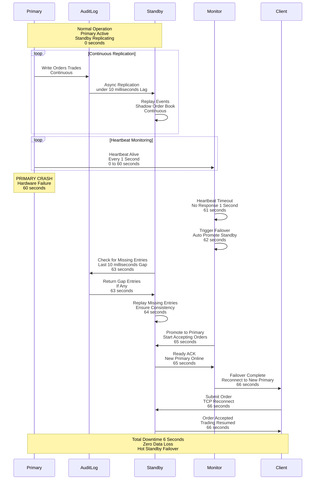

---

## 12. DPDK Packet Processing

**Flow:**

Shows the DPDK (Data Plane Development Kit) kernel bypass networking for ultra-low latency packet processing.

**Steps:**

1. **Packet Arrival** (0ns): Ethernet packet arrives at NIC (100 Gbps Mellanox ConnectX-6)
2. **DMA Transfer** (500ns): NIC writes packet directly to application memory via DMA (Direct Memory Access)
3. **Poll Mode Driver** (1000ns): Application thread polls NIC descriptor ring (100% CPU utilization, no interrupts)
4. **Zero-Copy Read** (1500ns): Application reads packet data directly from NIC memory (no kernel copy)
5. **FIX Parsing** (3000ns): Parse FIX protocol message (order fields)
6. **Order Validation** (5000ns): Validate order (JWT auth cached, no DB lookup)
7. **Ring Buffer Enqueue** (5500ns): Enqueue to matching engine ring buffer
8. **Total Gateway Latency** (5500ns = 5.5μs): From packet arrival to ring buffer

**Traditional Stack Comparison:**

1. **Packet Arrival** (0μs): Packet arrives at NIC
2. **Hardware Interrupt** (1μs): NIC generates interrupt, CPU context switches
3. **Kernel Processing** (10μs): Linux network stack (TCP/IP, checksums, routing)
4. **Copy to User Buffer** (15μs): Copy from kernel buffer to application buffer
5. **Application Processing** (20μs): Parse FIX protocol
6. **Total Latency** (20μs): 4× slower than DPDK!

**DPDK Benefits:**

- **10× latency reduction:** 20μs → 2-5μs
- **No interrupts:** Polling eliminates context switch overhead (1000-10000 cycles)
- **Zero-copy:** Direct memory access, no kernel buffer copies

**Trade-offs:**

- ❌ **CPU overhead:** 100% utilization for polling (dedicated core required)
- ❌ **Complexity:** Custom userspace TCP/IP stack, NIC-specific drivers
- ❌ **Portability:** Tied to specific NICs (Intel X710, Mellanox ConnectX)

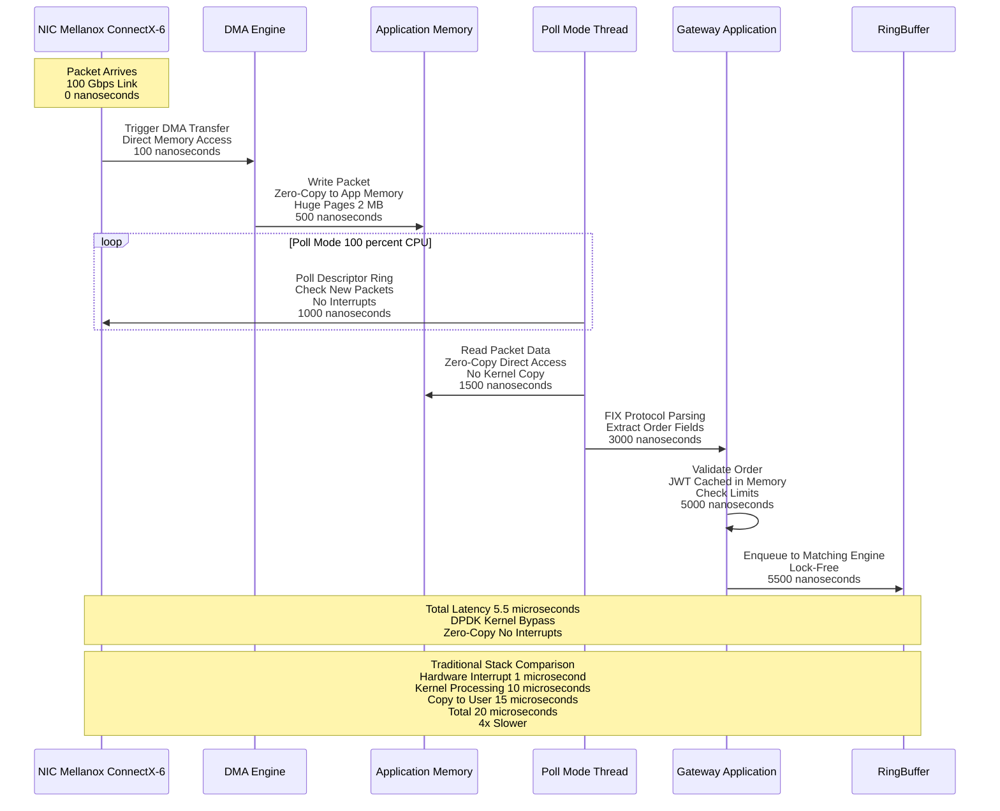

